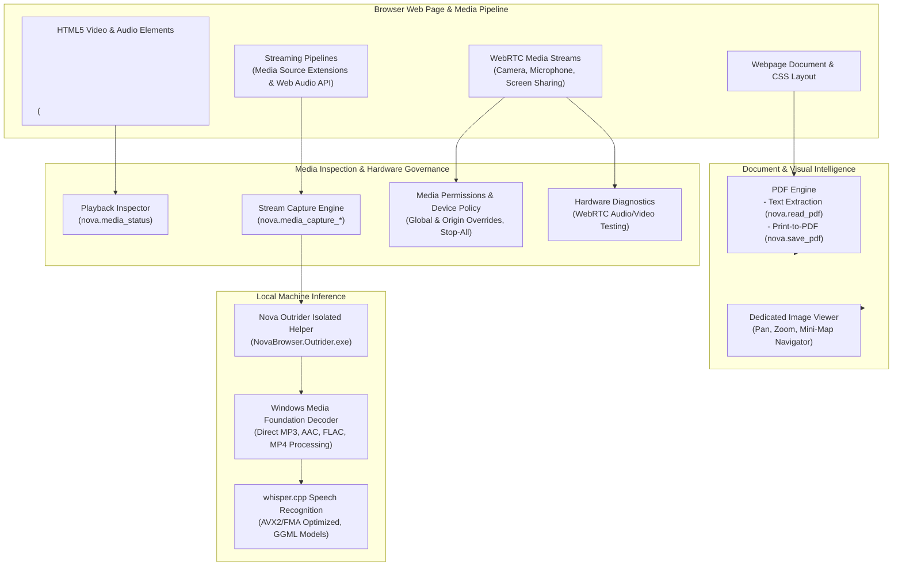
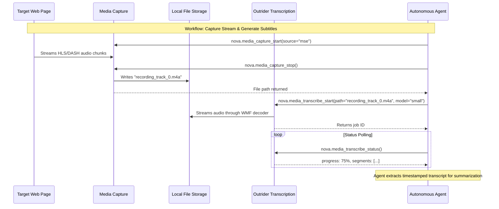

# Media Intelligence Architecture

Nova provides a comprehensive, privacy-preserving media intelligence subsystem designed for local media processing, stream capture, document analysis, and hardware governance. It bridges web-based multimedia playback with local operating system capabilities and external native helper processes.

All high-compute operations—such as speech-to-text recognition—execute 100% locally on device, ensuring sensitive audio recordings, customer calls, and confidential voice notes are never transmitted to external cloud transcription APIs.

---

## Core Media Intelligence Subsystems

| Subsystem | Scope & Capabilities | Primary Operations & Tools |
| :--- | :--- | :--- |
| **[Speech Transcription](transcription/README.md)** | 100% on-device speech-to-text recognition running inside an isolated native process. Pinned GGML models, timestamped segments, and subtitle export. | `nova.media_transcribe_start`, `nova.media_transcribe_status`, `nova.media_transcribe_stop`, `nova.media_transcribe_models`, `nova.media_transcribe_model_install`, `nova.media_file_info` |
| **[Media Devices & Permissions](devices-and-permissions/README.md)** | Governance of camera, microphone, speaker, and screen-sharing access. Persistent per-origin overrides, temporary session grants, active stream inspection, and emergency kill-switches. | `nova.media_permissions_list`, `nova.media_permission_get`, `nova.media_permission_set`, `nova.media_activity_status`, `nova.media_stop_all`, `nova.hardware_diagnostics_start` |
| **[Media Capture](media-capture/README.md)** | Captures live streaming audio/video directly from Media Source Extensions (MSE) and Web Audio API pipelines into local track files. | `nova.media_capture_start`, `nova.media_capture_status`, `nova.media_capture_stop` |
| **[Media Playback Inspection](media-playback/README.md)** | Real-time diagnostics of in-page `<video>` and `<audio>` elements: playback state, current position, volume, readiness, and pause cause classification. | `nova.media_status` |
| **[PDF Reading & Export](pdf/README.md)** | Programmatic text extraction from local PDF files and pixel-accurate webpage printing via Chromium's print-to-PDF engine. | `nova.read_pdf`, `nova.save_pdf` |
| **[Image Viewer](image-viewer/README.md)** | Dedicated WinUI 3 modal viewer for high-resolution inspection of web images with pan, zoom, and mini-map orientation. | In-app GUI action ("Magnify image") |

---

## Architecture Principles & Isolation Invariants

### 1. The Outrider Process Boundary (Native Isolation)

Speech recognition relies on native C++ inference engines (`whisper.cpp`). Native code introduces potential memory faults, unhandled exceptions, and high CPU/GPU loads that could compromise browser stability.

Nova enforces a strict architectural boundary by executing all Whisper inference inside an external helper process: **Nova Outrider** (`NovaBrowser.Outrider.exe`).
* **Fault Containment:** If the native library encounters an unrecoverable segmentation fault or corrupted audio stream, only the helper process terminates; the main browser UI, active sandboxes, and agent sessions remain unaffected.
* **Controlled Termination:** When an agent cancels a transcription via `nova.media_transcribe_stop`, Nova terminates the Outrider worker process immediately, freeing memory without waiting for internal loops to unwind.

### 2. Privacy-First Local Decoding (Zero Cloud Leakage)

Audio and video files processed by Nova are never transmitted to external APIs or third-party servers.
* **Direct Decoding:** Standard web formats (WAV, Ogg/Opus, WebM/Opus) are decoded directly in-memory.
* **Windows Media Foundation (WMF):** Compressed container formats (MP3, AAC/M4A, MP4/MOV, FLAC, WMA) are decoded using the host's native Windows Media Foundation pipeline without requiring external FFmpeg binaries.
* **Network Independence:** Network connectivity is utilized exclusively for one-time downloads of pinned GGML speech models from Hugging Face.

### 3. Hardware Governance & Auditability

Access to sensitive peripherals (webcam, microphone, screen sharing) is subject to multi-layered authorization:
* **Visual Identifiers:** Tabs actively capturing audio or video display distinct WinUI 3 animated recording badges in the title bar and address bar.
* **Emergency Halt (`nova.media_stop_all`):** Agents or users can invoke a global emergency stop that immediately cuts all active media streams across all browser tabs.
* **Ephemeral vs. Persistent Grants:** Distinguishes between persistent permission rules stored in configuration and temporary in-memory "Allow once" grants that flush upon session completion.

---

## Cross-Subsystem Workflows

The components of Media Intelligence are designed to form cohesive, multi-step agent workflows:

1. **Capture to Transcription:** An agent records a podcast, lecture, or voice note from an active tab using `nova.media_capture_*`, flushes the audio to a local `.m4a` or `.wav` file, and immediately starts an offline transcription job using `nova.media_transcribe_*`.
2. **Webpage to PDF Archival:** An agent captures an official document or receipt using `nova.save_pdf` and inspects the resulting PDF using `nova.read_pdf` to verify text extraction before attaching it to a connector workflow.
3. **Perceptual Fallback:** When low-level media controls are inaccessible via standard DOM selectors, agents use `nova.media_status` to observe video progress, combined with screenshot capture for visual confirmation.

---

## Related Systems

* **[Session Recording](../session-recording/README.md)**: Records browser, DOM mutations, and network events for debugging. Completely independent of media capture and audio recording.
* **[Evidence Verification Mode (EVM)](../../research/evidence-verification-mode-evm/README.md)**: Capturing screenshot evidence and visual diffs to substantiate agent actions.
* **[Connectors Subsystem](../connectors/README.md)**: Transmitting exported PDFs, transcripts, and captured audio files via Mail, SFTP, or FTP.

---

[All core features](../README.md) · [Media & Transcription Tool Reference](../../mcp-reference/tools/media-and-transcription/README.md) · [Visual Evidence Tool Reference](../../mcp-reference/tools/visual-evidence/README.md) · [Outrider Architecture](../../components/outrider/README.md)
