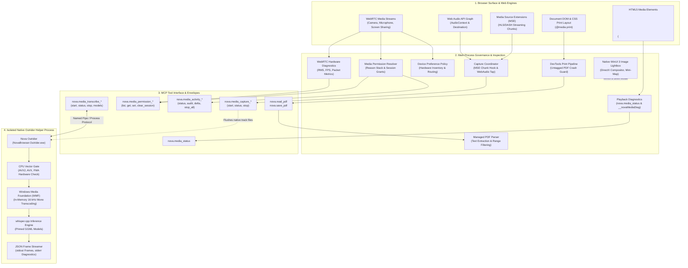
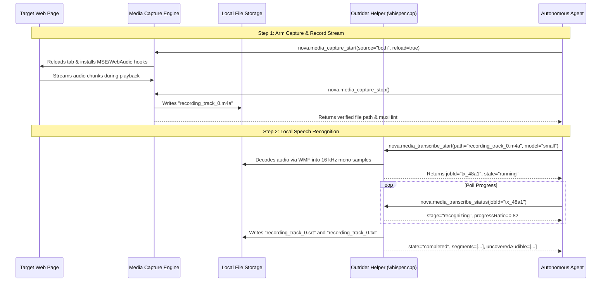
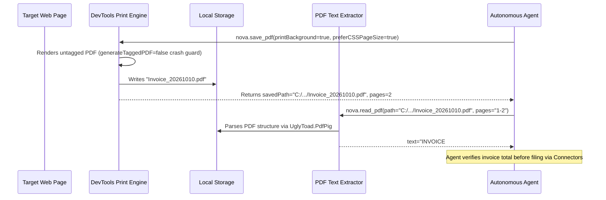

# Media Intelligence Architecture

Nova provides a comprehensive, privacy-preserving media intelligence subsystem designed for on-device multimedia processing, live stream capture, document analysis, and hardware peripheral governance. It bridges web-based multimedia playback with local operating system capabilities and external native helper processes.

All high-compute operations—most notably speech-to-text recognition—execute 100% locally on the user's workstation. Sensitive audio recordings, corporate conference calls, and confidential voice notes are never transmitted to external cloud transcription APIs or third-party servers.

---

## Core Media Intelligence Subsystems

| Subsystem | Scope & Technical Capabilities | Primary Operations & Tools |
| :--- | :--- | :--- |
| **[Speech Transcription](transcription/README.md)** | 100% on-device speech-to-text recognition executing in an isolated native helper process. Pinned GGML quantized models, hardware instruction set verification (AVX2/FMA), Windows Media Foundation audio decoding, and acoustic coverage analysis. | `nova.media_transcribe_start` `nova.media_transcribe_status` `nova.media_transcribe_stop` `nova.media_transcribe_models` `nova.media_transcribe_model_install` `nova.media_transcribe_model_remove` `nova.media_file_info` |
| **[Media Devices & Permissions](devices-and-permissions/README.md)** | Multi-layered governance over camera, microphone, speaker, and screen-sharing access. Persistent per-origin rules, ephemeral session grants, live stream monitoring, emergency kill-switches, and WebRTC hardware diagnostics. | `nova.media_permissions_list` `nova.media_permission_get` `nova.media_permission_set` `nova.media_permissions_clear_session_grants` `nova.media_activity_status` `nova.media_activity_audit` `nova.media_activity_delta` `nova.media_stop_all` `nova.site_permissions_reset_origin` `nova.media_device_preferences_list` `nova.hardware_diagnostics_start` `nova.hardware_diagnostics_state` `nova.hardware_diagnostics_stop` |
| **[Media Capture](media-capture/README.md)** | In-page stream recording intercepting live media directly from Media Source Extensions (MSE) and Web Audio API graphs into local native track files without external transcoders. | `nova.media_capture_start` `nova.media_capture_status` `nova.media_capture_stop` |
| **[Media Playback Inspection](media-playback/README.md)** | Real-time diagnostics of in-page `<video>` and `<audio>` elements: playback state, current position, buffer health, network readiness, YouTube video ad detection, and classified pause root causes. | `nova.media_status` |
| **[PDF Reading & Export](pdf/README.md)** | Programmatic digital text extraction from local PDF documents and pixel-accurate print-to-PDF export from active webpages using Chromium's print engine with crash-safe untagged rendering. | `nova.read_pdf` `nova.save_pdf` |
| **[Image Viewer](image-viewer/README.md)** | Hardware-accelerated WinUI 3 lightbox viewer for high-resolution inspection of web images with kinetic 2D panning, dynamic zoom limits, and a floating picture-in-picture mini-map navigator. | In-app GUI action ("Magnify image") |

---

## Architecture Principles & Isolation Invariants

### 1. The Outrider Process Boundary (Native Isolation)

Speech recognition relies on native C/C++ inference engines (`whisper.cpp`). In modern .NET runtimes, native memory access violations, illegal CPU instructions, or unhandled exceptions in native libraries cannot be caught by standard `try / catch` blocks and terminate the host process immediately.

Nova enforces a strict architectural boundary by executing all Whisper speech inference inside an external helper process: **Nova Outrider** (`NovaBrowser.Outrider.exe`).
* **Fault Containment:** If a corrupted audio stream, malformed model file, or native library flaw causes an access violation, only the Outrider helper process terminates. Nova's main browser window, open tabs, active sandbox profiles, and MCP server connections remain unaffected.
* **Controlled Termination:** When an agent cancels a transcription job via `nova.media_transcribe_stop` or when a job exceeds its compute budget, Nova terminates the Outrider worker process immediately. Memory is reclaimed instantly by the operating system without waiting for native inference loops to unwind.
* **Stdio Channel Separation:** Outrider writes structured JSON progress frames exclusively to `stdout` (one JSON object per line), while redirecting all native C++ loggers to `stderr`. This ensures native log output never corrupts or tears JSON progress frames read by the main browser process.

### 2. Privacy-First Local Decoding (Zero Cloud Leakage)

Audio and video files processed by Nova are never transmitted to external APIs or third-party servers:
* **Windows Media Foundation (WMF):** Compressed container formats (MP3, AAC/M4A, MP4/MOV, FLAC, WMA) are decoded directly using the host's native Windows Media Foundation pipeline. This avoids third-party FFmpeg dependencies while decoding multi-format audio into 16 kHz mono float samples in memory.
* **Direct In-Memory Processing:** Uncompressed WAV and Ogg/Opus streams are decoded directly in-memory without creating temporary unencrypted disk scratch files that could leak sensitive data.
* **Network Independence:** Network connectivity is utilized exclusively for one-time downloads of pinned GGML speech models from Hugging Face when requested by the user or agent.

### 3. Hardware Governance & Provenance Auditing

Access to sensitive peripherals (webcams, microphones, speaker audio, screen sharing) is subject to multi-layered authorization:
* **The Permission Decision Model:** Evaluates effective access through a strict hierarchy:
  $$\text{Effective Permission} = \text{SessionGrant} \succ \text{OriginOverride} \succ \text{GlobalDefault}$$
* **Provenance Chain (`reasonStack`):** When querying site permissions with `nova.media_permission_get`, Nova provides the exact evaluation stack (e.g. `enterprise_override:not_configured → os_privacy:not_checked → site_override:camera=allow`), explaining why an access decision was reached.
* **Emergency Halt (`nova.media_stop_all`):** Provides a global or origin-scoped kill-switch that instantly cuts all active media tracks across open tabs and releases physical hardware locks on cameras and microphones.
* **Ephemeral vs. Persistent Grants:** Distinguishes between persistent permission rules stored in configuration and temporary in-memory "Allow once" grants that flush upon session completion or via `nova.media_permissions_clear_session_grants`.

### 4. DRM & Protected Media Invariant

Nova's Media Capture subsystem records what the browser page receives and decodes in the clear. It does **not** bypass Digital Rights Management (DRM):
* With Encrypted Media Extensions (EME) and Widevine, decryption occurs inside the Content Decryption Module (CDM).
* Intercepted buffers before CDM decryption remain ciphertext and cannot produce playable media files.
* If an agent attempts to capture a DRM-protected stream, the capture halts with `reasonCode: "no_media_captured"`, explicitly communicating that the stream is protected rather than producing corrupt data.

### 5. Filesystem Sandboxing & Reference-Based Delivery

Nova enforces clear filesystem boundaries for media and document tools:
* **Safe Default Directories:** Captures and PDF exports write by default to Nova's internal directories (`StoragePaths.ExportsDir/MediaCaptures` and `StoragePaths.ExportsDir`), which survive application restarts and require no elevated permissions.
* **Local File Access Gate:** Writing to custom directories (`saveDir`, `savePath`) or reading arbitrary hard drive files requires the explicit user setting **"Allow local files (file://)"**. If disabled, requests fail immediately with error code `-32035` (`mcp.file_access_disabled`).
* **Reference-Based Output Contract:** Multi-megabyte binary payloads (PDF files, audio tracks) are written directly to disk. Tools return verified absolute filesystem paths rather than embedding massive base64 payloads across JSON-RPC channels, protecting agent context windows from token exhaustion.

---

## Cross-Subsystem Workflows

Nova's media intelligence components operate as cohesive building blocks in multi-step automation workflows:

### Workflow 1: Capture Stream & Generate Local Subtitles

1. **Stream Capture:** The agent initializes capture on an active multimedia page with `reload=true` to arm hooks from second zero, recording dynamic audio streams into native container files (`.m4a`, `.webm`, or `.wav`).
2. **Local Transcription:** The agent passes the recorded track to `nova.media_transcribe_start`, which verifies hardware instructions, converts audio via WMF, and runs local Whisper inference in the isolated Outrider process.
3. **Evidence Verification:** The completed job produces structured timestamped segments, plain text transcripts, and acoustic coverage metrics (`uncoveredAudible`) identifying non-speech audio intervals.

---

### Workflow 2: Web Document Archival & Verification

1. **Document Export:** The agent archives an active webpage (e.g. receipt, confirmation page) using `nova.save_pdf`, applying exact print stylesheets and untagged rendering to protect the renderer process.
2. **Verification Loop:** Rather than guessing whether the exported PDF contains the expected data, the agent immediately reads the file using `nova.read_pdf`.
3. **Downstream Integration:** Verified documents are dispatched to enterprise destinations using Nova's [Connectors Subsystem](../connectors/README.md).

---

## Tool Reference Matrix

| Subsystem | Tool | Purpose & Key Parameters |
| :--- | :--- | :--- |
| **Transcription** | [`nova.media_transcribe_start`](../../mcp-reference/tools/media-and-transcription/nova-media-transcribe-start.md) | Launches local speech recognition (`path`, `model`, `language`, `waitMs`). Supports synchronous inline completion for short audio clips. |
| **Transcription** | [`nova.media_transcribe_status`](../../mcp-reference/tools/media-and-transcription/nova-media-transcribe-status.md) | Queries transcription job status (`jobId`, `includeText`), returning stage progress, segment counts, and acoustic coverage. |
| **Transcription** | [`nova.media_transcribe_stop`](../../mcp-reference/tools/media-and-transcription/nova-media-transcribe-stop.md) | Terminates active worker process immediately, preserving recognized partial segments. |
| **Transcription** | [`nova.media_transcribe_models`](../../mcp-reference/tools/media-and-transcription/nova-media-transcribe-models.md) | Lists installed, bundled, and available GGML models, effective model selection, and CPU instruction support. |
| **Transcription** | [`nova.media_transcribe_model_install`](../../mcp-reference/tools/media-and-transcription/nova-media-transcribe-model-install.md) | Downloads official pinned models from Hugging Face (`modelId`) or adopts local user model files (`path`). |
| **Transcription** | [`nova.media_transcribe_model_remove`](../../mcp-reference/tools/media-and-transcription/nova-media-transcribe-model-remove.md) | Deletes installed speech models from disk (`fileName`). |
| **Transcription** | [`nova.media_file_info`](../../mcp-reference/tools/media-and-transcription/nova-media-file-info.md) | Fast pre-flight container probe (`path`), returning container format, stream inventory, and duration before compute commitment. |
| **Permissions** | [`nova.media_permissions_list`](../../mcp-reference/tools/media-and-transcription/nova-media-permissions-list.md) | Enumerates stored per-origin permissions and global baseline defaults (`axis`, `mode`, `origin`, `limit`, `offset`). |
| **Permissions** | [`nova.media_permission_get`](../../mcp-reference/tools/media-and-transcription/nova-media-permission-get.md) | Resolves effective permission for an origin, returning the complete provenance `reasonStack`. |
| **Permissions** | [`nova.media_permission_set`](../../mcp-reference/tools/media-and-transcription/nova-media-permission-set.md) | Writes persistent or session-only permissions across peripheral axes (`camera`, `microphone`, `speaker`, `screenCapture`, `geolocation`). |
| **Permissions** | [`nova.media_permissions_clear_session_grants`](../../mcp-reference/tools/media-and-transcription/nova-media-permissions-clear-session-grants.md) | Flushes all temporary in-memory grants and immediately terminates any active streams relying on them. |
| **Governance** | [`nova.media_activity_status`](../../mcp-reference/tools/media-and-transcription/nova-media-activity-status.md) | O(1) live snapshot of active media tracks and hardware usage across all open tabs. |
| **Governance** | [`nova.media_stop_all`](../../mcp-reference/tools/media-and-transcription/nova-media-stop-all.md) | Emergency kill-switch severing active camera, microphone, and screen-sharing tracks globally or by origin. |
| **Governance** | [`nova.site_permissions_reset_origin`](../../mcp-reference/tools/site-data-and-identity/nova-site-permissions-reset-origin.md) | Comprehensive single-origin reset clearing media rules, notification permissions, device bindings, and stopping active streams. |
| **Governance** | [`nova.media_activity_audit`](../../mcp-reference/tools/media-and-transcription/nova-media-activity-audit.md) | Retrieves historical audit trail of permission decisions and stream lifecycle events. |
| **Governance** | [`nova.media_activity_delta`](../../mcp-reference/tools/media-and-transcription/nova-media-activity-delta.md) | Token-efficient incremental audit query returning only events logged since a given `sinceSequence`. |
| **Governance** | [`nova.media_device_preferences_list`](../../mcp-reference/tools/media-and-transcription/nova-media-device-preferences-list.md) | Lists stored hardware peripheral bindings per origin for device drift diagnosis. |
| **Diagnostics** | [`nova.hardware_diagnostics_start`](../../mcp-reference/tools/media-and-transcription/nova-hardware-diagnostics-start.md) | Launches an isolated WebRTC hardware diagnostic session (`camera`, `microphone`, `speaker`). |
| **Diagnostics** | [`nova.hardware_diagnostics_state`](../../mcp-reference/tools/media-and-transcription/nova-hardware-diagnostics-state.md) | Queries live hardware telemetry (FPS, resolution, audio RMS energy, clipping). |
| **Diagnostics** | [`nova.hardware_diagnostics_stop`](../../mcp-reference/tools/media-and-transcription/nova-hardware-diagnostics-stop.md) | Terminates diagnostic testing and releases hardware handles. |
| **Capture** | [`nova.media_capture_start`](../../mcp-reference/tools/media-and-transcription/nova-media-capture-start.md) | Starts recording in-page media streams (`targetId`, `source`, `reload`, `maxBytes`, `saveDir`, `fileName`). |
| **Capture** | [`nova.media_capture_status`](../../mcp-reference/tools/media-and-transcription/nova-media-capture-status.md) | Returns real-time recording metrics (`bytesWritten`, `elapsedMs`, track inventory, `limitHit`, `recorderLost`). |
| **Capture** | [`nova.media_capture_stop`](../../mcp-reference/tools/media-and-transcription/nova-media-capture-stop.md) | Finalizes track headers, flushes buffers to disk, and returns verified file paths with `muxHint`. |
| **Playback** | [`nova.media_status`](../../mcp-reference/tools/media-and-transcription/nova-media-status.md) | In-page playback diagnostics: currentTime, duration, readyState, classified pause cause, and YouTube ad status. |
| **Documents** | [`nova.read_pdf`](../../mcp-reference/tools/visual-evidence/nova-read-pdf.md) | Extracts digital text from local PDF documents (`path`, `pages`, `maxChars`). |
| **Documents** | [`nova.save_pdf`](../../mcp-reference/tools/visual-evidence/nova-save-pdf.md) | Generates vector PDF from webpage via Chromium print engine (`printBackground`, `landscape`, `scale`, `pageRanges`). |

---

## Related Systems

* **[Session Recording](../session-recording/README.md)**: Records DOM mutations and network packets for browser session debugging and replay. Completely distinct from multimedia stream capture.
* **[Evidence Verification Mode (EVM)](../../research/evidence-verification-mode-evm/README.md)**: Multimodal visual inspection, bounding box analysis, and screenshot capture for verifying visual webpage states.
* **[Connectors Subsystem](../connectors/README.md)**: Dispatches exported PDFs, local transcripts, and audio recordings across external enterprise endpoints (Mail, SFTP, FTP).
* **[Browser Interaction & Automation](../browser-interaction/README.md)**: Input dispatch, keyboard navigation, and guarded macros for controlling media players and web applications.

---

[All core features](../README.md) · [Media & Transcription Tool Reference](../../mcp-reference/tools/media-and-transcription/README.md) · [Visual Evidence Tool Reference](../../mcp-reference/tools/visual-evidence/README.md) · [Outrider Architecture](../../components/outrider/README.md)
