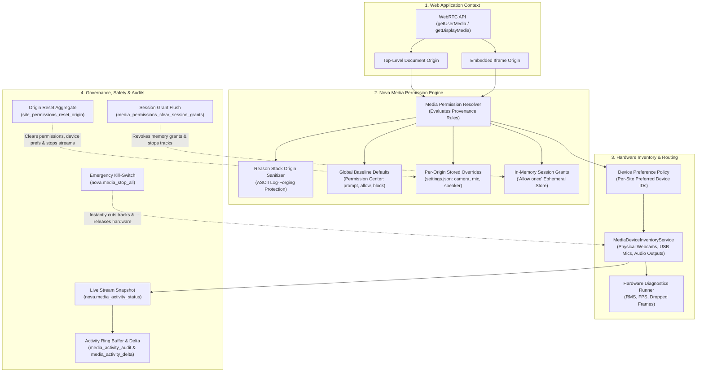
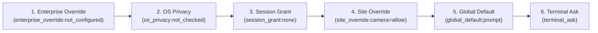
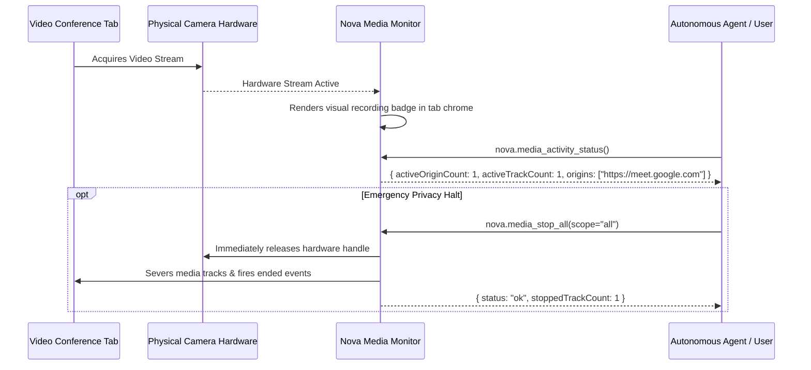

# Media Devices & Permissions Architecture

Nova enforces strict, transparent governance over web application access to sensitive hardware peripherals: webcams, microphones, speaker audio output, screen-sharing pipelines, and geolocation sensors. It implements a multi-layered permission model that separates persistent user preferences from ephemeral session grants, provides live stream monitoring, equips agents and users with an instant emergency kill-switch, and includes an isolated WebRTC hardware diagnostic suite.

---

## 1. The Multi-Layered Permission Decision Model

When a website invokes `navigator.mediaDevices.getUserMedia` or `getDisplayMedia`, Nova determines access through a strict evaluation hierarchy:

$$\text{Effective Permission} = \text{SessionGrant} \succ \text{OriginOverride} \succ \text{GlobalDefault}$$

### Decision States

* **`prompt` (Default):** Prompts the user with an interactive WinUI 3 permission dialog displaying the requesting origin, requested peripheral axes, and persistence options.
* **`allow`:** Automatically permits the requesting origin to access the specified peripheral.
* **`block`:** Automatically rejects the peripheral request without prompting the user or notifying the site.

### Granular Peripheral Axes

Nova tracks permissions independently across five distinct axes:
1. `camera`: Webcams and video capture cards.
2. `microphone`: Audio input devices and USB microphones.
3. `speaker`: Audio output device selection (`setSinkId`).
4. `screenCapture`: Desktop and window screen sharing via `getDisplayMedia`.
5. `geolocation`: Physical coordinate sensors and Wi-Fi triangulation.

### Embedded Iframes & Origin Isolation

Nova tracks both the top-level window origin and the immediate requesting frame origin. Third-party iframes cannot silently inherit permissions granted to the top-level document. An embedded widget on `https://example.com` requesting a camera stream must be explicitly authorized for its own frame origin.

---

## 2. Provenance Chains & The `reasonStack`

When agents query permissions using `nova.media_permission_get`, Nova provides the exact evaluation provenance chain:

### Evaluation Rule Hierarchy

1. **`enterprise_override`:** Enterprise group policy and DLP controls (highest precedence).
2. **`os_privacy`:** Windows operating system-level privacy toggles (camera/microphone privacy switches).
3. **`session_grant`:** In-memory "Allow once" grants valid for the active session.
4. **`site_override`:** Stored per-origin preferences recorded in `settings.json`.
5. **`global_default`:** Global Permission Center defaults.
6. **`terminal_ask`:** Fallback prompting the user.

### Reason Stack Origin Sanitization (Log-Forging Protection)

Origin strings originating from untrusted web pages or agent parameters could potentially inject control characters, newlines, or ANSI escape codes into log files and MCP envelopes.

Nova applies strict ASCII sanitization to every origin string before interpolating it into reason stack entries:
* All characters outside the strict character class `[A-Za-z0-9./:_-]` are replaced with `_`.
* Strings are strictly clamped in length to prevent buffer overruns or log-forging exploits.

---

## 3. Persistent Rules vs. Ephemeral Session Grants

Nova enforces a clear distinction between persistent configuration and temporary memory grants:

| Property | Persistent Permissions | Ephemeral Session Grants ("Allow Once") |
| :--- | :--- | :--- |
| **Storage Location** | Persisted to disk in Nova's `settings.json` | Stored exclusively in volatile application RAM |
| **Lifetime** | Indefinite until explicitly revoked or reset | Discarded when the tab closes or Nova restarts |
| **Intended Use** | Trusted daily work tools (e.g. video conferencing suites) | Ad-hoc meetings, temporary voice notes, unknown websites |
| **Revocation Tool** | `nova.media_permission_set` or `nova.site_permissions_reset_origin` | `nova.media_permissions_clear_session_grants` |

### Session Grant Flushing with Immediate Stream Termination

Calling `nova.media_permissions_clear_session_grants` flushes all temporary in-memory grants.

**The Immediate Termination Invariant:** Rather than merely deleting memory tokens while leaving active video streams running, Nova's clear routine actively severs all active camera, microphone, and screen-sharing tracks relying on those grants. The physical webcam LED indicator turns off immediately.

---

## 4. Live Stream Monitoring & Emergency Kill-Switches

Nova provides continuous, real-time oversight of hardware usage:

### 1. Live Stream Snapshot (`nova.media_activity_status`)

An $O(1)$ query that inspects active media streams across all open tabs without scanning the historical audit log:
* `activeOriginCount`: Number of origins currently capturing media.
* `activeTrackCount`: Total number of live tracks (audio, video, screen).
* `origins`: Sorted list of origins actively accessing hardware.
* `isAnyActive`: Immediate boolean flag for rapid polling.

### 2. The Emergency Stop (`nova.media_stop_all`)

A global kill-switch for immediate privacy protection:
* **`scope="all"` (Default):** Immediately severs all active media tracks across all open tabs and browser sandboxes, releasing operating system handles on cameras and microphones.
* **`scope="origin"`:** Scopes the termination to a specific target origin (`origin="https://..."`).

### 3. Origin Reset Aggregate (`nova.site_permissions_reset_origin`)

A single-operation atomic reset that completely wipes a website's footprint:
* Deletes all stored media permission overrides (camera, mic, speaker, screen, geolocation).
* Deletes notification permissions.
* Deletes stored hardware device bindings.
* Flushes all active session grants for that origin.
* Halts any active media streams and reapplies CDP policy boundaries.

---

## 5. Hardware Device Routing & Drift Diagnostics

Modern workstations frequently feature multiple multimedia devices (e.g. built-in laptop webcam, 4K USB webcam, podcast microphone, Bluetooth headset, virtual camera).

### Stored Device Preferences (`nova.media_device_preferences_list`)

* **Default Device Token (`__nova.system_default__`):** Explicitly marks an axis as following the host operating system's default peripheral.
* **Per-Site Device Binding:** Users and agents can associate specific preferred devices with specific origins (e.g. routing a recording studio site to a professional USB interface).
* **Drift Diagnosis:** If a user unplugs a USB webcam, the stored device ID remains in configuration. `nova.media_device_preferences_list` exposes stored bindings so agents can correlate them against live hardware and detect stale configurations.

### Real-Time WebRTC Hardware Diagnostics

When diagnosing audio or video failures inside web applications, Nova provides an isolated diagnostic suite:

* **`nova.hardware_diagnostics_start`:** Launches an isolated diagnostic session in the target tab for `"camera"`, `"microphone"`, or `"speaker"`.
* **`nova.hardware_diagnostics_state`:** Queries real-time hardware telemetry:
  - **Camera:** Resolution (width $\times$ height), observed frame rate (FPS), frame drop rate.
  - **Microphone:** Input volume levels (RMS energy), audio sample rate, clipping indicators.
  - **Speaker:** Loopback audio verification.
* **`nova.hardware_diagnostics_stop`:** Terminates the diagnostic test and releases hardware handles.

---

## 6. In-Memory Activity Audit Trail & Incremental Deltas

Every permission check, prompt resolution, and stream state change is recorded in an in-memory ring buffer:

* **`nova.media_activity_audit`:** Retrieves recent permission decisions and stream lifecycle events with optional `kind` filtering.
* **`nova.media_activity_delta`:** Token-efficient incremental querying for background security agents. The agent passes `sinceSequence`, and Nova returns only events logged after that sequence number. In steady state, the response is empty, consuming minimal LLM context tokens.

---

## Tool Reference

| Tool | Parameters | Output / Diagnostics |
| :--- | :--- | :--- |
| [`nova.media_permissions_list`](../../../mcp-reference/tools/media-and-transcription/nova-media-permissions-list.md) | `axis?`, `mode?`, `origin?`, `limit?`, `offset?` | Stored per-origin permissions and global Permission Center defaults |
| [`nova.media_permission_get`](../../../mcp-reference/tools/media-and-transcription/nova-media-permission-get.md) | `origin`, `requestingOrigin?` | Effective permission (`prompt`, `allow`, `block`), provenance `reasonStack` |
| [`nova.media_permission_set`](../../../mcp-reference/tools/media-and-transcription/nova-media-permission-set.md) | `origin`, `camera?`, `microphone?`, `speaker?`, `screenCapture?`, `geolocation?`, `lifetime?`, `clearAll?` | Confirmation of updated axes, previous state |
| [`nova.media_permissions_clear_session_grants`](../../../mcp-reference/tools/media-and-transcription/nova-media-permissions-clear-session-grants.md) | None | Count of cleared session grants and severed live media tracks |
| [`nova.media_activity_status`](../../../mcp-reference/tools/media-and-transcription/nova-media-activity-status.md) | None | Live stream inventory, active origin count, total active tracks |
| [`nova.media_stop_all`](../../../mcp-reference/tools/media-and-transcription/nova-media-stop-all.md) | `scope?` (`"all"`, `"origin"`), `origin?` | Count of severed media tracks and released hardware locks |
| [`nova.site_permissions_reset_origin`](../../../mcp-reference/tools/site-data-and-identity/nova-site-permissions-reset-origin.md) | `origin` | Outcome tuple indicating removed media, notification, and device rules |
| [`nova.media_device_preferences_list`](../../../mcp-reference/tools/media-and-transcription/nova-media-device-preferences-list.md) | `origin?` | Stored hardware device preferences per origin |
| [`nova.media_activity_audit`](../../../mcp-reference/tools/media-and-transcription/nova-media-activity-audit.md) | `kind?`, `limit?` | Chronological audit trail of recent permission decisions |
| [`nova.media_activity_delta`](../../../mcp-reference/tools/media-and-transcription/nova-media-activity-delta.md) | `sinceSequence?`, `limit?` | Incremental audit entries logged since specified sequence |
| [`nova.hardware_diagnostics_start`](../../../mcp-reference/tools/media-and-transcription/nova-hardware-diagnostics-start.md) | `kind` (`camera`, `microphone`, `speaker`), `targetId?` | Diagnostic session handle and initialized hardware device |
| [`nova.hardware_diagnostics_state`](../../../mcp-reference/tools/media-and-transcription/nova-hardware-diagnostics-state.md) | `targetId?` | Live hardware telemetry: FPS, resolution, RMS levels, packet metrics |
| [`nova.hardware_diagnostics_stop`](../../../mcp-reference/tools/media-and-transcription/nova-hardware-diagnostics-stop.md) | `targetId?` | Diagnostic summary and hardware release confirmation |

---

[Media Intelligence overview](../README.md) · [Media Capture](../media-capture/README.md) · [Media Playback](../media-playback/README.md) · [Speech Transcription](../transcription/README.md) · [All core features](../../README.md)
