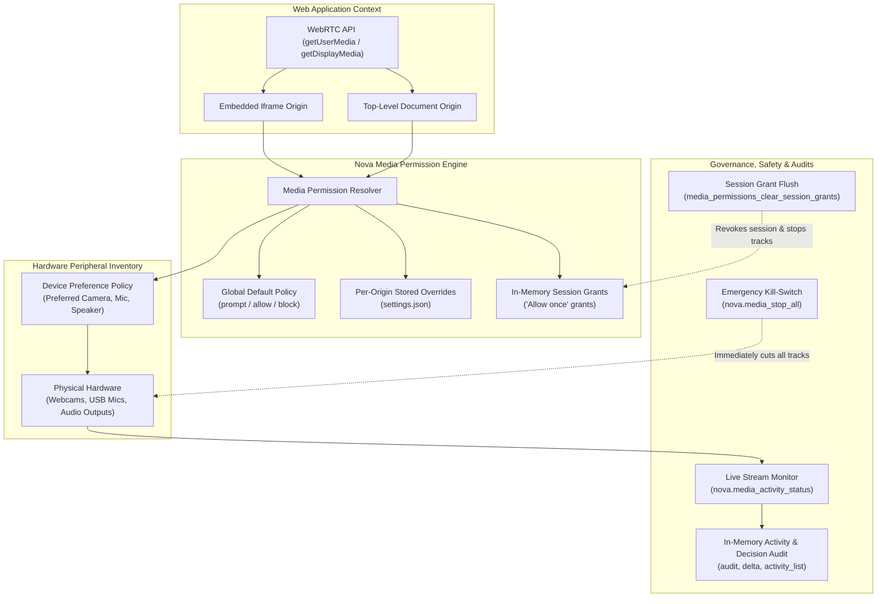
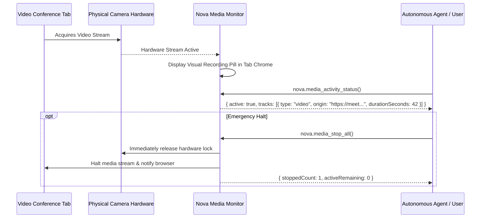

# Media Devices & Permissions Architecture

Nova enforces strict, transparent governance over web access to sensitive hardware peripherals: webcams, microphones, speaker audio output, and screen-sharing pipelines. It implements a multi-layered permission model that separates persistent user preferences from ephemeral session grants, provides live stream monitoring, and equips agents and users with an instant emergency kill-switch.

---

## The Permission Decision Model

When a website requests access to audio or video input (via `navigator.mediaDevices.getUserMedia`) or screen capture (via `getDisplayMedia`), Nova determines access through a strict evaluation hierarchy:

$$\text{Effective Permission} = \text{SessionGrant} \succ \text{OriginOverride} \succ \text{GlobalDefault}$$

### Decision States

1. **`prompt` (Default):** Prompts the user with an interactive permission dialog displaying the requesting origin, requested devices, and persistence options.
2. **`allow`:** Automatically permits the requesting origin to access the specified peripheral.
3. **`block`:** Automatically rejects the request without prompting the user.

### Scope and Hierarchy

* **Global Defaults (Permission Center):** Baseline behavior applied when no origin-specific rule exists. Managed via [`nova.permission_center_set`](../../../mcp-reference/tools/app-shell-and-ui/nova-permission-center-set.md).
* **Per-Origin Overrides:** Explicit rules bound to canonical origins (e.g., `https://meet.google.com`). An override takes precedence over global defaults.
* **Embedded Iframes:** Nova tracks both the top-level window origin and the immediate requesting frame origin, preventing third-party iframes from silently inheriting parent-frame permissions.

---

## Persistent Rules vs. Ephemeral Session Grants

Nova clearly distinguishes between persistent settings and temporary memory grants:

| Trait | Persistent Permissions | Ephemeral Session Grants ("Allow Once") |
| :--- | :--- | :--- |
| **Storage Location** | Persisted to disk in Nova's configuration | Stored exclusively in volatile memory |
| **Lifetime** | Indefinite until explicitly cleared or revoked | Discarded when the tab closes or Nova restarts |
| **Intended Use** | Trusted daily work applications (e.g. company video conferencing) | One-off meetings, ad-hoc voice recordings, unknown websites |
| **Revocation** | `nova.media_permission_set(camera="ask", microphone="ask")` | `nova.media_permissions_clear_session_grants` |

### Session Grant Flushing

`nova.media_permissions_clear_session_grants` flushes all temporary in-memory grants. Any active camera, microphone, or screen-sharing streams that rely on an ephemeral session grant are **terminated immediately**, while permanent settings remain untouched.

---

## Live Activity Monitoring & Emergency Kill-Switch

Nova provides continuous visibility into active hardware usage:

### 1. Active Stream Inspection (`nova.media_activity_status`)

Enumerates all active camera, microphone, and screen-sharing streams across all open tabs, reporting:
* The host tab identifier and window handle.
* The requesting origin.
* Peripheral type (`video`, `audio`, `screen`).
* Stream duration in seconds.

### 2. The Emergency Stop (`nova.media_stop_all`)

A global kill-switch for immediate privacy protection. When invoked:
* Nova instantly severs all active media tracks across all open tabs.
* Physical hardware locks on cameras and microphones are released immediately.
* Can be invoked globally or scoped to a specific origin.

---

## Device Inventory & Preferred Routing

Modern computers frequently have multiple audio and video devices (e.g., laptop internal webcam, external 4K USB webcam, headset microphone, conference speakerphone).

* **Inventory Enumeration (`nova.media_device_preferences_list`):** Lists all detected physical and virtual input/output devices with unique device IDs and hardware labels.
* **Preferred Device Binding:** Users and agents can associate specific preferred devices with specific web origins (e.g., routing a video conferencing site to a dedicated podcast microphone).
* **Precondition Warning:** Storing a device preference does **not** grant permission to use the device; permission must still be evaluated via the decision model.

---

## Real-Time Hardware Diagnostics

When diagnosing audio or video failures inside web applications, Nova provides an integrated WebRTC diagnostic test suite:

* **`nova.hardware_diagnostics_start`:** Launches an isolated diagnostic session in the target tab for `camera`, `microphone`, or `speaker`.
* **`nova.hardware_diagnostics_state`:** Queries real-time hardware telemetry:
  - **Camera:** Actual resolution, observed frame rate (FPS), frame drop rate.
  - **Microphone:** Input volume levels (RMS energy), clipping indicators, audio sample rate.
  - **Speaker:** Loopback audio verification.
* **`nova.hardware_diagnostics_stop`:** Terminates the diagnostic test and releases hardware handles.

---

## In-Memory Audit Trail

Every media permission evaluation, user prompt response, and stream state change is recorded in Nova's in-memory audit log:

* **`nova.media_activity_audit`:** Retrieves recent permission decisions and stream lifecycle events.
* **`nova.media_activity_delta`:** Returns only new audit events recorded since a specified cursor, ideal for continuous background security monitoring.

---

## Tool Reference

| Tool | Core Parameters | Output / Diagnostics |
| :--- | :--- | :--- |
| [`nova.media_permissions_list`](../../../mcp-reference/tools/media-and-transcription/nova-media-permissions-list.md) | None | Global defaults and dictionary of stored per-origin permissions |
| [`nova.media_permission_get`](../../../mcp-reference/tools/media-and-transcription/nova-media-permission-get.md) | `origin` | Effective permission (`prompt`, `allow`, `block`), stored vs session status |
| [`nova.media_permission_set`](../../../mcp-reference/tools/media-and-transcription/nova-media-permission-set.md) | `origin`, `permission`, `mode`, `isSessionOnly` | Update confirmation, previous state |
| [`nova.permission_center_set`](../../../mcp-reference/tools/app-shell-and-ui/nova-permission-center-set.md) | `cameraPermissionMode?`, `microphonePermissionMode?`, `speakerPermissionMode?`, `geolocationPermissionMode?` | Updates global Permission Center baseline defaults and preferred devices |
| [`nova.media_permissions_clear_session_grants`](../../../mcp-reference/tools/media-and-transcription/nova-media-permissions-clear-session-grants.md) | None | Count of cleared session grants and stopped media tracks |
| [`nova.media_activity_status`](../../../mcp-reference/tools/media-and-transcription/nova-media-activity-status.md) | None | Active media stream inventory with origins, types, and durations |
| [`nova.media_stop_all`](../../../mcp-reference/tools/media-and-transcription/nova-media-stop-all.md) | `origin` (optional) | Emergency stop outcome, count of severed media streams |
| [`nova.media_device_preferences_list`](../../../mcp-reference/tools/media-and-transcription/nova-media-device-preferences-list.md) | None | Hardware device catalog and stored per-site preferred device bindings |
| [`nova.hardware_diagnostics_start`](../../../mcp-reference/tools/media-and-transcription/nova-hardware-diagnostics-start.md) | `kind` (`camera`, `microphone`, `speaker`), `targetId` | Diagnostic session handle, initialized device info |
| [`nova.hardware_diagnostics_state`](../../../mcp-reference/tools/media-and-transcription/nova-hardware-diagnostics-state.md) | `targetId` | Live hardware telemetry: RMS levels, FPS, resolution, packet metrics |
| [`nova.hardware_diagnostics_stop`](../../../mcp-reference/tools/media-and-transcription/nova-hardware-diagnostics-stop.md) | `targetId` | Diagnostic summary and cleanup confirmation |
| [`nova.media_activity_audit`](../../../mcp-reference/tools/media-and-transcription/nova-media-activity-audit.md) | `maxEntries` | Chronological list of recent permission decisions and stream events |

---

[Media Intelligence overview](../README.md) · [Media Capture](../media-capture/README.md) · [Media Playback](../media-playback/README.md) · [All core features](../../README.md)
