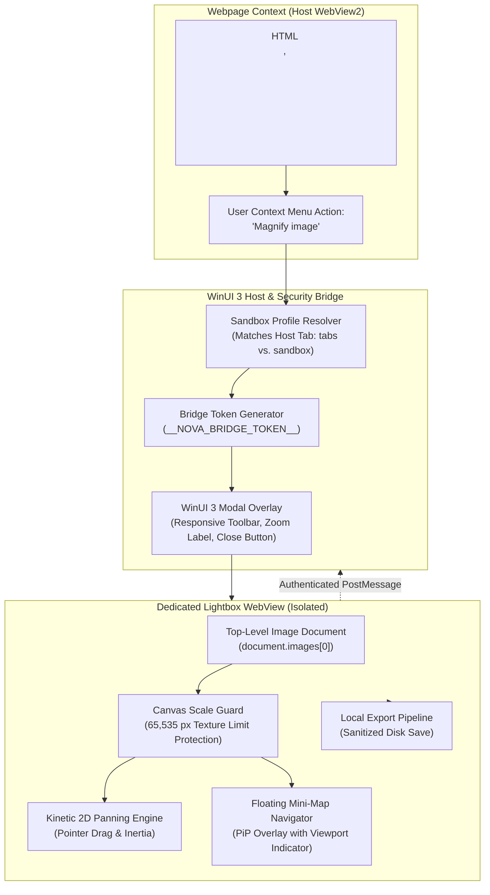
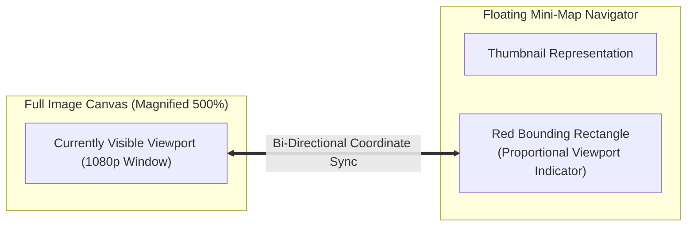

# Image Viewer Architecture

Nova includes a native, high-performance Image Viewer built directly into the WinUI 3 application shell. It allows human operators to inspect fine visual details, architectural schematics, high-resolution photography, and complex diagrams embedded in web pages without altering the zoom level, viewport geometry, or layout of the host webpage.

---

## 1. Invocation & Isolated WebView Lifecycle

### User Invocations

1. **Magnify Image (Context Menu):** Right-clicking any image element on a webpage and selecting **Magnify image** opens the dedicated WinUI 3 lightbox overlay immediately. The host webpage maintains its scroll position, layout, active form data, and zoom level undisturbed in the background.
2. **Open Image in New Tab:** Selecting **Open image in new tab** loads the image URL into a standard Nova tab, useful for full browser navigation.

### Dedicated Isolated Viewer WebView

Unlike lightweight CSS popups or JavaScript DOM overlays that inject arbitrary modal elements into the existing page, Nova hosts the Image Viewer in a dedicated, isolated WebView instance (`_imageLightboxWebView`):

* **Sandbox Profile Isolation:** The lightbox WebView is provisioned within the exact same sandbox profile (`tabs` vs. `sandbox:<profileId>`) as the source tab. This ensures authenticated images (e.g. session-gated charts, private dashboards, internal network cameras) load seamlessly using the user's active session cookies and TLS credentials without leaking data across sandboxes.
* **DOM Independence:** Malformed page CSS, aggressive `z-index` stacking contexts, or sticky navigation bars on the host webpage cannot clip, occlude, or distort the magnified image.

### Per-Navigation Bridge Security Token (`__NOVA_BRIDGE_TOKEN__`)

To prevent untrusted web content—such as malicious SVGs with embedded scripts or hijacked image documents—from manipulating the browser's native WinUI 3 chrome:

* The host generates a cryptographically random bridge token for every lightbox navigation.
* The internal lightbox script transmits messages to the WinUI 3 host via `chrome.webview.postMessage` strictly enveloped with this token (`{ type: "novaImageLightbox", token: bridgeToken, action: "..." }`).
* Any message lacking the verified token is discarded by the host, preventing rogue scripts from closing the lightbox, spoofing zoom metrics, or triggering unauthorized save operations.

---

## 2. Rendering Engine, Geometry & Compositing

### GPU Texture Boundary & Scale Protection

Massive images (e.g. 50-megapixel architectural scans or GIS satellite imagery) can cause severe graphics memory exhaustion or GPU rasterizer crashes if scaled indiscriminately. In Chromium and DirectX, texture allocations exceeding 65,535 pixels trigger internal engine faults.

Nova's lightbox script calculates a strictly bounded maximum zoom scale:

$$\text{maxScale} = \max\left(0.001, \, \min\left(8.0, \, \frac{65535}{\text{naturalWidth}}, \, \frac{65535}{\text{naturalHeight}}\right)\right)$$

* **Scale Clamping:** Zoom magnification is clamped between `minScale` (down to `0.05` for extreme resolutions) and `maxScale` (up to `8.0` / 800% for standard assets), guaranteeing that rendered canvas bounds never exceed the 65,535-pixel threshold.
* **Aspect Ratio Preservation:** Native dimensions are read from `image.naturalWidth` and `image.naturalHeight`, rendering within a dark radial gradient canvas (`#05070b` theme) that prevents visual contrast glare.

### Viewer Controls & Navigation

* **Fit to Window:** Automatically calculates the scale factor required to fit the entire image bounding box within the active window without clipping or letterboxing distortion.
* **100% (1:1 Original Scale):** Displays the image at its true native pixel resolution. Essential for verifying typography, inspecting pixel art, reviewing UI iconography, and examining uncompressed digital artifacts.
* **Continuous Granular Zoom:** Smooth mouse wheel and button zooming with animated easing.
* **Kinetic 2D Panning:** Smooth dragging in any direction using native pointer capture (`cursor: grab` / `cursor: grabbing`).

---

## 3. Floating Picture-in-Picture Mini-Map Navigator

For high-resolution or heavily magnified images, human operators can quickly lose orientation. Nova renders a floating picture-in-picture mini-map navigator:

* **Proportional Viewport Indicator:** A distinct red bounding rectangle indicates the exact portion of the image currently visible in the main window.
* **Interactive Navigation:** Dragging the red indicator box within the mini-map smoothly pans the main canvas to the targeted region.
* **Draggable & Resizable Overlay:** Operators can reposition the floating mini-map to any corner of the window or resize it to fit their workspace.
* **Position Reset:** A double-click or reset button returns the navigator to its default docking corner.

---

## 4. Local Export Pipeline

Operators can save magnified images directly to the host filesystem:
* **Format Preservation:** Saves the original image asset without re-encoding artifacts or lossy compression.
* **Filename Sanitization:** The filename is extracted and cleaned using Nova's stored payload sanitizer, stripping dangerous traversal characters (`..`, `/`, `\`) and invalid Windows path characters (`:`, `*`, `?`, `"`, `<`, `>`, `|`).
* **Direct Disk Commit:** Writes the verified image to the user's Downloads or Exports directory via standard Windows save pickers.

---

## 5. Human Inspection vs. Agent Evidence

Nova maintains a strict boundary between interactive human image viewing and automated agent visual inspection:

| Architectural Trait | Native WinUI 3 Image Viewer | Evidence Verification Mode (EVM) & MCP Tools |
| :--- | :--- | :--- |
| **Primary Actor** | **Human Operator** | **Autonomous AI Agent** |
| **User Interface** | Hardware-accelerated desktop GUI modal overlay | JSON-RPC MCP Tools (`nova.capture_screenshot`, element screenshots) |
| **Interaction Model** | Mouse wheel zoom, kinetic drag, mini-map PiP | Viewport bounding boxes, clip coordinates, base64 data budgets |
| **Verification Purpose** | Manual inspection of visual schematics, artwork, receipts | Multimodal visual regression, LLM perception, visual hash assertions |
| **Execution Context** | Runs inside isolated WinUI 3 shell overlay | Operates across DevTools CDP `Page.captureScreenshot` protocol |
| **Persistence** | Interactive OS save dialog | Structured disk reference or inline base64 token budgets |

For automated visual evidence capture, consult [Evidence Verification Mode (EVM)](../../../research/evidence-verification-mode-evm/README.md). For programmatic document text analysis, consult [PDF Reading & Export](../pdf/README.md).

---

[Media Intelligence overview](../README.md) · [PDF Reading & Export](../pdf/README.md) · [Visual Evidence Tools](../../../mcp-reference/tools/visual-evidence/README.md) · [All core features](../../README.md)
