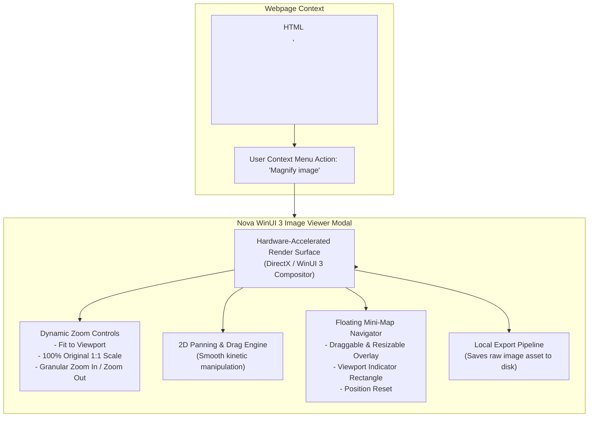

# Image Viewer Architecture

Nova includes a native, high-performance Image Viewer built directly into the WinUI 3 application shell. It allows human operators to inspect fine visual details, architectural schematics, high-resolution photography, and complex diagrams embedded in web pages without altering the zoom level or layout of the host webpage.

---

## Opening and Navigating Images

### Invocation

1. Right-click any image element on a webpage.
2. Select **Magnify image** from the context menu.
3. The image is rendered immediately within a dedicated WinUI 3 modal overlay. The host webpage maintains its scroll position, layout, and zoom level in the background.
4. Alternatively, selecting **Open image in new tab** loads the raw image URL directly into a standard Nova tab.

### Viewer Controls & Navigation

* **Zooming Modes:**
  - **Fit to Window:** Scales the image so its entire boundary fits within the active window without clipping.
  - **100% (1:1 Original Size):** Displays the image at its native pixel resolution, ideal for pixel-art, iconography, or fine typographic inspection.
  - **Continuous Zoom:** Smooth mouse wheel or button zooming (up to 3200% magnification).
* **Panning:** Drag the image canvas smoothly in any direction to explore magnified sections.
* **Floating Mini-Map Navigator:**
  - For large or high-resolution images, a floating picture-in-picture navigator window appears in the corner.
  - Displays a red viewport bounding rectangle showing exactly which portion of the image is currently visible.
  - The navigator can be moved, resized, or minimized by the user.

---

## Human Inspection vs. Agent Evidence

Nova maintains a clear architectural distinction between interactive human image viewing and automated agent visual inspection:

| Capability / Trait | Native Image Viewer | Evidence Verification Mode (EVM) & MCP Screenshots |
| :--- | :--- | :--- |
| **Primary Consumer** | **Human Operator** | **Autonomous AI Agent** |
| **Interface** | WinUI 3 interactive desktop GUI | JSON-RPC MCP Tools (`nova.capture_screenshot`, element screenshots) |
| **Interaction** | Mouse drag, wheel zoom, visual navigator | Bounding box coordinates, visual hash comparison, base64 payloads |
| **Analysis** | Visual human perception | Multimodal LLM analysis, OCR, visual regression testing |
| **Storage** | Interactive save dialog | Programmatic file paths or base64 token budgets |

For automated agent inspection, use [Evidence Verification Mode (EVM)](../../../research/evidence-verification-mode-evm/README.md). For programmatic document text analysis, use [PDF Reading & Export](../pdf/README.md).

---

[Media Intelligence overview](../README.md) · [PDF Reading & Export](../pdf/README.md) · [Visual Evidence Tools](../../../mcp-reference/tools/visual-evidence/README.md) · [All core features](../../README.md)
