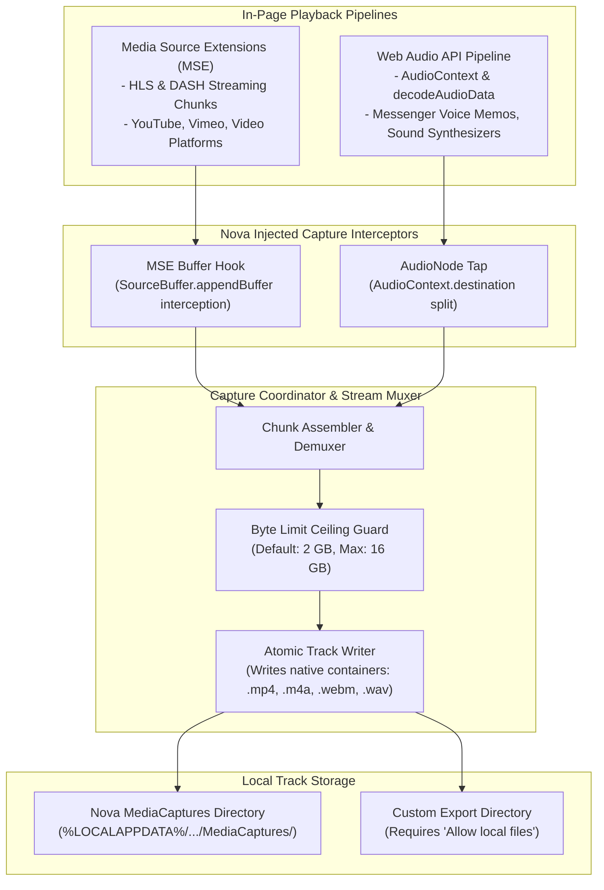

# Media Capture Architecture

Nova's Media Capture subsystem enables autonomous agents to record live streaming audio and video directly from web application playback pipelines. By intercepting low-level browser audio and video buffers at the engine level, Nova captures media fidelity that cannot be acquired through standard file downloads, making it ideal for archiving conference recordings, extracting messenger voice notes, and feeding streams into Nova's [Speech Transcription](../transcription/README.md) engine.



---

## Capture Sources & Engine Hooks

Modern web applications do not play media through simple static file URLs; they stream dynamic chunks via JavaScript APIs:

### 1. Media Source Extensions (`mse`)

* **Target:** Streaming video and audio platforms utilizing HTTP Live Streaming (HLS) or Dynamic Adaptive Streaming over HTTP (DASH).
* **Interception Mechanism:** Injects a hook into `MediaSource` and `SourceBuffer.appendBuffer()`, intercepting encoded audio and video chunks as they arrive from the network and before they are passed to the hardware decoder.
* **Containers:** Outputs native fragmented MP4 (`.mp4`, `.m4a`) or WebM (`.webm`) track files.

### 2. Web Audio API (`webaudio`)

* **Target:** Web messengers (WhatsApp Web, Telegram, Slack), browser games, and audio workstations that play voice messages through `AudioContext.decodeAudioData()`.
* **Interception Mechanism:** Taps the Web Audio graph immediately before audio reaches `AudioContext.destination`, recording uncompressed PCM streams.
* **Containers:** Outputs uncompressed WAV (`.wav`) files.

### 3. Combined Mode (`both` - Default)

Monitors both MSE and Web Audio pipelines simultaneously, ensuring mixed media environments (e.g. video playback combined with separate soundboard audio) are captured into synchronized track files.

---

## Capture Lifecycle & Hot Reloading

```mermaid
sequenceDiagram
    participant Agent as Autonomous Agent
    participant Nova as Nova Capture Manager
    participant Tab as Target Browser Tab
    participant Disk as Local Track Storage

    Agent->>Nova: nova.media_capture_start(targetId="active", source="both", reload=true)
    Note over Nova,Tab: Tab reloads to install interceptor before player initializes!
    Nova->>Tab: Inject capture hooks on page load
    Tab-->>Nova: Hooks active, waiting for playback
    Nova-->>Agent: { captureId: "cap_44b1", status: "recording" }

    Note over Tab,Disk: Page plays media; chunks are streamed to disk
    loop Monitor Progress
        Agent->>Nova: nova.media_capture_status(targetId="tab_7")
        Nova-->>Agent: { bytesWritten: 14500000, durationSeconds: 68.2, tracks: [...] }
    end

    Agent->>Nova: nova.media_capture_stop(targetId="tab_7")
    Nova->>Tab: Detach hooks & flush trailing buffers
    Nova->>Disk: Finalize track headers and close files
    Nova-->>Agent: { status: "finished", files: ["C:/.../track_0_audio.m4a"] }
```

### 1. The Pre-Playback Hook Invariant (`reload=true`)

Media capture hooks must be attached **before** the target player initializes its media buffers.
* If a player is already running, streaming chunks that arrived before the tool was called cannot be recovered.
* Setting `reload=true` automatically reloads the target tab, injecting the interceptors on page load so playback is captured from second zero.

### 2. Live Status Monitoring (`nova.media_capture_status`)

While recording, agents can query progress to observe:
* Total bytes accumulated.
* Elapsed recording duration.
* Individual track file details (audio vs. video).

### 3. Graceful Finalization (`nova.media_capture_stop`)

Stopping the capture flushes in-memory buffers to disk, finalizes container file headers (such as the MP4 `moov` atom or WebM index), and returns the verified absolute file paths of the completed tracks.

---

## Storage Boundaries & Byte Ceilings

To prevent runaway streams from consuming entire hard drives:

* **Default Ceiling:** 2 GB per capture session.
* **Configurable Ceiling (`maxBytes`):** Configurable up to **16 GB**. If cumulative recorded bytes exceed this budget, capture halts automatically without interrupting the user's web playback.
* **Storage Locations:** Files are saved by default to Nova's internal `MediaCaptures` folder. Custom export directories require the user setting "Allow local files (file://)".

---

## System Boundaries & Privacy Notice

* **Distinct from Session Recording:** [Session Recording](../../session-recording/README.md) logs DOM mutations and network packets for web debugging. Media Capture records actual audio and video media streams.
* **Distinct from Peripheral Recording:** Media Capture records in-page playback, not the user's physical camera or microphone (see [Devices & Permissions](../devices-and-permissions/README.md)).
* **Acceptable Use & Copyright:** Capturing audio or video does not grant ownership or redistribution rights. Respect applicable copyright laws and Nova's [Acceptable Use Policy](../../../../ACCEPTABLE-USE.md).

---

## Tool Reference

| Tool | Core Parameters | Output / Diagnostics |
| :--- | :--- | :--- |
| [`nova.media_capture_start`](../../../mcp-reference/tools/media-and-transcription/nova-media-capture-start.md) | `targetId`, `source` (`mse`, `webaudio`, `both`), `reload`, `maxBytes`, `saveDir` | Capture session ID, status, initial track list |
| [`nova.media_capture_status`](../../../mcp-reference/tools/media-and-transcription/nova-media-capture-status.md) | `captureId` | Cumulative bytes written, elapsed time, active track file paths |
| [`nova.media_capture_stop`](../../../mcp-reference/tools/media-and-transcription/nova-media-capture-stop.md) | `captureId` | Finalized track file paths, total duration, bytes committed to disk |

---

[Media Intelligence overview](../README.md) · [Speech Transcription](../transcription/README.md) · [Media Playback](../media-playback/README.md) · [All core features](../../README.md)
