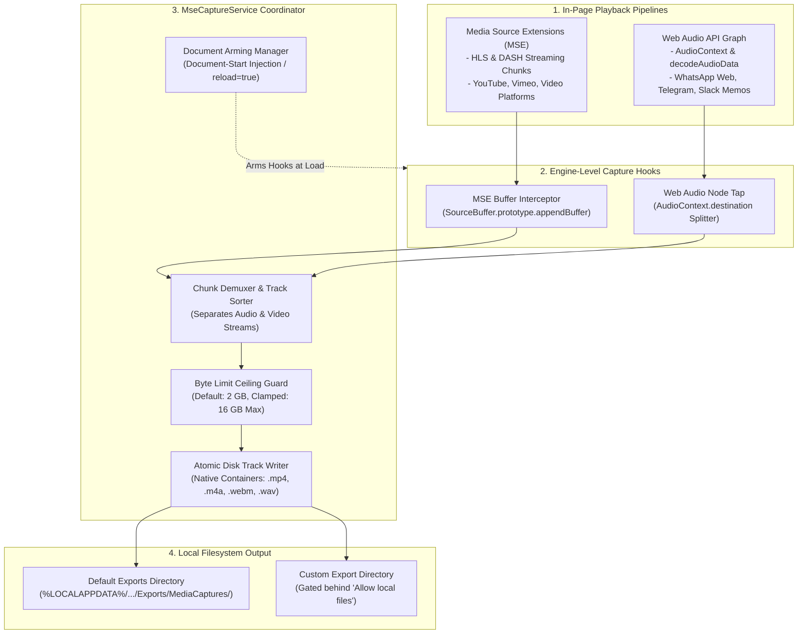
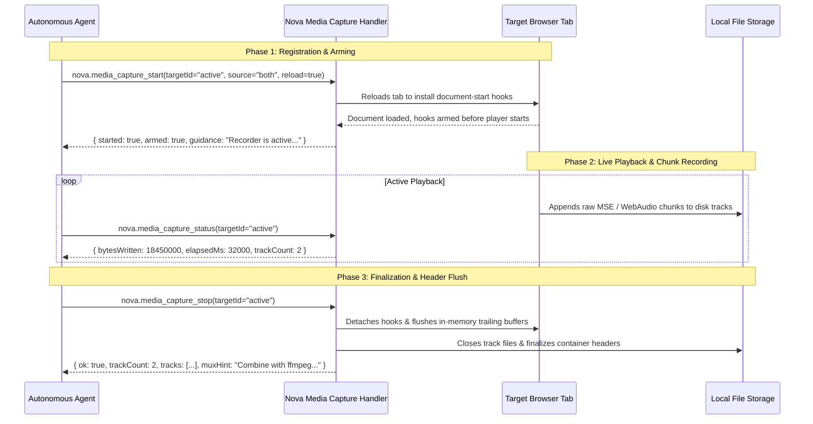

# Media Capture Architecture

Nova's Media Capture subsystem enables autonomous agents to record live streaming audio and video directly from web application playback pipelines. By intercepting low-level browser audio and video buffers at the engine level, Nova captures media fidelity that cannot be acquired through standard static file downloads or `fetch` requests, making it ideal for archiving streaming conference calls, extracting web messenger voice memos, and feeding audio tracks into Nova's [Speech Transcription](../transcription/README.md) engine.



---

## 1. Capture Sources & Interception Mechanics

Modern multimedia web applications rarely stream media via single, downloadable file URLs. Instead, they dynamically stream chunked audio and video over JavaScript APIs:

### 1. Media Source Extensions (`source="mse"`)

* **Target Platforms:** Streaming video and audio platforms utilizing HTTP Live Streaming (HLS) or Dynamic Adaptive Streaming over HTTP (DASH) (e.g. YouTube, Vimeo, Twitch, podcast portals).
* **Interception Mechanism:** Injects an interceptor into `MediaSource` and monkey-patches `SourceBuffer.prototype.appendBuffer()`. Encoded audio and video segments are intercepted in real-time as they arrive from the network and before they are passed to the hardware decoder.
* **Native Output:** Writes native fragmented container tracks: MP4 video (`.mp4`), AAC/M4A audio (`.m4a`), or WebM (`.webm`).

### 2. Web Audio API (`source="webaudio"`)

* **Target Platforms:** Web messengers (WhatsApp Web, Telegram Web, Slack), browser games, and online audio workstations that play voice memos through `AudioContext.decodeAudioData()`.
* **Interception Mechanism:** Taps the Web Audio graph immediately before the audio stream reaches `AudioContext.destination`, recording uncompressed PCM audio buffers.
* **Native Output:** Writes uncompressed 16-bit PCM WAV (`.wav`) files.

### 3. Combined Mode (`source="both"` - Default)

Monitors both MSE and Web Audio pipelines simultaneously. A caller asking to record a webpage's media does not need to guess whether a web application routes sound through Media Source Extensions or the Web Audio API; both pipelines are captured into synchronized track files.

---

## 2. Capture Lifecycle & The Pre-Playback Arming Invariant



### The Pre-Playback Hook Invariant (`reload=true`)

Media capture hooks must be installed **before** the target media player initializes its internal buffers.
* **Why Reloading is Critical:** Once a web player initializes `MediaSource` and buffers initial video segments, streaming chunks that arrived before the tool was called cannot be recovered retroactively from the browser engine.
* **The `reload` Parameter:** Setting `reload=true` automatically reloads the target tab, injecting the interceptors on page load so playback is captured from second zero.
* **Guidance on Delayed Start:** If called without `reload=true` on an already playing video, Nova returns:
  ```
  "Recorder is registered but the current document was not armed — a player that already created its MediaSource will not be captured. Call again with reload=true, or reload the tab, then start playback."
  ```

### Live Status Monitoring (`nova.media_capture_status`)

While recording is active, agents can poll status to inspect:
* `bytesWritten`: Total bytes accumulated across all tracks.
* `elapsedMs`: Elapsed recording duration in milliseconds.
* `trackCount`: Number of active media tracks.
* `tracks`: Detailed array of tracks, reporting recorder type (`mse` vs. `webaudio`), track index, MIME type, and file path.
* `recorderLost`: Boolean flag indicating if the user navigated the tab away before capture stopped (in which case the document-start script must re-arm the next document).

---

## 3. Faithful Track Delivery & The Muxing Contract

Adaptive streaming engines (DASH/HLS) transmit audio and video as separate independent streams to adjust bitrates dynamically.

Nova follows a strict architectural contract regarding track delivery:
* **No In-Process Muxing:** Nova does **not** transcode or multiplex separate audio and video tracks into a single container inside the browser process. Performing high-compute video multiplexing inside the main browser UI process would cause UI freezes and require massive third-party transcoding libraries.
* **Faithful Track Files:** Nova writes each track into its own container file (`capture_track_0.m4a`, `capture_track_1.mp4`).
* **Actionable `muxHint`:** When multiple tracks are recorded, Nova returns an explicit `muxHint` string, saving the agent from guessing how to combine the assets:
  ```json
  {
    "muxHint": "Separate tracks: combine them with ffmpeg, e.g. ffmpeg -i <track0> -i <track1> -c copy output.mp4"
  }
  ```

---

## 4. Safety Guardrails & Resource Limits

### Byte Ceilings (`maxBytes`)

To prevent runaway live streams from exhausting host hard drive space:
* **Default Ceiling:** 2 GB per capture session.
* **Configurable Ceiling (`maxBytes`):** Configurable up to **16 GB**.
* **Limit Hit Behavior:** If recorded bytes reach the ceiling, capture halts automatically (`limitHit: true`, `reasonCode: "max_bytes_reached"`). Playback in the web page continues undisturbed without crashing.

### Path Sandboxing & Filename Sanitization

* **Default Storage:** Files are saved to `StoragePaths.ExportsDir/MediaCaptures/`, requiring no elevated permissions.
* **Custom `saveDir`:** Specifying a custom destination directory requires the user setting **"Allow local files (file://)"**. If disabled, requests fail immediately with error `-32035` (`mcp.file_access_disabled`).
* **Filename Sanitization:** Stems provided via `fileName` are clamped to a maximum length of 80 characters and stripped of path traversal sequences. If omitted, Nova generates a timestamped stem (`capture-yyyyMMdd-HHmmss`).

---

## 5. DRM Boundary & Anti-Circumvention Invariant

Nova's media capture operates strictly on cleartext data available in the browser renderer:

* **The CDM Barrier:** On websites utilizing Encrypted Media Extensions (EME) and Widevine DRM (e.g. Netflix, Spotify, Disney+), encrypted media chunks are passed directly into the operating system's Content Decryption Module (CDM).
* **Ciphertext Interception:** Intercepted bytes before CDM decryption remain ciphertext; intercepted audio/video cannot be decoded into playable files.
* **Explicit Failure Code:** If a capture session terminates with zero usable cleartext bytes, Nova reports:
  ```json
  {
    "ok": false,
    "stopped": true,
    "reasonCode": "no_media_captured",
    "summary": "Capture stopped without any media. The recorder saw no SourceBuffer data: either playback never started while it was armed, or the stream is DRM-protected, in which case the bytes never reach the page in the clear."
  }
  ```

---

## Tool Reference

| Tool | Core Parameters | Output / Diagnostics |
| :--- | :--- | :--- |
| [`nova.media_capture_start`](../../../mcp-reference/tools/media-and-transcription/nova-media-capture-start.md) | `targetId?`<br/>`source?` (`"both"`, `"mse"`, `"webaudio"`)<br/>`reload?` (boolean)<br/>`maxBytes?` (integer)<br/>`saveDir?`<br/>`fileName?` | `started` (boolean)<br/>`armed` (boolean)<br/>`saveDir` (resolved path)<br/>`fileStem`<br/>`guidance` string |
| [`nova.media_capture_status`](../../../mcp-reference/tools/media-and-transcription/nova-media-capture-status.md) | `targetId?` | `capturing` (boolean)<br/>`bytesWritten`<br/>`elapsedMs`<br/>`trackCount`<br/>`limitHit` (boolean)<br/>`recorderLost` (boolean)<br/>`tracks` array |
| [`nova.media_capture_stop`](../../../mcp-reference/tools/media-and-transcription/nova-media-capture-stop.md) | `targetId?` | `stopped` (boolean)<br/>`bytesWritten`<br/>`trackCount`<br/>`tracks` array with finalized file paths<br/>`muxHint` string<br/>`reasonCode` (`"no_media_captured"`, `"max_bytes_reached"`) |

---

[Media Intelligence overview](../README.md) · [Speech Transcription](../transcription/README.md) · [Media Playback](../media-playback/README.md) · [Devices & Permissions](../devices-and-permissions/README.md) · [All core features](../../README.md)
