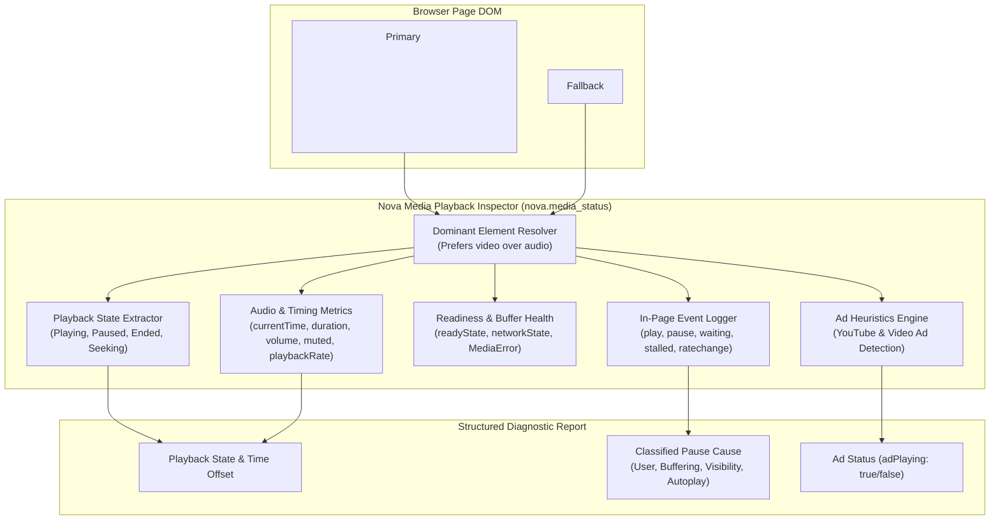
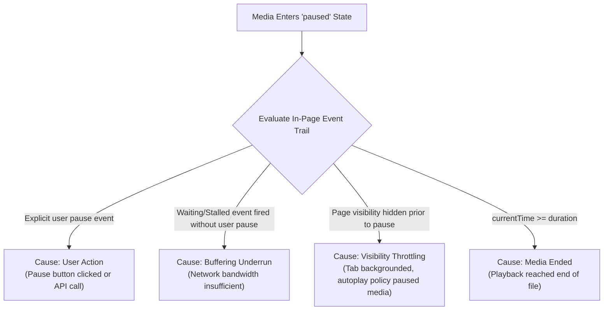

# Media Playback Inspection Architecture

Nova's Media Playback Inspection subsystem provides agents and developers with deep runtime visibility into HTML5 media elements (`<video>` and `<audio>`) playing inside browser tabs. It exposes playback state, buffer health, network readiness, volume levels, and a diagnostic trail that classifies the root causes of unexpected playback pauses or stalls.

---

## Dominant Element Resolution

When `nova.media_status` is called on a tab:
1. **Primary Video Preference:** Nova scans the DOM for the primary `<video>` element on the page (evaluated by visibility, viewport prominence, and active playback).
2. **Audio Fallback:** If no video element exists, Nova falls back to the first active `<audio>` element.
3. **Multi-Player Boundaries:** The tool evaluates the dominant media player; it does not inventory every hidden or background sound effect on the page.

---

## Playback Telemetry & Engine Readiness

The diagnostic inspection extracts a comprehensive snapshot of the underlying browser media engine:

### 1. Playback & Timing Metrics

* **State:** `playing`, `paused`, `ended`, or `seeking`.
* **Current Position:** `currentTime` in fractional seconds.
* **Duration:** Total media duration in seconds (`NaN` or `Infinity` for continuous live streams).
* **Audio Metrics:** `volume` (clamped from `0.0` to `1.0`), `muted` boolean flag, and active `playbackRate` (e.g. `1.0`, `1.5`, `2.0`).

### 2. Readiness & Network States (HTML5 Specification)

* **`readyState`:**
  - `0 (HAVE_NOTHING)`: No media information available.
  - `1 (HAVE_METADATA)`: Duration and dimensions available, but no audio/video frames ready.
  - `2 (HAVE_CURRENT_DATA)`: Current playback frame is available, but insufficient data to continue playing.
  - `3 (HAVE_FUTURE_DATA)`: Data available for the current position and at least a few future frames.
  - `4 (HAVE_ENOUGH_DATA)`: Full playback data available; stream can play through without buffering.
* **`networkState`:** Indicates whether the browser is actively fetching data (`NETWORK_LOADING`), idle (`NETWORK_IDLE`), or encountering missing sources (`NETWORK_NO_SOURCE`).
* **`error`:** If the element fails, reports standard HTML5 error codes:
  - `1 (MEDIA_ERR_ABORTED)`: Fetching aborted by user agent.
  - `2 (MEDIA_ERR_NETWORK)`: Network failure while fetching media.
  - `3 (MEDIA_ERR_DECODE)`: Error decoding corrupted media stream.
  - `4 (MEDIA_ERR_SRC_NOT_SUPPORTED)`: Format or MIME type not supported by hardware/browser.

---

## Cause Classification for Pauses and Stalls

A frequent challenge in browser automation is identifying **why** a media player stopped playing. Nova's in-page diagnostics script monitors the media event timeline to classify pause causes:

* **User Action:** The user or an agent clicked pause or invoked a control.
* **Buffering Underrun:** The player ran out of buffered frames and stalled due to network latency.
* **Visibility Throttling:** The browser backgrounded the tab or minimized the window, triggering Chromium's background media throttling policies.
* **Media Ended:** Normal completion of the media stream.

---

## Advertisement Detection Heuristics

On major video streaming platforms (notably YouTube), video players often display pre-roll or mid-roll advertisements before the target video begins.

`nova.media_status` applies platform-specific heuristics:
* **`adPlaying: true`:** An advertisement is actively playing (e.g. YouTube ad overlay detected, ad progress bar active, skip button pending).
* **`adPlaying: false`:** The primary content video is actively playing.

This prevents agents from confusing advertisement dialogue or runtimes with the actual target video content.

---

## Tool Reference

| Tool | Core Parameters | Output / Diagnostics |
| :--- | :--- | :--- |
| [`nova.media_status`](../../../mcp-reference/tools/media-and-transcription/nova-media-status.md) | `targetId` | Playback state, `currentTime`, `duration`, `volume`, `muted`, `playbackRate`, `readyState`, `networkState`, classified pause cause, `adPlaying` status |

---

[Media Intelligence overview](../README.md) · [Media Capture](../media-capture/README.md) · [Speech Transcription](../transcription/README.md) · [All core features](../../README.md)
