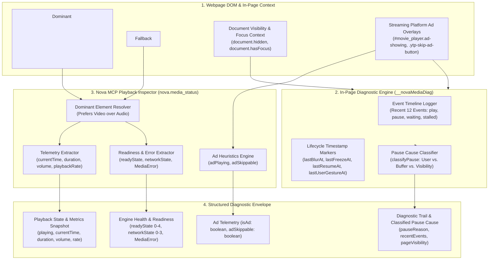
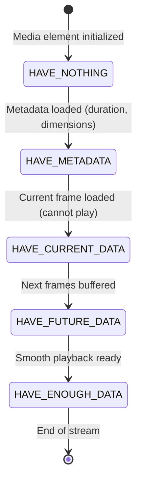
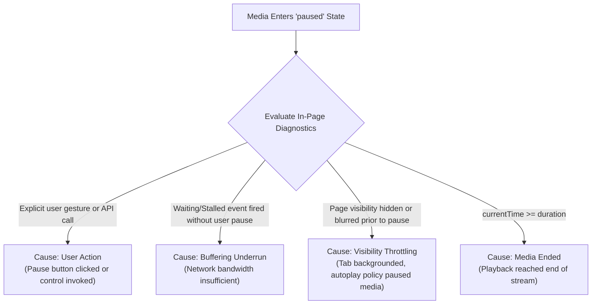
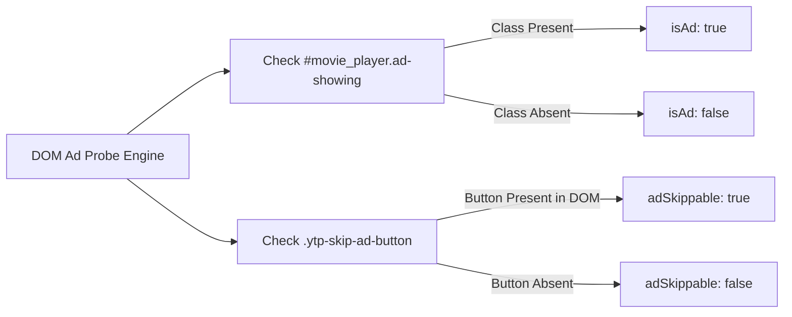

# Media Playback Inspection Architecture

Nova's Media Playback Inspection subsystem provides agents and developers with deep runtime visibility into HTML5 media elements (`<video>` and `<audio>`) embedded inside browser tabs. By evaluating player state, buffer health, network readiness, volume levels, and an in-page diagnostic event trail, Nova automatically classifies the root causes of unexpected playback pauses or stalls and detects video advertisements.



---

## 1. Dominant Element Resolution Algorithm

A single modern web application often contains multiple `<video>` and `<audio>` elements simultaneously (e.g. video feeds, background ambient tracks, sound effect players, banner ads). `nova.media_status` executes a prioritized resolution scan:

1. **Video Preference:** Nova scans the DOM for `<video>` elements first. It evaluates element visibility, viewport prominence, and active playback state to identify the dominant video player.
2. **Audio Fallback:** If no video element exists on the page, Nova falls back to the first active `<audio>` element (e.g. web music players, podcast streams, messenger voice memos).
3. **Multi-Player Boundaries:** The tool targets the primary media stream; auxiliary notification chimes or hidden background audio loops are ignored, ensuring telemetry reflects the user's primary content.

---

## 2. Playback Telemetry & Engine Readiness

Nova extracts a complete snapshot of the underlying browser media engine:

### Playback & Timing Metrics

* **State Flags:** `playing` (`!paused && !ended`), `paused`, `ended`, and `seeking`.
* **Current Position (`currentTime`):** Exact playback position in seconds, rounded to tenths for clarity.
* **Duration (`duration`):** Total media duration in seconds. For continuous live streams (HLS/DASH), returns `NaN` or `Infinity`.
* **Audio Metrics:** `volume` (clamped `0.0` to `1.0`), `muted` boolean flag, and `playbackRate` (e.g. `1.0`, `1.5`, `2.0`).
* **Source Reference (`src`):** The active media source URL, safely truncated to 120 characters to prevent massive data URI strings from cluttering output.

### HTML5 Readiness & Network States

The tool inspects standard HTML5 media specification properties:



* **`readyState`:**
  - `0 (HAVE_NOTHING)`: No media information available.
  - `1 (HAVE_METADATA)`: Duration, dimensions, and audio tracks parsed, but no video/audio frames ready.
  - `2 (HAVE_CURRENT_DATA)`: Data for current frame ready, but insufficient data to advance playback.
  - `3 (HAVE_FUTURE_DATA)`: Current and future frames available; can start playback.
  - `4 (HAVE_ENOUGH_DATA)`: Media engine estimates sufficient buffer to play through without stalling.
* **`networkState`:** Indicates whether the browser is actively fetching (`NETWORK_LOADING`), idle (`NETWORK_IDLE`), or encountering missing sources (`NETWORK_NO_SOURCE`).
* **`error`:** If the media element fails, extracts native `MediaError` properties:
  - `code 1 (MEDIA_ERR_ABORTED)`: Fetching aborted by user agent.
  - `code 2 (MEDIA_ERR_NETWORK)`: Network error occurred while fetching.
  - `code 3 (MEDIA_ERR_DECODE)`: Decoding error while parsing corrupted media stream.
  - `code 4 (MEDIA_ERR_SRC_NOT_SUPPORTED)`: MIME format or codec not supported by hardware/browser.
  - `message`: Detailed browser error string.

---

## 3. In-Page Event Logging & Cause Classification

A primary challenge in web automation is diagnosing **why** a media player paused unexpectedly. Is the player stalled on network buffers? Did Chromium throttle the background tab? Or did the user click pause?

Nova injects an in-page media diagnostic probe (`window.__novaMediaDiag`) that monitors playback events and classifies pause causes:



### Classified Pause Causes

* **`user_action`:** An explicit user interaction (click, spacebar) or programmatic control triggered the pause.
* **`buffering_underrun`:** The player exhausted its frame buffer; `waiting` or `stalled` events fired immediately before the pause without user action.
* **`visibility_throttling`:** Chromium backgrounded or minimized the tab, triggering browser media throttling policies.
* **`media_ended`:** Normal completion of playback (`currentTime >= duration`).

### Diagnostic Trail & Host Visibility

The structured output includes an in-depth diagnostic trail:
* **`recentEvents`:** A rolling buffer of the last 12 media events (`play`, `pause`, `waiting`, `stalled`, `ratechange`, `seeking`, `seeked`).
* **Timestamp Markers:** High-resolution timestamps tracking `lastBlurAt`, `lastVisibilityChangeAt`, `lastFreezeAt`, `lastResumeAt`, and `lastUserGestureAt`.
* **Host Page State:** Evaluates `page.hidden`, `page.visibilityState`, and `page.hasFocus` to determine whether browser window state influenced playback.

---

## 4. Video Advertisement Detection Heuristics

On video streaming platforms (most notably YouTube), media players frequently display pre-roll or mid-roll advertisements before the main video begins. If an autonomous agent relies solely on audio or transcript content, it risks misinterpreting advertisement dialogue as actual webpage content.

`nova.media_status` applies robust platform heuristics:



* **`isAd: true`:** An advertisement is actively playing (e.g. YouTube ad overlay detected, ad progress bar active).
* **`adSkippable: true`:** An ad skip button is available in the DOM, allowing agents to dispatch a click action to bypass the ad immediately.
* **`isAd: false`:** The primary content video is playing.

---

## 5. Tool Reference & Envelope Structure

### Tool: `nova.media_status`

* **Parameters:** `targetId?` (tab profile identifier, defaults to `"active"`).
* **Output Structure:**

```json
{
  "targetId": "active",
  "media": {
    "found": true,
    "playing": true,
    "paused": false,
    "ended": false,
    "seeking": false,
    "currentTime": 45.2,
    "duration": 360.0,
    "volume": 0.85,
    "muted": false,
    "playbackRate": 1.0,
    "isAd": false,
    "adSkippable": false,
    "readyState": 4,
    "networkState": 1,
    "error": null,
    "src": "blob:https://youtube.com/a94d8...",
    "title": "Quantum Computing Fundamentals",
    "page": {
      "hidden": false,
      "visibilityState": "visible",
      "hasFocus": true
    },
    "diag": {
      "pauseReason": null,
      "lastVisibility": "visible",
      "lastHidden": false,
      "lastFocus": true,
      "recentEvents": ["play", "playing", "timeupdate"]
    }
  }
}
```

---

[Media Intelligence overview](../README.md) · [Media Capture](../media-capture/README.md) · [Speech Transcription](../transcription/README.md) · [Browser Interaction & Input Dispatch](../../browser-interaction/input-dispatch/README.md) · [All core features](../../README.md)
