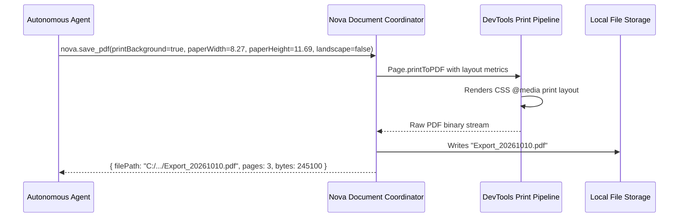

# PDF Reading & Export Architecture

Nova provides document intelligence through two complementary PDF operations: extracting programmatic text from existing PDF files on disk (`nova.read_pdf`) and generating pixel-accurate PDF documents from active web pages using Chromium's headless print engine (`nova.save_pdf`).

```mermaid
flowchart TD
    subgraph ReadPath["PDF Text Extraction (nova.read_pdf)"]
        LocalPDF["Local PDF Document on Disk"]
        RangeFilter["Page Range Selector\n(e.g. '1,3-5', 'all')"]
        Parser["Native PDF Text Extraction Engine"]
        BudgetGuard["Text Token Budget Guard\n(Truncation Indicator)"]
        ExtractedText["Structured Page Text Output\n(pageNumber, text, charCount)"]
    end

    subgraph SavePath["Webpage PDF Export (nova.save_pdf)"]
        ActivePage["Active Webpage DOM & Styles"]
        PrintEngine["DevTools Page.printToPDF Engine"]
        PrintOptions["Print Parameters\n(Margins, Paper Size, Backgrounds, Scale)"]
        DiskWriter["Local PDF File Writer\n(Returns verified file path)"]
    end

    LocalPDF --> RangeFilter --> Parser --> BudgetGuard --> ExtractedText
    ActivePage --> PrintOptions --> PrintEngine --> DiskWriter
```

---

## 1. PDF Text Extraction (`nova.read_pdf`)

`nova.read_pdf` extracts selectable text from PDF documents stored locally on the user's computer:

### Page Selection Syntax

Agents can extract the entire document or target specific sections to conserve context window tokens:
* Single pages: `1`
* Multiple disjoint pages: `1,4,8`
* Continuous ranges: `2-5`
* Mixed selections: `1,3-6,9`
* All pages: Omit the argument or pass `all` (default).

### Diagnostic Codes & Error States

| Result Code | Meaning & Recommended Agent Action |
| :--- | :--- |
| **`truncated: true`** | The document's extracted text exceeded the maximum response character budget. Narrow the query using specific `pageRanges`. |
| **`read_pdf.no_extractable_text`** | The PDF contains no digital text streams. The document is likely a scanned image, flattened bitmap, or rasterized drawing. Requires an Optical Character Recognition (OCR) pipeline. |
| **`read_pdf.encrypted`** | The document is protected by an owner or user password and cannot be extracted without decryption credentials. |
| **`read_pdf.not_found`** | The file does not exist at the specified path. |

### Filesystem Sandboxing

Nova allows reading PDF documents residing in Nova's default `Downloads` and `Exports` directories without friction. Accessing arbitrary paths across local hard drives requires the user setting "Allow local files (file://)".

> [!NOTE]
> `nova.read_pdf` is a pure digital text extractor; it does not execute OCR on scanned images or describe visual figures. For visual document analysis, use screenshot tools or Nova's [Image Viewer](../image-viewer/README.md).

---

## 2. Webpage PDF Export (`nova.save_pdf`)

`nova.save_pdf` renders the active web tab into a vector PDF on disk using Chromium's `Page.printToPDF` protocol. It provides granular typographic and layout controls:

### Layout Parameters

* **`printBackground` (Default: `true`):** Renders CSS background colors and graphics. Essential for dashboards, styled invoices, and charts.
* **`landscape`:** Toggles between portrait (`false`) and landscape (`true`) orientation.
* **`scale` (0.1 to 2.0):** Scales webpage content to fit printable bounds.
* **Paper Sizing:** Supports standard named sizes (`A4`, `Letter`, `Legal`) or explicit dimensions via `paperWidth` and `paperHeight` in inches.
* **Margins:** Independent margin controls (`marginTop`, `marginBottom`, `marginLeft`, `marginRight`) in inches.
* **`preferCSSPageSize`:** When enabled, prioritizes `@page` CSS rules defined in the website's print stylesheet over tool arguments.
* **`displayHeaderFooter`:** Injects standard browser headers (date, page title) and footers (page number, URL).

### File Return Invariant

Rather than embedding hundreds of kilobytes or megabytes of base64-encoded PDF data directly in the JSON-RPC response—which would pollute agent context windows—`nova.save_pdf` writes the file directly to disk and returns its verified absolute path.

---

## Embedded WinUI 3 PDF Viewer

For human operators, Nova includes a native WinUI 3 PDF viewer component integrated directly into browser tabs:
* Features smooth hardware-accelerated page zooming (`PdfViewerZoom`).
* Supports standard keyboard navigation (`Page Up`, `Page Down`, `Home`, `End`).
* Allows immediate text copying and direct local printing.

---

## Tool Reference

| Tool | Core Parameters | Output / Diagnostics |
| :--- | :--- | :--- |
| [`nova.read_pdf`](../../../mcp-reference/tools/visual-evidence/nova-read-pdf.md) | `filePath`, `pageRanges`, `maxChars` | Total page count, pages read, per-page text array, truncation flag, diagnostic error codes |
| [`nova.save_pdf`](../../../mcp-reference/tools/visual-evidence/nova-save-pdf.md) | `targetId`, `filePath`, `printBackground`, `landscape`, `scale`, `paperFormat`, `pageRanges` | Generated PDF file path, total page count, file size in bytes |

---

[Media Intelligence overview](../README.md) · [Image Viewer](../image-viewer/README.md) · [Visual Evidence Tools](../../../mcp-reference/tools/visual-evidence/README.md) · [All core features](../../README.md)
