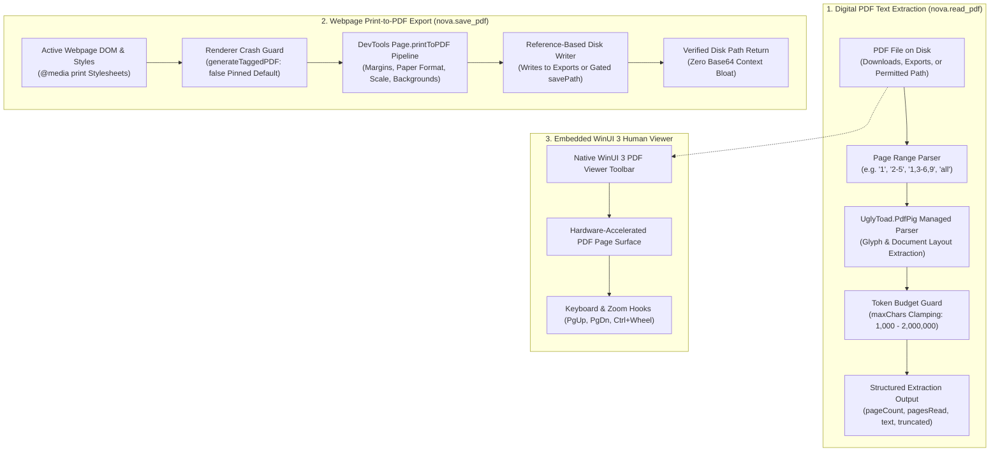
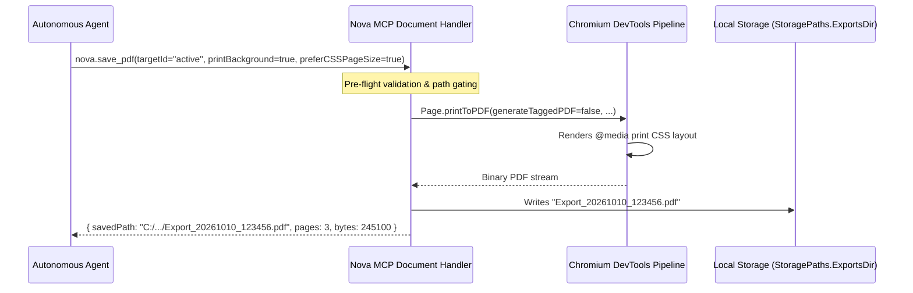

# PDF Reading & Export Architecture

Nova provides comprehensive document intelligence through two complementary PDF operations: extracting structured digital text from existing PDF files on disk (`nova.read_pdf`) and generating pixel-accurate vector PDF documents from active web pages using Chromium's DevTools print engine (`nova.save_pdf`).

It bridges automated document processing for AI agents with a native, hardware-accelerated WinUI 3 PDF viewing surface for human operators.



---

## 1. Webpage PDF Export (`nova.save_pdf`)

`nova.save_pdf` renders the active web tab into an archival vector PDF document on disk using Chromium's `Page.printToPDF` protocol. It provides granular typographic, page dimension, and styling controls:



### The `generateTaggedPDF: false` Renderer Crash Guard

A critical architectural invariant in Nova's PDF printing pipeline is the explicit deactivation of tagged PDF generation:

```json
{
  "generateTaggedPDF": false
}
```

* **The Underlying Chromium Bug:** In Chromium and WebView2, generating an accessible, tagged PDF forces the renderer to take an internal accessibility snapshot:
  $$\text{PrintWithParams} \longrightarrow \text{PrintPagesNative} \longrightarrow \text{SnapshotAccessibilityTree} \longrightarrow \text{SerializeEntireTreeAndDispose}$$
  On complex webpages containing deeply nested dynamic DOM structures or malformed ARIA trees (first observed on Roundcube webmail, WebView2 151.0.4129.101), this code path triggers an unrecoverable internal Chromium `CHECK` assertion failure (`int 3`).
* **The Failure Mode:** When the assertion fails, the entire WebView render process crashes mid-call. The browser tab goes blank, Nova must rebuild the tab's WebView controller, and no PDF file is generated.
* **The Safe Invariant:** Untagged PDF export takes the exact same typographic layout, font embedding, and vector rendering path while bypassing the accessibility tree snapshot. By pinning `generateTaggedPDF: false` by default, Nova eliminates the renderer crash risk entirely while preserving 100% visual fidelity and selectable text.

### Layout & Page Parameters

* **`printBackground` (Default: `true`):** Renders CSS background colors, gradients, and images. Essential for generating authentic receipts, invoices, data dashboards, and charts.
* **`preferCSSPageSize` (Default: `true`):** Prioritizes `@page` rules declared within the website's print stylesheet over tool parameters, ensuring layouts intended for specific book or invoice dimensions render as designed.
* **`landscape` (Default: `false`):** Toggles orientation between portrait (`false`) and landscape (`true`).
* **`scale` (Range: `0.1` to `2.0`, Default: `1.0`):** Scales page content uniformly, preventing wide tables or fixed layouts from truncating.
* **Paper Sizing (`paperWidth` & `paperHeight`):** Explicit paper dimensions in inches (e.g. `8.27` $\times$ `11.69` for A4, `8.5` $\times$ `11.0` for US Letter).
* **Granular Margins (`marginTop`, `marginBottom`, `marginLeft`, `marginRight`):** Independent margin offsets in inches.
* **`pageRanges`:** Selective printing of specific pages (e.g. `'1-3'`, `'1,5'`).
* **`displayHeaderFooter` (Default: `false`):** Injects standard browser headers (current date, page title) and footers (page number, source URL). Kept disabled by default for clean archival exports.

### Reference-Based Delivery Invariant

A single rendered PDF frequently exceeds several megabytes in size. Encoding this binary stream into a JSON-RPC response via base64 would immediately consume hundreds of thousands of context tokens and risk blowing MCP client message limits.

Nova strictly enforces **reference-based delivery**:
1. The rendered PDF is written directly to disk.
2. Nova writes by default to `StoragePaths.ExportsDir`, requiring no elevated permissions.
3. The MCP tool returns a compact JSON envelope containing the verified absolute path (`savedPath`), total page count (`pages`), and file size (`bytes`).

---

## 2. Digital PDF Text Extraction (`nova.read_pdf`)

`nova.read_pdf` extracts selectable digital text from PDF documents stored locally on disk. It closes the verification loop for agents: an agent can save a webpage to PDF or download an invoice, and immediately read back its contents to confirm that key data (such as invoice numbers, dollar amounts, or cancellation notices) are present.

### Managed Parsing Engine (`UglyToad.PdfPig`)

Nova utilizes the managed, high-performance `UglyToad.PdfPig` engine for digital PDF parsing:
* **Zero External Dependencies:** Executes entirely within Nova's managed process without requiring external command-line utilities (such as `pdftotext` or Poppler).
* **Glyph & Layout Analysis:** Reconstructs natural reading order across multi-column text layouts, tables, and headers.
* **Page-Selective Parsing:** When specific page ranges are requested, only the target pages are loaded and tokenized, minimizing CPU and memory consumption on large documents.

### Page Selection Syntax

Agents can target specific sections of a document to conserve context tokens:
* Single page: `"1"`
* Disjoint pages: `"1,4,8"`
* Continuous range: `"2-5"`
* Mixed selection: `"1,3-6,9"`
* All pages: Omit the argument or pass `"all"`.

### Token Budget Guard (`maxChars`)

To protect LLM context windows from overflowing when processing large legal filings or technical manuals:
* **Default Budget:** 50,000 characters.
* **Configurable Range:** Clamped between `1,000` and `2,000,000` characters.
* **Truncation Flag:** If the extracted text reaches the limit, Nova halts further extraction and sets `truncated: true` alongside structured decision metadata (`McpOutputBudget`), alerting the agent to narrow its query with specific `pageRanges`.

### Diagnostic Codes & Outcomes

`nova.read_pdf` provides clear diagnostic classification for document parsing issues:

| Result Code | Status | Meaning & Recommended Agent Action |
| :--- | :--- | :--- |
| **`ok`** | `"ok"` | Extraction succeeded. Returns `text`, `pageCount`, and `pagesRead` array. |
| **`read_pdf.not_found`** | `"not_found"` | File does not exist at the specified path. Check download progress via `nova.downloads_wait` before reading. |
| **`read_pdf.encrypted`** | `"blocked"` | The document is protected by an owner or user password. Nova does not store or prompt for PDF passwords. |
| **`read_pdf.no_extractable_text`** | `"empty"` | The document parsed successfully, but contains zero digital text streams. The document is a rasterized scan or flattened bitmap. Requires an OCR pipeline. |
| **`read_pdf.unreadable`** | `"error"` | File header or structure is corrupted, incomplete, or not a valid PDF. |

> [!NOTE]
> `nova.read_pdf` is a pure digital text extractor. It does not perform Optical Character Recognition (OCR) on scanned bitmaps. For visual inspection of scanned PDFs, render the document and use Nova's screenshot or visual evidence tools.

---

## 3. Filesystem Sandboxing & Policy Gating

Access to local PDF files is governed by Nova's path security policy:

* **Automatic Consent:** PDF files residing in Nova's default `Downloads` and `Exports` directories are accessible immediately without friction.
* **Custom Paths & Hard Drive Access:** Reading files from arbitrary local paths or exporting to a custom `savePath` requires the user setting **"Allow local files (file://)"**. If disabled, requests fail immediately with:
  ```json
  {
    "code": -32035,
    "message": "Tool 'nova.save_pdf' blocked by policy: saving to a custom savePath requires local file access.",
    "data": { "reasonCode": "mcp.file_access_disabled" }
  }
  ```
* **Early Path Validation:** `nova.save_pdf` validates and gates custom destination paths **before** executing the render pipeline, ensuring invalid paths fail fast before consuming CPU and layout compute.

---

## 4. Embedded WinUI 3 PDF Viewer

For human operators, Nova embeds a native WinUI 3 PDF viewing surface directly inside browser tabs:
* **Hardware-Accelerated Zooming:** Smooth page zooming managed via `PdfViewerZoom`.
* **Keyboard Navigation:** Full support for `Page Up`, `Page Down`, `Home`, `End`, and `Ctrl + Wheel` zooming hooks (`PdfZoomKeyboardHook`).
* **Interactive PDF Toolbar:** Built-in WinUI 3 toolbar (`PdfToolbar`) providing single-click page navigation, zoom presets (fit-to-width, fit-to-page), and native printing.

---

## Tool Reference

| Tool | Parameters | Output & Diagnostics |
| :--- | :--- | :--- |
| [`nova.save_pdf`](../../../mcp-reference/tools/visual-evidence/nova-save-pdf.md) | `targetId?`<br/>`savePath?`<br/>`printBackground?`<br/>`preferCSSPageSize?`<br/>`landscape?`<br/>`scale?`<br/>`paperWidth?`<br/>`paperHeight?`<br/>`marginTop?`<br/>`marginBottom?`<br/>`marginLeft?`<br/>`marginRight?`<br/>`pageRanges?`<br/>`displayHeaderFooter?`<br/>`generateTaggedPDF?` | `savedPath` (verified file path)<br/>`pages` (total count)<br/>`bytes` (file size)<br/>Renderer error classification |
| [`nova.read_pdf`](../../../mcp-reference/tools/visual-evidence/nova-read-pdf.md) | `path`<br/>`pages?`<br/>`maxChars?`<br/>`includePages?` | `text` (extracted continuous text)<br/>`pageCount` (total document pages)<br/>`pagesRead` (array of read page indices)<br/>`truncated` (boolean)<br/>`reasonCode` (`read_pdf.no_extractable_text`, `read_pdf.encrypted`, etc.) |

---

[Media Intelligence overview](../README.md) · [Image Viewer](../image-viewer/README.md) · [Visual Evidence Tools](../../../mcp-reference/tools/visual-evidence/README.md) · [Connectors Subsystem](../../connectors/README.md) · [All core features](../../README.md)
