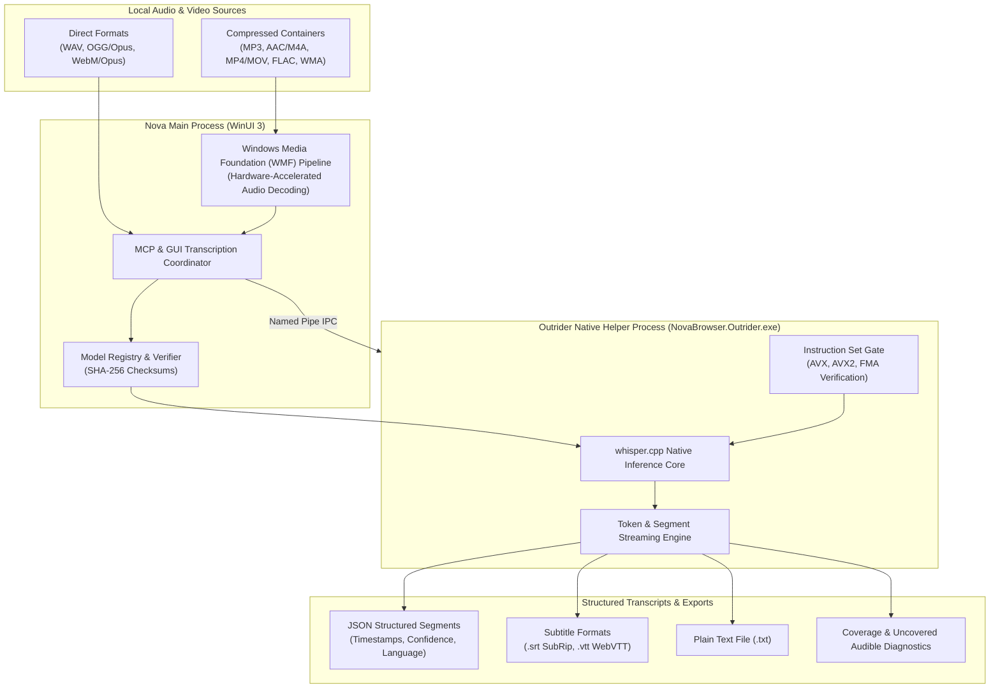
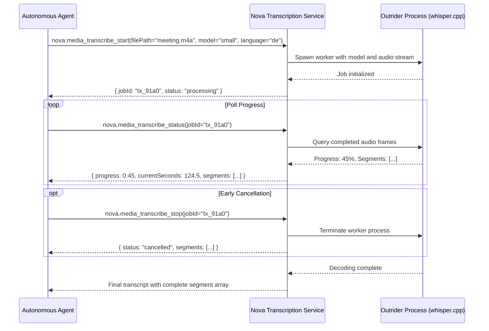

# Speech Transcription Architecture

Nova includes a native, privacy-first automatic speech recognition (ASR) engine powered by an optimized build of `whisper.cpp`. The engine runs 100% locally on the user's computer, requires zero cloud connectivity for transcription, and isolates native inference inside Nova's external helper process to ensure application stability.

Agents and human operators can transcribe local audio or video files, monitor real-time decoding progress, extract timestamped dialogue segments, and export results into industry-standard subtitle or text formats.

---

## Local Recognition & Outrider Process Isolation

### The Outrider Process Boundary

`whisper.cpp` is written in native C/C++. High-performance native code operating on complex floating-point matrices poses unique risks: memory corruption in native libraries or excessive CPU spikes could crash the entire browser application.

Nova resolves this by executing all speech inference within **Nova Outrider** (`NovaBrowser.Outrider.exe`):
1. **Crash Isolation:** If the native library encounters an unhandled exception or illegal instruction on malformed audio data, only the Outrider process terminates. The browser UI, tabs, and agent connections remain fully operational.
2. **Instant Cancellation:** When an agent invokes `nova.media_transcribe_stop` or when a job exceeds its compute budget, Nova terminates the Outrider worker process immediately. Memory is instantly reclaimed by the operating system without waiting for internal inference loops to complete.
3. **Hardware Instruction Verification:** High-throughput Whisper inference requires modern CPU vector instructions (AVX, AVX2, and FMA). Nova verifies CPU capabilities before loading the native model; `nova.media_transcribe_models` exposes these hardware verification flags.

---

## Container Decoding & Supported Formats

Nova processes audio files without requiring external FFmpeg installations:

* **Direct In-Memory Decoding:**
  - Uncompressed PCM WAV (`.wav`).
  - Ogg Opus (`.ogg`, `.opus`).
  - WebM / Matroska containers with Opus audio (`.webm`, `.mkv`), standard for in-browser media recordings.
* **Windows Media Foundation (WMF) Decoding:**
  - Compressed audio formats supported natively by the Windows OS: MP3 (`.mp3`), Advanced Audio Coding (`.aac`, `.m4a`), Windows Media Audio (`.wma`), and FLAC (`.flac`).
  - Video containers with audio tracks: MP4 (`.mp4`), QuickTime (`.mov`), and AVI (`.avi`).
* **Pre-Flight Inspection (`nova.media_file_info`):**
  - Quickly probes container headers, streams, and advertised duration without decoding the entire audio payload, allowing agents to estimate compute time before starting transcription.

---

## Pinned Speech Models

Nova utilizes quantized GGML models hosted upstream on Hugging Face. Each official model is strictly pinned to an exact byte size and cryptographic SHA-256 checksum:

| Model Identifier | Model Filename | Disk Size | Target Accuracy & Use Case |
| :--- | :--- | :--- | :--- |
| **`base`** | `ggml-base-q5_1.bin` | ~57 MB | Fast, basic transcription. Included with Nova out of the box. Ideal for clean audio and quick voice memos. |
| **`small`** | `ggml-small-q5_1.bin` | ~181 MB | **Recommended Default.** Balanced accuracy and speed. Handles accented speech and conversational audio well. |
| **`large-v3-turbo`** | `ggml-large-v3-turbo-q5_0.bin` | ~547 MB | **Highest Precision.** Whisper v3 Turbo architecture. Exceptional multilingual accuracy and complex terminology handling; requires significant CPU resources. |

### Model Lifecycle & Custom Adoption

* **Installation:** Downloaded on demand via `nova.media_transcribe_model_install`. Nova verifies the SHA-256 hash immediately upon download.
* **Adoption ("Use a file I already have"):** Users can point Nova to existing GGML model files on disk. Nova integrates the model but flags it as user-provided.
* **Removal:** `nova.media_transcribe_model_remove` purges unneeded models from disk.

---

## Transcription Job Lifecycle

### Key Parameters on `nova.media_transcribe_start`

* **`filePath`:** Absolute path to the local audio or video file. Must reside in Downloads, Exports, or a permitted local directory.
* **`model`:** Target model identifier (`base`, `small`, `large-v3-turbo`). If omitted, uses the user's preferred model from Settings.
* **`language`:** Optional ISO 639-1 language code (e.g., `de`, `en`, `fr`, `es`). While Whisper supports auto-detection, explicitly specifying the language improves recognition accuracy on short recordings.
* **`prompt`:** Optional initial text prompt providing domain-specific terminology, acronyms, or speaker names.
* **`temperature`:** Sampling temperature (0.0 for deterministic greedy decoding, higher values for diverse sampling).
* **`budgetMs`:** Optional maximum compute deadline in milliseconds.

---

## Evaluating Transcripts as Verifiable Evidence

A finished transcription job provides quantitative coverage metrics to help agents evaluate transcript reliability:

### Coverage Metrics & Silence Differentiation

* **Full Audio Coverage:** A transcript is complete only when the decoder processes the entire audio stream to the final audible frame.
* **Audible vs. Silent Gaps:** Audio containing silence or pauses is not considered missing text.
* **`uncoveredAudible` Segments:** Nova identifies audio intervals where significant acoustic energy was detected by the decoder, but no valid speech tokens were emitted.
  - **Interpretation:** These intervals often indicate background music, coughing, ambient noise, or unintelligible speech. Agents should inspect these segments before assuming speech was missed.

---

## Output Formats & User Experience

Transcripts can be formatted and exported across multiple standards:

* **JSON Structured Segments:** Each segment includes `id`, `startMs`, `endMs`, `text`, and token confidence scores.
* **SubRip Subtitles (`.srt`):** Standard sequential numbered subtitle blocks with millisecond timestamps.
* **WebVTT Subtitles (`.vtt`):** Modern HTML5 video subtitle format with cue styling support.
* **Plain Text (`.txt`):** Continuous prose transcript for direct reading or feeding into large language model context windows.

### GUI Transcription Window

Users can open the **Transcribe audio or video** window from Nova's main toolbar, drag and drop any supported audio or video file, select an installed model, observe real-time progress bars, and export text or subtitle files with one click.

---

## Tool Reference

| Tool | Core Parameters | Output / Diagnostics |
| :--- | :--- | :--- |
| [`nova.media_transcribe_start`](../../../mcp-reference/tools/media-and-transcription/nova-media-transcribe-start.md) | `filePath`, `model`, `language`, `prompt`, `temperature`, `budgetMs` | Job ID, initial status, selected model details |
| [`nova.media_transcribe_status`](../../../mcp-reference/tools/media-and-transcription/nova-media-transcribe-status.md) | `jobId` | Numeric progress (0.0–1.0), elapsed time, current audio offset, recognized segment list |
| [`nova.media_transcribe_stop`](../../../mcp-reference/tools/media-and-transcription/nova-media-transcribe-stop.md) | `jobId` | Cancellation confirmation, partial segment list captured prior to termination |
| [`nova.media_transcribe_models`](../../../mcp-reference/tools/media-and-transcription/nova-media-transcribe-models.md) | None | List of available models, installation state, disk paths, and CPU instruction support |
| [`nova.media_transcribe_model_install`](../../../mcp-reference/tools/media-and-transcription/nova-media-transcribe-model-install.md) | `model`, `customPath` | Download progress, SHA-256 verification status, final installed path |
| [`nova.media_transcribe_model_remove`](../../../mcp-reference/tools/media-and-transcription/nova-media-transcribe-model-remove.md) | `model` | Deletion confirmation, freed disk space |
| [`nova.media_file_info`](../../../mcp-reference/tools/media-and-transcription/nova-media-file-info.md) | `filePath` | Fast container probe, container type, stream summary, total duration |

---

[Media Intelligence overview](../README.md) · [Media Capture](../media-capture/README.md) · [Outrider Architecture](../../../components/outrider/README.md) · [Transcription User Guide](../../../user-guide/tools/transcription.md) · [All core features](../../README.md)
