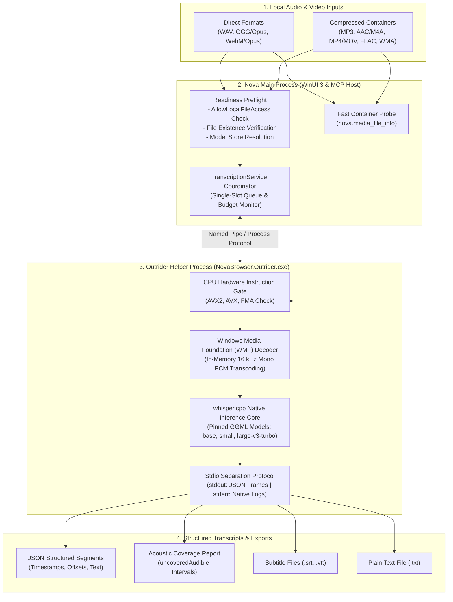
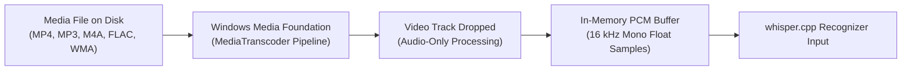
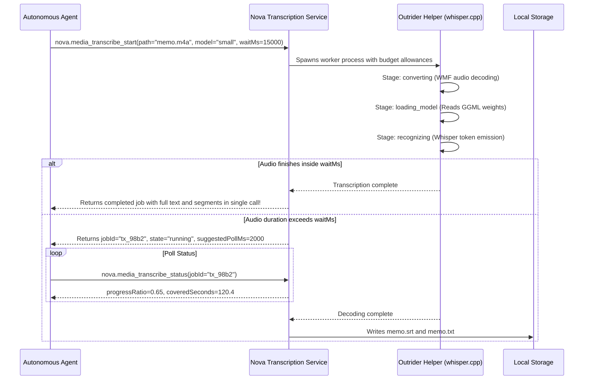

# Speech Transcription Architecture

Nova includes a native, privacy-first automatic speech recognition (ASR) subsystem powered by an optimized build of `whisper.cpp`. The engine runs 100% locally on the user's workstation, requires zero cloud connectivity for inference, and strictly isolates native code inside Nova's external helper process to ensure application resilience.

Autonomous agents and human operators can transcribe local audio or video files, monitor real-time decoding progress, extract timestamped dialogue segments, and export results into industry-standard subtitle or text formats.



---

## 1. Local Recognition & Outrider Process Isolation

### The Outrider Process Boundary (`NovaBrowser.Outrider.exe`)

High-performance speech inference relies on native C/C++ libraries (`whisper.cpp`) operating on complex floating-point matrices. In modern .NET runtimes, native memory access violations, illegal CPU instructions, or unhandled exceptions inside native code cannot be trapped by managed `try / catch` blocks and cause immediate process termination.

Nova eliminates this vulnerability by executing all native speech recognition within an isolated external helper process: **Nova Outrider** (`NovaBrowser.Outrider.exe`):

1. **Fault Containment:** If a malformed audio container, corrupted model file, or native library defect triggers an access violation, only the Outrider process terminates. Nova's main browser window, open tabs, active sandbox profiles, and MCP connections remain fully operational.
2. **Instant Cancellation:** When an agent cancels a transcription via `nova.media_transcribe_stop` or when a job exceeds its compute budget, Nova terminates the Outrider worker process immediately. Memory is instantly reclaimed by the operating system without waiting for native loops to complete.
3. **Stdio Channel Separation:** Outrider writes structured progress frames exclusively to `stdout` (one JSON object per line). All native C++ logging from `whisper.cpp` is redirected to `stderr`. This ensures native logs never tear or corrupt the JSON frames parsed by the main browser process.

### CPU Vector Instruction Set Gates

High-throughput Whisper inference requires modern CPU vector extensions (AVX, AVX2, and FMA).

* **The Illegal Instruction Crash (`0xC000001D`):** GGML binaries are compiled against AVX2/FMA/F16C instructions. On a CPU lacking these instructions, the very first call into the native library triggers an uncatchable operating system fault (`0xC000001D Illegal Instruction`). Probing by "just trying it" cannot be recovered from.
* **Pre-Flight Hardware Gate:** Nova inspects CPU capabilities in managed code *before* loading the native library (`TranscribeProbe.IsCpuSupported`). If unsupported, jobs fail gracefully with:
  ```json
  {
    "code": -32004,
    "message": "Processor lacks required instruction sets (missing:AVX2+FMA).",
    "data": { "reasonCode": "cpu_unsupported", "permanent": true }
  }
  ```

---

## 2. In-Memory Container Decoding via Windows Media Foundation

Nova decodes a wide variety of audio and video formats without requiring external FFmpeg binaries:



### Why Windows Media Foundation (WMF) over FFmpeg

1. **License Safety:** FFmpeg builds bundled with common codecs (e.g. x264, x265) carry GPL licenses, conflicting with proprietary enterprise distributions. WMF is built directly into Windows, adding zero third-party licensing baggage.
2. **Zero Codec Bloat:** Leverages hardware-accelerated Windows media decoders already present on the user's operating system.
3. **In-Memory Transcoding:** Decoded audio is kept entirely in RAM. An hour of 16 kHz mono 16-bit PCM requires approximately 115 MB. This avoids generating temporary unencrypted disk scratch files that would remain behind if a job was cancelled.
4. **Video Track Dropping:** For video files (MP4, MOV, MKV), WMF decodes exclusively the audio stream, skipping video decoding entirely and saving substantial CPU resources.

### Pre-Flight Container Inspection (`nova.media_file_info`)

Agents can probe media files before launching transcription using `nova.media_file_info`:
* Quickly inspects container headers and streams in milliseconds.
* Reports exact audio duration, sample rate, and container format.
* Allows agents to estimate compute duration and choose an appropriate model before committing resources.

---

## 3. Pinned Speech Model Catalog & Store

Nova utilizes quantized GGML models hosted upstream on Hugging Face. Each official model is strictly pinned to an exact byte size and cryptographic SHA-256 checksum:

| Model ID | Filename | Disk Size | Accuracy & Target Use Case |
| :--- | :--- | :--- | :--- |
| **`base`** | `ggml-base-q5_1.bin` | ~57 MB | High speed, basic transcription. Bundled with Nova out of the box. Ideal for clean voice memos. |
| **`small`** | `ggml-small-q5_1.bin` | ~181 MB | **Recommended Default.** Balanced accuracy and speed. Handles accented speech and conversational audio reliably. |
| **`large-v3-turbo`** | `ggml-large-v3-turbo-q5_0.bin` | ~547 MB | **Highest Precision.** Whisper v3 Turbo architecture. Multilingual transcription with technical terminology handling. |

### Model Lifecycle & Adoption

* **Installation (`nova.media_transcribe_model_install`):**
  - Passing `modelId` downloads an official pinned model from Hugging Face and verifies its SHA-256 checksum.
  - Passing `path` adopts a local `.bin` model file provided by the user (flagged as `userSupplied`).
* **Model States:** `installed`, `bundled` (shipped with Nova), `available` (cataloged but not downloaded), `damaged` (checksum mismatch), and `userSupplied`.
* **Removal (`nova.media_transcribe_model_remove`):** Deletes unneeded models to reclaim disk space.

---

## 4. Transcription Job Lifecycle & Telemetry



### The Synchronous Inline Wait (`waitMs`)

While long recordings outlive standard MCP client timeouts, short audio clips (such as a 10-second web messenger voice memo) can finish in seconds:
* `nova.media_transcribe_start` accepts an optional `waitMs` parameter (up to `30,000` ms).
* If the job completes within this duration, the tool returns the completed transcript immediately, saving the agent a second round-trip.
* If processing exceeds `waitMs`, the tool returns the active job handle for status polling.

### Multi-Stage Pipeline Tracking

Jobs advance through clear operational stages:
1. `queued`: Waiting for the single-run worker slot.
2. `converting`: Windows Media Foundation is decoding the container to 16 kHz mono PCM (`stageProgress` tracks decode percentage).
3. `loading_model`: Outrider is mapping GGML model weights into RAM.
4. `recognizing`: Whisper inference is streaming 30-second audio windows.

### Compute Budgets & Stall Protection

To prevent runaway jobs from consuming CPU indefinitely:
* **`budgetMs`:** Total compute deadline.
* **`budgetModelLoadMs`:** Allowance for loading model weights into memory.
* **`budgetRecognitionMs`:** Allowance for processing audio frames.
* **`budgetStallMs`:** The stall timeout representing the maximum permitted gap between two signs of life (emitted 30-second windows). A slow job that continues emitting progress is never terminated, whereas a deadlocked worker is terminated cleanly.

---

## 5. Acoustic Coverage & Transcript Reliability

Machine transcripts read fluently even where words are misrecognized. Nova provides quantitative acoustic metrics to help agents evaluate transcript reliability:

### Measured Audio Length vs. Ratio

* `audioSecondsMeasured`: Distinguishes between measured audio duration (from WMF decoding or parsed headers) and estimated duration.
* `progressRatio`: Reflects true audio progress against measured duration.

### Uncovered Audible Intervals (`uncoveredAudible`)

Nova analyzes the acoustic energy of the decoded audio against recognized speech tokens:
* **Definition:** Identifies time intervals where significant acoustic energy was present in the audio stream, but Whisper emitted zero text tokens.
* **Interpretation:** These segments typically indicate background music, coughing, ambient noise, or unintelligible speech.
* **Agent Action:** Agents should inspect these intervals before assuming speech was missed:
  ```json
  {
    "uncoveredAudibleCount": 2,
    "uncoveredAudible": [
      { "start": 42.5, "end": 46.1 },
      { "start": 105.0, "end": 108.2 }
    ]
  }
  ```

### Omission of Artificial Confidence Scores

Many ASR wrappers expose arbitrary synthetic confidence numbers (e.g. `confidence: 0.000` or heuristic probabilities). Nova deliberately omits artificial confidence scores because `Whisper.net` leaves segment probability at zero; reporting synthetic numbers gives a false impression of precision. Nova instead relies on concrete acoustic coverage and duration metrics.

### Explicit Accuracy Warning (`accuracyNote`)

Every transcription result carries an explicit accuracy notice:
```
"Machine transcript from model 'small'. Do not take numbers, amounts, proper nouns or technical terms as verified, and treat a passage that does not add up as a transcription error rather than an odd statement."
```

---

## 6. Output Formats & User Experience

Transcripts can be consumed programmatically or exported:
* **JSON Structured Segments:** Each segment includes `start`, `end`, and `text`.
* **SubRip Subtitles (`.srt`):** Millisecond-accurate subtitle cues for video editing.
* **WebVTT Subtitles (`.vtt`):** Standard web video subtitle format.
* **Plain Text (`.txt`):** Continuous prose transcript.

### WinUI 3 Transcription Window

Human operators can open the **Transcribe audio or video** window from Nova's main toolbar, drag and drop any supported media file, select an installed model, observe real-time progress bars, and export text or subtitles with a single click.

---

## Tool Reference

| Tool | Parameters | Output / Diagnostics |
| :--- | :--- | :--- |
| [`nova.media_transcribe_start`](../../../mcp-reference/tools/media-and-transcription/nova-media-transcribe-start.md) | `path`, `model?`, `language?`, `waitMs?` | `jobId`, `state`, `model`, `stage`, `segments`, `progressRatio` |
| [`nova.media_transcribe_status`](../../../mcp-reference/tools/media-and-transcription/nova-media-transcribe-status.md) | `jobId`, `includeText?` | `state` (`queued`, `running`, `completed`, `canceled`, `failed`), `stageProgress`, `coveredSeconds`, `audioSeconds`, `uncoveredAudible`, `transcriptPath` |
| [`nova.media_transcribe_stop`](../../../mcp-reference/tools/media-and-transcription/nova-media-transcribe-stop.md) | `jobId` | Cancellation confirmation, partial segment list captured prior to termination |
| [`nova.media_transcribe_models`](../../../mcp-reference/tools/media-and-transcription/nova-media-transcribe-models.md) | None | Catalog of speech models, installed states, disk paths, CPU instruction support, and effective model choice |
| [`nova.media_transcribe_model_install`](../../../mcp-reference/tools/media-and-transcription/nova-media-transcribe-model-install.md) | `modelId?`, `path?` | Download progress, SHA-256 verification status, final installed path |
| [`nova.media_transcribe_model_remove`](../../../mcp-reference/tools/media-and-transcription/nova-media-transcribe-model-remove.md) | `fileName` | Deletion confirmation, freed disk space |
| [`nova.media_file_info`](../../../mcp-reference/tools/media-and-transcription/nova-media-file-info.md) | `path` | Fast container probe: format, stream inventory, duration in seconds |

---

[Media Intelligence overview](../README.md) · [Media Capture](../media-capture/README.md) · [Outrider Architecture](../../../components/outrider/README.md) · [Transcription User Guide](../../../user-guide/tools/transcription.md) · [All core features](../../README.md)
