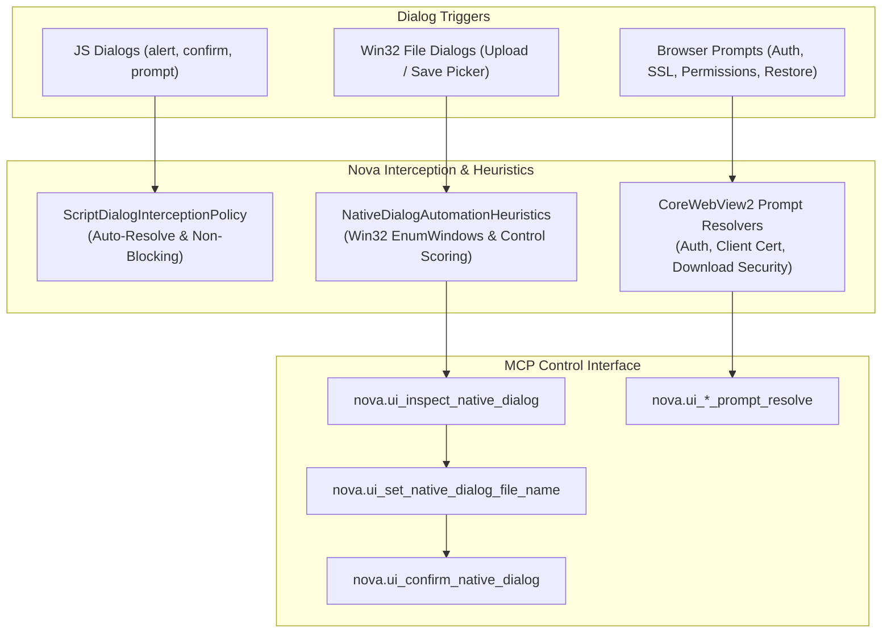

# Native Dialogs & UI Prompts Automation Engine

> [!NOTE]
> The **Native Dialogs & UI Prompts Automation Engine** (`NovaBrowser.Core.NativeDialogAutomationHeuristics`, `ScriptDialogInterceptionPolicy`) overcomes the steepest hurdle in browser automation: authentic Win32 and WebView2 system dialogs that exist outside the DOM and would otherwise deadlock the host thread.

---

## 1. Problem Statement: The Win32 Thread-Freeze

Traditional browser automation tools (Playwright, Selenium, Computer Use) operate exclusively within the HTML DOM:
1. **Thread Freezes on Modal OS Dialogs:** When a website opens an authentic modal window—such as a file upload picker (`<input type="file">`), HTTP Basic Auth prompt, print dialog, or client certificate selector—the rendering thread freezes. Standard DOM clicks become technically impossible; the agent enters an unresolvable deadlock.
2. **Browser Security Prompts:** Operating system security prompts (e.g. "Allow this site to access clipboard?", "Download executable file?", "Restore previous tabs?") reside on the OS shell level and cannot be addressed via CSS selectors.
3. **Fragile Coordinate Simulation:** Attempting to click dialog buttons via simulated screen coordinates fails due to DPI scaling differences, multi-monitor configurations, and localized button labels ("Open" vs. "Öffnen").

**Nova AI Workspace** resolves this through an **asynchronous Win32/COM interception and heuristics layer** that inspects, controls, and resolves native dialogs directly at the window handle (`HWND`) level.

---

## 2. The 2-Tier Interception Architecture

---

## 3. Win32 Control Heuristics (`NativeDialogAutomationHeuristics.cs`)

For native file open and save dialogs, Nova scans child controls of the dialog handle (`HWND`) and calculates confidence scores:
* **Input Field Identification:** Analyzes geometry, window class (`Edit`), and layout placement (`MinimumFileNameEditScore = 50`).
* **Role Classification:** Multi-lingual token matching identifies affirmative and dismissal buttons:
  * **Confirm:** `open`, `save`, `ok`, `select`, `oeffnen`, `speichern`, `auswaehlen`, `drucken`.
  * **Cancel:** `cancel`, `close`, `abort`, `dismiss`, `abbrechen`, `schliessen`, `verwerfen`.
* **Default Focus Detection:** Evaluates Win32 default button flags (`IsDefaultButton`).

---

## 4. Production Code References

| Component | Source File | Responsibility |
| :--- | :--- | :--- |
| **`NativeDialogAutomationHeuristics`** | `NovaBrowser/Core/Browser/NativeDialogAutomationHeuristics.cs` | Classifies controls, input fields, and buttons in native Win32 dialogs. |
| **`NativeDialogAutomation`** | `NovaBrowser/Core/Mcp/McpServer.ExecutionNativeDialogAutomation.cs` | Exposes MCP tool endpoints for inspecting and resolving dialogs. |

---

## 5. MCP Tooling for Dialogs & Prompts

Agents control modal system dialogs through specialized MCP tools:

* **Win32 File & Picker Dialogs:**
  * `nova.ui_inspect_native_dialog`: Detects whether a native dialog is active, returning title, buttons, and input fields.
  * `nova.ui_set_native_dialog_file_name`: Writes the target file path directly into the dialog's edit control.
  * `nova.ui_confirm_native_dialog`: Triggers the primary affirmative action (e.g. "Open" or "Save").
  * `nova.ui_dismiss_native_dialog`: Safely cancels or dismisses the dialog (`Cancel`).
* **Security, Auth & Permission Prompts:**
  * `nova.ui_auth_prompt_resolve`: Resolves HTTP Basic/Digest authentication prompts using vault credentials.
  * `nova.ui_permission_prompt_resolve`: Grants or denies web permission prompts (geolocation, notifications, media).
  * `nova.ui_client_certificate_prompt_resolve`: Selects the required X.509 client certificate for mTLS handshakes.
  * `nova.ui_download_security_prompt_resolve`: Resolves warnings on executable downloads (`.exe`, `.msi`, `.ps1`).
  * `nova.ui_restore_tabs_prompt_resolve`: Resolves the startup session restoration prompt after abnormal reboots.

---

## Related Documentation

* **[Outrider Process Boundary](outrider-boundary.md)** — Native process boundary and hardware resilience.
* **[Agent Awareness Gates (AAG)](aag.md)** — Pre-execution safety and verification rules.
* **[Secure Vault & Zero-Leak Secrets](vault-and-secrets.md)** — Credential autofill without leaking plaintext secrets.
