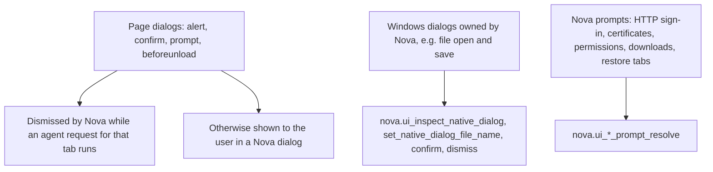

# Native Dialogs & UI Prompts

> [!NOTE]
> Some dialogs are not part of the web page: the page's own `alert`/`confirm`/`prompt` boxes, Windows file dialogs, and Nova's own prompts for sign-in, certificates, permissions, risky downloads and tab restore. CSS selectors cannot reach them. Nova handles page dialogs itself during automation and gives agents dedicated tools for the others.

---

## 1. Problem Statement

1. **Modal dialogs stop page automation:** A page waiting for an answer to `confirm()` does not continue, and a Windows file dialog is not part of the DOM.
2. **Browser prompts outside the page:** HTTP sign-in, certificate warnings, permission requests and the restore-tabs question appear above the page and have no selector.
3. **Coordinate clicking is fragile:** Clicking dialog buttons by screen position breaks with DPI scaling, multiple monitors and localized button labels ("Open" vs. "Öffnen").

---

## 2. Three Kinds of Dialogs

### Page dialogs (`alert`, `confirm`, `prompt`, `beforeunload`)

Nova intercepts these through WebView2 instead of patching page scripts. While an agent request for that tab is in progress, Nova dismisses the dialog right away (`confirm` and `prompt` are answered as cancelled), so the page continues and the agent is not blocked. Otherwise Nova shows the dialog to the user in its own window. `nova.ui_inspect_native_dialog` is not needed for page dialogs.

### Windows dialogs owned by Nova

For Windows dialogs that belong to Nova's window, such as file open and save dialogs, Nova reads the dialog's child controls:
* **File-name field:** chosen among the visible, enabled `Edit` controls by size and position in the dialog.
* **Button roles:** the standard OK and Cancel button IDs first; otherwise the label, matched against English and German words — confirm: `open`, `save`, `ok`, `choose`, `select`, `print`, `öffnen`, `speichern`, `auswählen`, `drucken`; cancel: `cancel`, `close`, `abort`, `dismiss`, `abbrechen`, `schließen`, `verwerfen`. A default button with any label counts as confirm.
* **Actions:** the file name is written into the field and buttons are pressed through window messages with a 1.5-second timeout, so a hanging dialog cannot block Nova.

For uploads, `nova.file_upload` sets the file on the page's file input directly and avoids the Windows dialog altogether.

### Nova's own prompts

HTTP sign-in, certificate warnings, client-certificate selection, permission requests, download warnings and the restore-tabs question are Nova dialogs. Each has its own resolver tool, and these tools stay usable while the prompt is open. `nova.ui_inspect_native_dialog` also reports an open Nova prompt together with the tools that can answer it.

---

## 3. MCP Tooling for Dialogs & Prompts

* **Windows dialogs:**
  * `nova.ui_inspect_native_dialog`: Reports the active dialog (title, class, controls) and the available actions.
  * `nova.ui_set_native_dialog_file_name`: Writes `text` into the dialog's file-name field.
  * `nova.ui_confirm_native_dialog`: Presses the confirm button (e.g. "Open" or "Save").
  * `nova.ui_dismiss_native_dialog`: Cancels the dialog.
* **Nova prompts:**
  * `nova.ui_auth_prompt_resolve`: HTTP Basic/Digest sign-in — `use_vault` signs in with a vault entry for this origin (optional `username`), `cancel` declines.
  * `nova.ui_certificate_prompt_resolve`: Untrusted server certificate — `refuse` or `proceed` (for this session).
  * `nova.ui_client_certificate_prompt_resolve`: Client certificate request — `send` with a certificate `subject`, or `send_none`.
  * `nova.ui_permission_prompt_resolve`: Permission request (camera, microphone, location, notifications) — `defer` (default), `allow` or `deny`.
  * `nova.ui_download_security_prompt_resolve`: Download warning — `discard` or `keep`.
  * `nova.ui_restore_tabs_prompt_resolve`: Startup question about restoring previous tabs — `restore`, `discard` or `not_now`.

---

## Related Documentation

* **[Outrider Process Boundary](outrider-boundary.md)** — Native helper process for risky Windows calls.
* **[Agent Awareness Gates (AAG)](aag.md)** — Pre-execution safety and verification rules.
* **[Password Vault & Secret Injection](vault-and-secrets.md)** — Stored credentials used by `use_vault`.
