# Native Dialogs & UI Prompts Architecture

Modern web automation frequently fails when execution encounters surfaces that lie outside the web page's Document Object Model (DOM). Standard browser automation tools (such as Playwright, Puppeteer, or direct CDP scripts) are built to query HTML elements, but cannot interact with operating system file pickers, modal JavaScript dialogs that freeze the execution thread, or browser-level security and permission prompts.

Nova provides a unified, three-plane architecture for discovering, inspecting, and resolving every modal surface—spanning in-page JavaScript dialogs, native Win32 operating system pickers, and WinUI 3 platform security prompts—without brittle screen-coordinate clicking.

---

## 1. High-Level Architecture: The Three Dialog Planes

Nova categorizes non-DOM modal surfaces across three distinct architectural planes:

```mermaid
flowchart TD
    subgraph TriggerLayer ["Modal Trigger Events"]
        JSTrigger["Web Page Script<br/>• window.alert()<br/>• window.confirm()<br/>• window.prompt()<br/>• window.onbeforeunload"]
        Win32Trigger["Operating System Request<br/>• <input type='file'> click<br/>• window.showOpenFilePicker()<br/>• File Save / Export<br/>• Print Dialog"]
        PlatformTrigger["Browser Shell Event<br/>• HTTP 401 Basic/Digest Auth<br/>• Untrusted SSL/TLS Cert<br/>• Enterprise mTLS Handshake<br/>• Camera/Mic/Location API<br/>• Executable Download (.exe)<br/>• Post-Restart Tab Restore"]
    end

    subgraph PlaneA ["Plane A: JavaScript Dialogs"]
        JSInterception["WebView2 ScriptDialogOpening Hook<br/>• Agent Mode: Automatic Dismissal (< 2ms)<br/>• Interactive Mode: Themed WinUI 3 Modal"]
    end

    subgraph PlaneB ["Plane B: Win32 OS Dialogs"]
        Win32Engine["Win32 Window Controller (#32770)<br/>• Heuristic Edit Control Discovery<br/>• Multilingual Button Matching (EN/DE)<br/>• Non-blocking Win32 Messages (1.5s Timeout)"]
        Win32Bypass["DOM Bypass Primitive<br/>• nova.file_upload<br/>• Direct CDP file injection"]
    end

    subgraph PlaneC ["Plane C: Platform Prompts"]
        HostResolvers["Dedicated Platform Resolvers<br/>• nova.ui_auth_prompt_resolve<br/>• nova.ui_certificate_prompt_resolve<br/>• nova.ui_client_certificate_prompt_resolve<br/>• nova.ui_permission_prompt_resolve<br/>• nova.ui_download_security_prompt_resolve<br/>• nova.ui_restore_tabs_prompt_resolve"]
    end

    JSTrigger --> PlaneA
    Win32Trigger --> PlaneB
    PlatformTrigger --> PlaneC
```

### The Three Operational Planes

| Operational Plane | Originating Layer | Window Architecture | Key Diagnostic & Resolution Mechanism |
| :--- | :--- | :--- | :--- |
| **Plane A: JavaScript Dialogs** | Web Page Script | Virtual Modal (Rendered by Chromium) | **Automatic Host Interception:** Auto-dismissed during running agent requests to prevent V8 thread deadlocks; presented to humans in interactive mode. |
| **Plane B: Win32 OS Dialogs** | Windows Shell | Native Win32 Window (`#32770`) | **Low-Level Native Automation:** [`nova.ui_inspect_native_dialog`](../../mcp-reference/tools/app-shell-and-ui/nova-ui-inspect-native-dialog.md), [`nova.ui_set_native_dialog_file_name`](../../mcp-reference/tools/app-shell-and-ui/nova-ui-set-native-dialog-file-name.md), and [`nova.ui_confirm_native_dialog`](../../mcp-reference/tools/app-shell-and-ui/nova-ui-confirm-native-dialog.md), or direct DOM bypass via [`nova.file_upload`](../../mcp-reference/tools/browser-automation/nova-file-upload.md). |
| **Plane C: Platform Prompts** | WinUI 3 Host Chrome | WinUI 3 XAML Visual Tree | **Dedicated MCP Resolvers:** Six specialized tools answering authentication, certificates, permissions, downloads, and session recovery. |

---

## 2. In-Depth Subsystems & Architecture Guides

Explore each dedicated subsystem within the Native Dialogs & UI Prompts suite:

| Subsystem Guide | Primary Focus | Key Architectural Scope & Enforcements |
| :--- | :--- | :--- |
| [Windows File Dialogs & OS Pickers](file-dialogs-and-os-pickers/README.md) | Win32 `#32770` & In-App Dialogs | Common Item Dialogs (`IFileDialog`), child control discovery (Edit, ComboBoxEx32, IDOK, IDCANCEL), bilingual button matching, non-blocking Win32 messaging, and the `nova.file_upload` DOM bypass route. |
| [Security & Browser Platform Prompts](security-and-platform-prompts/README.md) | Platform Trust Boundaries | The six dedicated resolvers: HTTP Basic/Digest authentication with DPAPI Vault integration, SSL/TLS certificate overrides, enterprise mTLS selection, device permissions, download SmartScreen warnings, and tab restoration. |
| [JavaScript Dialog Interception](javascript-dialog-interception/README.md) | Synchronous In-Page Modals | The V8 execution freeze problem, WebView2 `ScriptDialogOpening` interception pipeline, agent auto-dismissal vs interactive user mode, the `beforeunload` navigation trap, and the critical verification rule: *Dismissal is not approval*. |

---

## 3. Why Standard DOM Selectors Are Insufficient

When building autonomous browser workflows, attempting to resolve modal dialogs via standard web perception fails for three fundamental reasons:

1. **Zero DOM Footprint:**
   Operating system file dialogs (`#32770`) and browser platform prompts exist in external windowing layers. They do not appear in the HTML source code, DOM tree, or accessibility tree accessible to JavaScript.
2. **Synchronous Execution Thread Freezing:**
   When a web script executes `window.confirm()` or `window.prompt()`, the browser's JavaScript event loop stops completely. DevTools commands hang waiting for DOM updates, causing agent timeouts unless intercepted at the host level.
3. **Coordinate-Clicking Fragility:**
   Attempting to automate native windows by simulating mouse clicks at physical screen coordinates breaks across High-DPI display scaling, multi-monitor environments, window movement, and localized button labels ("Open" vs. "Öffnen").

---

## 4. MCP Native Dialog & Prompt Tool Matrix

Nova equips autonomous agents with 11 specialized tools for dialog inspection and resolution:

| MCP Tool Name | Target Surface | Operational Action & Semantics |
| :--- | :--- | :--- |
| `nova.ui_inspect_native_dialog` | Win32 & WinUI Modals | Reports whether a dialog or platform prompt is open, its window class, and all discovered child controls or next actions. |
| `nova.ui_set_native_dialog_file_name` | Win32 File Pickers | Injects an absolute file path into the detected file-name edit field (bounded to 16 KB). |
| `nova.ui_confirm_native_dialog` | Win32 & In-App Modals | Dispatches the affirmative action (`IDOK` or Enter fallback) or clicks a specific button by visible label. |
| `nova.ui_dismiss_native_dialog` | Win32 Dialogs | Dispatches `IDCANCEL` to gracefully close the dialog without action. |
| `nova.ui_auth_prompt_resolve` | HTTP 401 Challenges | Injects decrypted credentials from Nova's DPAPI Vault (`use_vault`) or cancels the challenge (`cancel`). |
| `nova.ui_certificate_prompt_resolve` | Invalid TLS Certs | Grants a session-scoped security exception (`proceed`) or aborts navigation (`refuse`). |
| `nova.ui_client_certificate_prompt_resolve` | Enterprise mTLS | Selects an installed client certificate from Windows `CurrentUser\My` store matching `subject`, or declines (`send_none`). |
| `nova.ui_permission_prompt_resolve` | HTML5 Device Sensors | Grants (`allow`), blocks (`deny`), or defers (`defer`) access to camera, microphone, geolocation, or notifications. |
| `nova.ui_download_security_prompt_resolve` | Risky File Downloads | Confirms file retention (`keep`) or cancels the download and purges temporary fragments (`discard`). |
| `nova.ui_restore_tabs_prompt_resolve` | Startup Crash Recovery | Reopens previously active tabs (`restore`), starts clean (`discard`), or dismisses temporarily (`not_now`). |
| `nova.ui_restore_tabs_prompt_state` | Startup State Query | Queries whether the tab restoration prompt is currently displayed on screen. |

---

## 5. Decision Matrix: Selecting the Right Dialog Action

When an agent encounters a modal block, selecting the appropriate tool ensures immediate unblocking without timeout penalties:

```mermaid
flowchart TD
    BlockDetected["Modal Block Encountered"] --> InspectState["Call nova.ui_get_state or<br/>nova.ui_inspect_native_dialog"]
    
    InspectState --> SurfaceCheck{"Identify Surface Kind"}

    SurfaceCheck -->|"kind: file_picker (#32770)"| FileDecision{"Is standard <input type='file'><br/>visible in DOM?"}
    FileDecision -->|"Yes (DOM Input Available)"| UseFileUpload["Preferred Route:<br/>nova.file_upload(selector, filePaths)<br/>• Fast, 100% deterministic"]
    FileDecision -->|"No (Custom Button / Shell Picker)"| UseNativePipeline["Native Route:<br/>1. nova.ui_set_native_dialog_file_name<br/>2. nova.ui_confirm_native_dialog"]

    SurfaceCheck -->|"kind: in_app_dialog (WinUI 3)"| InAppConfirm["Call nova.ui_confirm_native_dialog(button='<name>')"]

    SurfaceCheck -->|"Platform Security Prompt"| MatchPrompt{"Match Prompt Type"}
    MatchPrompt -->|"HTTP 401 Auth"| AuthResolve["nova.ui_auth_prompt_resolve(decision='use_vault')"]
    MatchPrompt -->|"SSL/TLS Cert Error"| CertResolve["nova.ui_certificate_prompt_resolve(decision='proceed' / 'refuse')"]
    MatchPrompt -->|"mTLS Client Cert"| mTLSResolve["nova.ui_client_certificate_prompt_resolve(decision='send', subject='...')"]
    MatchPrompt -->|"Device Sensor (Cam/Mic)"| PermResolve["nova.ui_permission_prompt_resolve(decision='allow' / 'deny')"]
    MatchPrompt -->|"Risky Download (.exe)"| DownloadResolve["nova.ui_download_security_prompt_resolve(decision='keep' / 'discard')"]
    MatchPrompt -->|"Tab Restore Question"| RestoreResolve["nova.ui_restore_tabs_prompt_resolve(decision='restore')"]
```

---

## 6. Safety, Timeout & Boundary Guarantees

Modal window interactions carry severe risks of hanging background workers. Nova enforces strict architectural safety boundaries:

1. **Win32 Messaging Timeout (1.5 Seconds):**
   * Window messages (`WM_SETTEXT`, `BM_CLICK`, `WM_COMMAND`) are dispatched with the Win32 `SMTO_ABORTIFHUNG` flag and a strict **1,500 ms timeout**.
   * If a third-party dialog freezes or enters an infinite loop, Nova terminates the message dispatch rather than freezing the MCP server.
2. **Text Bounding Limits:**
   * File name input text is capped at **16 KB** to prevent buffer overflow vulnerabilities in legacy Windows controls.
   * In-app dialog titles and body texts are bounded to **200 characters** to protect against prompt injection from adversarial webpage titles.
3. **DPAPI Credential Isolation:**
   * Calling `nova.ui_auth_prompt_resolve` with `use_vault` retrieves and injects passwords directly at the native WebView2 credential boundary.
   * Plain-text passwords never enter tool arguments, MCP server logs, or conversation memory transcripts.
4. **The Golden Verification Rule:**
   * **Dismissal is a response, NOT approval.**
   * Auto-dismissing a JavaScript dialog or clicking Cancel leaves the web application in a distinct programmatic state. Agents must always inspect the resulting DOM state or network traffic before declaring a task complete.

---

## 7. Related References

### Subsystem Architecture Guides
* [Windows File Dialogs & OS Pickers](file-dialogs-and-os-pickers/README.md): Low-level Win32 control automation and DOM bypass routes.
* [Security & Browser Platform Prompts](security-and-platform-prompts/README.md): Resolving HTTP auth, certificates, permissions, and tab recovery.
* [JavaScript Dialog Interception](javascript-dialog-interception/README.md): V8 thread unblocking and automated dismissal semantics.

### Related Core Features & Tools
* [Outrider Process Boundary](../../components/outrider/README.md): Native helper process for killable OS and hardware probes.
* [Password Vault & DPAPI Credentials](../privacy/vault-and-secrets/README.md): Credential protection backing `use_vault`.
* [SSL/TLS Inspection & Debugging](../network/tls-inspection/README.md): Passive cryptographic chain inspection.
* [Browser Interaction Overview](../browser-interaction/README.md): DOM input dispatch and selectors.
* [File Upload Tool Reference](../../mcp-reference/tools/browser-automation/nova-file-upload.md)
* [Inspect Native Dialog Tool Reference](../../mcp-reference/tools/app-shell-and-ui/nova-ui-inspect-native-dialog.md)
* [Confirm Native Dialog Tool Reference](../../mcp-reference/tools/app-shell-and-ui/nova-ui-confirm-native-dialog.md)

---

[All core features](../README.md)
