# Windows File Dialogs, Shell Pickers & In-App Dialog Automation

Web applications frequently require user interaction with the host operating system to upload files, export downloads, or configure printing. While standard web automation engines operate exclusively within the Document Object Model (DOM), file pickers and print dialogs are native Win32 windows created by the Windows Shell.

Nova bridges the gap between web automation and operating system dialogs through its native inspection and automation pipeline, allowing autonomous agents to inspect, fill, confirm, and dismiss native Windows dialogs and WinUI 3 in-app dialogs without brittle coordinate clicking.

---

## 1. The Native Boundary Problem

In web automation, operating system dialogs present unique architectural challenges:

```mermaid
flowchart TD
    subgraph BrowserDOM ["Browser DOM Execution Plane"]
        WebBtn["User / Agent clicks Upload Button"]
        FileInput["<input type='file'> Element"]
        FilePickerAPI["window.showOpenFilePicker()"]
    end

    subgraph OSPlane ["Win32 OS Window Plane"]
        NativePicker["Win32 Modal Window (#32770)<br/>Common Item Dialog (IFileDialog)"]
        EditCtrl["Edit / ComboBoxEx32 Control<br/>(File Name Field)"]
        ConfirmBtn["Button Control (IDOK = 1)<br/>'Open' / 'Save' / 'Öffnen'"]
        CancelBtn["Button Control (IDCANCEL = 2)<br/>'Cancel' / 'Abbrechen'"]
    end

    subgraph AutomationEngines ["Automation Resolution Routes"]
        CDPBypass["DOM Bypass Route<br/>nova.file_upload<br/>• Direct CDP file injection<br/>• Never spawns native window"]
        NativePipeline["Native Win32 Route<br/>nova.ui_inspect_native_dialog<br/>nova.ui_set_native_dialog_file_name<br/>nova.ui_confirm_native_dialog<br/>• Controls real OS dialog"]
    end

    WebBtn --> FileInput
    WebBtn --> FilePickerAPI
    FileInput -.->|"Standard Browser Route"| NativePicker
    FilePickerAPI -.->|"Modern Web Route"| NativePicker

    NativePicker --> EditCtrl
    NativePicker --> ConfirmBtn
    NativePicker --> CancelBtn

    FileInput ==>|"Preferred Automated Route"| CDPBypass
    NativePicker ==>|"Required for Shell Dialogs"| NativePipeline
```



### Why Standard DOM Tools Fail on OS Dialogs
1. **Zero DOM Visibility:** Win32 dialogs belong to the host operating system window tree (`#32770`), not the Chromium rendering engine. CSS selectors, XPath, and `document.querySelector` cannot reach them.
2. **Modal Execution Blocks:** A modal Windows dialog halts message processing in its owner window until dismissed, preventing further in-page script execution.
3. **Coordinate Clicking Fragility:** Clicking buttons by screen coordinates breaks across varying display resolutions, High-DPI display scaling, multiple monitors, and OS language differences (e.g. English "Open" vs. German "Öffnen").

---

## 2. Anatomy of a Win32 Native Dialog

Nova discovers and manipulates native dialogs through its low-level window inspection subsystem. When a native dialog is active, Nova identifies its child controls using structural heuristics:

```
+-----------------------------------------------------------------------------------+
| WIN32 CONTROL COMPONENT    | IDENTIFICATION HEURISTICS & WIN32 ATTRIBUTES         |
+-----------------------------------------------------------------------------------+
| 1. Dialog Window Container | Window Class: #32770 (Standard Windows Dialog).      |
|                            | Owner Window: Nova AI Workspace host window.         |
+----------------------------+------------------------------------------------------+
| 2. File Name Edit Control  | Window Classes: Edit, ComboBoxEx32, cmb13.           |
|                            | Discovered among visible, enabled edit controls      |
|                            | using spatial bounding heuristics (width/position).  |
+----------------------------+------------------------------------------------------+
| 3. Primary Affirmative Btn | Standard Control ID: IDOK (1).                       |
|                            | Win32 Button Style: BS_DEFPUSHBUTTON (default button)|
|                            | Multilingual label matching: open, save, ok, choose, |
|                            | select, print, öffnen, speichern, auswählen, drucken.|
+----------------------------+------------------------------------------------------+
| 4. Cancel / Dismiss Button | Standard Control ID: IDCANCEL (2).                   |
|                            | Multilingual label matching: cancel, close, abort,   |
|                            | dismiss, abbrechen, schließen, verwerfen.            |
+-----------------------------------------------------------------------------------+
```

---

## 3. The Native Dialog Automation Pipeline

When a native file picker or shell dialog appears, agents resolve it using a 4-step pipeline:

```mermaid
sequenceDiagram
    autonumber
    participant Agent as Autonomous Agent
    participant Nova as Nova Dialog Controller
    participant Win32 as Win32 OS Dialog (#32770)

    Agent->>Nova: nova.ui_inspect_native_dialog()
    Nova->>Win32: Enumerate Child Controls & Match Roles
    Win32-->>Nova: Controls (Edit, IDOK, IDCANCEL)
    Nova-->>Agent: { isOpen: true, kind: "file_picker", supportsSetFileName: true, ... }

    Agent->>Nova: nova.ui_set_native_dialog_file_name(text="C:\\data\\report.pdf")
    Nova->>Win32: PostMessage(WM_SETTEXT, EM_SETSEL) [1.5s Timeout]
    Win32-->>Nova: Text updated in file name Edit control
    Nova-->>Agent: { ok: true, status: "ok" }

    Agent->>Nova: nova.ui_confirm_native_dialog()
    Nova->>Win32: BM_CLICK / WM_COMMAND(IDOK) with VK_RETURN Fallback
    Win32-->>Nova: Dialog closes; OS returns file handle to browser
    Nova-->>Agent: { ok: true, confirmed: true, dialogStillOpen: false }

    Agent->>Agent: Follow-up check: Verify in-page upload result
```

### Step 1: Inspection (`nova.ui_inspect_native_dialog`)
Reports whether a native dialog is currently open, its window class, and all discovered controls:

```json
{
  "name": "nova_ui_inspect_native_dialog",
  "arguments": {}
}
```

Response payload:
```json
{
  "structuredContent": {
    "ok": true,
    "status": "ok",
    "nativeDialog": {
      "isOpen": true,
      "kind": "file_picker",
      "title": "Open File",
      "className": "#32770",
      "foreground": true
    },
    "automation": {
      "dialogType": "file_picker",
      "supportsConfirm": true,
      "supportsCancel": true,
      "supportsSetFileName": true,
      "supportedActions": ["confirm", "cancel", "set_file_name"],
      "fileNameField": {
        "className": "Edit",
        "controlId": 1152,
        "visible": true,
        "enabled": true
      },
      "buttons": [
        { "text": "Open", "role": "confirm", "controlId": 1, "isDefault": true },
        { "text": "Cancel", "role": "cancel", "controlId": 2, "isDefault": false }
      ]
    }
  }
}
```

### Step 2: Setting the File Name (`nova.ui_set_native_dialog_file_name`)
Injects an absolute file path into the detected edit field:

```json
{
  "name": "nova_ui_set_native_dialog_file_name",
  "arguments": {
    "text": "C:\\Users\\Username\\Documents\\invoice_2026.pdf"
  }
}
```

* **Size Limits:** Input text is strictly bounded to a maximum of **16 KB** (`16,384 characters`) to prevent buffer overflows or memory exhaustion in legacy dialog controls.
* **Window Messaging:** Text is dispatched via Win32 messages (`WM_SETTEXT` and `EM_SETSEL`) with non-blocking execution guards.

### Step 3: Confirmation (`nova.ui_confirm_native_dialog`)
Triggers the affirmative action on the open dialog:

```json
{
  "name": "nova_ui_confirm_native_dialog",
  "arguments": {}
}
```

* **Without `button` parameter:** Automatically targets the primary affirmative control (`IDOK`, default pushbutton, or bilingual confirmation match). If no button control is detected via UI automation, Nova sends `VK_RETURN` (Enter) as a fallback.
* **With `button` parameter (`button: "Open"`):** Matches and clicks a specific button by visible label. Case, whitespace, and typographic apostrophes are normalized.

### Step 4: Dismissal (`nova.ui_dismiss_native_dialog`)
Gracefully cancels the dialog without selecting files:

```json
{
  "name": "nova_ui_dismiss_native_dialog",
  "arguments": {}
}
```

Dispatches `WM_COMMAND` with `IDCANCEL` (2) to close the modal window.

---

## 4. The DOM Bypass Alternative: `nova.file_upload`

While `nova.ui_inspect_native_dialog` interacts with real Windows Shell pickers, many file uploads can be handled much faster and more reliably by bypassing the native picker entirely.

[`nova.file_upload`](../../../mcp-reference/tools/browser-automation/nova-file-upload.md) uses the Chromium DevTools Protocol (`DOM.setFileInputFiles`) to directly bind files to an `<input type="file">` element in the DOM:

```json
{
  "name": "nova_file_upload",
  "arguments": {
    "targetId": "tab-101",
    "selector": "input[type='file']",
    "filePaths": ["C:\\Data\\contract.pdf"]
  }
}
```

### Decision Matrix: When to Bypass vs. When to Automate Native Dialogs

| Scenario | Recommended Route | Rationale |
| :--- | :--- | :--- |
| **Standard File Input** (`<input type="file">`) | **`nova.file_upload`** | Direct DOM injection; 100% deterministic, zero window focus issues, works even if the picker is suppressed. |
| **Custom Upload Button** (spawns OS dialog on click) | **`nova.ui_inspect_native_dialog`** | The DOM exposes no `<input>` element; the native picker is already open and must be resolved. |
| **File Save / Export Dialog** | **`nova.ui_set_native_dialog_file_name`** + **`confirm`** | Download location selection cannot be resolved via DOM file input tools. |
| **Print Dialog** (`window.print()`) | **`nova.ui_confirm_native_dialog`** / **`dismiss`** | Print subsystem uses Win32 shell modals. |

---

## 5. WinUI 3 In-App Dialog Automation (`in_app_dialog`)

Not all modal dialogs in Nova are Win32 `#32770` windows. Nova's own application dialogs (such as connection wizards, settings confirmations, and onboarding prompts) are rendered using WinUI 3 `ContentDialog` controls inside the XAML visual tree.

### Visual Tree Inspection
Because a `ContentDialog` has no independent operating system window handle (`HWND`), Nova traverses the WinUI 3 automation tree to inspect it:

* Reported with `nativeDialog.kind: "in_app_dialog"` and `detectedBy: "visual_tree"`.
* Includes the dialog `title`, all rendered body `texts`, and a list of enabled `buttons`.
* Body and title labels are truncated to 200 characters to prevent prompt injection from page-controlled titles.

### Interacting with In-App Dialogs
Unlike Win32 dialogs where `confirm` can default to `IDOK`, in-app dialogs require specifying the exact button name because each button has distinct semantic meaning:

```json
{
  "name": "nova_ui_confirm_native_dialog",
  "arguments": {
    "button": "Save Changes"
  }
}
```

If an agent calls `nova.ui_confirm_native_dialog` without `button` on an in-app dialog, Nova responds with `reasonCode: "native_dialog.button_required"` and lists all available button labels.

---

## 6. Deadlock Prevention & Timeout Boundaries

Modal dialog automation carries severe risks of system deadlocks if an unresponsive window traps the automation thread. Nova enforces three critical safety boundaries:

1. **Win32 Messaging Timeout (1.5 Seconds):**
   * Control messages (`WM_SETTEXT`, `BM_CLICK`, `WM_COMMAND`) are dispatched with the Win32 `SMTO_ABORTIFHUNG` flag and a strict **1,500 ms timeout**.
   * If a third-party dialog freezes or deadlocks, Nova aborts the call rather than hanging the MCP server.
2. **In-App Host Timeout (3.0 Seconds):**
   * UI thread visual tree queries timeout after **3.0 seconds** if the WinUI dispatcher is congested.
3. **Task Completion Verification:**
   * Dismissing or confirming a dialog only resolves the modal window. **It does not guarantee task success.**
   * Autonomous agents must always perform a follow-up DOM read or network inspection to verify that the file was accepted by the application.

---

## 7. Related References

* [Native Dialogs & UI Prompts Master Hub](../README.md): Primary architecture, classification, and tool matrix.
* [Security & Platform Prompts](../security-and-platform-prompts/README.md): Resolving HTTP auth, certificate warnings, permissions, and tab restore.
* [JavaScript Dialog Interception](../javascript-dialog-interception/README.md): Automatic dismissal of in-page `alert`, `confirm`, and `prompt` boxes.
* [File Upload Tool Reference](../../../mcp-reference/tools/browser-automation/nova-file-upload.md): Parameter schemas for direct CDP file injection.
* [Inspect Native Dialog Tool Reference](../../../mcp-reference/tools/app-shell-and-ui/nova-ui-inspect-native-dialog.md)
* [Confirm Native Dialog Tool Reference](../../../mcp-reference/tools/app-shell-and-ui/nova-ui-confirm-native-dialog.md)

---

[Native Dialogs Overview](../README.md) · [All core features](../../README.md)
