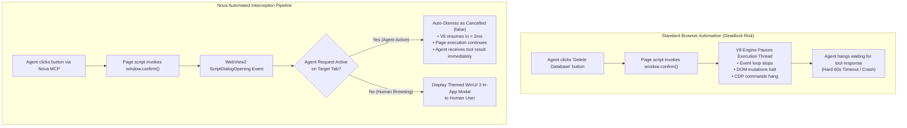

# JavaScript Modal Dialog Interception (`alert`, `confirm`, `prompt`, `beforeunload`)

Modern web applications frequently rely on legacy synchronous JavaScript dialog primitives—specifically `window.alert()`, `window.confirm()`, `window.prompt()`, and `window.onbeforeunload`. While simple for human users, these primitives are notoriously hazardous for automated agents: they execute synchronously, completely freezing the browser's JavaScript engine and DevTools automation channels until dismissed.

Nova resolves this architectural challenge through an automated interception pipeline at the WebView2 host layer, ensuring that autonomous agent requests are never deadlocked while preserving human-in-the-loop modal dialogs during interactive browsing.

---

## 1. The Automation Deadlock Dilemma

In standard web browsers, JavaScript dialogs block the V8 execution thread:



### Why Synchronous Modals Break Automation
1. **Execution Thread Freezing:** Unlike modern asynchronous promises or HTML `<dialog>` elements, `alert()`, `confirm()`, and `prompt()` execute synchronously. No subsequent JavaScript or asynchronous callbacks can run until the dialog returns a value.
2. **CDP Connection Lockup:** When an agent triggers a click that produces a synchronous dialog, the underlying Chromium DevTools Protocol (CDP) execution call does not complete until the dialog is closed. Without proactive interception, the agent call times out.
3. **No DOM Footprint:** JavaScript dialogs do not exist in the DOM tree. Neither `document.querySelector` nor XPath can detect or click an `alert()` button.

---

## 2. Nova's Dual-Mode Interception Pipeline

Nova intercepts the `CoreWebView2.ScriptDialogOpening` event directly within the host application before the dialog can manifest as a desktop modal:

```
+-----------------------------------------------------------------------------------+
| JAVASCRIPT DIALOG PRIMITIVE| AGENT MODE RESOLUTION        | USER INTERACTIVE MODE |
+-----------------------------------------------------------------------------------+
| 1. window.alert(message)   | Acknowledged instantly (OK)  | Displayed as WinUI 3  |
|                            | Execution continues.         | Info Modal.           |
+----------------------------+------------------------------+-----------------------+
| 2. window.confirm(message) | Dismissed as Cancel (false)  | Displayed with OK &   |
|                            | Prevents accidental destructive| Cancel buttons.     |
|                            | actions.                     |                       |
+----------------------------+------------------------------+-----------------------+
| 3. window.prompt(msg, def) | Dismissed as Cancel (null)   | Displayed with text   |
|                            | No arbitrary text injected.  | input box.            |
+----------------------------+------------------------------+-----------------------+
| 4. window.onbeforeunload   | Suppressed on agent tab      | Warns user of unsaved |
|                            | close/navigate commands.     | form changes.         |
+-----------------------------------------------------------------------------------+
```

---

## 3. The Golden Verification Rule: Dismissal is Not Approval

A frequent point of failure in autonomous AI agents is assuming that resolving a dialog means the intended task was successful:

> [!WARNING]
> **Dismissal is a Response, NOT Approval!**
> When Nova automatically dismisses a `confirm()` prompt during an agent request, it returns `false` (Cancelled) to the page's JavaScript. If the webpage's code requires an affirmative `true` to proceed (e.g., `if (confirm("Delete file?")) { deleteFile(); }`), the deletion will **not** execute.

### Empirical Post-Condition Verification
Autonomous agents must follow this rigorous verification checklist:
1. **Never Assume Success:** Do not conclude a task succeeded merely because an action tool returned without error.
2. **Inspect the Resultant DOM:** Re-read the page's DOM (`nova.read_text` or `nova.read_dom`) to confirm whether the expected state change occurred.
3. **Evaluate Alternative UI Triggers:** If a website strictly requires affirmative confirmation that cannot be bypassed via DOM script execution, inspect whether the workflow can be fulfilled via direct API submission ([Detached Request Replay](../../network/network-interception/README.md)) or native controls.

---

## 4. The `beforeunload` Navigation Trap

Web applications frequently attach event handlers to `window.onbeforeunload` to prevent accidental navigation loss when a form contains unsaved changes:

```javascript
window.onbeforeunload = function() {
  return "You have unsaved changes. Are you sure you want to leave?";
};
```

### The Infinite Loop Hazard
In naive automation tools, attempting to close a tab or navigate to a new URL triggers `beforeunload`, which opens a modal prompt. If the automation engine attempts to close the window, the prompt reappears, creating an unbreakable loop that halts the automation worker.

### Nova's Safe Navigation Enforcement
* When an agent invokes a tab navigation (`nova.navigate`) or closes a tab (`nova.tab_close`), Nova's host controller flags the operation as programmatic.
* Any `beforeunload` dialog generated during this transition is automatically bypassed, allowing clean tab termination without orphaned browser processes.

---

## 5. Architectural Comparison: Page Dialogs vs. Native Dialogs

To ensure agents apply the correct diagnostic and resolution tools, Nova categorizes dialogs across three distinct architectural planes:

| Characteristic | Page JavaScript Dialogs | Win32 OS File Pickers | Browser Platform Prompts |
| :--- | :--- | :--- | :--- |
| **Originating Layer** | Web Page Script (`window.alert`) | Windows Shell (`#32770`) | WinUI 3 Host Chrome |
| **Examples** | `alert()`, `confirm()`, `prompt()` | File Open, Save, Print | HTTP Auth, SSL Cert, Permissions |
| **DOM Visibility** | None | None | None |
| **Window Class** | None (Rendered by engine) | `#32770` (Win32 HWND) | WinUI 3 XAML Visual Tree |
| **Agent Handling** | **Automatic Interception** (No tool call required) | [`nova.ui_inspect_native_dialog`](../../../mcp-reference/tools/app-shell-and-ui/nova-ui-inspect-native-dialog.md) | Dedicated Resolvers (`nova.ui_*_prompt_resolve`) |
| **DOM Bypass Available?** | Not applicable | Yes: [`nova.file_upload`](../../../mcp-reference/tools/browser-automation/nova-file-upload.md) | No (Security Boundary) |

---

## 6. Related References

* [Native Dialogs & UI Prompts Master Hub](../README.md): Master classification and tool matrix.
* [File Dialogs & OS Pickers](../file-dialogs-and-os-pickers/README.md): Automating Win32 file open/save dialogs.
* [Security & Platform Prompts](../security-and-platform-prompts/README.md): Resolving HTTP auth, certificate warnings, permissions, and tab restore.
* [Browser Automation Overview](../../browser-interaction/README.md): Input dispatch and selector strategies.
* [Inspect Native Dialog Tool Reference](../../../mcp-reference/tools/app-shell-and-ui/nova-ui-inspect-native-dialog.md)

---

[Native Dialogs Overview](../README.md) · [All core features](../../README.md)
