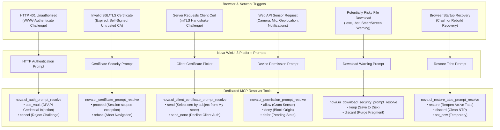
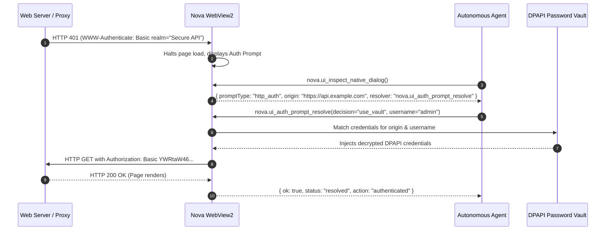

# Security, Identity & Browser Platform Prompts

Modern web browsers enforce strict security and privacy boundaries at the browser chrome layer. When a website requests sensitive device access (such as a camera or microphone), challenges the client for HTTP authentication, or delivers an untrusted SSL/TLS certificate, the browser halts execution and displays a modal security prompt.

These prompts do not exist within the web page's Document Object Model (DOM) and cannot be inspected or controlled using standard DOM selectors or Win32 window message tools. Nova provides six dedicated prompt resolvers that allow autonomous agents and developers to programmatically answer browser security and platform prompts with deterministic, auditable decisions.

---

## 1. Architectural Concept: Platform Prompts as Trust Boundaries

Platform prompts represent synchronous trust gates enforced by the browser host application:



### Discovery of Open Prompts
When a prompt is active, agents discover it through two primary channels:
1. **`nova.ui_get_state`:** Surfaces `nativeDialog.isOpen: true` and identifies the specific prompt type.
2. **`nova.ui_inspect_native_dialog`:** Directly inspects the open prompt and explicitly names the matching resolver tool in `nextActions`.

---

## 2. The Six Dedicated Platform Resolvers

```
+-----------------------------------------------------------------------------------+
| RESOLVER TOOL               | TRIGGER CONDITION            | DECISION VALUES      |
+-----------------------------------------------------------------------------------+
| 1. ui_auth_prompt_resolve   | HTTP 401 Basic/Digest Auth   | use_vault, cancel    |
+-----------------------------+------------------------------+----------------------+
| 2. ui_certificate_prompt    | Untrusted/expired TLS cert   | proceed, refuse      |
+-----------------------------+------------------------------+----------------------+
| 3. ui_client_certificate    | Enterprise mTLS request      | send, send_none      |
+-----------------------------+------------------------------+----------------------+
| 4. ui_permission_prompt     | Device sensor/API request    | allow, deny, defer   |
+-----------------------------+------------------------------+----------------------+
| 5. ui_download_security     | Risky executable file (.exe) | keep, discard        |
+-----------------------------+------------------------------+----------------------+
| 6. ui_restore_tabs_prompt   | Post-restart session recovery| restore, discard,    |
|                             |                              | not_now              |
+-----------------------------------------------------------------------------------+
```

---

## 3. Deep Dive: HTTP Authentication (`nova.ui_auth_prompt_resolve`)

When a web server or proxy returns an HTTP 401 response with a `WWW-Authenticate` header (RFC 7617 Basic or RFC 7616 Digest), the browser displays an authentication challenge modal.



### Protocol Parameters
```json
{
  "name": "nova_ui_auth_prompt_resolve",
  "arguments": {
    "decision": "use_vault",
    "username": "api-service-account"
  }
}
```

* **`use_vault` (Default):** Retrieves stored credentials from Nova's DPAPI Vault matching the target origin and optional username. **Crucial Security Feature:** Passwords are injected directly into the WebView2 challenge handler without exposing plain-text credentials in MCP tool arguments, logs, or agent conversation memory.
* **`cancel`:** Declines the authentication challenge. The browser displays the server's 401 Unauthorized error page.

---

## 4. Deep Dive: SSL/TLS Certificate Prompts (`nova.ui_certificate_prompt_resolve`)

When WebView2 navigates to a website whose SSL/TLS certificate fails validation (e.g. self-signed certificates in staging environments, expired certificates, or missing intermediate CAs), the browser displays an invalid certificate warning screen.

```json
{
  "name": "nova_ui_certificate_prompt_resolve",
  "arguments": {
    "decision": "proceed"
  }
}
```

### Decision Modes
* **`proceed`:** Bypasses the certificate warning for the **current browser session only**. Navigation resumes, and the page renders.
* **`refuse`:** Aborts navigation and closes the prompt. The connection remains blocked.

> [!IMPORTANT]
> **Diagnostic Inspection vs. Prompt Resolution:**
> Calling [`nova.tls_inspect`](../../network/tls-inspection/README.md) is a **passive diagnostic tool**—it analyses certificate chains and reports findings without modifying browser behavior. Calling `nova.ui_certificate_prompt_resolve` is an **active trust override** that grants a live session exception. In production environments, always inspect the certificate first to verify identity before deciding to proceed.

---

## 5. Deep Dive: Client Certificates & mTLS (`nova.ui_client_certificate_prompt_resolve`)

In enterprise zero-trust networks, servers demand Mutual TLS (mTLS) authentication by requesting a client certificate during the TLS handshake.

```json
{
  "name": "nova_ui_client_certificate_prompt_resolve",
  "arguments": {
    "decision": "send",
    "subject": "CN=Joel Aniol (Workstation Client)"
  }
}
```

* **`send`:** Searches the Windows Personal Certificate Store (`CurrentUser\My`) for an installed client certificate matching the provided `subject` substring, then transmits it to complete the handshake.
* **`send_none`:** Declines to provide a client certificate. The server may close the TLS connection or downgrade access depending on its mTLS policy.

---

## 6. Deep Dive: Hardware & Sensor Permissions (`nova.ui_permission_prompt_resolve`)

HTML5 Device APIs require explicit user consent before a webpage can access physical sensors or private capabilities:

* **Supported Sensors:** `camera`, `microphone`, `geolocation`, `notifications`, `clipboard-read`, `midi`.

```json
{
  "name": "nova_ui_permission_prompt_resolve",
  "arguments": {
    "decision": "allow"
  }
}
```

### Decision Semantics
* **`allow`:** Grants the requested permission to the origin for the active browser session.
* **`deny`:** Denies permission and suppresses future prompts from that origin for the duration of the session.
* **`defer` (Safe Default):** Leaves the prompt unresolved without granting access, preventing unverified sites from accessing sensors.

> [!TIP]
> For permanent, system-wide permission governance, use Nova's Permission Center tools: [`nova.permission_center_get`](../../../mcp-reference/tools/app-shell-and-ui/nova-permission-center-get.md) and [`nova.permission_center_set`](../../../mcp-reference/tools/app-shell-and-ui/nova-permission-center-set.md).

---

## 7. Deep Dive: Download Security & Tab Restoration

### Download Security Prompts (`nova.ui_download_security_prompt_resolve`)
When downloading executable binaries (`.exe`, `.msi`, `.bat`, `.ps1`) or files from unverified web origins, Windows SmartScreen and Chromium security filters display a download warning prompt:

```json
{
  "name": "nova_ui_download_security_prompt_resolve",
  "arguments": {
    "decision": "keep"
  }
}
```

* **`keep`:** Overrides the download warning and allows the file to be written to disk in Nova's download staging directory.
* **`discard`:** Immediately cancels the download and purges all temporary partial file fragments from disk.

### Startup Tab Restoration (`nova.ui_restore_tabs_prompt_resolve`)
Following a browser restart, application crash, or developer rebuild, Nova prompts: *"Restore previous tabs?"*

```json
{
  "name": "nova_ui_restore_tabs_prompt_resolve",
  "arguments": {
    "decision": "restore"
  }
}
```

* **`restore`:** Automatically reopens all previously active browser tabs, restoring live session contexts, navigation history, and tab isolates.
* **`discard`:** Closes the prompt and starts with a clean default New Tab Page (NTP).
* **`not_now`:** Temporarily dismisses the recovery banner without purging the restoration log.

> [!NOTE]
> In automated developer environments and during agent test runs, Nova agents are instructed to **always resolve with `restore`** to ensure the developer's work in progress is never discarded.

---

## 8. Related References

* [Native Dialogs & UI Prompts Master Hub](../README.md): Classification of all native dialog planes.
* [File Dialogs & OS Pickers](../file-dialogs-and-os-pickers/README.md): Win32 file open/save dialog automation.
* [JavaScript Dialog Interception](../javascript-dialog-interception/README.md): Handling in-page `alert`, `confirm`, and `prompt` boxes.
* [Password Vault & DPAPI Credentials](../../privacy/vault-and-secrets/README.md): Credential storage architecture backing `use_vault`.
* [SSL/TLS Inspection & Debugging](../../network/tls-inspection/README.md): Passive cryptographic chain inspection.
* [Auth Prompt Tool Reference](../../../mcp-reference/tools/app-shell-and-ui/nova-ui-auth-prompt-resolve.md)
* [Certificate Prompt Tool Reference](../../../mcp-reference/tools/app-shell-and-ui/nova-ui-certificate-prompt-resolve.md)

---

[Native Dialogs Overview](../README.md) · [All core features](../../README.md)
