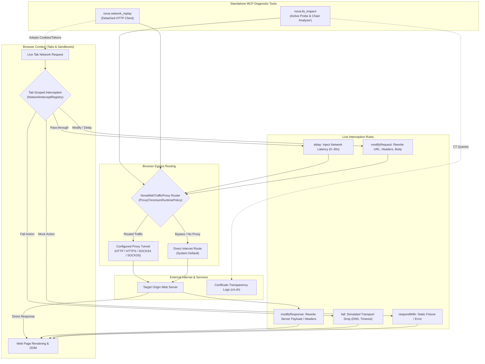

# Network Architecture & Traffic Control

The Network subsystem in Nova AI Workspace provides developers and autonomous agents with granular, enterprise-grade control over browser egress, in-flight traffic manipulation, standalone API testing, and deep cryptographic inspection. Modern web applications rely on complex distributed microservices, strict Cross-Origin policies (CORS), dynamic WebSockets, and Content Security Policies (CSP). Debugging and automating these systems requires tools that go far beyond standard browser DevTools.

Nova unifies four specialized network disciplines into a single coherent architecture:
1. **Dynamic Proxy Routing:** System-wide or sandbox-isolated proxy routing (HTTP, HTTPS, SOCKS4, SOCKS5) with DPAPI-backed credential authentication and WebRTC IP-leak prevention.
2. **Tab-Scoped Network Interception:** In-flight request and response modification within a live browser tab, supporting mock responses, transport failure simulation, header rewriting, and controlled delays.
3. **Detached Request Replay:** An independent HTTP/HTTPS client outside the browser context capable of adopting live browser session credentials (`HttpOnly` cookies and `localStorage` bearer tokens) with cryptographic redacting previews.
4. **Deep SSL/TLS Cryptographic Inspection:** In-depth cryptographic analysis of X.509 certificate chains, server cipher suite negotiation, HTTP Strict Transport Security (HSTS), and public Certificate Transparency (CT) logs.

---

## 1. High-Level Architecture & Traffic Flow

The following diagram illustrates how outgoing and incoming network traffic flows through Nova's various control planes:



### Core Routing Invariants
1. **The Single Egress Policy:** All active network probes initiated by `nova.tls_inspect` and request replay operations via `nova.network_replay` respect Nova's active browser proxy route. If a proxy is configured and fails or goes offline, Nova **never falls back to a direct, unproxied route**, preventing accidental IP exposure.
2. **Replay Traffic Isolation:** Requests generated via `nova.network_replay` are executed by an independent HTTP client outside the browser tab. Replay traffic **never traverses the page's tab-scoped interception rules**, ensuring that replayed requests test the real server rather than local browser mocks.
3. **Session Replay Decoupling:** Adopting a browser session into request replay copies authentication headers and cookies into a new request draft. It does not clone the browser's execution state or bind to the page's transport socket.

---

## 2. The Three Network Control Pillars

Nova partitions network operations across three distinct architectural pillars:

```
+-----------------------------------------------------------------------------------+
|                              NETWORK CONTROL PILLARS                              |
+-----------------------------------------------------------------------------------+
| 1. Proxy Routing & Isolation  | Global & sandbox proxy profiles, SOCKS5/HTTP,     |
|                               | DPAPI credential storage, WebRTC leak protection, |
|                               | domain bypass rules, dynamic route switching.     |
+-------------------------------+---------------------------------------------------+
| 2. Interception & Replay      | Tab-scoped CDP interception, 5 action primitives  |
|                               | (fail, respondWith, modifyRequest/Response, delay)|
|                               | detached request replay, session adoption.        |
+-------------------------------+---------------------------------------------------+
| 3. SSL/TLS Deep Inspection    | In-tab vs active host probes, full X.509 chains,  |
|                               | cipher suites & PFS, ALPN, HSTS verification,     |
|                               | Certificate Transparency subdomains via crt.sh.   |
+-----------------------------------------------------------------------------------+
```

---

## 3. Documentation Suite Index

Explore each specialized module within the Network documentation suite:

| Topic | Primary Focus | Key Capabilities & Enforcements |
| :--- | :--- | :--- |
| [Proxy Routing](proxy/README.md) | Egress & IP Control | HTTP, HTTPS, SOCKS4, and SOCKS5 profiles, DPAPI credential storage, WebRTC STUN/ICE interface binding, domain bypass lists, connection testing, and live route switching. |
| [Network Interception & Request Replay](network-interception/README.md) | In-Flight Manipulation | Five interception actions (`fail`, `respondWith`, `modifyRequest`, `modifyResponse`, `delay`), one-hit rules, session adoption from `HttpOnly` cookies and `localStorage`, and baseline diff comparisons. |
| [SSL/TLS Inspection & Debugging](tls-inspection/README.md) | Cryptographic Verification | Tab connection inspection (`targetId`) vs active host probes (`url`), X.509 chain trust validation, cipher suite enumeration (PFS, AEAD), HSTS header auditing, and public CT log queries. |

---

## 4. MCP Network Tool Reference Matrix

The `proxy-and-network` capability bundle provides 16 specialized tools:

| Tool Name | Subsystem | Action & Operational Scope |
| :--- | :--- | :--- |
| `nova.proxy_create` | Proxy | Registers a new named proxy profile (HTTP/SOCKS5, host, port, credentials). |
| `nova.proxy_update` | Proxy | Modifies configuration parameters of an existing proxy profile. |
| `nova.proxy_remove` | Proxy | Deletes an existing proxy profile from the workspace. |
| `nova.proxy_list` | Proxy | Lists all configured proxy profiles and identifies the currently active route. |
| `nova.proxy_status` | Proxy | Returns live operational status, egress IP, latency, and connection health. |
| `nova.proxy_switch` | Proxy | Dynamically switches the active browser routing profile without browser restarts. |
| `nova.proxy_test` | Proxy | Probes proxy reachability, authentication validity, and round-trip latency. |
| `nova.proxy_set_password` | Proxy | Updates authentication credentials stored in the DPAPI Vault for a proxy profile. |
| `nova.proxy_disconnect` | Proxy | Disconnects the active proxy, reverting the browser to the direct system route. |
| `nova.proxy_reconnect` | Proxy | Re-establishes an active proxy tunnel after a network drop or IP rotation. |
| `nova.proxy_log` | Proxy | Retrieves recent diagnostic connection events and authentication logs. |
| `nova.network_intercept_add` | Interception | Registers a tab-scoped interception rule (`fail`, `respondWith`, `modify`, `delay`). |
| `nova.network_intercept_list` | Interception | Lists all armed interception rules for a specific browser tab. |
| `nova.network_intercept_clear` | Interception | Removes armed interception rules from a browser tab. |
| `nova.network_replay` | Replay | Executes standalone HTTP requests outside the tab with optional session adoption. |
| `nova.tls_inspect` | TLS | Performs in-depth cryptographic and certificate chain inspection for a host or tab. |

---

## 5. Decision Matrix: Selecting the Right Network Tool

When diagnosing network anomalies or building autonomous workflows, selecting the appropriate tool ensures minimal overhead:

| Diagnostic or Engineering Objective | Recommended Tool / Action | Target Scope |
| :--- | :--- | :--- |
| **Mask the browser's outward IP address** | `nova.proxy_switch` (`profileName: "residential_de"`) | System / Sandbox Profile |
| **Verify proxy egress IP and latency** | `nova.proxy_status` or `nova.proxy_test` | Proxy Profile |
| **Simulate backend API outage (HTTP 503)** | `nova.network_intercept_add` (`action: "respondWith"`, status 503) | Active Tab Only |
| **Test frontend offline recovery** | `nova.network_intercept_add` (`action: "fail"`, `errorReason: "InternetDisconnected"`) | Active Tab Only |
| **Test slow network or 3G throttling** | `nova.network_intercept_add` (`action: "delay"`, `delayMs: 3000`) | Active Tab Only |
| **Test API endpoint with live browser token** | `nova.network_replay` (`adoptSession: true`, `targetId: "tab-101"`) | Standalone Client |
| **Investigate untrusted SSL certificate** | `nova.tls_inspect` (`targetId: "tab-101"`, `checks: ["certificate"]`) | Tab Handshake State |
| **Audit server cipher suites & TLS 1.3** | `nova.tls_inspect` (`url: "api.example.com"`, `checks: ["server"]`) | Active Host Probe |
| **Enumerate subdomains via CT logs** | `nova.tls_inspect` (`url: "example.com"`, `checks: ["ct_subdomains"]`) | Public crt.sh Service |

---

## 6. Security, Privacy & Boundary Guarantees

1. **WebRTC Leak Protection:**
   * Standard browser proxies often leak local and public IP addresses through WebRTC STUN/ICE queries.
   * Nova's proxy routing subsystem enforces WebRTC interface binding: non-proxied UDP traffic is disabled, binding all WebRTC communication strictly through the proxy tunnel. See [Anti-Tracking & Leak Protection](../privacy/anti-tracking-and-leak-protection/README.md).
2. **Credential Storage in DPAPI Vault:**
   * Proxy authentication passwords are encrypted using the Windows Data Protection API (DPAPI) and never stored in plain text configuration files.
3. **Session Adoption Security Boundary:**
   * Adopting browser cookies or `localStorage` tokens into `nova.network_replay` requires approval under the [Site Data Permission Gate](../site-data-management/permissions-and-audit/README.md).
   * Adopted secrets are masked in tool result transcripts, preventing credentials from entering agent memory transcripts.
4. **No Direct Route Fallback:**
   * Active TLS probes and replay requests strictly enforce proxy binding: if the proxy connection fails, the operation aborts with a connection error rather than silently leaking data over the direct network interface.

---

## 7. Related Architecture Guides

* [Multi-Sandbox Session Isolation](../sandbox-isolation/README.md): Details physical profile separation across sandboxes and proxy inheritance.
* [Session Recording & Time-Travel Debugging](../session-recording/README.md): Capturing network streams (`network.cdp.jsonl`) for post-mortem forensics.
* [Site Data Management](../site-data-management/README.md): Cookie and Web Storage management, session adoption, and permission controls.
* [Privacy & Credential Protection](../privacy/README.md): DPAPI Vault architecture, SecretRef single-use tokens, and fingerprint noise.
* [Proxy & Network Tool Reference](../../mcp-reference/tools/proxy-and-network/README.md): Detailed parameter schemas for all 16 network tools.

---

[All core features](../README.md)
