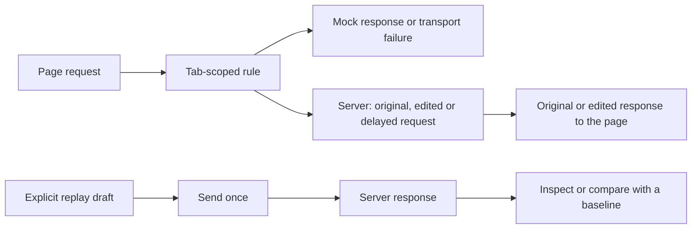

# Network Interception & Request Replay

Nova gives agents two ways to investigate network behaviour: change selected requests or responses **inside a live browser tab**, or prepare and send a **separate HTTP request** and compare its result with a baseline. This covers failure simulation, mock responses, request editing, response editing, controlled delays and API debugging with an explicitly chosen session.

## 1. A Concrete Example: A Slow, Failing API

A page normally receives a list of items from an API. You want to see whether it keeps a loading indicator visible, explains a server failure and lets the user recover. Ask your agent:

> On my test page, make the next request to the items API return a JSON error with HTTP 503 after a short delay. Check the loading state and error message, then remove the rule and check that the next normal request works.

The agent deposits a one-hit rule, triggers the page action and checks the visible result. Nova applies the rule itself when the request arrives; it does not wait for another model turn. A note identifies the test in Nova's interception indicator.

This tests the page's behaviour without needing the real service to fail. Replay answers a different question: what does the server return when a specific request is sent or changed?

## 2. Two Distinct Paths

| Capability | Live interception | Request replay |
| :--- | :--- | :--- |
| Where it operates | Requests or responses of one browser tab. | A separate HTTP client outside the page. |
| What triggers it | A matching page request after a rule is armed. | An explicit `send` of a prepared request. |
| What can change | Transport outcome, URL, method, headers, body, status and delay, depending on the action. | The explicitly prepared URL, method, headers and text or binary body. |
| Session | The page makes its normal browser request; request edits can change its headers. | Explicit headers or permission-gated session adoption. |
| What to verify | Rule application and the page's visible response. | Dispatch outcome, HTTP status, returned data and baseline comparison. |



Replay traffic does not run through the page's interception rules. It uses Nova's global proxy route, or the Windows default when no Nova proxy applies; see [Proxy Routing](../proxy/README.md).

## 3. Five Interception Actions

| Action | What Nova does | Example use |
| :--- | :--- | :--- |
| `fail` | Fails the request with a chosen transport error. | Test offline handling, DNS failure, a refused connection or a timeout path. |
| `respondWith` | Returns a chosen status, headers and body without contacting the destination for that request. | Supply a JSON fixture, an empty result, HTTP 429 or HTTP 503. |
| `modifyRequest` | Changes an outgoing request and then lets it reach the network. | Change the destination URL, method, payload or headers. |
| `modifyResponse` | Lets the real server answer, then changes what the page receives. | Change a status or header while keeping the real payload, or replace the payload. |
| `delay` | Holds a matching request, then continues it unchanged. | Check loading indicators and slow-service behaviour. |

**An HTTP error and a transport failure are different tests.** `respondWith` with status 503 gives the page an HTTP response. `fail` with `InternetDisconnected` or `TimedOut` takes a network-error path. A delay alone is not a bandwidth throttle or a guaranteed transport timeout.

`delayMs` can accompany **any** action, so a mock response can also arrive slowly. Its maximum is 30 seconds; clearing the rule or closing its tab ends the wait early.

### Request and response edits

`modifyRequest` sets/removes headers, rewrites the URL, replaces the method and replaces the body. Nova retains existing request headers, overrides explicitly supplied names, then applies removals. Adding one diagnostic header does not replace the entire header set. `setBody: ""` clears the body; omission preserves it. Body replacement removes stale `Content-Length`.

`modifyResponse` sets/removes response headers, replaces the HTTP status and replaces the body. For example, a test can remove `Set-Cookie`, change a cache header or expose an error status while keeping the real payload. Without a replacement body, the original stays with Chromium rather than being read into Nova; header/status edits also support redirects and streaming responses. Transport failures pass through without consuming a response-rule hit.

Replacement response text is uncompressed; obsolete compression/framing headers are removed. Empty replacement text clears the body, while HEAD requests and bodyless statuses do not receive an added payload. Modification rules with no actual edits are rejected.

### Example: one slow mock response

Illustrative tool request for a test endpoint:

```json
{
  "name": "nova.network_intercept_add",
  "arguments": {
    "targetId": "tab-1",
    "urlPattern": "https://example.com/api/items*",
    "methods": ["GET"],
    "action": "respondWith",
    "status": 503,
    "contentType": "application/json",
    "body": "{\"error\":\"temporarily unavailable\"}",
    "delayMs": 1500,
    "maxHits": 1,
    "ttlMs": 30000,
    "note": "Check loading and recovery for the items API"
  }
}
```

This deliberately changes the page's input. It is not evidence that the real service returned 503.

## 4. Scope, Lifetime and Application Evidence

Interception is available when MCP Remote Control is enabled, without a separate interception feature switch. Discovery and listing do not arm rules: only an explicit `nova.network_intercept_add` does.

* **Targeted matching:** Rules belong to one tab, match URL globs with `*` and `?`, and can restrict HTTP methods. Patterns need at least four literal characters; a bare wildcard is rejected.
* **Automatic expiry:** Rules end by lifetime, hit budget, tab closure or app exit. Defaults are two minutes and twenty hits; lifetime is capped at fifteen minutes.
* **Visible state:** Nova displays active interception. `note` identifies its purpose; `nova.network_intercept_list` reports remaining lifetime and counters.
* **Explicit cleanup:** `nova.network_intercept_clear` removes one rule, a tab's rules or all active rules without filters. An already expired rule is reported as not found.
* **No model turn per request:** Nova applies deposited rules itself. If applying one fails, it attempts to continue the request unchanged rather than leave the page waiting.

**A match is not proof of an applied change.** `hits` counts matches; `applied`, `failed` and `lastError` report application results. Exhausted rules can remain visible while an in-flight answer finishes. Check those counters and the page outcome before declaring a test successful.

The fallback matters for mocks: a failed application can let the original request reach the real server. A deposited rule alone is not proof that real traffic was blocked.

## 5. Request Replay: Inspect, Edit, Send and Compare

Start with network inspection or [recorded request data](../../session-recording/README.md), then explicitly choose the request to send. There is no automatic import from a recording ID.

| Action | Behaviour |
| :--- | :--- |
| `prepare` | Validates and freezes the request; returns a preview and `replayId` without sending. |
| `send` | Dispatches that ID once. Repeating the same ID reads its result instead of sending again. |
| `get` | Reads the draft's status or result. |
| `discard` | Removes an idle draft/result; it does not undo a server action. |

Prepared requests are immutable. Prepare a separate variant to change one, and keep the same explicit `agentId` throughout: drafts/results belong to that agent, without claiming a browser tab.

### Controlled A/B comparisons

Send a baseline, then prepare a variant with one intentional change and `compareTo` set to the completed baseline's ID. Sending the variant compares HTTP status, changed header names and complete response-body hashes. It does not resend the baseline or produce a semantic JSON diff. Truncated bodies do not earn a full-body hash/equality claim.

Replay accepts exact UTF-8 text through `body` or binary data through `bodyBase64`. Missing, redacted or truncated recording data is not a complete original request; supply the complete intended payload.

### Adopt a browser session with a redacted preview

`adoptSessionFrom` can fill a draft with cookies applicable to its URL and explicitly mapped values from a tab's local/session storage. This helps investigate why an independent API request receives different data from a logged-in page.

Adoption uses the existing [cookie/storage-value permission gate and site-data audit log](../../site-data-management/permissions-and-audit/README.md). The destination must pass Nova's same-site check; unrelated hosts are refused. Adopted values are sent but withheld from the preview, which records header names and provenance. Caller-supplied headers are not silently overwritten; missing storage keys are errors. Storage-to-header mapping is explicit and does not invent a token's header name or authentication prefix.

Example preparation with a test tab's applicable cookies:

```json
{
  "name": "nova.network_replay",
  "arguments": {
    "agentId": "agent-demo",
    "action": "prepare",
    "url": "https://example.com/api/items?limit=10",
    "method": "GET",
    "adoptSessionFrom": {"targetId": "tab-1", "cookies": true},
    "_meta": {"intent": "Inspect a read request using the test page's session"}
  }
}
```

This only prepares the draft and may require permission to read session values. Sending requires a separate `send` with its returned ID. Without adoption, cookies and tokens are not automatically extracted from the page.

## 6. Results and Transport Boundaries

Replay returns HTTP status, headers, captured body bytes as Base64, timing, truncation state and a complete-body hash when available. `status: "response"` means an HTTP response arrived; inspect `httpOk`, status and content to judge HTTP/application success.

* **Bounds:** Request bodies are limited to 1 MiB; response capture defaults to 256 KiB and can reach 1 MiB. The deadline is configurable up to sixty seconds. Each agent can retain thirty-two drafts/results, with a ten-minute lifetime in memory.
* **Separate transport:** Replay uses .NET HTTP/1.1, not browser `fetch`. It is outside the page's CORS restriction and does not reproduce the browser's full transport identity.
* **Explicit state:** No ambient browser cookie jar or automatic browser authentication/client-certificate inheritance. Redirects are not followed, application retries are not performed, and received `Set-Cookie` does not update the browser cookie store. Normal TLS validation remains active.
* **Transport-owned framing:** Caller-supplied `Content-Length`, `Transfer-Encoding` and other transport-owned headers are rejected. This is an HTTP repeater, not a raw-wire or request-smuggling instrument. Compressed responses remain compressed bytes.
* **Uncertain dispatch:** Timeout, cancellation or transport failure can happen after the server acted. `mayHaveBeenSent` reports that uncertainty. The same ID does not resend; a new ID used as a blind retry could duplicate a server action.

## 7. MCP Tools and Related Documentation

All four tools are in `page_read_debug`. Four names expose multiple actions and workflows, rather than four fixed tests.

| Tool | Purpose |
| :--- | :--- |
| [`nova.network_intercept_add`](../../../mcp-reference/tools/proxy-and-network/nova-network-intercept-add.md) | Deposit a rule with one of five actions and optional delay. |
| [`nova.network_intercept_list`](../../../mcp-reference/tools/proxy-and-network/nova-network-intercept-list.md) | Inspect rules, lifetime, application counters and errors. |
| [`nova.network_intercept_clear`](../../../mcp-reference/tools/proxy-and-network/nova-network-intercept-clear.md) | Remove a rule, clear a tab or clear all interception. |
| [`nova.network_replay`](../../../mcp-reference/tools/proxy-and-network/nova-network-replay.md) | Prepare, send once, read/discard results, adopt sessions and compare variants. |

* [Proxy Routing](../proxy/README.md) — Browser routing, profiles and leak protection.
* [Session Recording](../../session-recording/README.md) — Recorded request data for investigation.
* [SSL/TLS Inspection & Debugging](../tls-inspection/README.md) — Separate certificate and server-configuration diagnostics.

[Network overview](../README.md) · [All core features](../../README.md)
