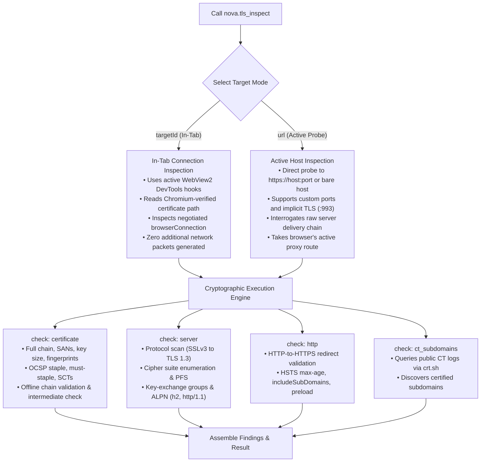
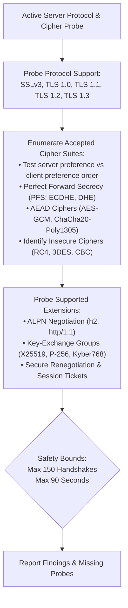

# SSL/TLS Inspection & Deep Cryptographic Debugging

Modern web applications depend entirely on Transport Layer Security (TLS) to guarantee data confidentiality, integrity, and server authentication. However, when HTTPS connections fail—due to expired certificates, missing intermediate Certificate Authorities (CAs), unsupported cipher suites, or corporate SSL/TLS inspection proxies—standard browser error pages provide little actionable detail.

Nova provides `nova.tls_inspect`, a deep cryptographic analysis engine capable of inspecting both active browser tab connections and arbitrary network hosts. It interrogates X.509 certificate chains, tests server protocol negotiation (from SSLv3 to TLS 1.3), verifies HTTP Strict Transport Security (HSTS) preloading criteria, and queries public Certificate Transparency (CT) logs—giving developers and security engineers the diagnostic power of tools like SSL Labs or testssl from within Nova.

---

## 1. Architectural Overview & Inspection Modes

`nova.tls_inspect` operates in two distinct operational modes:



### The Two Target Modes

| Mode Parameter | Execution Mechanism | Key Diagnostic Utility |
| :--- | :--- | :--- |
| **`targetId`** | Inspects the connection currently verified and negotiated by Chromium for an active tab. Generates **zero additional network traffic**. | Examines what the browser engine actually accepted, what cipher and ALPN protocol it negotiated, and whether a certificate security exception was manually overridden by the user. |
| **`url`** | Initiates an active cryptographic handshake directly with the target host (`https://host[:port]` or bare `host[:port]`). Supports implicit-TLS services (e.g. `mail.example.com:993` or `smtp.example.com:465`). | Inspects the certificate chain **exactly as delivered by the server**, uncovering missing intermediate certificates, server-preferred cipher orders, and protocol support limits. |

> [!IMPORTANT]
> The certificate chain verified by Chromium (`targetId`) can differ from the chain delivered by the server (`url`): Chromium may synthesize or cache missing intermediate certificates from local operating system stores, masking server misconfigurations that fail on non-Windows clients or mobile devices.

---

## 2. In-Depth Subsystems & Architecture Guides

Explore the dedicated cryptographic subsystems:

| Cryptographic Discipline | Guide | Core Architectural Scope & Enforcements |
| :--- | :--- | :--- |
| **X.509 Certificate Chains** | [Certificate Chain Analysis & Validation](certificate-chains/README.md) | Hierarchy (Leaf, Intermediate, Root), RFC 6125 SAN matching, intermediate CA caching fallacies, Windows `X509Chain` offline verification policies, and raw PEM exports. |
| **Cipher Suites & Protocols** | [Cipher Suites, Protocols & PFS](cipher-suites-and-protocols/README.md) | Deprecation of SSLv3–TLS 1.1, TLS 1.2/1.3 cipher negotiation, AEAD algorithms, Perfect Forward Secrecy (PFS), Post-Quantum hybrid groups (Kyber768), and ALPN protocol selection. |
| **Certificate Transparency** | [Certificate Transparency & Subdomains](certificate-transparency/README.md) | RFC 6962 framework, Signed Certificate Timestamps (SCTs), automated public CT log mining via `crt.sh`, subdomain discovery, and proxy privacy boundaries. |

---

## 3. The Four In-Depth Diagnostic Checks

The `checks` array allows callers to select specific analytical components:

```
+-----------------------------------------------------------------------------------+
| DIAGNOSTIC CHECK           | ANALYTICAL SCOPE & MEASUREMENTS                      |
+-----------------------------------------------------------------------------------+
| 1. certificate (Default)   | Delivery chain, Subject/Issuer, validity countdown,  |
|                            | SAN wildcards, key type/size, SHA-256 pins, SCTs,    |
|                            | stapled OCSP, offline chain & intermediate audit.    |
+----------------------------+------------------------------------------------------+
| 2. server                  | Protocol support (SSLv3–TLS 1.3), cipher suites,     |
|                            | Perfect Forward Secrecy (PFS), AEAD ciphers, ALPN,   |
|                            | key exchange groups (X25519, post-quantum hybrids).  |
+----------------------------+------------------------------------------------------+
| 3. http                    | Plain HTTP-to-HTTPS redirect status and target URL,  |
|                            | HSTS header policy, subdomains directive, preload.   |
+----------------------------+------------------------------------------------------+
| 4. ct_subdomains           | Queries public Certificate Transparency logs via     |
|                            | crt.sh to uncover historical certified subdomains.   |
+-----------------------------------------------------------------------------------+
```

---

## 4. Deep Dive: Certificate Chain Analysis (`check: certificate`)

When `certificate` is selected, Nova parses every X.509 certificate in the chain and evaluates its cryptographic properties:

> [!TIP]
> For an exhaustive architectural deep dive into intermediate CA synthesis bugs, RFC 6125 SAN matching algorithms, offline Windows `X509Chain` policies, and raw PEM export mechanics, consult the dedicated guide: [Certificate Chain Analysis & Validation](certificate-chains/README.md).

### 1. Delivery Chain & Certificate Hierarchy
Nova reports certificates in exact delivery order:
* **End-Entity (Leaf) Certificate:** The website's identity certificate.
* **Intermediate CAs:** Issuing intermediate authorities.
* **Root CA:** The trust anchor (often omitted by servers if expected in client trust stores).

### 2. Subject Alternative Names (SAN) & RFC 6125 Host Matching
* Browsers ignore the deprecated `Common Name` (CN) attribute for hostname validation; they enforce Subject Alternative Names (SAN).
* Nova tests the target hostname against every SAN entry using strict RFC 6125 rules:
  * Validates exact domain matches (`example.com`).
  * Validates single-level wildcard matches (`*.example.com` matches `app.example.com`, but does **not** match `sub.app.example.com` or `example.com`).
* **Multi-Host Testing (`checkHosts`):** Callers can supply up to 50 additional hostnames (e.g. `["api.example.com", "cdn.example.com"]`) to test multi-domain coverage in a single call.

### 3. Key Metrics, Algorithms & Signature Security
* **Key Types & Lengths:** Identifies RSA (2048-bit, 3072-bit, 4096-bit) and Elliptic Curve keys (ECDSA over `secp256r1`, `secp384r1`). Flags legacy RSA keys under 2048 bits as high risk.
* **Signature Algorithms:** Inspects the hashing algorithm used to sign each certificate (e.g., `SHA256withRSA`, `SHA384withECDSA`). Flags deprecated SHA-1 or MD5 signatures as critical vulnerabilities.
* **Validation Level:** Detects whether the certificate is Domain Validated (DV), Organization Validated (OV), Individual Validated (IV), or Extended Validation (EV).

### 4. Extensions, SCTs & Revocation Auditing
* **Basic Constraints & Key Usages:** Validates that end-entity certificates are not marked as Certificate Authorities (`IsCA: false`) and carry `validForServerAuth` in Extended Key Usages (EKU).
* **Certificate Transparency (SCTs):** Parses embedded Signed Certificate Timestamps (SCTs) proving the certificate was logged prior to issuance.
* **OCSP Stapling:** Checks whether the server staples a valid Online Certificate Status Protocol (OCSP) response during the TLS handshake, including expiration dates and revocation status.
* **Offline Chain Verification (`TlsChainCheck`):** Executes Windows `X509Chain` policy validation. Identifies common production defects:
  * `UntrustedRoot`: The root CA is not in the system trust store (e.g., self-signed, internal corporate CA).
  * `PartialChain`: The server failed to send an intermediate CA certificate required to bridge trust to the root.
  * `Expired` / `NotYetValid`: Certificate validity period is outside current UTC time.
  * `Revoked`: Revocation check via CRL or OCSP returned revoked status.

---

## 5. Deep Dive: Server Protocol & Cipher Scanning (`check: server`)

When `server` is enabled, Nova conducts an active probe against the target host:

> [!TIP]
> For detailed protocol security grading, AEAD cipher comparison tables, Post-Quantum hybrid key exchange groups (`X25519Kyber768`), and ALPN negotiation parameters, see the dedicated guide: [Cipher Suites, Protocols & PFS](cipher-suites-and-protocols/README.md).



### Protocol Version Probing
* Tests compatibility across the protocol spectrum: SSLv3, TLS 1.0, TLS 1.1, TLS 1.2, and TLS 1.3.
* **Security Enforcement:** Enabling legacy protocols (SSLv3, TLS 1.0, TLS 1.1) triggers critical security findings due to vulnerabilities like POODLE, BEAST, and lack of modern authenticated encryption.

### Cipher Suites & Perfect Forward Secrecy (PFS)
* Categorizes accepted cipher suites into modern Authenticated Encryption with Associated Data (AEAD) algorithms (`TLS_AES_128_GCM_SHA256`, `TLS_AES_256_GCM_SHA384`, `TLS_CHACHA20_POLY1305_SHA256`) vs legacy CBC-mode ciphers.
* Verifies whether ephemeral Diffie-Hellman key exchanges (ECDHE, DHE) are enforced to provide **Perfect Forward Secrecy (PFS)**, ensuring past recorded sessions cannot be decrypted if the server's private key is later compromised.
* Flags insecure or obsolete ciphers (`RC4`, `3DES`, static RSA key exchange).

### ALPN & Key-Exchange Groups
* **Application-Layer Protocol Negotiation (ALPN):** Discloses supported next-generation protocols (`h2` for HTTP/2, `http/1.1`).
* **Supported Groups:** Identifies elliptic curves (`X25519`, `secp256r1`) and evaluates readiness for post-quantum hybrid key exchange groups (e.g. `X25519Kyber768`).

> [!NOTE]
> Server scans are bounded to a maximum of **150 handshakes and 90 seconds** to prevent triggering server-side DDoS firewalls or rate limits. Probes that could not complete within the budget are explicitly recorded in `missing`.

---

## 6. HTTP & Certificate Transparency Checks

### `check: http` (HSTS & Redirects)
1. **HTTP-to-HTTPS Redirect Verification:** Connects to port 80 (plain HTTP) to evaluate whether the server redirects to HTTPS:
   * Status code check (`301 Moved Permanently`, `302 Found`, `307 Temporary Redirect`, `308 Permanent Redirect`).
   * Target destination URL validation.
2. **HTTP Strict Transport Security (HSTS):** Parses the `Strict-Transport-Security` response header:
   * `max-age`: Duration in seconds that the browser must remember to enforce HTTPS (minimum recommended: 31,536,000 seconds / 1 year).
   * `includeSubDomains`: Validates whether the HSTS policy covers all child domains.
   * `preload`: Validates whether the directive permits inclusion in Chrome and Firefox's hardcoded HSTS Preload List.

### `check: ct_subdomains` (Certificate Transparency Reconnaissance)
* Queries public Certificate Transparency (CT) logs using the `crt.sh` public API.
* Returns a deduplicated list of every subdomain that was historically issued an SSL/TLS certificate under the parent domain.
* **Privacy Disclosure:** **Invoking this check transmits the domain name to crt.sh**, an external third-party service.
* Supports pagination via `maxCtEntries` (default: 200; maximum: 2,000).

> [!TIP]
> For a comprehensive analysis of the RFC 6962 framework, CT data models, row/byte limits, and proxy routing assurances, see [Certificate Transparency & Subdomains](certificate-transparency/README.md).

---

## 7. Security Findings Grading System

Unlike diagnostic tools that compute a single, opaque security letter grade (e.g. "B+"), Nova's `TlsFindings` engine decomposes measurements into discrete, actionable findings:

| Severity Level | Characteristic Trigger Conditions | Recommended Engineering Action |
| :--- | :--- | :--- |
| **`critical`** | • Expired certificate (`validNotAfter` in the past)<br/>• Untrusted root CA or self-signed cert on public site<br/>• Server supports SSLv3, TLS 1.0, or TLS 1.1<br/>• Server accepts obsolete ciphers (RC4, 3DES, NULL)<br/>• SHA-1 signature on leaf certificate | Immediate deployment block. Renew certificate or update TLS terminator configuration. |
| **`high`** | • Incomplete certificate chain (`PartialChain`: missing intermediate CA)<br/>• Hostname mismatch (host not in SAN list)<br/>• RSA key size under 2048 bits<br/>• Missing HTTP-to-HTTPS redirect | Correct web server certificate configuration or reissue certificate with proper SANs. |
| **`medium`** | • Missing HSTS header on production domain<br/>• HSTS `max-age` under 6 months<br/>• Certificate expiring within 14 days<br/>• Server prefers legacy CBC cipher suites over AEAD | Enable HSTS header; renew certificate within scheduled maintenance window. |
| **`info`** | • Certificate expiring within 30 days<br/>• Extended Validation (EV) certificate verified<br/>• ALPN negotiated `h2` successfully<br/>• Must-Staple extension detected | Informational status; no immediate remediation required. |

---

## 8. Integration: Inspection vs. Certificate UI Prompts

It is essential to distinguish between **cryptographic inspection** and **security prompt resolution**:

1. **Inspection is Passive / Diagnostic:** Running `nova.tls_inspect` interrogates certificate data and produces diagnostic findings. It **does not** turn off certificate validation in the browser, bypass security blocks, or approve invalid certificates.
2. **UI Prompts are Interactive Decisions:** If a browser tab attempts to navigate to a page with an invalid or untrusted certificate, WebView2 halts navigation and displays a security error. Resolving this prompt is a separate interactive action handled through Nova's dialog system ([Native Dialogs & UI Prompts](../../native-dialogs-and-prompts/README.md) and [`nova.ui_certificate_prompt_resolve`](../../../mcp-reference/tools/app-shell-and-ui/nova-ui-certificate-prompt-resolve.md)).

---

## 9. Related References

### Cryptographic Subsystems
* [Certificate Chain Analysis & Validation](certificate-chains/README.md): X.509 hierarchy, intermediate caching fallacies, and offline validation.
* [Cipher Suites, Protocols & PFS](cipher-suites-and-protocols/README.md): Modern AEAD algorithms, PFS, post-quantum groups, and ALPN.
* [Certificate Transparency & Subdomains](certificate-transparency/README.md): Public log mining, subdomain reconnaissance, and privacy boundaries.

### Network Architecture & Tools
* [Network Overview](../README.md): Primary architecture hub, routing flowcharts, and decision matrices.
* [Proxy Routing Architecture](../proxy/README.md): Shared browser routes, SOCKS5/HTTP profiles, and DPAPI credentials.
* [Network Interception & Request Replay](../network-interception/README.md): Tab-scoped CDP interception and standalone request testing.
* [TLS Inspect Tool Reference](../../../mcp-reference/tools/proxy-and-network/nova-tls-inspect.md): JSON-RPC parameter schemas and live examples.

---

[Network overview](../README.md) · [All core features](../../README.md)
