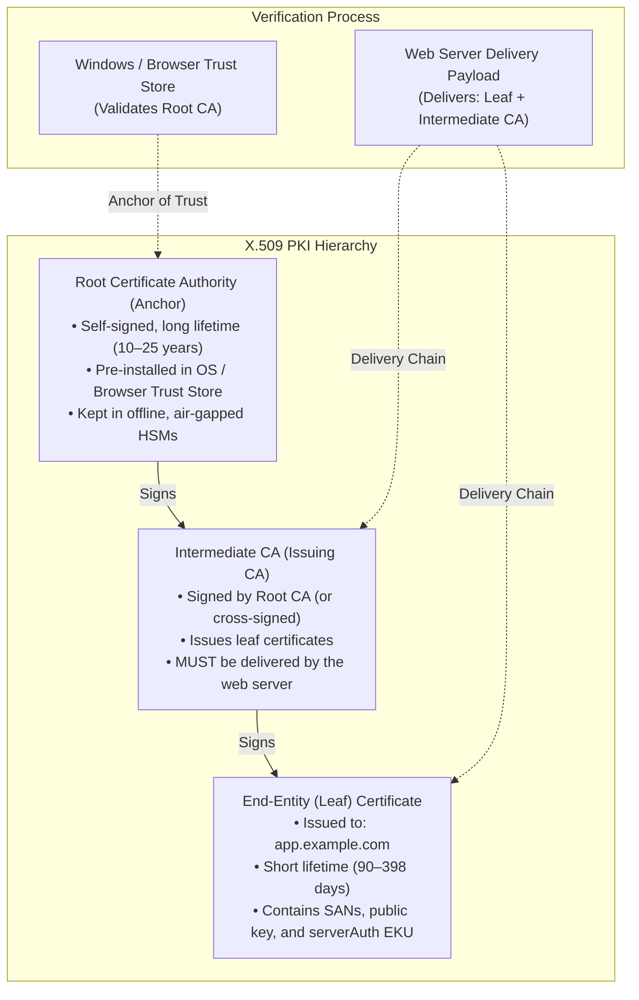
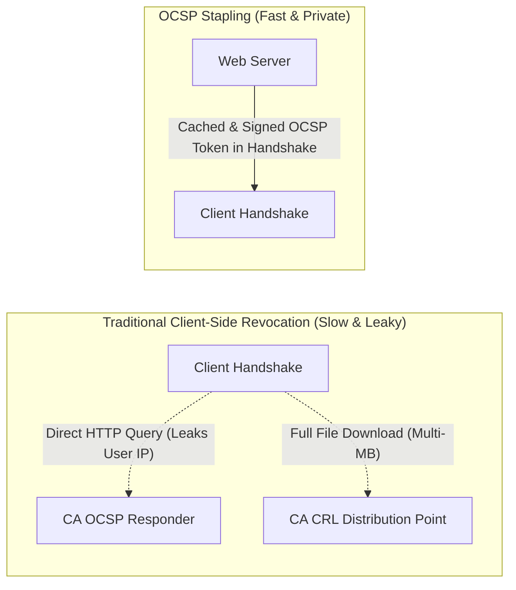

# Certificate Chains, Validation & Trust Anchors

Every secure HTTPS transaction relies on a mathematically verifiable chain of trust established through the X.509 Public Key Infrastructure (PKI). While standard browsers typically display only a green padlock or a generic error page, production HTTPS failures are frequently caused by subtle chain defects: missing intermediate Certificate Authorities (CAs), expired intermediate anchors, multi-domain Subject Alternative Name (SAN) omissions, or deprecated signature algorithms.

Nova's [`nova.tls_inspect`](../../../../mcp-reference/tools/proxy-and-network/nova-tls-inspect.md) provides comprehensive certificate chain analysis. It inspects delivery hierarchies, validates hostname coverage under RFC 6125, evaluates cryptographic key strengths, parses revocation pointers, and runs offline trust-path simulations to isolate defects before they impact end users.

---

## 1. Anatomy of an X.509 Certificate Chain

A complete X.509 certificate chain represents an unbroken path of trust from the website's leaf certificate to a globally trusted root anchor:



### The "Works on My Machine" Intermediate CA Trap
A common production failure occurs when server administrators configure only the leaf certificate and forget to configure the intermediate CA bundle:
1. **Chromium Intermediate Caching:** If a desktop browser previously visited another website that used the same intermediate CA (e.g., Let's Encrypt R3), Chromium caches that intermediate in local memory. The website appears completely valid to the developer.
2. **Client Failure (`PartialChain`):** When mobile applications, automated curl scripts, or clean sandbox profiles connect, they lack the cached intermediate and reject the connection with an SSL handshake failure.
3. **Detection with Nova:**
   * Calling `nova.tls_inspect` with `url: "https://example.com"` probes the server directly and inspects the raw delivery chain. If the intermediate is missing, Nova flags `findings[]` with severity `high` and reason code `PartialChain`.
   * Calling `nova.tls_inspect` with `targetId: "tab-101"` displays the path Chromium constructed, allowing comparison between server delivery and browser verification.

---

## 2. Subject Alternative Names (SAN) & RFC 6125 Host Matching

Modern TLS security strictly deprecates validating server identities via the Subject Common Name (CN). Identity validation is governed exclusively by the **Subject Alternative Name (SAN)** extension under RFC 6125:

| SAN Pattern | Example Match | Non-Matching Hosts (Rejected) |
| :--- | :--- | :--- |
| **Exact Host** (`example.com`) | `https://example.com` | `https://www.example.com`, `https://api.example.com` |
| **Single-Level Wildcard** (`*.example.com`) | `https://app.example.com`, `https://api.example.com` | `https://example.com` (apex domain)<br/>`https://sub.app.example.com` (multi-level) |
| **Multi-Domain SAN** (`cdn.com`, `assets.org`) | Exact matches on listed hostnames | Unlisted subdomains or apex variants |

### Multi-Host Verification (`checkHosts`)
When deploying a single certificate across microservices or multi-tenant architectures, testing each subdomain individually is time-consuming. `nova.tls_inspect` accepts the `checkHosts` array (up to 50 hostnames):

```json
{
  "url": "https://example.com",
  "checks": ["certificate"],
  "checkHosts": [
    "example.com",
    "www.example.com",
    "api.example.com",
    "portal.example.com",
    "admin.staging.example.com"
  ]
}
```

Nova returns a structured coverage matrix detailing whether each host is covered by the certificate and identifying the exact matching SAN pattern.

---

## 3. Cryptographic Key Strength & Signature Algorithms

Nova parses the public key material and cryptographic signature of every certificate in the delivery hierarchy:

```
+-----------------------------------------------------------------------------------+
| CRYPTOGRAPHIC PROPERTY    | EVALUATED VALUES                  | SECURITY STATUS   |
+-----------------------------------------------------------------------------------+
| Public Key Type & Size    | RSA 2048-bit, 3072-bit, 4096-bit  | Secure / Standard |
|                           | RSA < 2048-bit (e.g. 1024-bit)    | INSECURE (Critical)|
|                           | ECDSA over P-256 (secp256r1)      | Modern / Efficient|
|                           | ECDSA over P-384 (secp384r1)      | High Security     |
+---------------------------+-----------------------------------+-------------------+
| Signature Hash Algorithm  | SHA-256 (SHA256withRSA / ECDSA)   | Standard          |
|                           | SHA-384, SHA-512                  | High Security     |
|                           | SHA-1, MD5                        | BROKEN (Critical) |
+---------------------------+-----------------------------------+-------------------+
```

### Deprecated Cryptographic Primitives
* **RSA Key Sizes Below 2048 Bits:** Factoring 1024-bit RSA keys is within the capabilities of state-level adversaries. Nova immediately flags key sizes $< 2048$ bits with severity `critical`.
* **SHA-1 Signatures:** SHA-1 collision attacks (SHAttered) make forged certificates practical. Public CAs are forbidden from issuing SHA-1 certificates; Nova marks any SHA-1 signature in the active chain as `critical`.

---

## 4. X.509 Extensions & Validation Levels

Nova's ASN.1 parser interrogates key extensions that govern how a certificate may be used:

### 1. Extended Key Usage (EKU) & Basic Constraints
* **Basic Constraints:** Leaf certificates must have `IsCA: false`. If an end-entity certificate is accidentally marked as a CA, Nova flags a critical privilege escalation defect.
* **Server Authentication EKU:** The certificate must explicitly declare the `serverAuth` Object Identifier (`1.3.6.1.5.5.7.3.1`). If a certificate only carries `clientAuth` or `codeSigning`, TLS handshakes will be rejected.

### 2. Validation Levels (DV, OV, EV)
Nova inspects Certificate Policy OIDs embedded in the certificate to determine the validation rigor applied by the issuing CA:
* **Domain Validation (DV):** Confirms control over DNS or web server files only.
* **Organization Validation (OV):** Vets the legal existence of the organization.
* **Extended Validation (EV):** Rigorous legal, physical, and operational verification. Nova identifies EV certificates and confirms issuer conformance.

---

## 5. Revocation Pointers & OCSP Stapling

When a private key is compromised, the certificate must be revoked before its scheduled expiration. Nova audits all revocation pointers:



1. **CRL Distribution Points:** URLs where Certificate Revocation Lists can be downloaded. Often multi-megabyte files that stall initial handshakes.
2. **OCSP Responders:** HTTP endpoints queried to verify single certificate validity. Traditional client queries leak the user's browsing destination to the issuing CA.
3. **OCSP Stapling (`status_request`):** The server queries the CA periodically, caches the cryptographically signed validity token, and attaches ("staples") it directly to the TLS handshake:
   * **Zero Client Latency:** Eliminates external HTTP lookups during connection setup.
   * **Privacy Preservation:** The CA never sees the client's IP address.
   * **Must-Staple Extension:** If a certificate includes the TLS Feature `must-staple` extension, the server **must** include an OCSP staple; failure to do so causes modern browsers to abort the connection.

---

## 6. Offline Trust Chain Simulation (`TlsChainCheck`)

Nova executes an offline trust simulation using the local Windows cryptographic engine (`X509Chain`). It evaluates the chain against local trust stores and reports exact policy error codes:

| Chain Policy Flag | Underlying Defect | Practical Impact |
| :--- | :--- | :--- |
| **`UntrustedRoot`** | The root certificate is not present in the trusted root store. | Typical for self-signed certificates or uninstalled corporate proxy CAs. |
| **`PartialChain`** | An intermediate certificate is missing from the delivery payload. | Fails on mobile devices and clean browser profiles. |
| **`NotTimeValid`** | Certificate has expired or its `validNotBefore` timestamp is in the future. | Connection blocked with date/time error. |
| **`Revoked`** | The certificate has been revoked by the issuing CA. | Immediate fatal connection block. |
| **`WrongUsage`** | The certificate's Key Usage or EKU does not allow SSL server authentication. | Handshake rejected during key exchange. |

---

## 7. Raw PEM Export for External Analysis

When an incident investigation requires analyzing certificates with command-line tools like OpenSSL or importing intermediate bundles into servers, set `includePem: true`:

```json
{
  "url": "https://app.example.com",
  "checks": ["certificate"],
  "includePem": true
}
```

Nova returns every certificate in the chain as an ASCII-armored PEM string (`-----BEGIN CERTIFICATE----- ... -----END CERTIFICATE-----`), enabling immediate piping into `openssl x509 -text -noout`.

---

## 8. Related References

* [TLS Inspection Master Guide](../README.md): Primary architecture, inspection modes, and findings severity grading.
* [Cipher Suites & Protocol Negotiation](../cipher-suites-and-protocols/README.md): Probing SSLv3 to TLS 1.3, PFS, and AEAD ciphers.
* [Certificate Transparency Reconnaissance](../certificate-transparency/README.md): Querying public CT logs via crt.sh.
* [Network Overview](../../README.md): Traffic routing, proxy tunnels, and tab-scoped interception.
* [TLS Inspect Tool Reference](../../../../mcp-reference/tools/proxy-and-network/nova-tls-inspect.md)

---

[TLS Inspection Master Guide](../README.md) · [Network overview](../../README.md)
