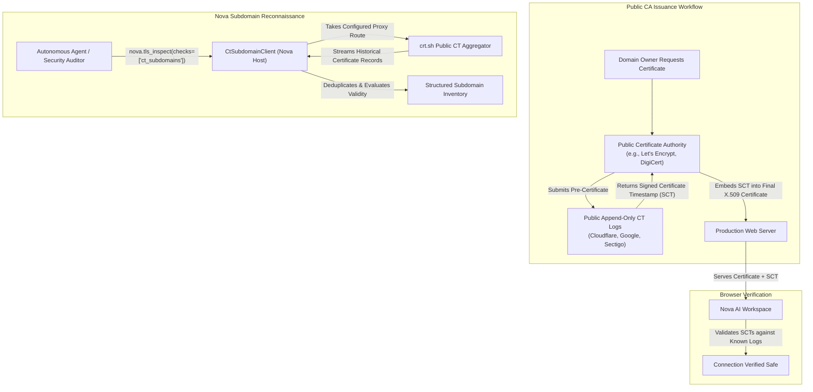

# Certificate Transparency & Subdomain Reconnaissance

Certificate Transparency (CT), formalized in RFC 6962, is an open cryptographic auditing framework designed to monitor and audit digital certificates issued by public Certificate Authorities (CAs). Before CT, compromised or coerced CAs could secretly issue fraudulent certificates for high-profile domains (as demonstrated in the historic DigiNotar breach), enabling man-in-the-middle attacks without the domain owner's knowledge.

Today, all public CAs must publish every issued certificate to public, append-only, Merkle-tree cryptographic logs. Nova's [`nova.tls_inspect`](../../../../mcp-reference/tools/proxy-and-network/nova-tls-inspect.md) harnesses these public logs through its `ct_subdomains` check, transforming public audit infrastructure into a powerful reconnaissance and shadow IT discovery tool.

---

## 1. The Certificate Transparency Framework (RFC 6962)

The core architecture of Certificate Transparency relies on three cooperating entities:



### Signed Certificate Timestamps (SCTs)
When a CA issues an SSL/TLS certificate, it submits a pre-certificate to multiple independent CT logs. Each log returns a Signed Certificate Timestamp (SCT) promising that the certificate will be incorporated into the log's immutable Merkle tree within a maximum merge delay (usually 24 hours).
* Nova inspects embedded SCTs in `check: certificate` to confirm that the server's certificate was legitimately logged before deployment.
* Major browsers reject any public certificate issued after 2018 that lacks valid SCTs.

---

## 2. Reconnaissance & Shadow IT Discovery (`check: ct_subdomains`)

Because every publicly certified domain name is recorded in permanent logs, CT logs serve as an authoritative, historical record of an organization's entire digital footprint.

When `checks` includes `ct_subdomains`, Nova queries public CT logs (via `crt.sh`, operated by Sectigo) to discover all hostnames ever certified under the target domain:

```json
{
  "url": "https://example.com",
  "checks": ["ct_subdomains"],
  "maxCtEntries": 100
}
```

### Discovery Capabilities
Unlike brute-force DNS scanners that query common wordlists (and miss obscure naming conventions), Certificate Transparency queries reveal real certificates issued for:
* **Staging & Pre-Production Environments:** `staging.internal.example.com`, `qa-v2.example.com`.
* **Administrative & Management Gateways:** `vpn.example.com`, `sso-login.example.com`, `admin-portal.example.com`.
* **API Endpoints & Microservices:** `payments-api.example.com`, `auth-v3.example.com`.
* **Forgotten & Shadow IT Infrastructure:** Abandoned promotional websites, legacy servers, or cloud test instances that still carry active certificates.

---

## 3. Structured Subdomain Output Model

Nova's `CtSubdomainClient` streams records from public logs, filters duplicates, analyzes temporal validity, and returns a structured inventory:

```json
{
  "ctSubdomains": {
    "status": "ok",
    "domain": "example.com",
    "source": "crt.sh",
    "totalNames": 142,
    "currentlyValidNames": 89,
    "returned": 100,
    "hasMore": true,
    "names": [
      {
        "name": "api.example.com",
        "wildcard": false,
        "currentlyValid": true,
        "firstSeen": "2021-04-12T10:00:00Z",
        "lastSeen": "2026-08-15T14:30:00Z",
        "latestNotAfter": "2026-11-15T14:30:00Z",
        "certificateCount": 16,
        "issuers": ["Let's Encrypt", "DigiCert"]
      },
      {
        "name": "dev-legacy.example.com",
        "wildcard": false,
        "currentlyValid": false,
        "firstSeen": "2019-01-10T08:00:00Z",
        "lastSeen": "2020-01-10T08:00:00Z",
        "latestNotAfter": "2021-01-10T08:00:00Z",
        "certificateCount": 2,
        "issuers": ["Let's Encrypt"]
      }
    ]
  }
}
```

### Key Field Definitions
* `currentlyValid`: Identifies whether an active, unexpired certificate currently covers this hostname. Differentiates active production endpoints from decommissioned historical systems.
* `firstSeen` / `lastSeen`: Reveals the operational lifecycle of a service. A service with `firstSeen` in 2019 and `lastSeen` in 2026 represents a long-standing core system; a name seen only once may indicate an ephemeral test.
* `certificateCount`: Number of certificates issued over time. Frequent renewals indicate active automation (e.g. ACME / Let's Encrypt cert-manager).
* `issuers`: Discloses CA vendors used across the organization.

---

## 4. Operational Boundaries, Quotas & Streaming Safety

Certificate Transparency queries can return tens of thousands of records for large multi-national organizations. To prevent process memory exhaustion and network stalls:

```
+-----------------------------------------------------------------------------------+
| BOUNDARY PARAMETER         | VALUE               | PROTECTION FUNCTION            |
+-----------------------------------------------------------------------------------+
| Maximum Stream Rows        | 100,000 rows        | Caps raw JSON rows from crt.sh |
+----------------------------+---------------------+--------------------------------+
| Maximum Stream Bytes       | 64 MB               | Prevents memory overflow on big|
|                            |                     | multi-tenant domains           |
+----------------------------+---------------------+--------------------------------+
| Default Result Limit       | 200 names           | Keeps MCP responses compact    |
+----------------------------+---------------------+--------------------------------+
| Configurable Entry Range   | 1 – 2,000 names     | Controlled via maxCtEntries    |
+-----------------------------------------------------------------------------------+
```

### Handling Upstream Log Latency & Overload
* Public CT search endpoints (like `crt.sh`) are frequently overloaded.
* **Non-Blocking Resilience:** If the CT log query times out or fails with an HTTP 504 error, Nova reports `status: "unavailable"` in `ctSubdomains` while allowing the rest of the inspection (`certificate`, `server`, `http`) to complete successfully. The overall tool call does not fail.

---

## 5. Privacy & Network Egress Disclosure

Because Certificate Transparency querying involves external lookups:

> [!WARNING]
> **Privacy Disclosure:** Executing `check: ct_subdomains` transmits the target root domain name to `crt.sh` (a third-party service operated by Sectigo).

### Proxy Routing Guarantee
* While the query contacts a third-party service, **all outbound requests take Nova's active browser proxy route**.
* If a SOCKS5 or residential HTTP proxy is configured, the query to `crt.sh` routes through the proxy tunnel, ensuring that your local IP address is never revealed to the log aggregator.

---

## 6. Related References

* [TLS Inspection Master Guide](../README.md): Primary architecture, inspection modes, and findings severity grading.
* [Certificate Chains & Trust Anchors](../certificate-chains/README.md): X.509 hierarchy, SAN wildcards, and intermediate CAs.
* [Cipher Suites & Protocol Negotiation](../cipher-suites-and-protocols/README.md): Probing SSLv3 to TLS 1.3, PFS, and AEAD ciphers.
* [Network Overview](../../README.md): Traffic routing, proxy tunnels, and tab-scoped interception.
* [TLS Inspect Tool Reference](../../../../mcp-reference/tools/proxy-and-network/nova-tls-inspect.md)

---

[TLS Inspection Master Guide](../README.md) · [Network overview](../../README.md)
