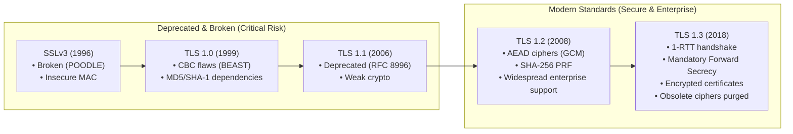
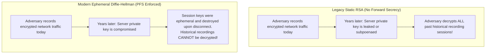

# Cipher Suites, Protocol Negotiation & Cryptographic Strength

The security of an HTTPS connection is determined not only by the certificate, but by the cryptographic algorithms negotiated during the initial TLS handshake: the protocol version, the cipher suite, the key-exchange mechanism, and negotiated extensions. A valid certificate deployed on a server that permits legacy SSLv3 protocols or obsolete RC4 ciphers remains vulnerable to active eavesdropping, session hijacking, and man-in-the-middle (MITM) downgrade attacks.

Nova's [`nova.tls_inspect`](../../../../mcp-reference/tools/proxy-and-network/nova-tls-inspect.md) provides an active server probe (`check: server`) that enumerates supported protocols from SSLv3 to TLS 1.3, measures cipher suite preference order, verifies Perfect Forward Secrecy (PFS), detects Next-Gen Post-Quantum hybrid groups, and audits Application-Layer Protocol Negotiation (ALPN).

---

## 1. Protocol Version Evolution & Security Thresholds

The Transport Layer Security protocol has undergone substantial architectural evolution:



### Protocol Security Classifications
* **SSLv3, TLS 1.0, TLS 1.1:** Formally deprecated by the IETF (RFC 8996) and rejected by modern browsers. Servers supporting these versions are vulnerable to protocol downgrade attacks. Nova assigns severity `critical` to any server accepting these protocols.
* **TLS 1.2:** The standard workhorse of enterprise infrastructure. Fully secure when configured to mandate Authenticated Encryption (AEAD) and ephemeral key exchanges.
* **TLS 1.3:** The modern gold standard (RFC 8446). Radically streamlined to eliminate static RSA key exchanges, CBC-mode ciphers, and arbitrary renegotiation. Reduces handshake latency from 2 round trips (2-RTT) to 1 round trip (1-RTT).

---

## 2. Cipher Suite Architecture & Strength Grading

A TLS 1.2 cipher suite string (e.g. `TLS_ECDHE_RSA_WITH_AES_128_GCM_SHA256`) explicitly defines four algorithmic components:
1. **Key Exchange:** Ephemeral Diffie-Hellman (`ECDHE`, `DHE`) vs static `RSA`.
2. **Authentication:** Server signature algorithm (`RSA`, `ECDSA`).
3. **Bulk Encryption:** Symmetric cipher and mode (`AES_128_GCM`, `CHACHA20_POLY1305`, `AES_256_CBC`).
4. **Integrity / MAC:** Hashing algorithm (`SHA256`, `SHA384`).

In TLS 1.3, the naming is simplified (e.g. `TLS_AES_128_GCM_SHA256`) because authentication and key-exchange groups are negotiated through separate extensions.

### Nova's Cipher Suite Strength Taxonomy

Nova evaluates accepted cipher suites against an authoritative cryptographic catalog:

```
+-----------------------------------------------------------------------------------+
| CIPHER STRENGTH TIER       | REPRESENTATIVE CIPHER SUITES     | SECURITY IMPACT   |
+-----------------------------------------------------------------------------------+
| Modern (AEAD + PFS)        | TLS_AES_128_GCM_SHA256 (TLS 1.3) | State of the art. |
|                            | TLS_AES_256_GCM_SHA384 (TLS 1.3) | Zero known flaws. |
|                            | TLS_CHACHA20_POLY1305_SHA256     | AEAD integrity.   |
|                            | TLS_ECDHE_RSA_WITH_AES_128_GCM   | Full Forward Sec. |
+----------------------------+----------------------------------+-------------------+
| Secure (PFS + CBC)         | TLS_ECDHE_RSA_WITH_AES_128_CBC   | Secure, but legacy|
|                            | TLS_ECDHE_RSA_WITH_AES_256_CBC   | CBC padding risk. |
+----------------------------+----------------------------------+-------------------+
| Insecure (Static RSA)      | TLS_RSA_WITH_AES_128_GCM_SHA256  | NO Forward Secrecy|
|                            | TLS_RSA_WITH_AES_256_CBC_SHA256  | Past sessions leak|
+----------------------------+----------------------------------+-------------------+
| Broken / Vulnerable        | TLS_RSA_WITH_RC4_128_SHA         | Broken stream     |
| (Critical Severity)        | TLS_RSA_WITH_3DES_EDE_CBC_SHA    | Sweet32 flaw      |
|                            | TLS_ECDHE_RSA_WITH_RC4_128_SHA   | Bar Mitzvah attack|
+-----------------------------------------------------------------------------------+
```

---

## 3. Perfect Forward Secrecy (PFS)

Perfect Forward Secrecy is a foundational requirement for modern network privacy:



* **Mechanism:** PFS mandates the use of ephemeral Diffie-Hellman key exchanges (`ECDHE` or `DHE`). A unique, temporary session key is computed for each connection and immediately erased from RAM after the session terminates.
* **Audit Check:** Nova checks every accepted cipher suite for `ForwardSecrecy: true`. If a server accepts static RSA key exchanges (`TLS_RSA_*`), Nova flags the finding with reason code `static_rsa`.

---

## 4. Server vs. Client Preference Ordering

Servers and clients exchange cipher suite lists during the `ClientHello` and `ServerHello` handshake messages. Which party dictates the final choice depends on server configuration:

* **Server Preference Enforced:** The server selects the most secure cipher suite from its own prioritized list that the client supports. This protects users against malicious or misconfigured clients that might otherwise choose weak algorithms.
* **Client Preference Honored:** The server selects the first cipher suite from the client's list that it supports. This allows clients to force weaker or suboptimal ciphers.
* **Nova Verification:** Nova probes the server with multiple permutated client cipher lists to determine whether `serverPreferenceOrder: true` is actively enforced.

---

## 5. Key-Exchange Groups & Post-Quantum Cryptography

In TLS 1.3 and modern TLS 1.2, elliptic curve Diffie-Hellman key exchange is governed by the `supported_groups` extension:

### Classical Elliptic Curves
* **`X25519` (`0x001D`):** The modern standard curve. Fast, constant-time, immune to side-channel cache attacks.
* **`secp256r1` / NIST P-256 (`0x0017`):** Standard enterprise curve supported by all hardware cryptographic modules.
* **`secp384r1` / NIST P-384 (`0x0018`):** High-security government grade curve.

### Post-Quantum Hybrid Cryptography (PQ / ML-KEM)
State-level adversaries currently intercept and store encrypted internet traffic in anticipation of future quantum computers capable of breaking elliptic curve mathematics (the "Harvest Now, Decrypt Later" threat).

Nova tests whether the server supports hybrid post-quantum key exchange groups:
* **`X25519Kyber768` (`0x6399`):** Combines classical `X25519` with the NIST-standardized Kyber lattice-based post-quantum algorithm.
* **`X25519MLKEM768` (`0x11EC`):** The ratified FIPS 203 post-quantum hybrid standard.
* **Audit Value:** Nova discloses whether the server is prepared for post-quantum cryptographic transitions.

---

## 6. Advanced TLS Extensions

Nova audits key TLS protocol extensions that secure session establishment:

```
+-----------------------------------------------------------------------------------+
| TLS EXTENSION              | SPECIFICATION  | SECURITY FUNCTION                   |
+-----------------------------------------------------------------------------------+
| ALPN (App-Layer Protocol)  | RFC 7301       | Negotiates h2 (HTTP/2) or http/1.1  |
|                            |                | during TLS handshake without delays.|
+----------------------------+----------------+-------------------------------------+
| Extended Master Secret     | RFC 7627       | Binds master secret to handshake    |
|                            |                | transcript; prevents Triple Handshake.|
+----------------------------+----------------+-------------------------------------+
| Secure Renegotiation       | RFC 5746       | Prevents renegotiation injection    |
|                            |                | attacks (CVE-2009-3555).            |
+----------------------------+----------------+-------------------------------------+
| Session Tickets (Stateless)| RFC 5077       | Resumes sessions without server     |
|                            |                | state; audits ticket encryption.    |
+-----------------------------------------------------------------------------------+
```

---

## 7. Active Probe Safety Boundaries

When running `check: server`, Nova conducts active network handshakes against the target host. To ensure safety and prevent triggering security alarms:

$$\text{Safety Limits} = 150 \quad \text{Maximum Handshakes} \quad \Big\vert \quad 90 \quad \text{Seconds Timeout}$$

* **Safety Throttling:** Handshakes are bounded and rate-governed so they do not overwhelm target web servers or trigger Web Application Firewall (WAF) rate limits.
* **Missing Items Transparency:** If a server is slow or connection limits are reached before all cipher permutations finish, Nova reports un-probed items explicitly in the `missing` array. Incomplete testing is never misreported as an absent feature.

---

## 8. Related References

* [TLS Inspection Master Guide](../README.md): Primary architecture, inspection modes, and findings severity grading.
* [Certificate Chains & Trust Anchors](../certificate-chains/README.md): X.509 hierarchy, SAN wildcards, and intermediate CAs.
* [Certificate Transparency Reconnaissance](../certificate-transparency/README.md): Public log verification and subdomain discovery via crt.sh.
* [Network Overview](../../README.md): Traffic routing, proxy tunnels, and tab-scoped interception.
* [TLS Inspect Tool Reference](../../../../mcp-reference/tools/proxy-and-network/nova-tls-inspect.md)

---

[TLS Inspection Master Guide](../README.md) · [Network overview](../../README.md)
