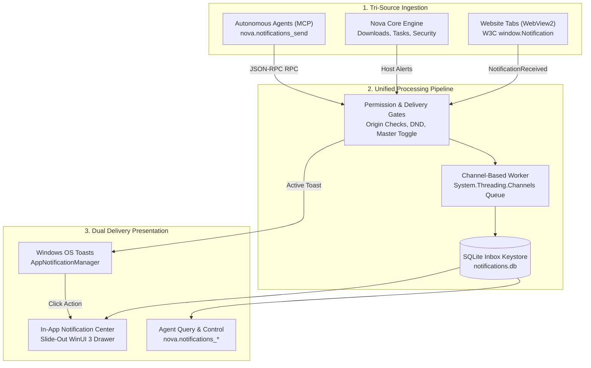
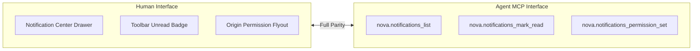
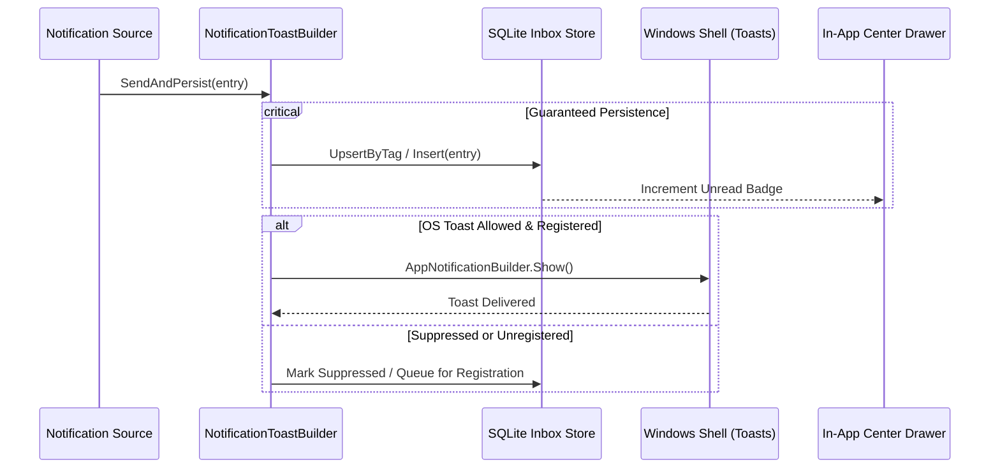
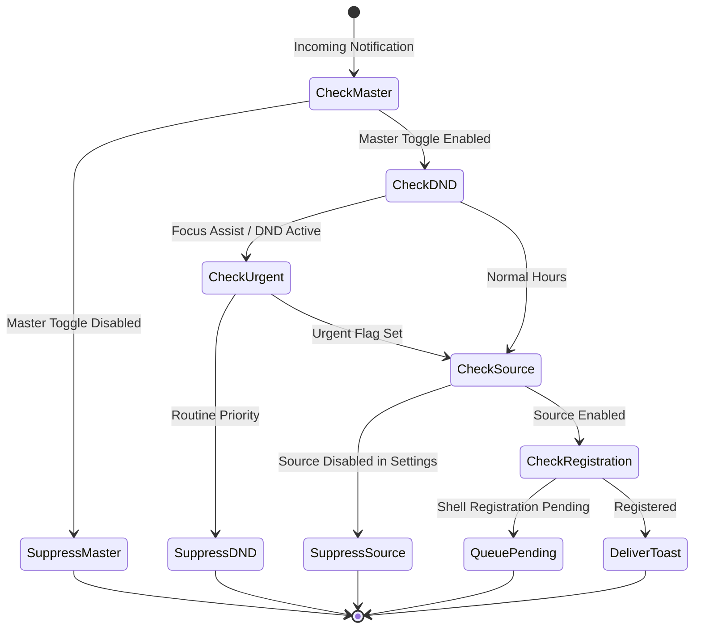
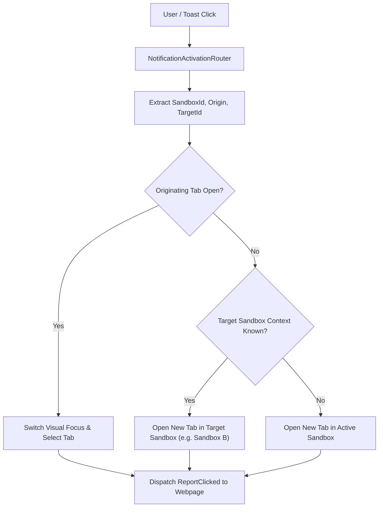

# Desktop Notifications & Unified Inbox Architecture

Nova AI Workspace provides a cross-cutting notification infrastructure bridging **W3C Web Notifications**, **Host System Alerts**, and **Autonomous Agent Dispatches** into a single persistent inbox, a reactive WinUI 3 slide-out notification center, and native Windows OS toasts.

---

## 1. High-Level Architecture & Three-Source Topology

Traditional web browsers deliver website notifications directly to the operating system's notification center without giving AI agents or local automation workflows visibility into past alerts. Nova unifies all notification streams under a single, strongly-typed domain model:



### The Three Ingestion Sources
1. **Website Notifications (`SourceKind = Website`):** Emitted by active browser tabs via the standard JavaScript W3C `new Notification(title, options)` API. Nova intercepts the WebView2 `NotificationReceived` event (`Handled = true`), taking complete ownership of display and persistence while routing interaction events back to the webpage.
2. **Nova Host Alerts (`SourceKind = Nova`):** Generated by core workspace subsystems—including background file downloads, completed cron tasks, terminal command exits, and security prompt resolutions.
3. **Agent Dispatches (`SourceKind = Agent`):** Pushed by AI agents via the MCP tool [`nova.notifications_send`](../../mcp-reference/tools/notifications/nova-notifications-send.md) to alert users of task completion, blocked workflows, or required manual interventions.

---

## 2. Human-Agent Parity Principle

Nova enforces strict **Human-Agent Parity** across the entire notification subsystem:

* **Single Source of Truth:** All notifications—regardless of whether they originated from a website, Nova itself, or an autonomous agent—are stored in the identical SQLite database schema (`notifications.db`).
* **Bidirectional Management:** Any action the human user can perform in the In-App Notification Center (reading, dismissing, clearing, opening links, adjusting origin permissions) can be executed identically by an AI agent using the 11 MCP notification tools.
* **Non-Destructive Inspection:** Agents can inspect unread alerts, list historical notifications with pagination, and filter by origin or delivery state without prematurely acknowledging or dismissing them.



---

## 3. Dual Delivery Pipeline

Every notification that passes Nova's delivery gates undergoes a coordinated two-pronged delivery process:



1. **Guaranteed Inbox Persistence:** The notification is immediately written to the local SQLite database via an asynchronous, non-blocking background queue. Even if the Windows notification service is disabled, in Focus Assist mode, or fails, the inbox entry is guaranteed to exist.
2. **Best-Effort Windows Toast:** If the user has OS toasts enabled and Focus Assist allows it, Nova builds and displays a native Windows App Notification using the Windows App SDK. If Windows toasts are disabled or the app is elevated without shell registration, toast delivery is suppressed without losing the inbox entry.

---

## 4. Delivery Gate State Machine

Before displaying a Windows toast, Nova evaluates a cascading series of delivery gates:



* **Master Gate (`AppSettings.EnableNotifications`):** When turned off globally, all OS toasts are suppressed.
* **Do Not Disturb & Urgent Override:** Routine notifications are suppressed during active Windows Focus Assist periods. However, notifications marked with `Urgent = true` (such as failed scheduled tasks or critical security warnings) escalate to the Windows `Urgent` scenario, breaking through Focus Assist.
* **Per-Source Gate:** Users can independently toggle OS toasts for Websites, Nova system alerts, and AI Agents in Settings.
* **Registration Self-Healing:** On unpackaged WinUI 3 boots where Windows shell registration is momentarily delayed, toasts are safely enqueued and flushed once registration succeeds.

---

## 5. Activation & Deep-Linking Routing

Clicking a notification—either inside the In-App Notification Center or via a Windows Toast banner—triggers Nova's unified activation router:

```
notif::{notificationId}?action=open&source=Website&sandbox=B&origin=https://chat.com&target=tab-9a2f
```



### Routing Invariants:
* **Sandbox Profile Isolation:** If the notification originated in an isolated profile (e.g., Sandbox B), clicking the alert will **never** open the URL in Sandbox A. If the original tab is still open, Nova focuses it; if closed, Nova creates a new tab strictly bound to the originating sandbox.
* **Web Lifecycle Feedback:** For website notifications, activating the notification triggers `CoreWebView2Notification.ReportClicked()`, which dispatches the standard JavaScript `onclick` event to the target web page.

---

## 6. Origin Permission Model

Websites requesting notification permissions are governed by a granular, origin-based security model:

| Permission Mode | Behavior | Persistence Scope |
| :--- | :--- | :--- |
| **`Ask` (Default)** | Displays an in-tab UI banner requesting user approval. | Ephemeral until answered. |
| **`Allow`** | Websites can immediately push notifications to the inbox and OS. | Persistent per origin in `settings.json`. |
| **`Deny`** | Silent suppression; no banners or toasts are shown. | Persistent per origin in `settings.json`. |

* **Global Default:** Configurable via [`nova.notifications_permission_default_set`](../../mcp-reference/tools/notifications/nova-notifications-permission-default-set.md) (`Ask`, `Allow`, or `Deny`).
* **Private Browsing Isolation:** Tabs opened in Private/Incognito mode evaluate permissions strictly in memory. Any permission granted in a private tab is discarded upon tab closure and never written to persistent disk storage.

---

## 7. The 11 MCP Notification Tools

All notification capabilities are exposed to AI agents via the `notifications` capability bundle:

| Tool Name | Parameters | Core Responsibility |
| :--- | :--- | :--- |
| **[`nova.notifications_list`](../../mcp-reference/tools/notifications/nova-notifications-list.md)** | `unreadOnly?`, `source?`, `origin?`, `limit?`, `offset?` | Queries the inbox with rich filtering and pagination. |
| **[`nova.notifications_get`](../../mcp-reference/tools/notifications/nova-notifications-get.md)** | `notificationId` | Retrieves complete payload, timestamps, and delivery diagnostics for an entry. |
| **[`nova.notifications_send`](../../mcp-reference/tools/notifications/nova-notifications-send.md)** | `title`, `body?`, `urgent?`, `isSilent?` | Dispatches an agent-authored notification to the user. |
| **[`nova.notifications_mark_read`](../../mcp-reference/tools/notifications/nova-notifications-mark-read.md)** | `notificationId`, `isRead?` | Updates read state without removing the alert from the inbox. |
| **[`nova.notifications_dismiss`](../../mcp-reference/tools/notifications/nova-notifications-dismiss.md)** | `notificationId` | Hides an alert from default views while preserving audit records. |
| **[`nova.notifications_clear`](../../mcp-reference/tools/notifications/nova-notifications-clear.md)** | `source?`, `olderThanDays?` | Bulk-dismisses historical notifications matching specific criteria. |
| **[`nova.notifications_open`](../../mcp-reference/tools/notifications/nova-notifications-open.md)** | `notificationId` | Executes the activation deep-link, focusing or navigating the target tab. |
| **[`nova.notifications_permissions_list`](../../mcp-reference/tools/notifications/nova-notifications-permissions-list.md)** | *(none)* | Audits all per-origin notification grants and reports the global default. |
| **[`nova.notifications_permission_set`](../../mcp-reference/tools/notifications/nova-notifications-permission-set.md)** | `origin`, `mode` | Programmatically grants (`Allow`), denies (`Deny`), or resets (`Ask`) origin permissions. |
| **[`nova.notifications_permission_default_set`](../../mcp-reference/tools/notifications/nova-notifications-permission-default-set.md)** | `mode` | Sets the global fallback permission policy for unknown websites. |
| **[`nova.notifications_unread_count`](../../mcp-reference/tools/notifications/nova-notifications-unread-count.md)** | *(none)* | Returns an instant, $O(1)$ count of unread inbox notifications. |

---

## 8. Subsystem Deep-Dive Guides

* **[Inbox Storage & Channel Worker Architecture](inbox-and-storage/README.md):**
  SQLite schema design, channel-based non-blocking persistence queues, WinUI 3 Notification Center sidebar, and unread counter synchronization.
* **[Windows Toasts & Deep-Link Activation Router](windows-toasts-and-activation/README.md):**
  Unpackaged WinUI 3 Windows App SDK integration, toast layout templates, Focus Assist escalation, and multi-sandbox click routing.
* **[W3C Web Permissions & Lifecycle Handshake](web-permissions-and-lifecycle/README.md):**
  WebView2 `NotificationReceived` interception, tag-based upsert mechanics, DOM lifecycle callbacks (`ReportClicked`/`ReportClosed`), and private tab isolation.

---

## Next Steps

* Manage notification tools in the **[MCP Tool Catalog](../../mcp-reference/tool-catalog.md#11-desktop-notifications--alerts)**.
* Read the **[Agent Awareness Gates (AAG)](../agent-awareness-gates-aag/README.md)** for human-in-the-loop permission contracts.
* Explore **[Multi-Sandbox Session Isolation](../sandbox-isolation/README.md)** for profile partition rules.
