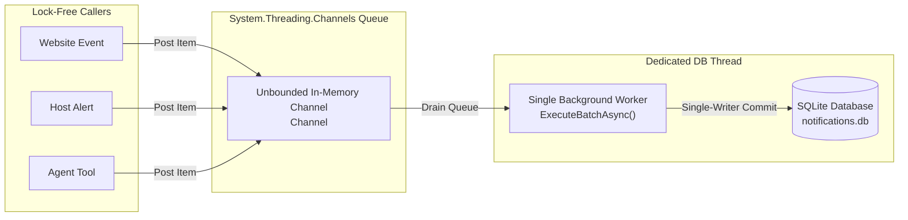
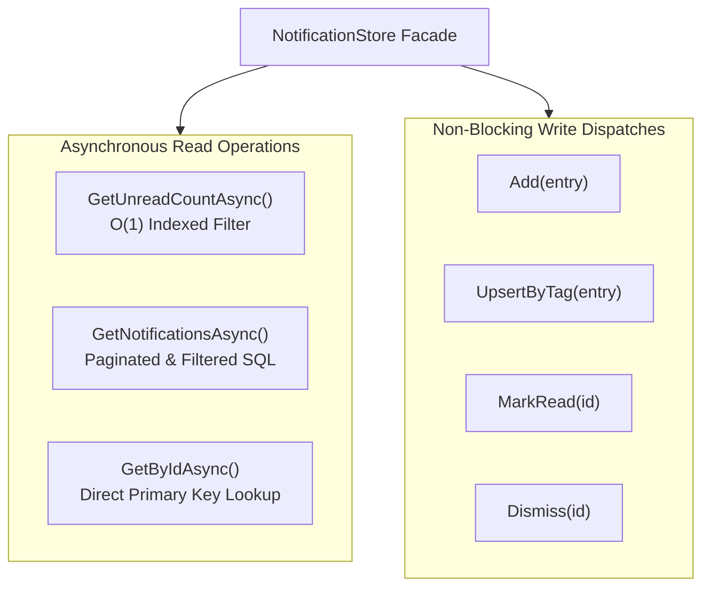
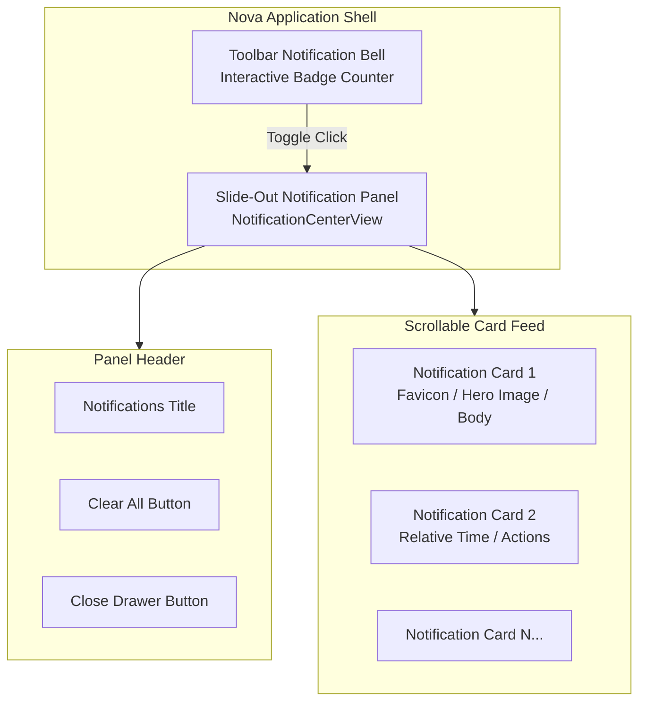
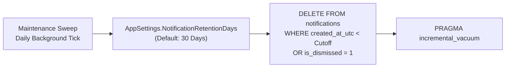

# Notification Inbox Storage & Channel Worker Architecture

This document specifies the persistence architecture, thread-safe asynchronous write queues, and reactive UI reconciliation mechanisms powering Nova AI Workspace's unified notification inbox.

---

## 1. Storage Topology & SQLite Database Design

All notifications—originating from live websites, Nova background services, or MCP agent calls—are stored in a dedicated SQLite database located in the active user profile:

```
%LOCALAPPDATA%\NovaBrowser\notifications.db
```

### Relational Schema Specification
The backing database table (`notifications`) stores complete metadata, visual asset pointers, and interaction flags:

```sql
CREATE TABLE IF NOT EXISTS notifications (
    id TEXT PRIMARY KEY NOT NULL,
    source_kind INTEGER NOT NULL,            -- 0 = Website, 1 = Nova, 2 = Agent
    origin TEXT,                             -- e.g. "https://chat.com"
    target_id TEXT,                          -- Specific tab identifier
    tab_id TEXT,
    sandbox_id TEXT,                         -- e.g. "A" or "B"
    profile_id TEXT,
    title TEXT NOT NULL,
    body TEXT,
    tag TEXT,                                -- W3C Web Notification tag for upserts
    icon_path TEXT,                          -- App logo override / site favicon URI
    image_path TEXT,                         -- Inline preview image URI
    hero_image_path TEXT,                    -- Top banner preview image URI
    use_circle_app_logo INTEGER NOT NULL,    -- Boolean: circular avatar cropping
    action_button_label TEXT,                -- Optional CTA button text
    urgent INTEGER NOT NULL,                 -- Boolean: Focus Assist priority override
    is_silent INTEGER NOT NULL,              -- Boolean: audio suppression
    requires_interaction INTEGER NOT NULL,   -- Boolean: persistent banner
    language TEXT,                           -- BCP47 language code (e.g. "en-US")
    timestamp_ms REAL,                       -- JavaScript epoch millisecond timestamp
    created_at_utc TEXT NOT NULL,            -- ISO-8601 creation timestamp
    is_read INTEGER NOT NULL DEFAULT 0,      -- 0 = Unread, 1 = Read
    is_dismissed INTEGER NOT NULL DEFAULT 0, -- 0 = Active, 1 = Dismissed
    delivery_state INTEGER NOT NULL DEFAULT 0-- 0=Pending, 1=Delivered, 2=Failed, 3=Suppressed
);

CREATE INDEX IF NOT EXISTS idx_notifications_created 
    ON notifications(created_at_utc DESC);

CREATE INDEX IF NOT EXISTS idx_notifications_tag_origin 
    ON notifications(tag, origin) 
    WHERE tag IS NOT NULL AND origin IS NOT NULL;

CREATE INDEX IF NOT EXISTS idx_notifications_unread 
    ON notifications(is_read, is_dismissed) 
    WHERE is_read = 0 AND is_dismissed = 0;
```

---

## 2. Lock-Free Channel Worker Queue

To ensure that high-frequency background operations (such as dozens of file downloads or rapid agent loops) never block the WinUI 3 UI thread or browser IPC pipelines, Nova decouples write requests using a producer-consumer channel queue:



### Architectural Guarantees:
* **Zero UI Stalls:** Callers enqueue write operations synchronously in under $0.05\text{ ms}$ without acquiring database mutexes or disk locks.
* **Batch Coalescing:** The background consumer processes queue drains in micro-batches, wrapping multiple insertions or tag-updates into single SQLite transactions, minimizing disk I/O.
* **Deterministic Single-Writer Serialisation:** By routing all writes through a single background worker thread, SQLite database lock contentions (`SQLITE_BUSY`) are eliminated by design.

---

## 3. High-Performance Query Facade

Reads and queries are executed through an asynchronous data access facade (`NotificationStore`):



### Unread Count Caching & Synchronization
The unread notification count is updated reactively:
* When a write is enqueued, the store updates its cached memory counter optimistically.
* When the user opens the In-App Notification Center or clears items, the badge counter reconciles against an indexed SQLite query (`WHERE is_read = 0 AND is_dismissed = 0`).
* AI agents can query the exact count instantly via [`nova.notifications_unread_count`](../../../mcp-reference/tools/notifications/nova-notifications-unread-count.md).

---

## 4. In-App Notification Center UI Architecture

The In-App Notification Center is rendered as a lightweight, code-only WinUI 3 slide-out drawer positioned along the right border of the browser window:



### Card Recycling & Layout Mechanics
1. **Incremental Reconciliation:** When new notifications arrive while the panel is visible, cards are reconciled incrementally without rebuilding the visual tree, preserving the user's scroll offset.
2. **Relative Time Formatting:** Timestamps are formatted dynamically into human-friendly intervals (`Just now`, `5m ago`, `2h ago`, `Yesterday`) while preserving exact ISO UTC stamps in tool query outputs.
3. **Rich Visual Styling:** Cards display the originating site's favicon, custom hero banners for task results, and visual unread indicators.

---

## 5. Retention & Purge Policies

To prevent indefinite database growth over months of continuous operation, Nova provides automated retention controls:



* **Retention Window:** Configured via `AppSettings.NotificationRetentionDays` (default: 30 days). Historical entries older than the threshold are automatically pruned.
* **Bulk Clearing by Agents:** Autonomous agents can trigger targeted purges using [`nova.notifications_clear`](../../../mcp-reference/tools/notifications/nova-notifications-clear.md), specifying filters such as `olderThanDays` or `source` to clean up temporary task notifications without affecting website alerts.

---

## Related Documentation

* **[Desktop Notifications Overview](../README.md)** — Master three-source topology and parity principles.
* **[Windows Toasts & Activation Routing](../windows-toasts-and-activation/README.md)** — Windows App SDK integration and deep-link routing.
* **[W3C Web Permissions & Lifecycle Handshake](../web-permissions-and-lifecycle/README.md)** — WebView2 interception and origin management.
