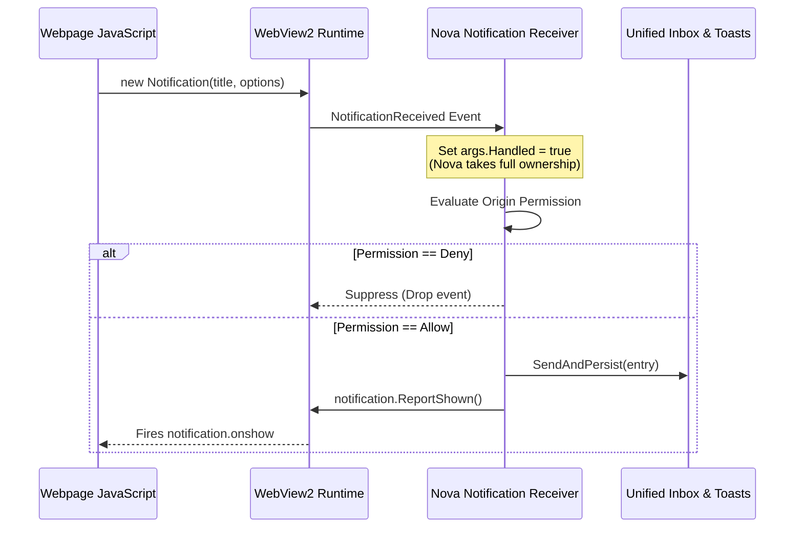
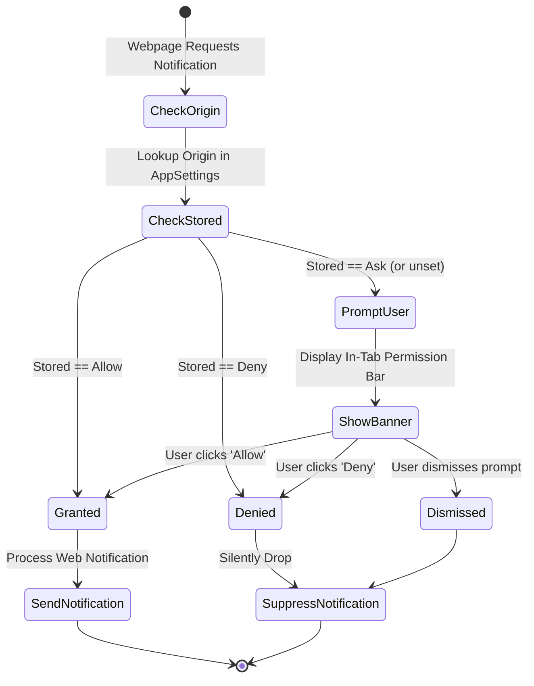
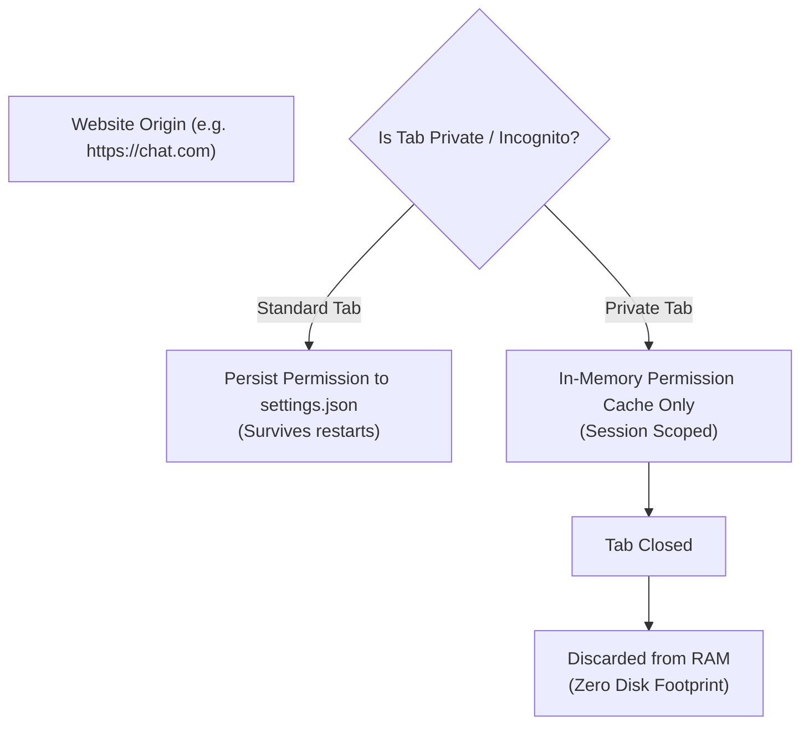
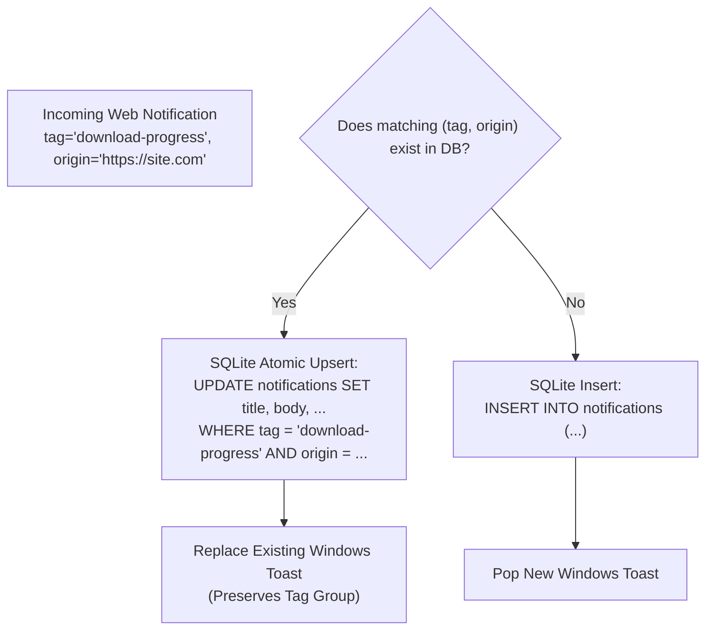

# W3C Web Permissions & Notification Lifecycle Handshake

This document specifies how Nova AI Workspace intercepts, authorizes, and synchronizes live website notifications using Microsoft WebView2 and the W3C Web Notifications standard.

---

## 1. W3C Web Notifications Specification Interception

Websites invoke the standard JavaScript Web Notifications API to alert users:

```javascript
// Webpage script execution
const notif = new Notification("Build Succeeded", {
    body: "Docker container nova-worker deployed.",
    icon: "/static/favicon.png",
    tag: "deploy-status-1024",
    renotify: true,
    silent: false
});

notif.onclick = () => { console.log("User clicked notification"); };
notif.onclose = () => { console.log("Notification dismissed"); };
```

In standard browsers, the underlying web runtime manages display directly. In Nova AI Workspace, Microsoft WebView2 fires the native `CoreWebView2.NotificationReceived` event:



By asserting `args.Handled = true`, Nova suppresses default WebView2 popups and routes the payload into Nova's unified three-source pipeline.

---

## 2. Origin-Based Permission State Machine

Notifications requested by web pages are governed by an origin-based permission model:



### Tri-State Permission Policy:
* **`Allow`:** The website origin is permanently permitted to emit notifications. Notifications pass directly to the inbox and Windows toast pipelines.
* **`Deny`:** The origin is permanently blocked. Incoming notification events are dropped silently without prompting the user.
* **`Ask` (Default):** Nova renders an unobtrusive in-tab permission bar asking the user to grant or deny access.

---

## 3. Privacy Boundaries & Ephemeral Private Tabs

To preserve complete confidentiality during private browsing sessions, Nova enforces strict storage boundaries:



* **Zero Disk Leakage:** When a user grants notification permission inside a private tab, the grant is held strictly in volatile memory. It is never written to `%LOCALAPPDATA%\NovaBrowser\settings.json`.
* **Instant Destruction:** When the private tab closes, all associated permission grants and notification tracking references are immediately purged from memory.

---

## 4. DOM Lifecycle Callbacks & COM Interop

The W3C Web Notifications standard requires that user interactions (clicks and closes) trigger JavaScript event callbacks on the client webpage. Nova bridges desktop actions back to the web runtime via COM interfaces:

```mermaid
flowchart LR
    subgraph UserAction["Desktop Interaction"]
        Click["User clicks Toast or In-App Card"]
        Close["User dismisses notification"]
    end

    subgraph NovaBridge["Nova Lifetime Tracker"]
        ActiveMap["_activeWebNotifications<br>Map<NotificationId, CoreWebView2Notification>"]
    end

    subgraph DOMEvents["Webpage Execution"]
        OnShow["notification.onshow"]
        OnClick["notification.onclick"]
        OnClose["notification.onclose"]
    end

    Click --> ActiveMap
    Close --> ActiveMap

    ActiveMap -->|ReportClicked()| OnClick
    ActiveMap -->|ReportClosed()| OnClose
```

### Supported Lifecycle Hooks:
1. **`ReportShown()`:** Called immediately after the notification is successfully committed to the database and displayed, dispatching the DOM `onshow` event.
2. **`ReportClicked()`:** Dispatched when the user clicks the notification card in the slide-out center or clicks the native Windows toast banner, triggering the DOM `onclick` event.
3. **`ReportClosed()`:** Dispatched when the user dismisses the card or closes the toast, firing the DOM `onclose` event and releasing COM handles.

---

## 5. Tag-Based Upsert & Replacement Semantics

Websites frequently update ongoing alerts (e.g. music playback tracks, sports scores, progress bars) by providing a `tag` property. Nova adheres strictly to W3C tag replacement semantics:



### Tag Invariants:
* **Anti-Spam Deduplication:** A new notification sharing an identical `(tag, origin)` tuple replaces the previous notification in-place within the SQLite database rather than appending duplicate rows.
* **Active Toast Replacement:** The existing Windows toast banner is updated seamlessly in the Windows Action Center, preventing desktop notification flooding.

---

## 6. Programmatic MCP Permission Control

Autonomous AI agents can audit and configure website notification permissions programmatically using Nova's dedicated MCP tools:

```json
// Example: Whitelist an internal developer dashboard for alerts
{
  "name": "nova.notifications_permission_set",
  "arguments": {
    "origin": "https://monitor.internal.net",
    "mode": "Allow"
  }
}
```

* **[`nova.notifications_permissions_list`](../../../mcp-reference/tools/notifications/nova-notifications-permissions-list.md):** Returns an inventory of all origins with customized permission grants along with the effective global default.
* **[`nova.notifications_permission_set`](../../../mcp-reference/tools/notifications/nova-notifications-permission-set.md):** Explicitly grants (`Allow`), revokes (`Deny`), or resets (`Ask`) permissions for a given URI origin.
* **[`nova.notifications_permission_default_set`](../../../mcp-reference/tools/notifications/nova-notifications-permission-default-set.md):** Changes the fallback policy for previously unvisited websites.

---

## Related Documentation

* **[Desktop Notifications Overview](../README.md)** — Master three-source topology and parity principles.
* **[Inbox Storage & Channel Worker Architecture](../inbox-and-storage/README.md)** — SQLite database schema and lock-free write queues.
* **[Windows Toasts & Deep-Link Activation Router](../windows-toasts-and-activation/README.md)** — Windows App SDK integration and deep-link routing.
