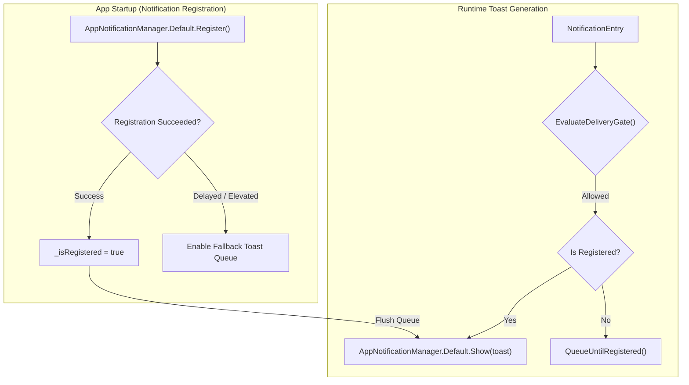
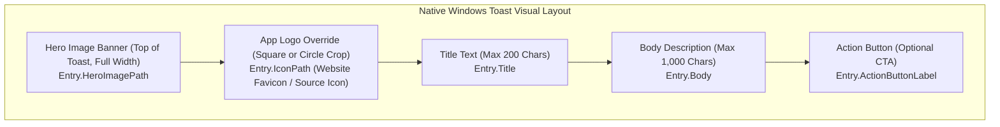
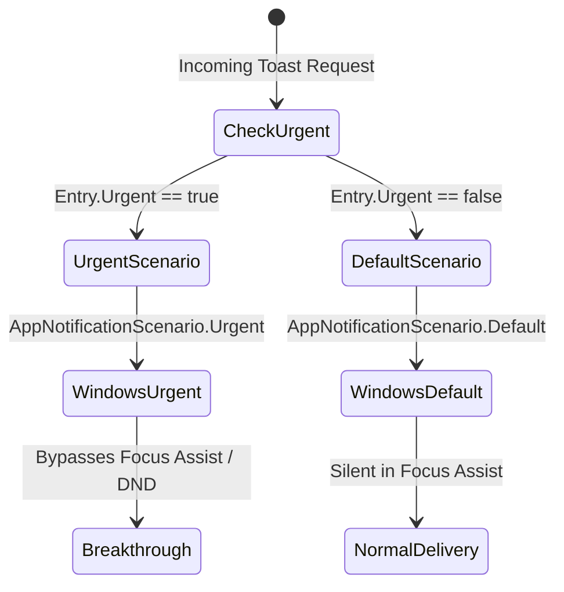
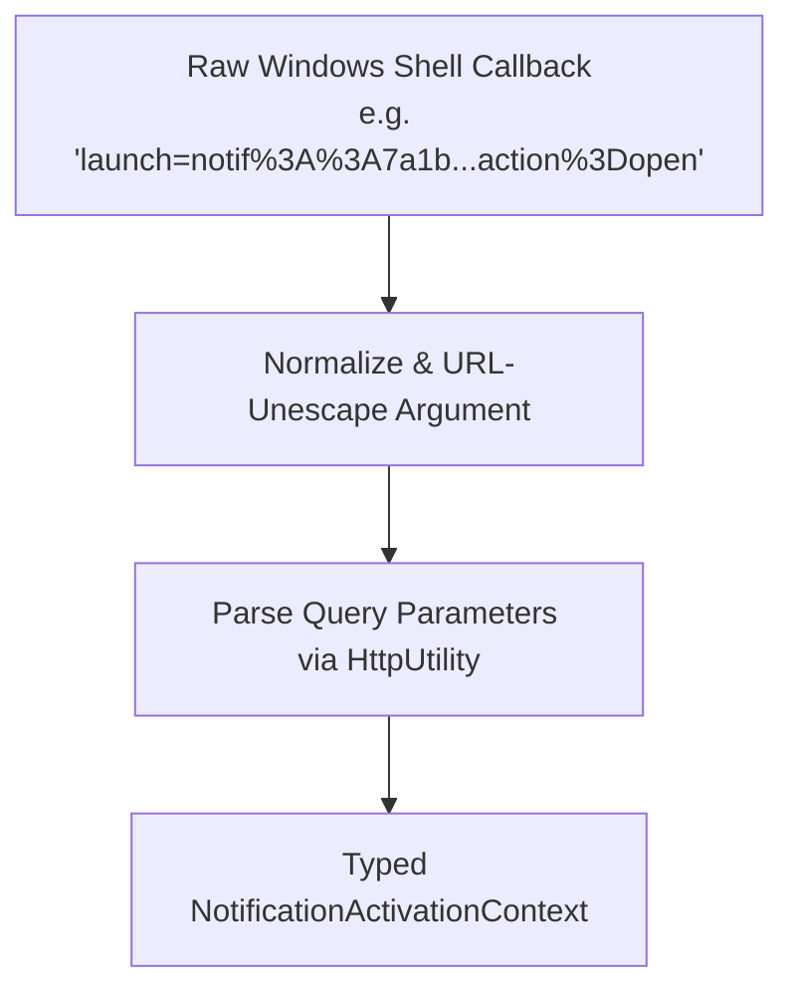

# Windows Toasts & Deep-Link Activation Router

This document details Nova AI Workspace's native operating system toast pipeline, Windows App SDK integration, toast layout templates, and multi-sandbox deep-link activation routing.

---

## 1. Windows App SDK Integration in Unpackaged WinUI 3

Nova AI Workspace is built as an **unpackaged WinUI 3 desktop application**. Unlike packaged MSIX applications—which have an implicit Windows Package Identity registered in the Appx repository—unpackaged desktop applications interact with the Windows Notification Platform using the Windows App SDK's `AppNotificationManager`:



### Challenges in Unpackaged Desktop Environments
1. **Shell Identity Registration:** Windows requires a registered App User Model ID (AUMID) and a COM notification activator CLSID in the Windows registry to associate toasts with `NovaAIWorkspace.exe`.
2. **Elevated Execution Boundaries:** When Nova is launched with administrator privileges, the Windows Shell suppresses certain standard user COM activation callbacks. Nova handles this by maintaining guaranteed persistence in the SQLite inbox regardless of OS toast delivery.
3. **Queue Until Registered:** If notifications arrive during cold boots before the Windows Notification Platform has completed registration handshake, Nova places the toast into an in-memory queue (`QueueUntilRegistered`) and flushes it immediately upon registration confirmation.

---

## 2. Toast Visual Layouts & Template Construction

Native Windows toasts are constructed using `Microsoft.Windows.AppNotifications.Builder.AppNotificationBuilder`. Nova configures rich visual elements depending on the notification source:



### Visual Components:
* **Hero Image (`HeroImagePath`):** A large 16:9 banner rendered at the top of the toast above the title. Nova background jobs use this for rich previews (such as screenshots captured by completed scheduled tasks).
* **App Logo Override (`IconPath`):** Replaces the default Nova browser icon in the toast corner with the originating website's favicon or a custom agent avatar.
* **Circle Logo Styling (`UseCircleAppLogo`):** Renders the logo in a circular contact-avatar crop rather than the standard square box.
* **Inline Action Button (`ActionButtonLabel`):** Adds a native Windows push button that triggers the primary activation action directly from the desktop banner.

---

## 3. Focus Assist Escalation & Urgent Priority

Windows Focus Assist (Do Not Disturb) silences non-critical application toasts during presentations, fullscreen gaming, or configured quiet hours. Routine notifications respect these quiet hours:



* **Standard Priority (`Urgent = false`):** Routine alerts (e.g. website notifications, download completions) use `AppNotificationScenario.Default`. When Focus Assist is active, they route silently to the Windows Action Center without popping a banner.
* **Urgent Priority (`Urgent = true`):** Critical alerts (e.g. failing autonomous workflows, security certificate invalidations) escalate to `AppNotificationScenario.Urgent`. Windows treats these as high-priority interruptions, forcing an immediate desktop banner popup.

---

## 4. Activation Argument Protocol & Serialization

When a user clicks a toast banner or action button, the Windows Shell invokes Nova's COM activation callback with an encoded launch argument:

```
notif::{notificationId}?action=open&source={source}&sandbox={sandbox}&origin={origin}&target={target}
```



### Serialized Properties:
| Parameter | Description | Example |
| :--- | :--- | :--- |
| `notificationId` | Unique GUID primary key in SQLite database. | `3c8d19a0e4...` |
| `action` | Requested interaction verb (`open`, `dismiss`). | `open` |
| `source` | Source enum identifier (`Website`, `Nova`, `Agent`). | `Website` |
| `sandbox` | Target sandbox partition ID (`A`, `B`, etc.). | `B` |
| `origin` | Target web origin URL. | `https://chat.com` |
| `target` | Originating tab identifier. | `tab-52f1` |

---

## 5. Multi-Sandbox Deep-Link Router

The activation router (`NotificationActivationRouter.RouteToPageAsync`) ensures that clicking a notification restores the exact visual and operational context without leaking state across isolated profiles:

```mermaid
flowchart TD
    Activation["Notification Activated"] --> CheckAction{"Action == 'open'?"}
    CheckAction -->|No (Dismiss)| Dismiss["Dismiss from Inbox"]
    CheckAction -->|Yes| TabSearch{"Is Target Tab Open?"}

    TabSearch -->|Tab Found| RestoreTab["1. Focus Window<br>2. Select Sandbox<br>3. Activate Tab Strip Item"]
    TabSearch -->|Tab Closed| SandboxResolve{"Target Sandbox Known?"}

    SandboxResolve -->|Yes (e.g. Sandbox B)| LaunchSandbox["Open New Tab in Sandbox B at Origin URL"]
    SandboxResolve -->|No| LaunchDefault["Open New Tab in Active Profile"]

    RestoreTab --> Callback["Dispatch ReportClicked to Page"]
    LaunchSandbox --> Callback
    LaunchDefault --> Callback
```

### Sandbox Profile Invariants:
1. **Zero Session Cross-Contamination:** A notification from an authenticated session in **Sandbox B** will **never** navigate or open inside **Sandbox A**.
2. **Tab Re-Focusing:** If the originating tab is still alive, Nova switches the active tab strip selection directly to it without reloading the document or discarding transient form inputs.
3. **Dead-Tab Recovery:** If the originating tab was closed prior to clicking the toast, Nova instantiates a fresh tab in the correct sandbox profile, targeting the saved `Origin` URL.

---

## Related Documentation

* **[Desktop Notifications Overview](../README.md)** — Master three-source topology and parity principles.
* **[Inbox Storage & Channel Worker Architecture](../inbox-and-storage/README.md)** — SQLite database schema and lock-free write queues.
* **[W3C Web Permissions & Lifecycle Handshake](../web-permissions-and-lifecycle/README.md)** — WebView2 interception and origin management.
