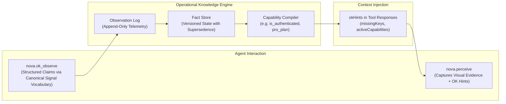

# Operational Knowledge (OK) & Real-Time Environment State

> [!NOTE]
> The Operational Knowledge (OK) system is the real-time dynamic semantic telemetry engine of Nova AI Workspace. While PKS stores durable, multi-session interaction playbooks, OK tracks the live, ephemeral state of every tab (authentication status, active account tier, selected AI model, available UI capabilities).

---

## 1. Problem Statement: The "Blind" Agent

When an AI agent navigates to a complex web application (e.g. ChatGPT, Claude, GitHub, Salesforce), it begins in a state of uncertainty:
* Is the tab authenticated or logged out?
* Which workspace or organization account is currently active?
* Is a Pro/Enterprise tier active, or is the user restricted to a Free tier?
* Which specific AI model or sandbox environment is selected?

Without structured state intelligence, the agent must perform expensive, token-heavy DOM parsing prior to every action—or fail blindly when attempting interactions that exceed account permissions.

Nova resolves this via the guiding principle: **"The agent perceives the page; the system aggregates the truth."**

---

## 2. Architecture of the OK Pipeline

---

## 3. Core Concepts & Data Flow

1. **Canonical Signal Vocabulary:**
   * Observations are submitted using typed semantic schemas (e.g. `auth.status = 'logged_in'`, `subscription.tier = 'plus'`, `ai.model = 'gpt-4o'`) rather than unconstrained natural language.
2. **Supersedence & Monotonic Versioning:**
   * Newer verified observations supersede older records deterministically. When an agent logs out, the logout observation instantly invalidates prior authenticated capabilities.
3. **Automatic Injection into `nova.perceive`:**
   * Invocations of `nova.perceive` automatically return known `okHints` alongside visual snapshots. The agent knows exactly which capabilities are active before making its first click.
4. **Integration with Domain Notes:**
   * In addition to ephemeral tab state, Nova manages persistent `nova.domain_note` entries that document global site quirks (e.g. custom scroll containers like `main#workspace` on LinkedIn) across all agent sessions.

---

## 4. MCP Tooling for OK & Domain Notes

| Tool | Purpose |
| :--- | :--- |
| `nova.ok_observe` | Submits structured observations about the live state of a tab to the OK engine. |
| `nova.ok_signal_schema` | Retrieves the canonical accepted signal schema vocabulary for supported services. |
| `nova.domain_note` | Stores or updates a domain-scoped operational note (with optional MUST-read enforcement). |
| `nova.domain_notes_list` | Lists all active notes and instructions registered for the current domain. |
| `nova.domain_note_ack` | Acknowledges a mandatory MUST-read note to satisfy pre-execution safety gates. |

---

## 5. Production Code References

* **OK Pipeline & Fact Repository:** `NovaBrowser/Core/Knowledge/OkRepository.cs`
* **MCP OK Observe Handler:** `NovaBrowser/Core/Mcp/McpOkObserveHandler.cs`
* **Domain Notes Store:** `NovaBrowser/Core/Knowledge/DomainNotesStore.cs`

---

## Related Documentation

* **[Phenomenological Knowledge Store (PKS)](pks.md)** — Long-term procedural UI memory and playbooks.
* **[Tool Observation Bus (TOB)](tob.md)** — Server-side evidence ledger and tamper-proof visit windows.
* **[Agent Awareness Gates (AAG)](aag.md)** — Pre-execution safety and multi-agent lease locking.
