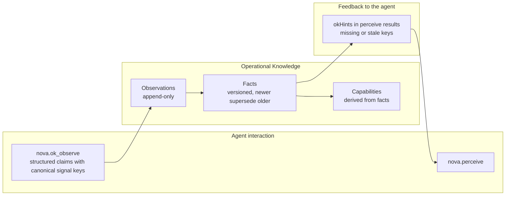

# Operational Knowledge (OK) & Real-Time Environment State

> [!NOTE]
> The Operational Knowledge (OK) system keeps a structured, versioned picture of the web services open in Nova's tabs: which service and account a tab is bound to, whether it is logged in, which plan and model are active. While PKS stores reusable interaction playbooks, OK tracks the current state of each target.

---

## 1. Problem Statement: The "Blind" Agent

When an AI agent opens a web application, it begins in a state of uncertainty:
* Is the tab logged in or logged out?
* Which account is active?
* Which plan is active?
* Which AI model is selected?

Without structured state knowledge, the agent has to work this out from the page before every action, or fails when an action exceeds what the account allows.

Nova's guiding principle here: **"The agent understands the page; the system aggregates the truth."**

---

## 2. Architecture of the OK Pipeline

---

## 3. Core Concepts & Data Flow

1. **Canonical Signal Vocabulary:**
   * Observations use fixed signal keys instead of free text, for example `core.login_state = "logged_in"`, `core.plan.tier = "pro"`, `core.model.active = "gpt-4o"`. `nova.ok_signal_schema` lists the accepted keys. Unknown `core.*` keys are rejected; platform-specific `vendor.*` keys are accepted without registration.
2. **Supersedence & Versioning:**
   * Facts are versioned. A newer observation of the same key supersedes the older fact instead of overwriting it silently, and observations themselves are never changed.
3. **Hints in `nova.perceive`:**
   * `nova.perceive` returns `okHints` that tell the agent which signal keys are missing or stale for the current page, so it knows what to report via `nova.ok_observe`.
4. **Integration with Domain Notes:**
   * Next to the tab state, Nova keeps persistent domain notes (`nova.domain_note`) that document site-specific instructions for all agent sessions. A note can be passive, show a warning on each call on that domain, or require acknowledgement before further calls (MUST-read).

---

## 4. MCP Tooling for OK & Domain Notes

| Tool | Purpose |
| :--- | :--- |
| `nova.ok_observe` | Pushes structured observations about the current page state of a tab. |
| `nova.ok_signal_schema` | Lists the canonical signal keys accepted by `nova.ok_observe`. |
| `nova.domain_note` | Stores or updates a domain note, with optional enforcement (`none`, `warn`, `block`/`must_read`). |
| `nova.domain_notes_list` | Lists the notes stored for a domain. |
| `nova.domain_note_ack` | Acknowledges a MUST-read note so tool calls on that domain can continue. |
| `nova.domain_note_delete` | Deletes a domain note. |

---

## 5. Under the Hood

* **Facts, Observations & Capabilities:** `OkRepository`
* **`nova.ok_observe` Handling:** `McpOkObserveHandler`
* **Domain Notes:** `DomainNotesStore`

---

## Related Documentation

* **[Phenomenological Knowledge Store (PKS)](pks.md)** — Long-term procedural UI memory and playbooks.
* **[Tool Observation Bus (TOB)](tob.md)** — Server-side record of executed tool calls.
* **[Agent Awareness Gates (AAG)](aag.md)** — Precondition gates and tab leases.
