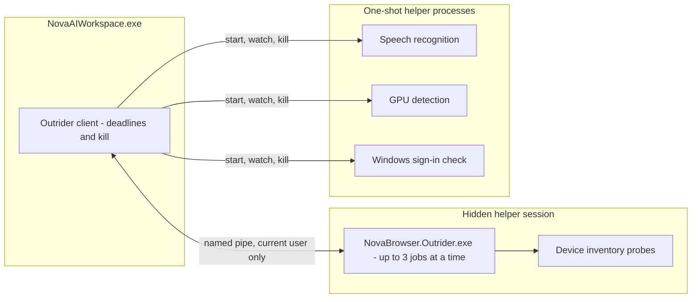

# Nova Outrider — Native Process Boundary

> [!NOTE]
> Nova Outrider (`NovaBrowser.Outrider.exe`) is a helper process that ships next to `NovaAIWorkspace.exe`. Nova runs risky native work in it — device enumeration through Windows drivers, GPU detection, speech recognition and the Windows sign-in check — so that a hanging or crashing driver or native library takes down the helper, not the browser.

---

## 1. Problem Statement: Native Code in the Browser Process

Some features need to call into Windows and third-party native code:
* Listing cameras, microphones and speakers (DirectShow and Windows device APIs).
* Detecting whether the GPU can run local speech recognition.
* Running speech recognition (whisper.cpp) on an audio file.
* Showing the Windows credential prompt before saved passwords are revealed or exported.

Native code can hang or crash in ways .NET cannot catch — a faulty virtual camera driver, an unsupported CPU instruction set or a corrupt model file. In the browser process, such a failure would close every tab and stop every running agent workflow.

---

## 2. Two Ways Nova Uses Outrider

* **Helper session (device inventory):** Started on first use as a hidden child process. Nova creates the named pipe, the helper connects to it, and the two exchange length-prefixed JSON messages. One session serves all device-inventory requests of a Nova process.
* **One-shot processes:** Speech recognition, GPU detection and the Windows sign-in check each run in a fresh helper process that does exactly one job and exits. Nova owns the deadline and kills the process if it is exceeded. The sign-in check runs this way because the Windows credential prompt crashed the long-lived helper on some Windows 11 setups.

---

## 3. Transport & Safety Rules

1. **Pipe restricted to the current user:** Nova creates the pipe with a random name (`nova-outrider-<pid>-<guid>`) and restricts it to the current Windows user. The helper receives the pipe name, a random session token and Nova's process ID on its command line.
2. **Helper identity check:** When the helper connects, Nova checks that the process on the other end of the pipe is the helper it just started, and the helper must answer the handshake with the expected token and capabilities. Otherwise the connection is dropped.
3. **Bounded work:**
   * Messages larger than 1 MB are rejected on both sides.
   * At most 3 jobs run at a time, enforced in Nova and in the helper.
   * Every job in the helper session carries a deadline between 1 ms and 60,000 ms; the helper rejects jobs without a valid deadline. One-shot processes get their own deadline from Nova.
4. **Timeouts:** A job that misses Nova's deadline fails on its own with an empty result and the reason `timeout`; other jobs keep running. After 3 timeouts in a row, Nova ends the helper session (killing the helper's process tree) and returns degraded results for 10 seconds before starting a fresh helper on the next request.
5. **Parent watch:** The helper checks once per second whether Nova is still running and stops when it is not, so no orphaned helper remains.
6. **No retry in the browser process:** If the helper times out or crashes, Nova returns a degraded result (for example an empty device list with a warning) instead of retrying the same probe in its own process.
7. **No decisions in the helper:** Outrider has no app UI, no WebView2, no settings and makes no permission or trust decisions. It only reports what it found; Nova decides what to do with it.

---

## 4. Features Backed by Outrider

| Feature | Where it shows up |
| :--- | :--- |
| Camera, microphone and speaker inventory | Device lists in Settings, the site permission prompt and site info, `nova.permission_center_get` |
| Speech recognition | Transcription window, `nova.media_transcribe_start` |
| GPU detection for speech recognition | Transcription settings |
| Windows credential prompt | Revealing or exporting saved passwords, when Windows Hello is not available |

---

## Related Documentation

* **[Agent Awareness Gates (AAG)](aag.md)** — Pre-execution safety and multi-agent concurrency.
* **[Media Intelligence & Speech Transcription](media-intelligence.md)** — Local transcription and media features.
* **[Native Dialogs & UI Prompts](native-dialogs-and-prompts.md)** — Handling dialogs outside the page.
