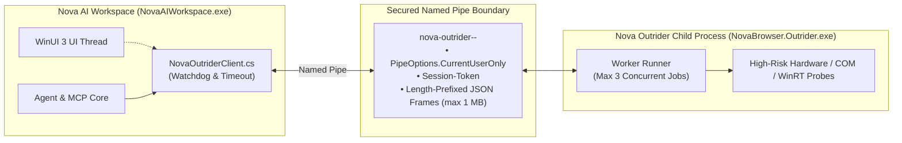

# Nova Outrider — Native Process Boundary & Hardware Resilience

> [!NOTE]
> Nova Outrider (`NovaBrowser.Outrider.exe`) is the canonical external helper process for high-risk native Windows, hardware, and driver operations. It protects the main browser process and WebView2 runtimes from unpredictable driver hangs, COM deadlocks, and native crashes.

---

## 1. Problem Statement: Native Drivers & Host Process Crashes

Web browsers and AI agents frequently need to interact with physical hardware and operating system APIs:
* Enumeration of webcams, microphones, and audio drivers.
* Streaming audio/video capture and hardware diagnostics.
* Native Win32 dialog inspection and COM/WinRT object querying.

**The Danger:** Third-party drivers (such as virtual webcams, audio processing filters, or GPU hooks) can crash in unmanaged C/C++ code or trigger unrecoverable deadlocks. When executed within the main process, a single faulty driver takes down the entire WinUI host window and all active agent workflows with it.

---

## 2. Architecture of the Outrider Process Boundary

---

## 3. Security & Transport Guarantees

1. **Lazy & Isolated:**
   * The Outrider process is started lazily upon first hardware request. It runs as a hidden child process scoped to the parent PID, never as a persistent Windows service.
2. **Strict Access Control (`CurrentUserOnly`):**
   * The Named Pipe uses a parent-generated, cryptographically random pipe name bound to the parent PID.
   * `PipeOptions.CurrentUserOnly` prevents cross-user access on shared multi-user workstations.
   * The Outrider server strictly verifies the real client PID before accepting frames.
3. **Hard Timeouts & Process-Tree Watchdog:**
   * The worker enforces a strict per-job deadline between `1..60000 ms`.
   * The parent client maintains a timeout watchdog. If Outrider becomes unresponsive, Nova kills the entire child process tree and relaunches it cleanly upon the next call.
4. **Graceful Degradation (Fail-Closed):**
   * If a native hardware probe hangs or crashes in Outrider, Nova remains undamaged. The call returns a safe, degraded result (e.g. `devices: []` with a warning code) to the agent rather than retrying the dangerous path in-process.
5. **Clear Separation of Concerns:**
   * Outrider makes **zero** permission, trust, or UI decisions. Nova retains exclusive ownership of WebView2 sessions, origin permissions, and security policies.

---

## 4. MCP Tools Backed by Outrider

| Tool | Purpose |
| :--- | :--- |
| `nova.hardware_diagnostics_start` / `stop` / `state` | Initiates and monitors hardware diagnostic loops for cameras and audio devices. |
| `nova.media_permissions_list` / `set` / `clear` | Manages and audits camera and microphone permissions per web origin. |
| `nova.media_activity_status` / `audit` | Monitors active audio, video, and screen-sharing tracks system-wide. |
| `nova.media_device_preferences_list` | Enumerates physically connected recording hardware without crash risk. |

---

## 5. Production Code References

* **Parent Host Client & Watchdog:** `NovaBrowser/Core/Runtime/NovaOutriderClient.cs`
* **Worker Project:** `NovaBrowser.Outrider/`
* **Release Contract:** `build.ps1` publishes `NovaBrowser.Outrider.exe` alongside `NovaAIWorkspace.exe` directly into `dist/`.

---

## Related Documentation

* **[Agent Awareness Gates (AAG)](aag.md)** — Pre-execution safety and multi-agent concurrency.
* **[Media Intelligence & Speech Transcription](media-intelligence.md)** — On-device Whisper transcription and WebAudio hooks.
* **[Native Dialogs & UI Prompts](native-dialogs-and-prompts.md)** — Asynchronous Win32 dialog inspection.
