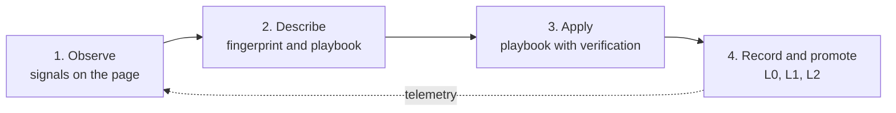

# Phenomenological Knowledge Store (PKS) & Continuous Learning Engine

> [!NOTE]
> PKS is the procedural long-term memory of Nova AI Workspace. It stores what Nova has learned about recurring UI phenomena on a website (cookie banners, modals, login walls and similar) together with a playbook for handling them, and keeps that knowledge across agent sessions. Knowledge that stops working is demoted and eventually switched off.

---

## 1. Problem Statement & Motivation

Autonomous agents browsing the web encounter two fundamental hurdles:
1. **Token Overhead:** On every page, the agent must again capture screenshots, parse large DOM trees, and work out how to deal with cookie consent walls, login prompts, or navigation drawers.
2. **Fragile Selectors & Layout Drift:** Modern websites frequently rotate CSS class hashes. An agent that relies on a single brittle selector fails on the next visit or triggers unintended side effects.

**PKS** addresses this by storing websites not as static HTML trees, but as **sets of observed phenomena**: a recognition fingerprint, a playbook, and a health record per phenomenon. An interaction that has been executed and verified can be stored as a durable, versioned playbook.

---

## 2. The Learning Cycle



1. **Observe:** Signals from the DOM, visible text, layout and vendor markers are collected.
2. **Describe:** A phenomenon is described by a fingerprint (how to recognize it) and a playbook (what to do, and how to verify it worked).
3. **Apply:** On later visits, `nova.pks_match` ranks known phenomena against the live signals, and `nova.phenomenon_apply` runs the stored playbook step by step.
4. **Record & Promote:** Every outcome is recorded. Phenomena move through learning levels only when the evidence gates below are met.

---

## 3. The Learning Levels

To keep unproven assumptions out of active memory, PKS uses three learning levels:

| Level | Designation | Status | System Behavior |
| :---: | :--- | :--- | :--- |
| **L0** | *Candidate* | Freshly observed pattern | Lives in the Learning Candidate Journal (LCJ), not yet in PKS; collects evidence. |
| **L1** | *Shadow* | Stored, not yet active | Stored in PKS (manual `nova.pks_upsert` writes start here) but not returned by `nova.pks_match`. |
| **L2** | *Active* | Active knowledge | Returned by `nova.pks_match` and usable by agents. |

Transitions are evaluated by `nova.learn_promote` (with `dryRun` to only inspect the gates). While an agent works on a site, Nova also runs the same evaluation in the background, at most once every 30 minutes per site:

* **L1 → L2:** at least 3 successful applications in the current 30-day window, from at least 2 distinct sessions, at most 1 failure, and no drift in the last 7 days. Cookie-consent phenomena (`consent_cmp`) need 5 successes from 3 sessions and no failure.
* **Demotion L2 → L1:** 2 consecutive failures, or hard drift within the last 24 hours.
* **Deprecation:** 3 consecutive failures for an L1 phenomenon, 5 for an L2 phenomenon.

`nova.explain` shows for a single phenomenon which gate passes or fails and why.

---

## 4. Data Architecture & Storage

PKS persists knowledge locally in the SQLite database `pks.db` in Nova's profile folder (`%LOCALAPPDATA%\nova-cognitive\Nova\`; installations from before the folder change keep using `%LOCALAPPDATA%\NovaBrowser\`). The core PKS tables:

```
pks.db
  ├── pks_domain             # one entry per site scope, with a trust level
  ├── pks_phenomenon         # fingerprint, playbook, health and learning level per phenomenon
  ├── pks_domain_hint        # declarative hints (ad containers, noise regions, result items)
  ├── pks_platform           # cross-site platform templates (consent vendors)
  ├── pks_platform_pattern   # the template patterns of a platform
  └── pks_platform_alias     # markers used to recognize a platform
```

Execution outcomes are not kept in a separate table: each phenomenon carries its own health record (success rate over 30 days, consecutive failures, staleness, total attempts).

Preinstalled platform templates cover the consent vendors OneTrust, Cookiebot, Quantcast Choice, Didomi, Usercentrics, iubenda and Sourcepoint.

### Anatomy of a Phenomenon Entry
* **Fingerprint:** Signals of the kinds `dom` (selectors), `text` (visible label text, optionally per locale), `vendor` (framework and consent-vendor markers), `layout` (position and size hints) and `interaction`, plus a minimum confidence.
* **Playbook:** A sequence of actions (`click`, `type`, `press_key`, `wait`, `dismiss`). `click` and `type` actions may carry up to 5 `fallbackSelectors` for the same element.
* **Verify:** Post-execution checks (`click`, `wait`, `absent`, `obstruction_cleared`, `scroll_unlocked`, `topmost_clickability_restored`). Verify steps never use fallback selectors.

---

## 5. Polarity Invariants & Anti-Hijacking Rules

For cookie-consent phenomena (`consent_cmp`), `nova.pks_upsert` rejects entries that break any of these rules:
1. Every mutating action (`click`, `type`, `press_key`) must declare `declaredPolarity` (`reject`, `accept`, `manage`, `navigate`, `noop`).
2. Wildcard selectors (universal `*`, substring matches such as `[class*=...]` or `[id*=...]`) are not accepted; use an exact id, class, or attribute-equals selector.
3. The declared polarity must match the visible text of the target (an "Accept all" button cannot be registered with polarity `reject`).
4. If the action calls a vendor consent API, the polarity that call implies must match the declared polarity.

---

## 6. Primary MCP Tools for PKS

| Tool | Purpose |
| :--- | :--- |
| `nova.pks_get` | Retrieves the stored phenomena of a site (`outputDetail='summary'` or `'full'`). |
| `nova.pks_upsert` | Stores or updates a phenomenon with fingerprint, playbook, and verification steps. |
| `nova.pks_match` | Ranks active phenomena against observed signals and returns the best matches. |
| `nova.phenomenon_apply` | Runs a stored playbook on the page and reports the outcome automatically. |
| `nova.pks_upsert_hint` | Registers declarative hints such as ad containers, noise regions, or repeated result items. |
| `nova.telemetry_report` | Records an outcome (`success`, `failure`, `not_applicable`) that updates the health record. |
| `nova.learn_promote` | Evaluates and applies learning-level transitions (L0 → L1 → L2, demotion, deprecation, revive). |

---

## 7. Under the Hood

* **Storage & Schema:** `PksDb` (one worker that serializes all database access)
* **Store & Public Facade:** `PksStore`
* **Repository & Queries:** `PksRepository`
* **Promotion Gates:** `PromotionService`

---

## Related Documentation

* **[Learning Pipeline (ALP)](learning-pipeline-alp.md)** — Turns journal observations into candidates and promotes them.
* **[Tool Observation Bus (TOB)](tob.md)** — Server-side evidence ledger and selector proofs.
* **[Closed-Loop System (CLS)](closed-loop-system.md)** — Verified state transitions and ambient auto-apply.
* **[Operational Knowledge (OK)](operational-knowledge.md)** — Live tab state and account capabilities.
