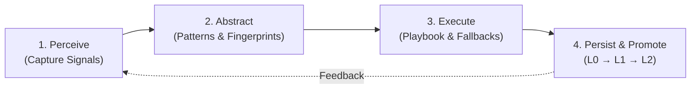

# Phenomenological Knowledge Store (PKS) & Continuous Learning Engine

> [!NOTE]
> PKS is the self-learning procedural long-term memory of Nova AI Workspace. It converts verified DOM observations and interaction sequences into persistent, self-healing fast-paths across agent sessions.

---

## 1. Problem Statement & Motivation

Autonomous agents browsing the web encounter two fundamental hurdles:
1. **Massive Token Overhead:** On every subpage, the agent must repeatedly capture screenshots, parse large DOM trees, and reason out how to interact with cookie consent walls, login prompts, or navigation drawers.
2. **Fragile Selectors & Layout Drift:** Modern websites frequently rotate CSS class hashes (e.g. React/SDUI architectures). An agent that relies on a single brittle selector fails on the next visit or triggers unintended side effects.

**PKS** solves this by storing websites not as static HTML trees, but as **sets of observed behavioral phenomena** (Phenomenological Knowledge). Whenever Nova executes and empirically verifies an interaction, it persists as a durable, versioned playbook.

---

## 2. The 4-Stage Cognition Loop



1. **Perceive:** Signals from the DOM, visible text labels, layout geometries, and vendor signatures are extracted.
2. **Abstract:** Nova isolates the intent of the action (e.g. "reject cookie consent banner" or "submit project form") and builds a multi-dimensional fingerprint.
3. **Execute:** On subsequent visits, `nova.pks_match` evaluates live signals and executes the proven playbook deterministically—without expensive LLM reasoning latency.
4. **Persist & Promote (Graduation Model):** Every phenomenon undergoes rigorous empirical gates before it is promoted to autonomous production execution.

---

## 3. The Graduation Model (Reifegrade)

To prevent hallucinations and false assumptions from contaminating production memory, PKS uses a 3-tier promotion hierarchy:

| Level | Designation | Operational Status | System Behavior |
| :---: | :--- | :--- | :--- |
| **L0** | *Candidate* | Freshly observed pattern | Logged in the `Lightweight Candidate Journal (LCJ)`; not eligible for autonomous execution. |
| **L1** | *Shadow Mode* | Statistical validation | Matched in the background against the live DOM on page loads; gathers hit rates, stability metrics, and telemetry. |
| **L2** | *Active Runtime* | Full autonomous fast-path | Active in production. Agents execute the playbook directly. If consecutive failures occur, it degrades back to L1 (`Auto-Deprecation`). |

Progression across tiers is managed by the MCP tool `nova.learn_promote` using mathematical evidence standards (e.g. at least 3 consecutive successful verifications within a 30-day window).

---

## 4. Data Architecture & Storage

PKS persists knowledge locally in a high-speed SQLite database (`pks.db`) located in `%LOCALAPPDATA%\NovaBrowser\`:

```
pks.db
  ├── pks_domain                # Scopes (e.g. 'linkedin.com', 'github.com', domain trust score)
  ├── pks_phenomenon            # Interactive playbooks (fingerprints, step sequences, verifications)
  ├── pks_domain_hint           # Declarative DOM filters (ad containers, noisy animated sections)
  ├── pks_platform_pattern      # Vendor templates (OneTrust, Cookiebot, Cloudflare Turnstile)
  └── pks_telemetry             # Historical records of executions, latencies, and misfires
```

### Anatomy of a Phenomenon Entry:
* **Fingerprint:** Multi-attribute signature combining `dom` (selectors), `text` (multilingual label tokens), `vendor` (framework and CMP markers), and `layout` (element geometry and bounding boxes).
* **Playbook:** Deterministic sequence of actions (`click`, `type`, `press_key`, `wait`) with up to 5 verified `fallbackSelectors`.
* **Verify:** Mandatory post-execution proof (`absent`, `wait`, `topmost_clickability_restored`, `scroll_unlocked`).

---

## 5. Polarity Invariants & Anti-Hijacking Rules

For high-consequence phenomena (such as cookie consent banners `consent_cmp`), Nova enforces four strict invariants:
1. Every mutating action must declare an explicit `declaredPolarity` (`reject`, `accept`, `manage`, `noop`).
2. Selectors must be precise; ambiguous wildcard patterns (e.g. `[class*='btn']`) are strictly forbidden.
3. The declared polarity must match the visible text label (e.g. an "Accept All" button cannot be registered with polarity `reject`).
4. The action polarity must align with any invoked vendor JavaScript consent APIs.

---

## 6. Primary MCP Tools for PKS

| Tool | Purpose |
| :--- | :--- |
| `nova.pks_get` | Retrieves stored phenomena and domain playbooks (`outputDetail='summary'` or `'full'`). |
| `nova.pks_upsert` | Stores or updates a verified phenomenon with fingerprint, playbook, and verification rules. |
| `nova.pks_match` | Matches live page elements against known fingerprints and returns ranked playbooks. |
| `nova.pks_upsert_hint` | Registers declarative noise or advertisement container selectors to prune before perception scans. |
| `nova.telemetry_report` | Records execution outcomes (`success`, `failure`, `not_applicable`) to adjust health scores. |
| `nova.learn_promote` | Evaluates promotion criteria (L0 $\rightarrow$ L1 $\rightarrow$ L2) and applies autonomous promotions. |

---

## 7. Production Code References

* **Storage & Schema:** `NovaBrowser/Core/Pks/PksDb.cs`
* **Store & Public Facades:** `NovaBrowser/Core/Pks/PksStore.cs`
* **Repository & Queries:** `NovaBrowser/Core/Pks/PksRepository.cs`
* **MCP Integration:** `NovaBrowser/Core/Mcp/McpServer.ArgumentParsingAndPksModes.cs`

---

## Related Documentation

* **[Learning Pipeline (ALP)](learning-pipeline-alp.md)** — Quality filter evaluating candidate observations.
* **[Tool Observation Bus (TOB)](tob.md)** — Evidence ledger and cryptographic selector proof generator.
* **[Closed-Loop System (CLS)](closed-loop-system.md)** — Autonomous background healing and fast-path execution.
* **[Operational Knowledge (OK)](operational-knowledge.md)** — Dynamic tab state and account capabilities.
