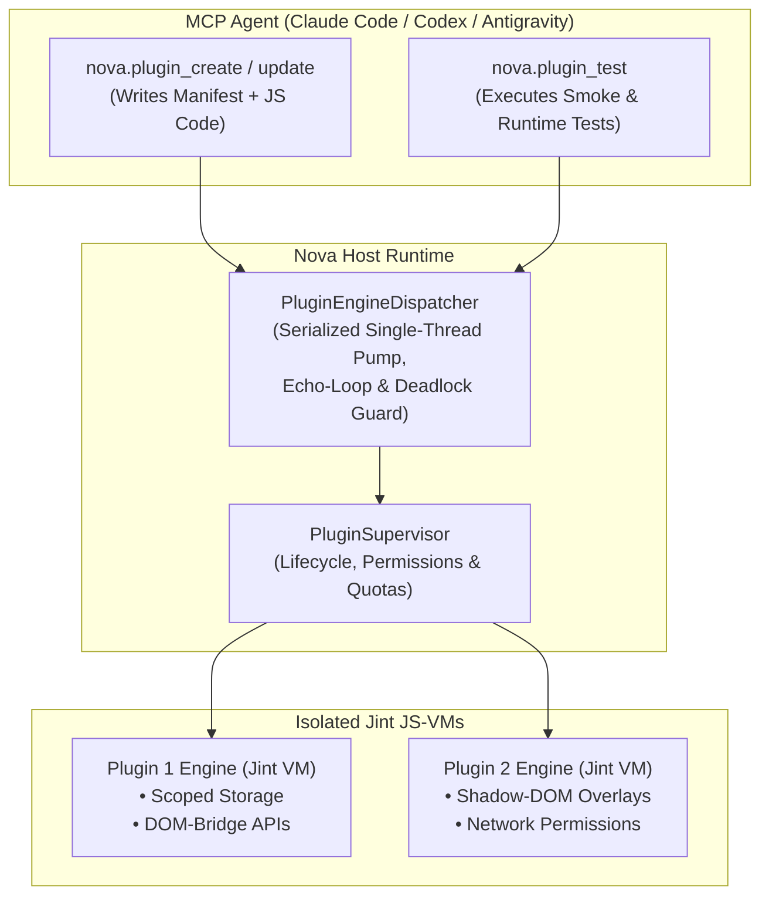

# Agent-Authored Plugins (AAP) & Dynamic Jint VM Runtime

> [!NOTE]
> Agent-Authored Plugins (AAP) allow AI agents to author, test, and run tailored browser extensions in JavaScript at runtime — without needing C# recompilation or browser restarts.

---

## 1. Problem Statement & Motivation

Traditional browser extensions require manual installation, store reviews, and pre-packaged static code. When an AI agent automates complex sites (e.g., custom table data extraction, interactive user confirmation overlays, or continuous DOM monitoring), raw remote scripting via `eval` has inherent limitations:
* `eval` lacks persistent state and isolated storage.
* Repeated remote polling across network channels wastes tokens and increases latency.
* Pre-installed extensions cannot be customized on-the-fly by an agent for novel websites.

**AAP** grants agents the capability: *"The agent writes the tool, while the user maintains complete control."*

---

## 2. Architecture & Jint JS-VM

---

## 3. Security & Runtime Guarantees

1. **Complete VM Isolation (Jint):**
   * Each plugin executes inside an isolated Jint JavaScript Virtual Machine.
   * Plugins cannot access host file systems, native Windows APIs, or memory of other running plugins.
2. **Serialized `PluginEngineDispatcher`:**
   * All JavaScript engine calls are routed through a dedicated single-threaded dispatcher pump.
   * Eliminates deadlocks between the WinUI 3 UI thread and JavaScript runtimes.
   * Built-in call-depth guards prevent cascading echo loops during event relaying.
3. **Explicit Capability Permissions:**
   * Plugins initialize with zero privileges.
   * Host capabilities (`activeTab`, DOM manipulation, MCP tool exposition) must be explicitly declared in the manifest or granted by the operator (`nova.plugin_request_permission`).
4. **Shadow-DOM UI Isolation:**
   * Plugins can render custom UI overlays into web pages wrapped in closed Shadow Roots, ensuring page styles or scripts cannot interfere with or inspect agent UI elements.

---

## 4. MCP Tool Reference for AAP

| Tool | Purpose |
| :--- | :--- |
| `nova.plugin_create` | Creates a new plugin with manifest, script files, and optional deferred activation. |
| `nova.plugin_inspect` | Inspects active plugin sessions, frame targets, granted permissions, and storage keys. |
| `nova.plugin_test` | Runs smoke tests and validation passes in test mode before live activation. |
| `nova.plugin_update` | Updates the manifest or script code of an existing plugin seamlessly without restarts. |
| `nova.plugin_request_permission` | Requests additional host pattern matches, network access, or MCP tool exposure. |
| `nova.plugin_enable` / `disable` | Toggles plugin execution on or off. |

---

## 5. Under the Hood

* **MCP Plugin Handler:** `McpPluginHandler`
* **Plugin Testing & Smoke:** `McpPluginHandler`
* **Plugin Runtime & Engine:** `Plugins` subsystem
