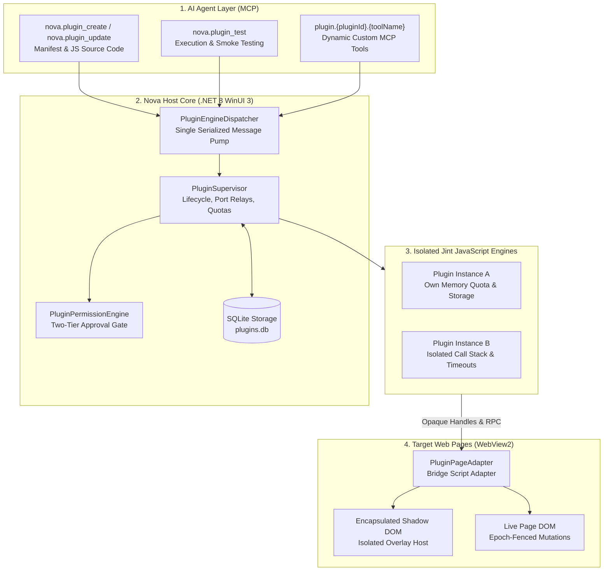
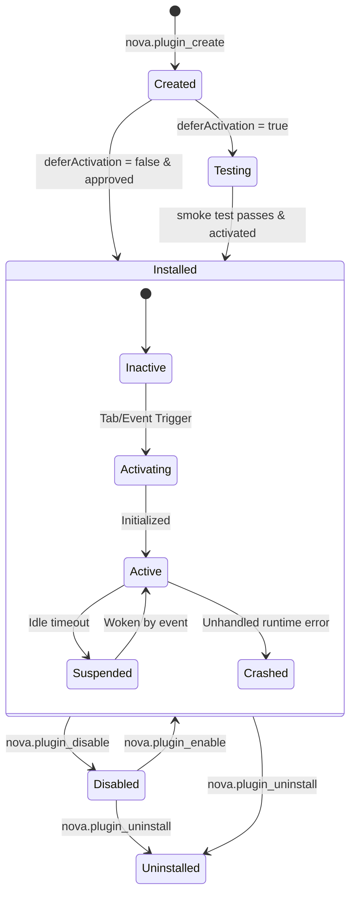
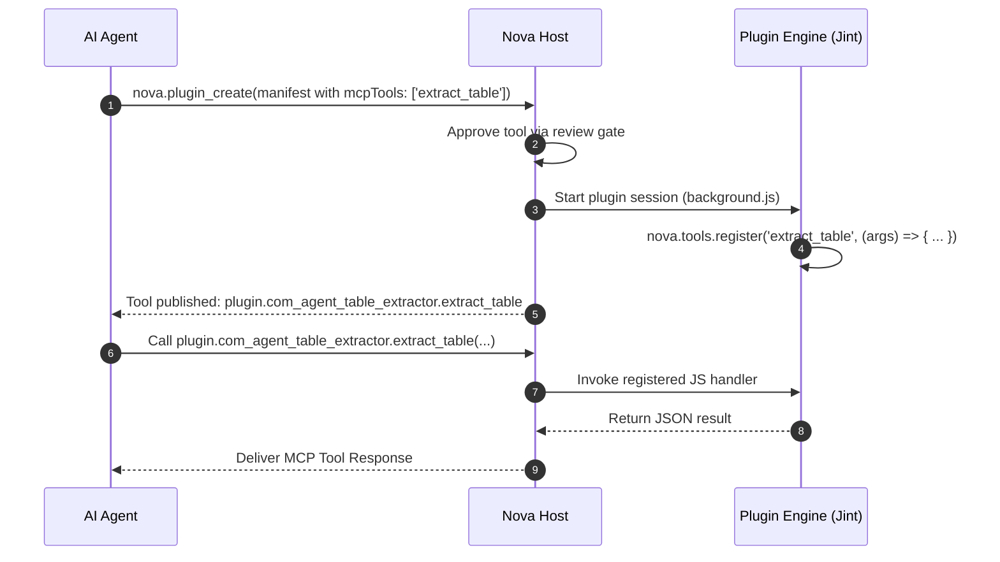

# Agent-Authored Plugins (AAP) & Jint JavaScript Runtime

> [!WARNING]
> **Unavailable during the public alpha.** The plugin subsystem is currently disabled in Nova AI Workspace and cannot be activated via settings. This document describes the complete architecture, execution sandbox, and tool specifications for technical reference and developer preview. See [Alpha status and limitations](../../../ALPHA.md).

> [!NOTE]
> The **Agent-Authored Plugins (AAP)** architecture allows AI agents to write, test, hot-reload, and execute browser extensions in JavaScript at runtime—without recompiling Nova or restarting the application. Every plugin executes in its own isolated **Jint JavaScript engine** inside Nova's host process, interacting with target web pages exclusively through permission-checked bridge APIs and open Shadow DOM overlay hosts.

---

## 1. Problem Statement & Motivation

Traditional browser extensions (e.g., Chrome Extensions / Manifest V3) require manual installation from Web Stores, pre-packaged static assets, and extensive developer packaging workflows. Conversely, when an autonomous AI agent automates complex enterprise portals, single-page applications, or data extraction workflows, relying solely on raw remote script evaluation (`eval`) exhibits severe operational bottlenecks:

1. **Statelessness & Polling Overhead:** Raw `eval` execution maintains no persistent local storage, background event listeners, or cross-tab message brokers, forcing agents to burn excessive context tokens in repetitive polling loops.
2. **Brittle Timing & DOM Race Conditions:** Remote commands struggle to handle micro-animations, single-page application routing shifts, or dynamic DOM hydration occurring between distinct network round-trips.
3. **Security Vulnerabilities of Direct Page Injection:** Injecting unrestricted scripts into the page's execution context risks contaminating page variables, triggering defensive Anti-Bot/CSP barriers, or exposing agent credentials to malicious page scripts.

**AAP solves this with a clear design philosophy:**
> *The AI agent authors the tool, but the human user retains total runtime sovereignty.*

Plugins run in a host-controlled .NET sandbox, declare explicit permissions, render visual elements into isolated Shadow DOM containers, and expose custom Model Context Protocol (MCP) tools dynamically back to the agent.

---

## 2. High-Level Architecture & Process Topology

The AAP subsystem bridges the AI Agent layer, the Nova Host process, and the WebView2 browser processes:



---

## 3. The Jint JavaScript Execution Engine

Each installed plugin executes inside an isolated instance of **Jint**—an embeddable, fully managed EcmaScript engine running directly in .NET:

### Sandbox Isolation Guarantees
1. **Zero Ambient Host Access:** The JavaScript environment has no access to Node.js APIs, .NET reflection, native operating system libraries, or filesystem operations.
2. **No Direct Page DOM Access:** The plugin runtime does not have direct access to `window`, `document`, or `navigator` of the webpage. All interactions occur across host-mediated bridge channels using opaque tokens.
3. **Deterministic Resource Budgets:**
   * **Memory Quotas:** Configurable per-plugin memory allocation (default: 32 MB). Exceeding the quota triggers a soft heap warning and terminates greedy execution loops.
   * **Wall-Clock Invocation Limits:** Every execution slice has a strict execution timeout (default: 5,000 ms), preventing infinite loops (`while(true)`) from stalling the host.
   * **Recursion Stack Depth:** A hard maximum recursion depth of 256 frames prevents call stack overflow crashes.

### Two-Phase Lifecycle State Machine
Nova separates plugin deployment state on disk from runtime execution state in memory:



* **`PluginInstallState` (Disk & Database):**
  * `Created`: Manifest registered in `plugins.db`.
  * `Testing`: Staged for isolated testing; content scripts do not execute on live user pages.
  * `Installed`: Fully installed and eligible for activation.
  * `Disabled`: Kept on disk, but disabled by the user or agent.
  * `Uninstalled`: Marked for deletion; files and databases scrubbed.
* **`PluginRuntimeState` (In-Memory Session):**
  * `Inactive` $\rightarrow$ `Activating` $\rightarrow$ `Active` $\rightarrow$ `Suspended` $\rightarrow$ `Crashed`.

---

## 4. The Serialized Engine Dispatcher Pump

A primary challenge in desktop browser automation is synchronizing the multi-threaded WinUI 3 UI thread, the asynchronous Chromium/WebView2 IPC pipeline, and multiple synchronous JavaScript execution sandboxes.

Nova implements the **`PluginEngineDispatcher`**—a dedicated, serialized execution pump:

* **Single-Threaded Serialization:** All plugin engine state modifications, script evaluations, event dispatches, and bridge calls pass through a single serialized work queue.
* **Deadlock Prevention:** The UI thread and WebView2 event loops never block synchronously waiting for a JavaScript engine. Asynchronous tasks post work items to the dispatcher and await completion tokens.
* **Re-entrancy & Depth Guards:** Cascading event loops (e.g., a plugin mutation triggering a DOM observer which dispatches back to the plugin) are bounded by strict recursion depth counters (max depth: 16), aborting runaway message storms before they degrade responsiveness.

---

## 5. AAP Manifest Specification (`manifest.json`)

Plugins are defined by an immutable manifest adhering to the AAP Schema v1:

```json
{
  "manifestVersion": 1,
  "id": "com.agent.table-extractor",
  "version": "1.0.0",
  "name": "Intelligent Table Extractor",
  "description": "Extracts pagination tables and presents interactive preview overlays.",
  "entryPoint": "background.js",
  "createdBy": {
    "agentClient": "claude-code",
    "model": "claude-3-7-sonnet",
    "timestampUtc": "2026-10-10T14:30:00Z"
  },
  "requestedPermissions": [
    "DomRead",
    "OverlayWrite",
    "StorageReadWrite",
    "BadgeWrite"
  ],
  "hostPermissions": {
    "matches": ["*://*.example.com/*", "*://internal-portal.corp/*"]
  },
  "lifecycle": {
    "memoryLimitMb": 32,
    "invocationTimeoutMs": 5000,
    "keepAliveMode": "ActiveTabOnly"
  },
  "storage": {
    "quotaBytes": 5242880
  },
  "contentScripts": [
    {
      "entryPoint": "content.js",
      "matches": ["*://*.example.com/reports/*"],
      "runAt": "DocumentIdle",
      "allFrames": false
    }
  ],
  "mcpTools": [
    {
      "name": "extract_table",
      "description": "Extracts tabular data from the active report page.",
      "inputSchema": {
        "type": "object",
        "properties": {
          "tableSelector": { "type": "string" },
          "maxRows": { "type": "integer" }
        },
        "required": ["tableSelector"]
      }
    }
  ]
}
```

### The Two-Tier Permission Model
Permissions are divided into two distinct security tiers:

| Permission | Tier | Description |
| :--- | :--- | :--- |
| **`StorageReadWrite`** | **Auto-Grant** | Read and write the plugin's own isolated SQLite storage partition. |
| **`BadgeWrite`** | **Auto-Grant** | Update the numeric or visual badge counter on the browser toolbar. |
| **`DomRead`** | **Install-Review** | Query DOM elements, compute styles, and read text nodes on matched hosts. |
| **`OverlayWrite`** | **Install-Review** | Render and mutate HTML/CSS elements inside the isolated Shadow DOM overlay. |
| **`MutationClassWrite`** | **Install-Review** | Add or remove CSS class names on target page DOM elements. |
| **`MutationStyleWrite`** | **Install-Review** | Modify inline CSS styles on target page DOM elements. |
| **`NetworkFetch`** | **Install-Review** | Dispatch HTTP/HTTPS network requests conforming to `hostPermissions`. |
| **`NotifySend`** | **Install-Review** | Dispatch desktop toasts via Nova's Notification Subsystem. |
| **`FrameMatchedSubframes`** | **Install-Review** | Execute content scripts inside matching `<iframe>` elements. |
| **`RequestFilter`** | **Install-Review** | Intercept, block, or modify outgoing web network requests. |

**Auto-Grant** permissions are enabled immediately upon installation. All **Install-Review** capabilities remain disabled until approved by the user via the Permission Review dialog ([`nova.plugin_request_permission`](../../mcp-reference/tools/plugins/nova-plugin-request-permission.md)) or granted temporarily for a session via [`nova.plugin_grant_active_tab`](../../mcp-reference/tools/plugins/nova-plugin-grant-active-tab.md).

---

## 6. Bridge APIs & DOM Virtualization

Inside the Jint sandbox, plugins interact with the world via the global `nova.*` namespace:

### 1. DOM Traversal via Opaque Element Handles
Plugins never receive raw DOM references. Instead, querying elements returns an immutable **`ElementHandle`**:

```javascript
// Inside content.js
const handle = await nova.dom.querySelector("table.financial-summary");
if (handle) {
  const text = await nova.dom.getInnerText(handle);
  const rect = await nova.dom.getBoundingRect(handle);
}
```

An `ElementHandle` consists of `(HandleId, FrameId, DocumentEpoch)`. If the user or agent navigates to a new page, the handle is automatically invalidated by the host.

### 2. Epoch Fences & Consistency Guards
To eliminate race conditions where a slow plugin bridge call mutates a newly loaded page, every bridge request includes an **`EpochFence`**:
* `NavigationId`: Monotonically increasing browser tab navigation counter.
* `DocumentEpoch`: Increments whenever the root document changes.
* `RouteEpoch`: Increments upon Single-Page Application (SPA) client-side history navigation (`pushState`, `hashchange`).
* `Consistency`:
  * `DocumentOnly`: Tolerates in-page route changes (standard for idempotent reads).
  * `DocumentAndRoute`: Enforces strict consistency (required for all DOM modifications).

If a fence mismatch is detected, the host rejects the bridge call with `epoch_stale`, protecting new pages from unintended mutations.

### 3. Reversible Mutation Ledger
All class and style mutations executed via `nova.mutation.*` are recorded in an in-memory and database-backed **`PluginMutationLedger`**:
* Every mutation stores both its applied value and its exact inverse (`ValueJson`, `InverseJson`).
* If a plugin is disabled, uninstalled, or encounters a crash, Nova executes atomic rollbacks using [`nova.plugin_css_reset`](../../mcp-reference/tools/plugins/nova-plugin-css-reset.md) and [`nova.plugin_inject_reset`](../../mcp-reference/tools/plugins/nova-plugin-inject-reset.md), restoring the page DOM to its pristine initial state.

---

## 7. Shadow DOM UI Overlay Isolation

When plugins render interactive UI (status badges, extraction progress bars, confirmation modals), overlays are injected into a dedicated **Open Shadow DOM** container:

```mermaid
flowchart LR
    subgraph WebPage["Host Web Page Context"]
        HostElement["<div id='nova-plugin-host-...'>"]
        ShadowRoot["#shadow-root (open)"]
        PluginUI["<div class='plugin-panel'>...</div>"]
        PageCSS["Page Stylesheets (Bootstrap, Tailwind, etc.)"]

        HostElement --> ShadowRoot
        ShadowRoot --> PluginUI
        PageCSS -.x|Styles Blocked| PluginUI
    end
```

### Security & Style Guarantees
1. **Style Encapsulation:** Page CSS cannot alter, break, or hide plugin overlay controls. Similarly, plugin styles cannot leak into or deform the surrounding webpage layout.
2. **Keylogger Defense:** Keystrokes typed into plugin overlay input fields are handled by isolated shadow event listeners and are not exposed to page-level JavaScript keydown listeners.

---

## 8. Dynamic MCP Tool Export

One of the most powerful features of AAP is the ability for an agent to author a plugin that exposes **brand-new MCP tools** back to itself or other agents:



* Up to 10 custom tools can be exported per plugin.
* Tools are automatically namespaced as `plugin.{pluginId}.{toolName}`.
* Tool handlers must be registered in JavaScript via `nova.tools.register(name, handler)` before invocation.

---

## 9. Rollout, Testing & Rollback Lifecycles

To prevent untested code from disrupting live workflows, Nova provides end-to-end staging:

1. **Staged Creation (`deferActivation = true`):** The plugin installs into the `Testing` state. It will not attach content scripts to open browser tabs.
2. **Isolated Smoke Testing ([`nova.plugin_test`](../../mcp-reference/tools/plugins/nova-plugin-test.md)):**
   * Agents can execute isolated test scripts (`mode = 'execute'`) or full automated smoke tests (`mode = 'smoke'`).
   * With `activateAfterPass = true`, the plugin transitions automatically to `Installed` upon successful test verification.
3. **Version History & Atomic Rollback:**
   * Every call to [`nova.plugin_update`](../../mcp-reference/tools/plugins/nova-plugin-update.md) archives the previous source code and manifest into `plugins.db`.
   * Agents can inspect historical code using [`nova.plugin_get_version_code`](../../mcp-reference/tools/plugins/nova-plugin-get-version-code.md) and execute atomic restorations with [`nova.plugin_rollback`](../../mcp-reference/tools/plugins/nova-plugin-rollback.md).
4. **Portability (`.novaplugin` Bundles):**
   * Plugins can be exported to and imported from standard ZIP archives via [`nova.plugin_export`](../../mcp-reference/tools/plugins/nova-plugin-export.md) and [`nova.plugin_import`](../../mcp-reference/tools/plugins/nova-plugin-import.md).

---

## 10. Complete MCP Tool Inventory (22 Tools)

All plugin management and diagnostic operations are grouped within the `plugin_management` capability bundle:

| Tool | Category | What it does |
| :--- | :--- | :--- |
| **[`nova.plugin_create`](../../mcp-reference/tools/plugins/nova-plugin-create.md)** | Authoring | Installs a new plugin from a manifest and JavaScript files. |
| **[`nova.plugin_update`](../../mcp-reference/tools/plugins/nova-plugin-update.md)** | Authoring | Updates code, content scripts, or manifest properties. |
| **[`nova.plugin_test`](../../mcp-reference/tools/plugins/nova-plugin-test.md)** | Testing | Executes test scripts or performs an isolated smoke test. |
| **[`nova.plugin_enable`](../../mcp-reference/tools/plugins/nova-plugin-enable.md)** | Lifecycle | Activates an installed plugin. |
| **[`nova.plugin_disable`](../../mcp-reference/tools/plugins/nova-plugin-disable.md)** | Lifecycle | Deactivates an active plugin without uninstalling it. |
| **[`nova.plugin_uninstall`](../../mcp-reference/tools/plugins/nova-plugin-uninstall.md)** | Lifecycle | Completely uninstalls a plugin and purges its local storage. |
| **[`nova.plugin_list`](../../mcp-reference/tools/plugins/nova-plugin-list.md)** | Inspection | Lists all installed plugins with status, version, and metrics. |
| **[`nova.plugin_inspect`](../../mcp-reference/tools/plugins/nova-plugin-inspect.md)** | Inspection | Retrieves detailed metadata, active sessions, permissions, and storage for a plugin. |
| **[`nova.plugin_get_code`](../../mcp-reference/tools/plugins/nova-plugin-get-code.md)** | Inspection | Reads the current active JavaScript source code of a plugin. |
| **[`nova.plugin_get_version_code`](../../mcp-reference/tools/plugins/nova-plugin-get-version-code.md)** | Inspection | Reads historical JavaScript source code from a previous version. |
| **[`nova.plugin_rollback`](../../mcp-reference/tools/plugins/nova-plugin-rollback.md)** | Lifecycle | Reverts a plugin atomically to an earlier version. |
| **[`nova.plugin_request_permission`](../../mcp-reference/tools/plugins/nova-plugin-request-permission.md)** | Security | Prompts the user or approves declared high-impact permissions. |
| **[`nova.plugin_grant_active_tab`](../../mcp-reference/tools/plugins/nova-plugin-grant-active-tab.md)** | Security | Grants temporary active-tab execution rights to a plugin. |
| **[`nova.plugin_logs`](../../mcp-reference/tools/plugins/nova-plugin-logs.md)** | Diagnostics | Retrieves runtime console output, warnings, and error stacks. |
| **[`nova.plugin_security_log`](../../mcp-reference/tools/plugins/nova-plugin-security-log.md)** | Diagnostics | Audits policy violations, blocked origins, and quota exceedances. |
| **[`nova.plugin_managed_storage_get`](../../mcp-reference/tools/plugins/nova-plugin-managed-storage-get.md)** | Storage | Reads host-configured, read-only settings for a plugin. |
| **[`nova.plugin_managed_storage_update`](../../mcp-reference/tools/plugins/nova-plugin-managed-storage-update.md)** | Storage | Sets host-managed configuration key-values. |
| **[`nova.plugin_export`](../../mcp-reference/tools/plugins/nova-plugin-export.md)** | Portability | Packages a plugin into a `.novaplugin` bundle. |
| **[`nova.plugin_import`](../../mcp-reference/tools/plugins/nova-plugin-import.md)** | Portability | Installs a plugin from a `.novaplugin` bundle file. |
| **[`nova.plugin_inject_reset`](../../mcp-reference/tools/plugins/nova-plugin-inject-reset.md)** | Recovery | Forces removal of all injected overlay DOM elements across open tabs. |
| **[`nova.plugin_css_reset`](../../mcp-reference/tools/plugins/nova-plugin-css-reset.md)** | Recovery | Reverts all injected CSS and class modifications across open tabs. |
| **[`nova.plugin_icons_list`](../../mcp-reference/tools/plugins/nova-plugin-icons-list.md)** | UI | Lists available icon identifiers supported in plugin manifests. |

---

## Related Documentation

* **[Alpha Limitations and Status](../../../ALPHA.md)** — Current feature availability.
* **[Browser Interaction Architecture](../browser-interaction/README.md)** — Input events and DOM manipulation.
* **[Agent Awareness Gates (AAG)](../agent-awareness-gates-aag/README.md)** — Permission models and safety checks.
* **[MCP Reference: Plugins Catalog](../../mcp-reference/tools/plugins/README.md)** — Full parameter documentation for all 22 plugin tools.
* **[Core Features Overview](../README.md)** — Master catalog of all Nova subsystems.
