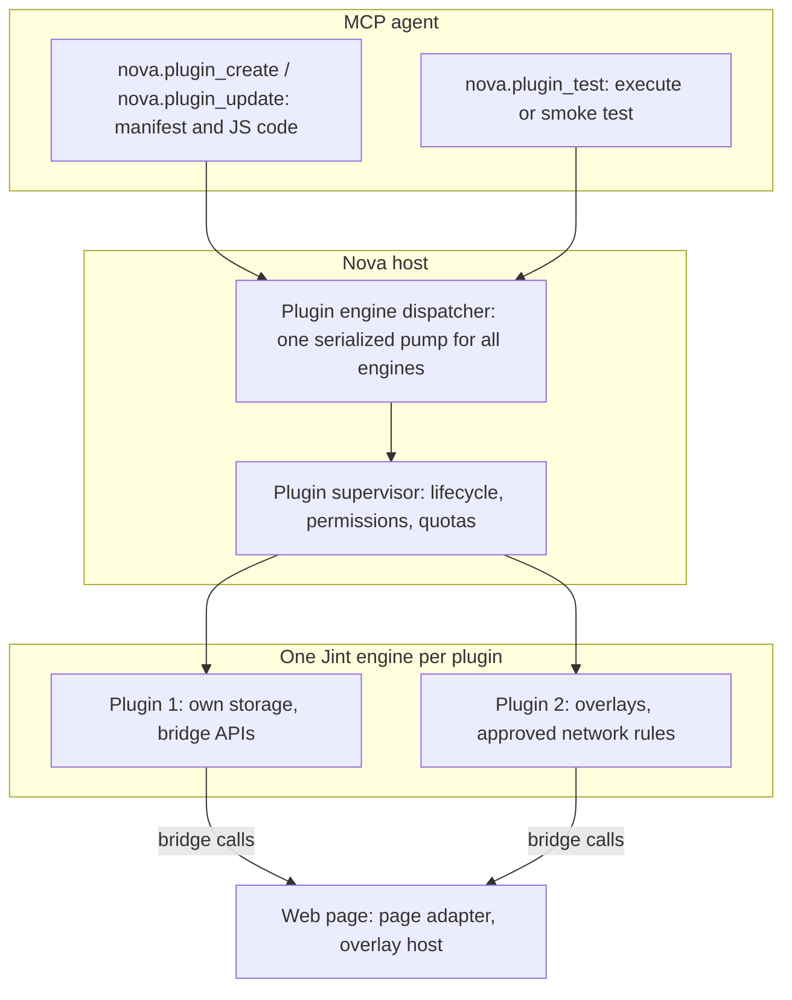

# Agent-Authored Plugins (AAP) & Jint JavaScript Runtime

> [!WARNING]
> **Unavailable during the public alpha.** Plugins are turned off and cannot be enabled in the settings. This page describes the plugin system for reference, not a feature you can use in the current alpha. See [Alpha status and limitations](../../../ALPHA.md).

> [!NOTE]
> The Agent-Authored Plugins (AAP) system is designed to let AI agents write, test and run browser plugins in JavaScript at runtime — without recompiling Nova AI Workspace or restarting it. Each plugin runs in its own Jint JavaScript engine and reaches the page only through permission-checked bridge APIs.

---

## 1. Problem Statement & Motivation

Traditional browser extensions require manual installation, store reviews, and pre-packaged static code. When an AI agent automates complex sites (e.g., custom table data extraction, interactive confirmation overlays, or continuous DOM monitoring), raw remote scripting via `eval` has inherent limitations:
* `eval` has no persistent state and no storage of its own.
* Repeated remote polling wastes tokens and adds latency.
* Pre-installed extensions cannot be adapted by an agent for a new website.

**AAP** follows one principle: *the agent writes the tool, the user stays in control.*

---

## 2. Architecture & Jint JavaScript Engine

---

## 3. Security & Runtime Guarantees

1. **Separate Jint engine per plugin:**
   * Plugin code runs in Nova's process inside its own Jint JavaScript engine, not in the web page. It has no `document` or `window`; it reaches the page only through Nova's bridge APIs (`nova.dom.*`, `nova.overlay.*`, `nova.mutation.*` and others).
   * Each engine runs with a memory limit, a wall-clock limit per invocation (both from the manifest's lifecycle settings) and a recursion limit of 256.
2. **Serialized engine access:**
   * All engine work — creation, execution, events, messages and tool calls — runs through one shared dispatcher, so the UI thread and the JavaScript engines cannot block each other. Relays between plugin sessions have a depth guard against echo loops.
3. **Minimal grants, review for the rest:**
   * On install, only storage and badge access are granted automatically. Everything else a manifest declares — DOM reading, overlays, class and style changes, network fetch, notifications, subframe access, request filtering, host patterns, network rules and plugin-defined MCP tools — stays pending until it is approved in a review dialog (`nova.plugin_request_permission`, or from the plugin details).
   * `nova.plugin_grant_active_tab` starts a plugin on the current tab with temporary access, after the user confirms it, without widening its permanent grants.
4. **Overlays in a Shadow DOM:**
   * Plugin overlays are rendered into a Shadow DOM host on the page, which keeps page styles from changing them. The shadow root is open; the isolation comes from the plugin engine, which has no direct access to the page.
5. **Safe rollout:** With `deferActivation=true` a new or changed plugin stays in Testing state until a smoke test passes (`nova.plugin_test` with `mode='smoke'` and `activateAfterPass=true`) or it is enabled. Every update keeps a version history, and `nova.plugin_rollback` restores an earlier version.

---

## 4. MCP Tool Reference for AAP

All tools are in the `plugin_management` bundle.

| Tool | Purpose |
| :--- | :--- |
| `nova.plugin_create` | Installs a new plugin from a manifest and its JavaScript files, optionally in Testing state. |
| `nova.plugin_update` | Changes the code and/or manifest of an installed plugin. |
| `nova.plugin_test` | Runs a script in the plugin's engine (`execute`) or an isolated smoke test (`smoke`). |
| `nova.plugin_enable`, `nova.plugin_disable`, `nova.plugin_uninstall` | Activates, deactivates or removes a plugin. |
| `nova.plugin_list`, `nova.plugin_inspect` | Lists plugins with state, permissions and error counts; shows one plugin's sessions, grants, content scripts and storage in detail. |
| `nova.plugin_request_permission` | Approves declared permissions, host patterns, network rules or plugin-defined MCP tools (with a review dialog). |
| `nova.plugin_grant_active_tab` | Starts a plugin on the current tab with temporary access. |
| `nova.plugin_get_code`, `nova.plugin_get_version_code`, `nova.plugin_rollback` | Reads the current or a historical version; restores a historical version. |
| `nova.plugin_logs`, `nova.plugin_security_log` | Error log of a plugin; recorded policy violations (for example permission denied, quota exceeded, URL blocked). |
| `nova.plugin_managed_storage_get`, `nova.plugin_managed_storage_update` | Reads and writes host-controlled settings that the plugin can only read. |
| `nova.plugin_export`, `nova.plugin_import` | Exports or imports a plugin as a `.novaplugin` ZIP bundle. |
| `nova.plugin_inject_reset`, `nova.plugin_css_reset` | Removes a plugin's overlays or injected stylesheet from open pages. |
| `nova.plugin_icons_list` | Lists the icon names a manifest can use. |

Plugin-defined tools appear to agents as `plugin.{pluginId}.{toolName}` once the plugin is active and the specific tool has been approved.

[All core features](../README.md)
