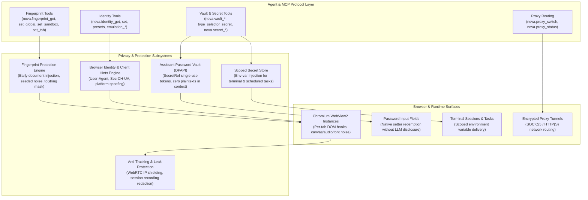
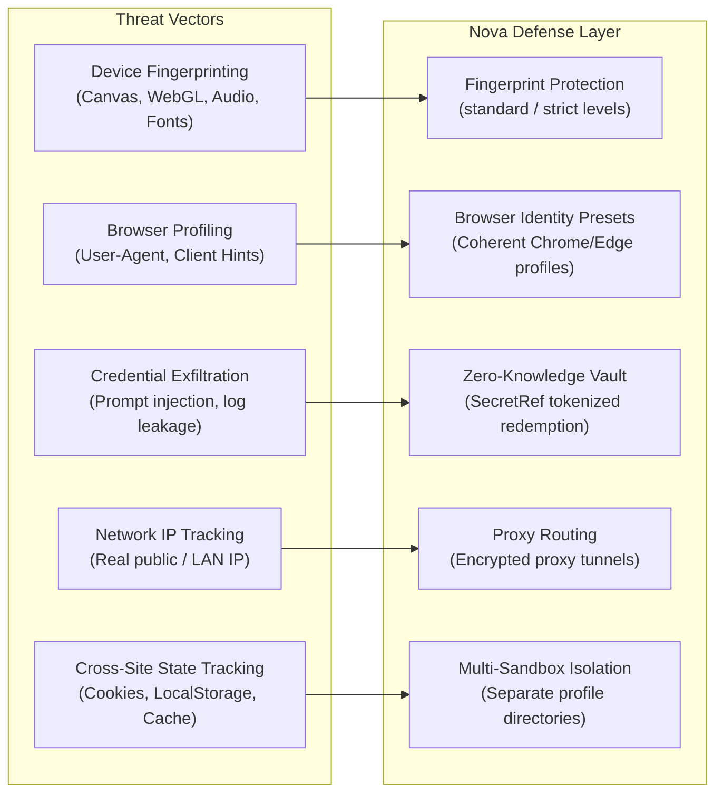
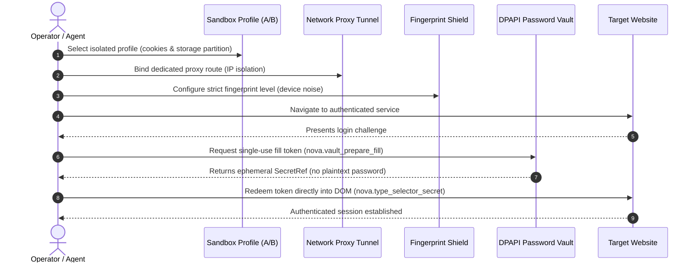

# Privacy Architecture Hub

Privacy in Nova AI Workspace is built on defense-in-depth principles across multiple independent layers: browser hardware fingerprint masking, browser identity emulation, zero-knowledge credential vaulting, scoped secret delivery, network routing isolation, and capture-time recording redaction.

Rather than offering a superficial "incognito mode" that merely clears local history, Nova provides fine-grained, verifiable controls that protect users and autonomous agents against device fingerprinting, session correlation, IP leakage, and credential exfiltration.

---

## The Four Privacy Pillars

Nova organizes privacy mechanisms into four distinct, complementary domains:

| Pillar | Core Focus | Key Mechanisms | Primary Tools |
| :--- | :--- | :--- | :--- |
| [**Fingerprint Protection**](fingerprint-and-identity/README.md) | Obscures hardware and rendering traits used to identify devices across sessions. | Seeded pixel noise ($\pm 1$ on Canvas RGB), inaudible audio jitter ($\pm 10^{-7}$), font whitelist, generic WebGL GPU strings, standardized hardware metrics. | [`nova.fingerprint_get`](../../mcp-reference/tools/site-data-and-identity/nova-fingerprint-get.md), [`nova.fingerprint_set_global`](../../mcp-reference/tools/site-data-and-identity/nova-fingerprint-set-global.md) |
| [**Browser Identity**](fingerprint-and-identity/README.md) | Alters advertised browser signature and client hints. | Presets (`chrome`, `firefox`, `safari`, `default`), matching `Sec-CH-UA` Client Hints, viewport and locale emulation. | [`nova.identity_get`](../../mcp-reference/tools/site-data-and-identity/nova-identity-get.md), [`nova.identity_set`](../../mcp-reference/tools/site-data-and-identity/nova-identity-set.md) |
| [**Password Vault & Secrets**](vault-and-secrets/README.md) | Delivers credentials without exposing plaintexts to the model. | Windows DPAPI encryption, single-use 128-bit `SecretRef` tokens, host-bound redemption, scoped terminal/task secrets. | [`nova.vault_prepare_fill`](../../mcp-reference/tools/vault-and-security/nova-vault-prepare-fill.md), [`nova.type_selector_secret`](../../mcp-reference/tools/vault-and-security/nova-type-selector-secret.md) |
| [**Anti-Tracking & Leak Protection**](anti-tracking-and-leak-protection/README.md) | Prevents side-channel leaks and data exposure. | WebRTC IP leak suppression, capture-time HMAC-SHA-256 credential redaction in session recordings, URL tracker stripping. | [`nova.session_record_start`](../../mcp-reference/tools/session-recording/nova-session-record-start.md) |

---

## Architectural Threat Model & Boundaries

Understanding what each privacy control addresses—and what it does not—is critical for designing secure agent workflows:

### Essential Invariants & Boundaries

1. **Fingerprinting vs. Anonymity:** 
   Fingerprint protection obscures peripheral and rendering signatures, but **does not make an agent anonymous**. If an agent signs into an account, accepts tracking cookies, or navigates from a static public IP address, the destination origin can correlate visits regardless of fingerprint settings.
2. **Identity Presets vs. Engine Emulation:**
   Selecting the `firefox` or `safari` identity preset modifies the `User-Agent` header, but does not transform the Chromium WebView2 engine into Gecko or WebKit. Bot detection engines that perform deep JavaScript engine divergence checks will detect Chromium-specific quirks. For maximum coherence, the `chrome` preset provides fully matched `Sec-CH-UA` Client Hints.
3. **The Vault Zero-Knowledge Boundary:**
   The password vault guarantees that plaintext credentials **never enter the LLM's conversation context window or transcript logs**. However, once `nova.type_selector_secret` fills the password into the website's DOM input field, the destination website has full access to the credential. The destination origin must still be trusted.
4. **Proxy Routing vs. Profile Storage:**
   Changing a network route via [`nova.proxy_switch`](../../mcp-reference/tools/proxy-and-network/nova-proxy-switch.md) directs HTTP/HTTPS traffic through an external tunnel, but does not clear existing cookies, local storage, or cached authentication tokens. True identity separation requires pairing proxies with [Multi-Sandbox Session Isolation](../sandbox-isolation/README.md).

---

## Inter-System Privacy Workflows

Nova's privacy components operate cohesively with the broader browser architecture:

* **Sandboxes + Fingerprinting:** Each sandbox can maintain an independent fingerprint protection level (`nova.fingerprint_set_sandbox`). Seed values incorporate the sandbox's unique persistent identifier, ensuring two sandboxes browsing the same site exhibit distinct, non-correlatable device signatures.
* **Vault + Session Recording:** When capturing session recordings for compliance or debugging, Nova's `VaultSecretFingerprintService` automatically detects and redacts vault credentials from HTTP request/response payloads before writing recordings to disk.
* **Proxies + WebRTC Shielding:** When routing through a proxy, Nova configures WebView2 interface bindings to suppress WebRTC local candidate discovery, preventing private LAN IPs from leaking through STUN/TURN queries.

---

## Subsystem Navigation

* [**Fingerprint Protection & Browser Identity**](fingerprint-and-identity/README.md) — Multi-tier protection levels, mathematical seed generation, Canvas/Audio noise, and Client Hints.
* [**Password Vault & Secret Injection**](vault-and-secrets/README.md) — Windows DPAPI encryption, host-bound `SecretRef` tokens, and scoped secret injection.
* [**Anti-Tracking & Leak Protection**](anti-tracking-and-leak-protection/README.md) — WebRTC IP leak shielding, capture-time recording redaction, and tracker sanitization.

### Related System Documentation

* [**Proxy Routing Guide**](../network/proxy/README.md) — Proxy configurations, authentication, and tunnel health monitoring.
* [**Multi-Sandbox Session Isolation**](../sandbox-isolation/README.md) — Independent profile partitions, cookie jars, and storage isolation.
* [**Site Data Management**](../site-data-management/README.md) — Granular inspection and clearing of cookies, local storage, and caches.
* [**Network Overview**](../network/README.md) — Request interception, TLS inspection, and proxy switching.

---

[All core features](../README.md) · [Site Data & Identity Tools](../../mcp-reference/tools/site-data-and-identity/README.md) · [Vault & Security Tools](../../mcp-reference/tools/vault-and-security/README.md)
