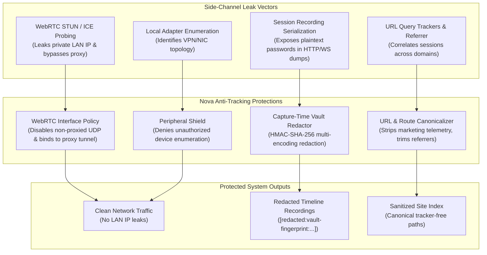
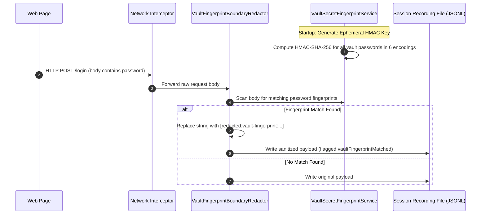
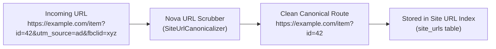

# Anti-Tracking, WebRTC IP Leak Prevention & Session Redaction

Even when an autonomous agent operates through an encrypted proxy tunnel and uses isolated browser sandboxes, standard web browsers routinely leak sensitive identity markers through subtle side channels:
1. **WebRTC IP Leakage:** Interactive WebRTC STUN queries enumerate local network adapters, exposing the user's private local LAN IP (`192.168.x.x`, `10.x.x.x`) and real public IP past the proxy.
2. **Session Recording Credential Leaks:** Network debugging tools and automated recording streams capture raw authentication tokens, API keys, and passwords in cleartext HTTP request bodies.
3. **URL Tracker Correlation:** Marketing query parameters (`utm_*`, `gclid`, `fbclid`) and HTTP `Referer` headers track user trajectories across independent domains.

Nova AI Workspace incorporates proactive, capture-time defensive mechanisms to seal these side channels before sensitive telemetry leaves the browser runtime.

---

## 1. WebRTC IP Leak Prevention

### The Vulnerability
WebRTC (Web Real-Time Communication) enables peer-to-peer audio, video, and data streaming in modern browsers. To connect peers directly behind Network Address Translation (NAT) routers, WebRTC uses the **Interactive Connectivity Establishment (ICE)** protocol with STUN/TURN servers.

During ICE candidate gathering, standard browsers query all available network interfaces—including local Ethernet adapters, Wi-Fi cards, and active VPN tunnels. Even if a browser routes all standard HTTP/HTTPS traffic through a SOCKS5 or HTTP proxy, WebRTC STUN requests send out-of-band UDP packets that reveal:
* The user's real private LAN IP address (e.g., `192.168.1.105` or `10.0.0.15`).
* Secondary network adapter IP addresses (e.g., corporate VPN interfaces).
* The user's real public WAN IP address if UDP traffic bypasses the proxy tunnel.

### Nova's Mitigation Strategy
Nova configures the underlying Chromium WebView2 engine with strict WebRTC IP handling policies:
1. **Disable Non-Proxied UDP:** When an active proxy is configured, WebRTC is restricted from transmitting UDP packets directly across physical network adapters. All media packets are either routed through the configured proxy or dropped if the proxy does not support UDP relay.
2. **Local Candidate Filtering:** Host ICE candidates that expose internal private IP ranges (`192.168.0.0/16`, `10.0.0.0/8`, `172.16.0.0/12`) are stripped before being returned to JavaScript `RTCPeerConnection` listeners.
3. **Peripheral Access Isolation:** WebRTC hardware device enumeration (`navigator.mediaDevices.enumerateDevices`) returns masked generic device IDs until explicit user permission is granted, preventing hardware GUID enumeration.

---

## 2. Capture-Time Credential Redaction in Session Recordings

When developers and agents record browsing workflows using [Session Recording](../../session-recording/README.md) for compliance, time-travel debugging, or audit trails, network traffic dumps often capture sensitive passwords, session tokens, and Bearer headers.

Nova's `VaultSecretFingerprintService` and `VaultFingerprintBoundaryRedactor` ensure credentials saved in the [Password Vault](../vault-and-secrets/README.md) are stripped **in-flight at capture time** before recording payloads reach disk:

### The Six Monitored Encodings
Credentials rarely travel in plain ASCII text. Depending on web frameworks and protocols, passwords may be formatted across various encodings. Nova generates HMAC-SHA-256 signatures across six distinct representations:

| Encoding Format | Description / Example |
| :--- | :--- |
| **Raw Plaintext** | The original UTF-8 password string (`MySecretP@ss!`). |
| **URL-Encoded (Lowercase)** | Standard percent-encoded representation (`mysecretp%40ss%21`). |
| **URL-Encoded (Uppercase)** | Standard percent-encoded uppercase (`MYSECRETP%40SS%21`). |
| **JSON-Escaped** | Standard JSON string escapes for quotes and backslashes (`\"`, `\\`, `\/`). |
| **Base64** | Standard Base64 encoded string (`TXlTZWNyZXRQQHNzIQ==`). |
| **Base64url** | URL-safe Base64 without padding (RFC 4648). |

### Stream Redaction Invariants
* **In-Memory Ephemeral Key:** Hashes are generated using an ephemeral HMAC key created in volatile memory at Nova startup. The key is never persisted to disk, preventing offline rainbow table attacks against recorded redaction markers.
* **Pre-Disk Interception:** Redaction occurs in process memory before HTTP bodies, WebSocket frames, or request headers are serialized to the recording log.
* **Zero Console Leakage:** Redaction operates on network boundaries; console messages and in-page script variables are separately protected by the [Zero-Knowledge Vault](../vault-and-secrets/README.md).

---

## 3. URL Tracker Sanitization & Referrer Trimming

Tracking companies embed persistent tracking tokens into URL query strings to follow user trajectories across third-party websites. When an agent clicks a link or copies a URL, these tokens correlate browsing activities.

### 1. Tracker Query Parameter Stripping
Nova's `SiteUrlCanonicalizer` automatically strips known marketing and analytics tracking parameters while strictly preserving functional parameters:
* **Stripped Trackers:** `utm_source`, `utm_medium`, `utm_campaign`, `utm_term`, `utm_content`, `gclid`, `fbclid`, `mc_eid`, `_ga`, `msclkid`.
* **Preserved Parameters:** Functional parameters that determine page content (`id`, `page`, `category`, `search`, `tab`, `view`).

### 2. Referrer Policy Enforcement
By default, Nova configures modern WebView2 instances to enforce `strict-origin-when-cross-origin`:
* Requests within the same origin transmit the full document path in the `Referer` header.
* Cross-origin requests transmit only the origin (e.g., `https://example.com/`) rather than the complete URL path, preventing query parameters and private path structures from leaking to external servers.
* Downlink requests from HTTPS to insecure HTTP send zero `Referer` headers.

---

## 4. Scoped Memory & Annotation Privacy

When autonomous agents record notes, operational guidance, or domain knowledge during multi-step tasks, Nova enforces strict domain boundaries:

| Tool Group | Scope | Privacy Boundary |
| :--- | :--- | :--- |
| **Domain Notes** (`nova.domain_note_*`) | Scoped strictly to the target web domain. | Notes recorded for `alpha.example.com` are never exposed to agents browsing `beta.other.com`. |
| **Operator Notes** (`nova.operator_notes_*`) | Scoped to the current task instance or user profile. | Operational guidance remains isolated to authorized agent sessions. |
| **Knowledge Board** (`nova.board_*`) | Cross-session organizational memory. | Stored in local SQLite; never transmitted to cloud providers. |

---

## 5. Privacy Boundary & Leak Prevention Checklist

| Threat Channel | Potential Impact | Nova Defensive Architecture |
| :--- | :--- | :--- |
| **WebRTC STUN / ICE** | Private LAN IP & real WAN IP leak past proxy | Non-proxied UDP disabled; local host candidates filtered. |
| **Canvas / Audio** | Persistent cross-session device identification | Seeded $\pm 1$ pixel noise, inaudible $\pm 10^{-7}$ audio jitter, intra-tab stability. |
| **Installed Fonts** | Machine profiling via font enumeration | Strict font whitelist (`FontFaceSet.check`) and sub-pixel `measureText` jitter. |
| **WebGL Renderer** | Exact GPU model and driver identification | Generic ANGLE / Google Inc. strings returned for unmasked vendor/renderer. |
| **Session Recordings** | Cleartext password leaks in HTTP logs | Multi-encoding HMAC-SHA-256 capture-time stream redaction. |
| **URL Parameters** | Cross-domain user journey correlation | Automated marketing tracker stripping in canonicalizer. |
| **HTTP Referrer** | Internal path leakage to external origins | `strict-origin-when-cross-origin` policy enforcement. |

---

## 6. Related Documentation

* [**Privacy Architecture Hub**](../README.md) — Comprehensive overview of privacy subsystems and threat modeling.
* [**Fingerprint Protection & Browser Identity**](../fingerprint-and-identity/README.md) — Anti-fingerprinting levels, noise algorithms, and identity presets.
* [**Password Vault & Secret Injection**](../vault-and-secrets/README.md) — DPAPI encryption, `SecretRef` tokens, and zero-knowledge filling.
* [**Session Recording & Time-Travel Debugging**](../../session-recording/README.md) — Network capture and replay mechanics.
* [**Proxy Routing Guide**](../../network/proxy/README.md) — Shared and sandbox proxy routing.

---

[All core features](../../README.md) · [Privacy overview](../README.md)
