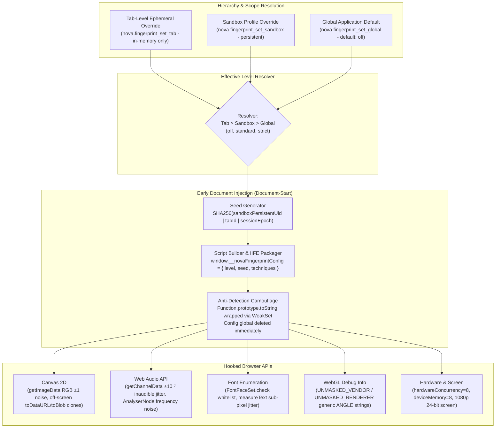
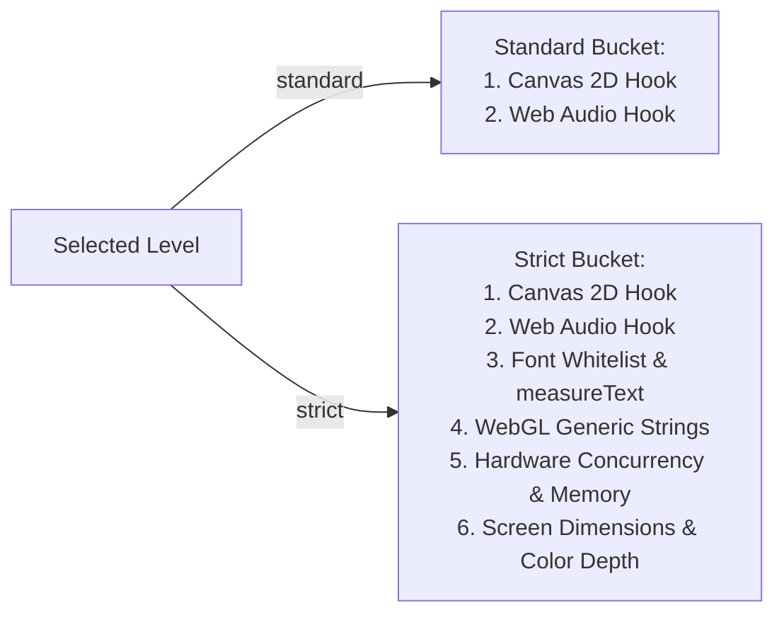
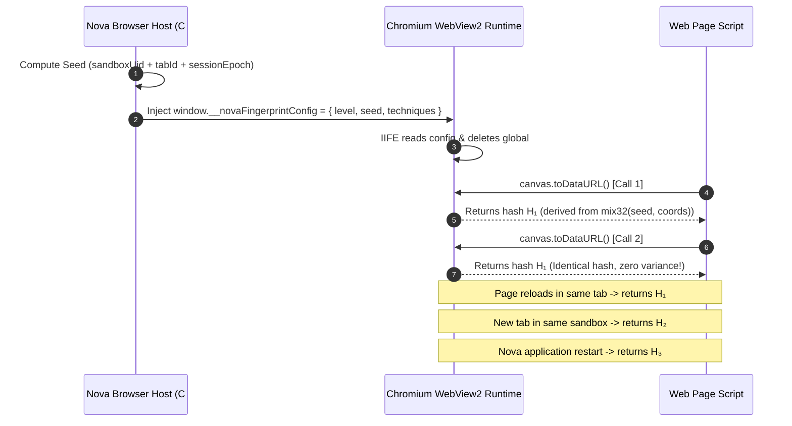
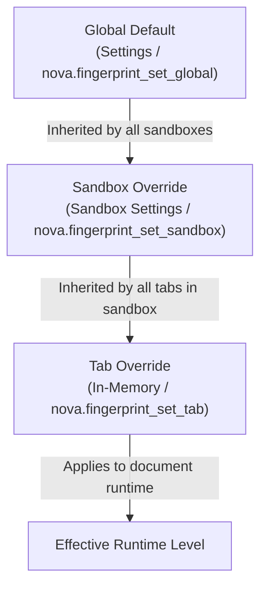
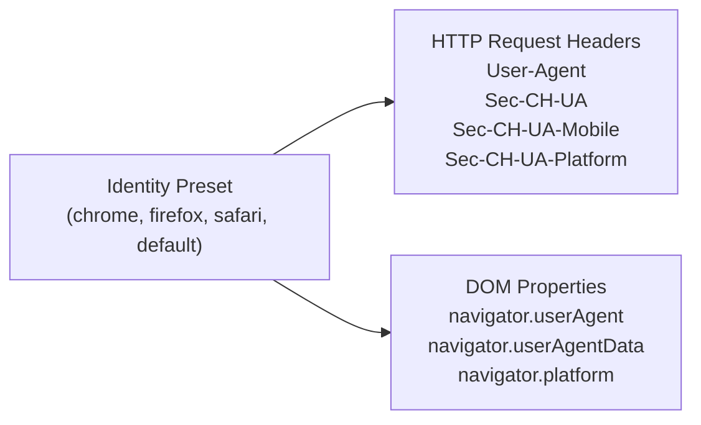

# Fingerprint Protection & Browser Identity

Websites routinely gather minute hardware and rendering characteristics to construct persistent device identifiers. By measuring HTML5 Canvas pixel rendering, Web Audio synthesis variations, installed system fonts, GPU vendor strings, and hardware metrics, tracking scripts can identify and correlate users and autonomous agents across sessions—even after all cookies and local storage are deleted.

Nova AI Workspace provides a multi-tiered **Fingerprint Protection Engine** alongside a **Browser Identity System**. These systems alter identifiable device signals using deterministic, stable noise while maintaining rendering stability and evading bot detection.



---

## 1. The Core Threat: Device Fingerprinting

Device fingerprinting leverages subtle hardware discrepancies to generate a semi-permanent identifier:
* **Canvas Fingerprinting:** Differences in GPU architectures, rasterization engines, and sub-pixel antialiasing algorithms produce slightly different pixel outputs when drawing text and shapes to a 2D canvas.
* **Audio Fingerprinting:** Variances in audio hardware processing and floating-point math during audio synthesis create unique frequency response signatures.
* **Font Probing:** Measuring character bounding boxes or checking `document.fonts.check()` across hundreds of font families reveals installed system fonts.
* **Hardware & GPU Leaks:** Querying `navigator.hardwareConcurrency`, `navigator.deviceMemory`, and WebGL extension strings reveals CPU core counts, RAM tiers, and exact graphics card models.

---

## 2. Protection Levels & Technique Matrix

Nova implements three distinct protection tiers:

| Protection Level | Settings Label | Included Techniques | Impact & Compatibility |
| :---: | :--- | :--- | :--- |
| **`off`** *(Default)* | Off | None | Native WebView2 behavior. No spoofing or noise injection. |
| **`standard`** | Standard | `canvas`, `audio` | Injects subtle, non-disruptive noise into Canvas and Web Audio readouts. Completely imperceptible to human users and stable for web applications. |
| **`strict`** | Strict | `canvas`, `audio`, `font`, `webgl`, `hardware`, `screen` | Standard protections plus font whitelisting, generic WebGL vendor/renderer strings, standardized CPU/RAM metrics, and fixed 1080p screen resolution. |

### Technique Breakdown



#### 1. Canvas 2D Hook (`canvas`)
* **`getImageData` Noise:** Adds deterministic $\pm 1$ delta noise to RGB color channels of pixels returned by `CanvasRenderingContext2D.prototype.getImageData`. Alpha transparency channels are preserved untouched.
* **Off-Screen Cloning for `toDataURL` and `toBlob`:** When a website calls `toDataURL` or `toBlob`, Nova executes the extraction against an off-screen clone canvas. The original visible canvas is never mutated on screen, ensuring charts, drawing apps, and image editors never suffer visual corruption or drifting pixels.

#### 2. Web Audio Hook (`audio`)
* **`AudioBuffer.prototype.getChannelData`:** Injects stable noise scaled at $\pm 10^{-7}$. Typical audio amplitudes range between $0.0$ and $1.0$; noise at $0.0000001$ is approximately $140\text{ dB}$ below the signal level, making it completely inaudible to human ears while completely disrupting audio hash calculations.
* **`AnalyserNode` Frequency Data:** Injects stable sub-decibel noise into `getFloatFrequencyData` ($\pm 0.001$) and `getByteFrequencyData` ($\pm 1$).

#### 3. Font Whitelist & Jitter (`font`)
* **`FontFaceSet.prototype.check` Filtering:** Restricts truthy responses to a standard cross-platform font whitelist (`Arial`, `Verdana`, `Times New Roman`, `Courier New`, `Georgia`, `Tahoma`, `Trebuchet MS`, `Segoe UI`, `Calibri`, `Cambria`, `Helvetica`, `sans-serif`, `serif`, `monospace`, `system-ui`).
* **`measureText` Sub-Pixel Jitter:** Adds sub-pixel jitter ($\pm 0.01\text{ px}$) to `TextMetrics.width`, preventing scripts from enumerating installed fonts via micro-measurements.

#### 4. WebGL Masking (`webgl`)
* Hooks `getParameter` on `WebGLRenderingContext` and `WebGL2RenderingContext` for extension parameters:
  * `UNMASKED_VENDOR_WEBGL` ($0\text{x}9245$): Always returns `"Google Inc. (NVIDIA)"`.
  * `UNMASKED_RENDERER_WEBGL` ($0\text{x}9246$): Always returns `"ANGLE (NVIDIA, NVIDIA GeForce Direct3D11 vs_5_0 ps_5_0)"`.

#### 5. Hardware Normalization (`hardware`)
* `navigator.hardwareConcurrency`: Standardized to `8` CPU logical cores.
* `navigator.deviceMemory`: Standardized to `8` GB RAM.
* `navigator.maxTouchPoints`: Standardized to `0` for desktop environments.

#### 6. Screen Normalization (`screen`)
* `screen.width` / `screen.height`: Standardized to $1920 \times 1080$.
* `screen.availWidth` / `screen.availHeight`: Standardized to $1920 \times 1040$ (accounting for a standard 40px taskbar).
* `screen.colorDepth` / `screen.pixelDepth`: Standardized to `24`-bit TrueColor.

---

## 3. Mathematical Seed Derivation & Stability Invariants

A critical flaw in naive fingerprint blockers is **random noise drift**: generating fresh random numbers on every read call. Bot detection systems easily flag browsers whose canvas pixel hashes fluctuate across repeated reads within the same page.

Nova solves this using **stateless deterministic seeding**:

$$\text{Seed} = \text{SHA256}\Big(\text{sandboxPersistentUid} \parallel \text{tabId} \parallel \text{sessionStartUnixMs}\Big)_{[0..3]}$$



### The Three Stability Guarantees

1. **Intra-Tab Determinism:** Repeated reads of the same canvas or audio buffer within a tab yield identical spoofed values. A page reload produces the exact same fingerprint, ensuring anti-tracking consistency.
2. **Cross-Tab Dispersion:** Different tabs produce distinct fingerprints because `tabId` is mixed into the seed.
3. **Session Rotation:** Restarting Nova rotates `sessionStartUnixMs`, generating fresh seeds across application lifecycles.

---

## 4. Anti-Detection & Camouflage Architecture

Advanced bot detection libraries (FingerprintJS, CreepJS, Datadome) inspect JavaScript prototypes to detect whether native methods have been intercepted:

1. **Early Document Injection:** Nova injects the fingerprint protection bundle via `CoreWebView2.AddScriptToExecuteOnDocumentCreatedAsync` before any site scripts or bootstrap scripts execute, guaranteeing that no script observes raw values before hooks install.
2. **Global Variable Destruction:** The IIFE immediately deletes `window.__novaFingerprintConfig` upon reading, preventing site scripts from verifying whether protection is active.
3. **`Function.prototype.toString` Masquerade:** Nova wraps `Function.prototype.toString` using a private `WeakSet`. Whenever site code calls `.toString()` on any hooked function, Nova returns the canonical native string:
   ```javascript
   function getImageData() { [native code] }
   ```

---

## 5. Scope Hierarchy & MCP Management

Fingerprint protection levels can be configured across three hierarchical scopes:

$$\text{Effective Level} = \text{TabOverride} \succ \text{SandboxOverride} \succ \text{GlobalSetting}$$



### Scope Comparison & Tools

| Scope | Persistence | UI Location | MCP Management Tools |
| :--- | :--- | :--- | :--- |
| **Global** | Persistent (`settings.json`) | Settings > Privacy > Protection level | [`nova.fingerprint_set_global`](../../../mcp-reference/tools/site-data-and-identity/nova-fingerprint-set-global.md) |
| **Sandbox** | Persistent (`settings.json`) | Sandbox Management > Privacy | [`nova.fingerprint_set_sandbox`](../../../mcp-reference/tools/site-data-and-identity/nova-fingerprint-set-sandbox.md) |
| **Tab** | In-Memory only (cleared on tab close) | Tab context menu > Fingerprint protection | [`nova.fingerprint_set_tab`](../../../mcp-reference/tools/site-data-and-identity/nova-fingerprint-set-tab.md) |

To clear an override and revert to the enclosing scope, pass `level: null` or `level: "inherit"`. To inspect the active configuration and its provenance, call [`nova.fingerprint_get`](../../../mcp-reference/tools/site-data-and-identity/nova-fingerprint-get.md).

---

## 6. Browser Identity Presets & Client Hints

While fingerprint protection addresses hardware and rendering APIs, **Browser Identity** manages network headers and navigator identity strings.

`nova.identity_set` configures a global identity profile that applies across all tabs:



### Identity Presets

| Preset | Announced Browser | Client Hints Synchronized? | Coherence Assessment |
| :--- | :--- | :---: | :--- |
| **`default`** | Native Edge / WebView2 | **Yes** | Fully coherent; authentic WebView2 identity. |
| **`chrome`** | Google Chrome on Windows | **Yes** | Fully coherent; matching `navigator.userAgentData` and `Sec-CH-UA` headers. Recommended for bot evasion. |
| **`firefox`** | Mozilla Firefox on Windows | **No** | Chromium keeps its underlying engine architecture; Client Hints are omitted. Incoherent under deep scrutiny. |
| **`safari`** | Apple Safari on macOS | **No** | Chromium engine characteristics remain detectable; Client Hints omitted. |
| **`custom`** | Custom User-Agent string | Conditional | Synchronized if the user-agent matches Chromium syntax. |

Query available versions using [`nova.identity_presets`](../../../mcp-reference/tools/site-data-and-identity/nova-identity-presets.md) and active settings with [`nova.identity_get`](../../../mcp-reference/tools/site-data-and-identity/nova-identity-get.md).

---

## 7. Dynamic Tab Emulation Suite

For localized testing, responsive validation, and scraping workflows, agents can apply temporary emulation overrides to individual tabs without modifying persistent settings:

| Tool | Capability | Parameters |
| :--- | :--- | :--- |
| [`nova.emulation_set_device_metrics`](../../../mcp-reference/tools/device-emulation/nova-emulation-set-device-metrics.md) | Viewport geometry & scale | `width`, `height`, `deviceScaleFactor`, `mobile` |
| [`nova.emulation_set_user_agent`](../../../mcp-reference/tools/device-emulation/nova-emulation-set-user-agent.md) | Temporary tab user-agent | `userAgent`, `acceptLanguage`, `platform` |
| [`nova.emulation_set_locale`](../../../mcp-reference/tools/device-emulation/nova-emulation-set-locale.md) | Language, timezone, location | `locale`, `timezoneId`, `geolocation` |
| [`nova.emulation_set_touch`](../../../mcp-reference/tools/device-emulation/nova-emulation-set-touch.md) | Touch event simulation | `enabled`, `maxTouchPoints` |
| [`nova.emulation_set_media`](../../../mcp-reference/tools/device-emulation/nova-emulation-set-media.md) | CSS media features | `media`, `features` (dark/light mode, reduced motion) |
| [`nova.emulation_use_device`](../../../mcp-reference/tools/device-emulation/nova-emulation-use-device.md) | Pre-configured device presets | `device` (iPhone 14, Pixel 7, iPad Pro) |

Overrides can be cleared individually via `nova.emulation_clear_device_metrics`, `nova.emulation_clear_locale`, and `nova.emulation_clear_media`.

---

## 8. Related Documentation

* [**Privacy Architecture Hub**](../README.md) — Comprehensive privacy overview and threat modeling.
* [**Password Vault & Secret Injection**](../vault-and-secrets/README.md) — DPAPI encryption, `SecretRef` tokens, and zero-knowledge filling.
* [**Anti-Tracking & Leak Protection**](../anti-tracking-and-leak-protection/README.md) — WebRTC IP shielding, recording redaction, and tracker sanitization.
* [**Multi-Sandbox Session Isolation**](../../sandbox-isolation/README.md) — Cookie and profile partition boundaries.
* [**Proxy Routing Guide**](../../network/proxy/README.md) — Shared and sandbox proxy routing.

---

[All core features](../../README.md) · [Privacy overview](../README.md) · [Site Data & Identity Tools](../../../mcp-reference/tools/site-data-and-identity/README.md)
