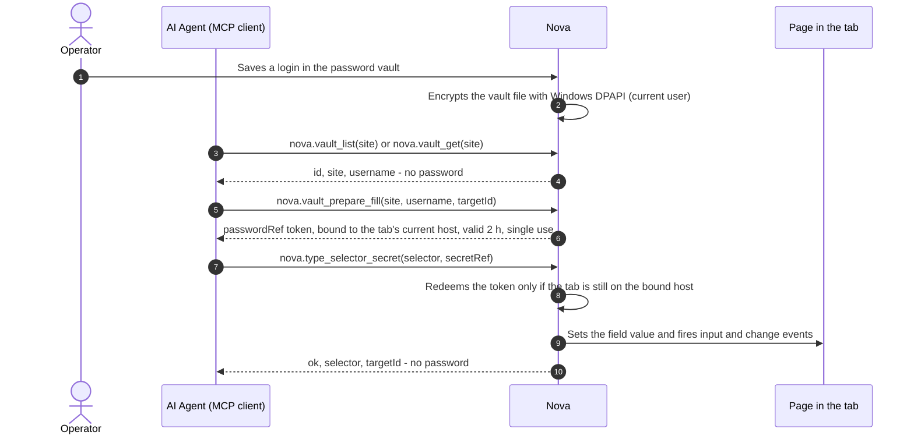

# Password Vault & Secret Injection

> [!NOTE]
> The assistant password vault lets agents fill saved credentials without returning the password through vault retrieval or secret-fill tools. Agents work with metadata (site, username) and a short-lived, single-use token; Nova itself puts the password into the page. A separate secret store holds API keys and tokens that Nova passes to terminal sessions and scheduled tasks as environment variables.

---

## 1. A Concrete Example: Signing In Without a Password in the Conversation

You save a work-account login in Nova's vault. An agent opens the real login page, finds the username and password fields, and requests a fill token for the saved entry. Nova returns metadata and a `passwordRef`, then redeems that reference when the agent requests the field fill. The agent can continue the login flow without putting the saved password into its conversation.

The password still reaches the website: Nova places it in the page's field. The vault protects this delivery path from unnecessary disclosure to the model; the destination page must still be trusted.

## 2. Why Separate Credentials from Agent Context?

Conventional browser automation exposes credentials during sign-in:

1. **Plaintext passwords in the model context:** If an operator writes a password into a prompt ("Log in with SecretPass123"), it is sent to the model provider and ends up in conversation transcripts and logs.
2. **Exfiltration via prompt injection:** A page can try to talk an agent into repeating values it has seen. A password the agent never received cannot be repeated.

No vault tool returns a saved password. This reduces the sensitive information available through vault responses, but it is not a guarantee against a malicious destination page, other inspection paths, or secrets printed by programs.

---

## 3. The Fill Flow

Vault retrieval and secret-fill results do not contain the password. It exists in Nova's process memory and, once filled, in the page's password field, where the website can access it.

---

## 4. What the Vault Tools Return

| Tool | Returns | Never returns |
| :--- | :--- | :--- |
| `nova.vault_list` | `id`, `site`, `username`, `createdBy`, `createdUtc` per entry; optional `site` filter (substring, case-insensitive) | password |
| `nova.vault_get` | entry metadata plus `passwordAvailable`, `passwordRedacted: true`, `retrievalMode: "secretref_required"` | password |
| `nova.vault_prepare_fill` | `entryId`, `site`, `username`, `passwordRef`, `expiresAt`, `boundOrigin` | password |
| `nova.type_selector_secret` | `ok`, `selector`, `targetId`, `actionDispatched`, an autofill popup warning if relevant | password |
| `nova.vault_set` / `nova.vault_delete` | action result | stored password (it is only written, never read back) |

---

## 5. The SecretRef Token

* **Issued by `nova.vault_prepare_fill`:** If the `site` matches several entries, the call returns the usernames and asks for `username` instead of issuing a token.
* **Bound to a host:** The token records the target tab's host at issuance. Redemption compares the selected target's current host exactly, ignoring case. A mismatch types nothing and leaves the token available for retry on the right host. This is a host check, not a binding to one tab ID or a full origin including scheme and port.
* **Single use, 2 hours:** A redeemed token cannot be used again; an unused token expires after 2 hours. Both cases need a fresh `nova.vault_prepare_fill`.
* **In memory only:** Tokens are random 128-bit values held in memory and are gone after a Nova restart.

> [!IMPORTANT]
> `nova.vault_prepare_fill` only issues a token when the tab already shows the vault entry's site: the same host or a subdomain of it, by the same rule the autofill for you uses (never the reverse, never across shared-hosting domains such as `github.io`). Otherwise the call is refused with `vault.site_mismatch`. Open the real login page first, then prepare the fill.

---

## 6. Storage & Encryption

* **Vault file:** `vault.dat` in the Nova profile folder (`%LOCALAPPDATA%\nova-cognitive\Nova\`; installations upgraded from older versions may still use `%LOCALAPPDATA%\NovaBrowser\`).
* **Encryption:** The whole vault is serialized and encrypted with Windows DPAPI in the current-user scope. Only the same Windows user account can decrypt it; restoring a backup on another machine or under another user requires re-entering credentials.
* **Writes:** Each save writes to a temporary file and replaces `vault.dat` in one step, so an interrupted save leaves the previous file intact. A vault that exists but cannot be read is not treated as empty, so a failed read cannot overwrite it.
* **Limits:** at most 5,000 entries and 8 MB for the encrypted file. Via MCP, `site` is limited to 512 characters, `username` to 256 and `password` to 4,096.

---

## 7. User Controls

* **Settings > Passwords & autofill > "Enable assistant password vault":** turns the vault on or off. While it is off, every vault tool returns "Vault is disabled".
* **"Agent may use saved passwords"** (agent permissions): turns off `nova.vault_list`, `nova.vault_get`, `nova.vault_prepare_fill` and `nova.type_selector_secret` for agents. Per-domain agent rules can additionally disallow vault access on specific sites.
* Depending on the agent permission settings, Nova asks for confirmation before an agent stores or removes credentials ("The agent wants to store or update credentials in the vault.").

---

## 8. Redaction in Session Recordings

When a session recording is running, Nova keeps HMAC-SHA-256 fingerprints of the vault passwords (in six encodings: raw, URL-encoded upper and lower case, JSON-escaped, Base64, Base64url) under a random key that exists only in memory. With capture-time redaction enabled, supported matches in recorded HTTP bodies and WebSocket payloads are replaced with a `[redacted:vault-fingerprint:...]` marker and flagged `vaultFingerprintMatched`. The redaction setting is off by default; granting a payload capture class does not automatically turn it on. This mechanism does not filter console output or what a page itself does with a field's value. See [Session Recording](../../session-recording/README.md).

---

## 9. Secret Store for Terminal & Tasks

`nova.secret_set`, `nova.secret_list` and `nova.secret_delete` manage API keys and tokens with the scopes `global`, `workspace` and `task`. Values are DPAPI-encrypted (current user), are not returned by the secret-management tools, and are injected as environment variables into terminal-workspace sessions and scheduled-task runs. A `global` secret reaches a terminal workspace only after the user has granted that workspace access.

The secret-management tools do not return stored values. A program receiving an environment variable can still print or transmit it, so choosing and authorizing that program remains a separate decision.

---

## Related Documentation

* **[Auth Surface Detection (ASD)](../../auth-surface-detection-asd/README.md)** — Detection of login walls and session state.
* **[Agent Awareness Gates (AAG)](../../agent-awareness-gates-aag/README.md)** — Pre-execution safety and lease locking.

[Privacy overview](../README.md) · [All core features](../../README.md)
