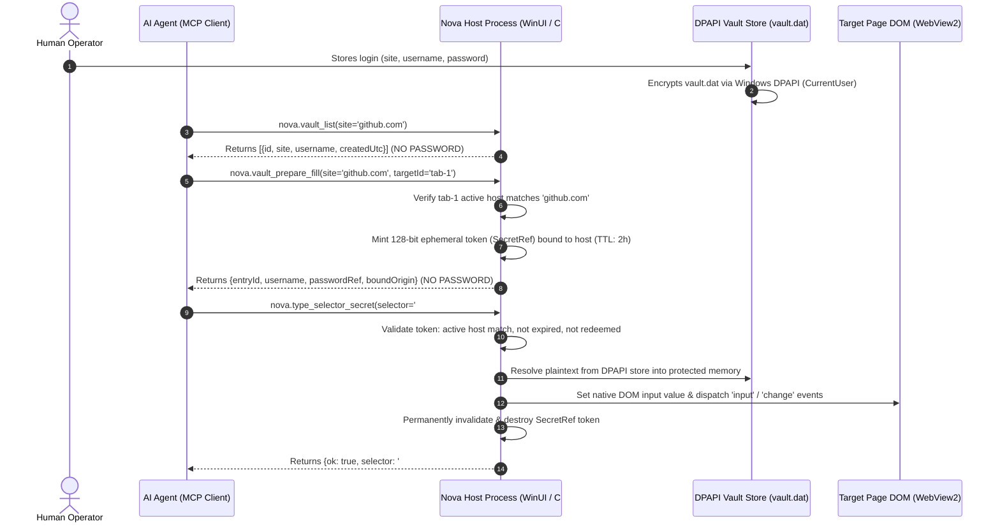
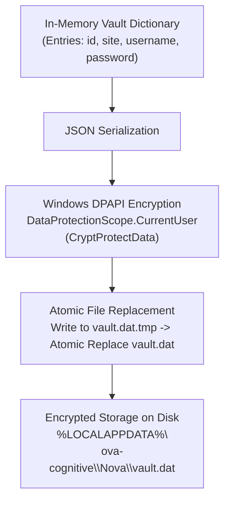
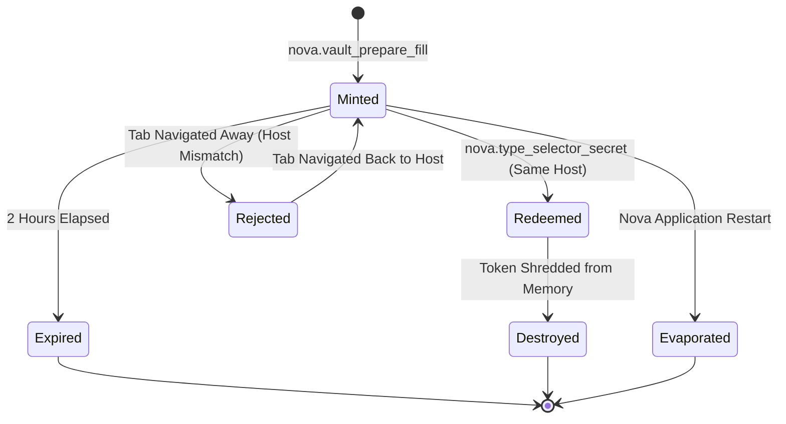
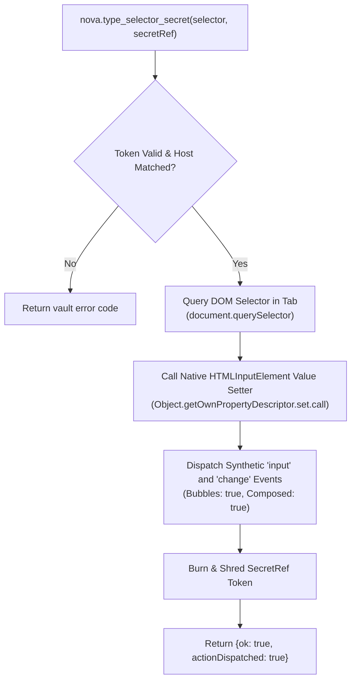
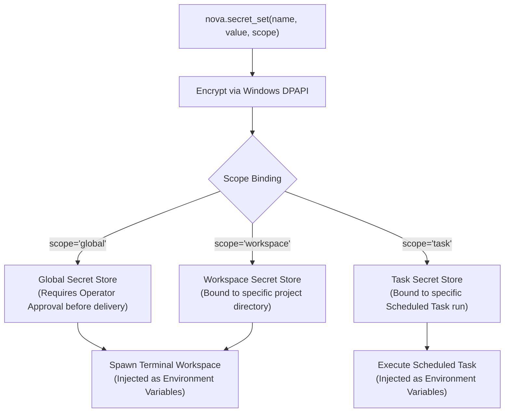

# Password Vault, SecretRef Tokens & Scoped Secret Delivery

In conventional browser automation and AI workflows, managing credentials poses severe security risks: operators paste passwords into prompts, scripts echo tokens into logs, and models see plaintexts in their context windows. If an agent encounters a malicious web page, a prompt-injection attack can induce the model to repeat or exfiltrate credentials it has seen.

Nova AI Workspace completely eliminates this vulnerability through an **Assistant Password Vault** built on a zero-knowledge delivery model:
1. Credentials are encrypted on disk with **Windows DPAPI**.
2. Neither vault discovery tools nor secret injection tools ever return the plaintext password to the agent or context window.
3. Password delivery uses an ephemeral, single-use, host-bound **`SecretRef` token**, redeemed directly into the browser DOM by the host process.
4. A complementary **Scoped Secret Store** delivers API tokens and keys to terminal sessions and scheduled tasks as environment variables without exposing them in transcripts.

---

## 1. System Architecture & The Zero-Knowledge Fill Flow

The vault decouples credential authorization from credential exposure:

---

## 2. Threat Modeling: Eliminating Credential Exfiltration

| Threat Vector | Conventional Automation | Nova Zero-Knowledge Architecture |
| :--- | :--- | :--- |
| **Model Context Exposure** | Passwords appear in prompts and model outputs; logged by LLM provider APIs. | **Eliminated.** Plaintext passwords never enter prompts, completions, or transcripts. |
| **Prompt Injection Exfiltration** | Malicious site tricks agent into summarizing or printing credentials. | **Eliminated.** The agent has only an opaque `passwordRef` handle, not the password itself. |
| **Credential Phishing on Redirects** | Automation scripts fill passwords blindly into rogue forms on redirect. | **Blocked.** Tokens are strictly bound to the target host; domain mismatches reject fills. |
| **Disk Inspection & Theft** | Plaintext config files or cleartext SQLite databases. | **Encrypted.** Protected by Windows DPAPI; unreadable by other Windows users or offline disks. |
| **Session Recording Leaks** | Passwords captured in HTTP debugging logs or timeline replays. | **Redacted.** Multi-encoding HMAC-SHA-256 redaction masks passwords at capture time. |

---

## 3. Storage Architecture & DPAPI Encryption

Nova's password vault store (`vault.dat`) is protected by operating-system-level encryption:

### Encryption Invariants

1. **Windows Data Protection API (DPAPI):**
   * Encrypted using `DataProtectionScope.CurrentUser`.
   * Cryptographic keys are derived from the active Windows user account's credentials. The file cannot be decrypted by other user accounts on the machine, nor if copied to another computer.
2. **Atomic File Write Pipeline:**
   * Every vault update serializes the entire store, encrypts the payload, writes it to a temporary file (`vault.dat.tmp`), and performs an atomic file replacement against `vault.dat`.
   * If a system crash or power outage occurs during write, the existing `vault.dat` remains intact and uncorrupted.
3. **Fail-Closed Deserialization:**
   * If `vault.dat` exists on disk but fails decryption (e.g., altered file, corrupted header), Nova **fails closed**. It never treats an unreadable vault as empty, preventing subsequent saves from overwriting existing credentials.
4. **Hard Limits:**
   * Maximum 5,000 vault entries.
   * Maximum 8 MB encrypted payload size.
   * Field lengths bounded to prevent memory attacks: `site` $\le 512$ characters, `username` $\le 256$ characters, `password` $\le 4,096$ characters.

---

## 4. The Ephemeral `SecretRef` Token Lifecycle

The core mechanism bridging agent intent and host execution is the `SecretRef` handle:

### Token Invariants

* **128-Bit Cryptographic Randomness:** Tokens are high-entropy, random hex strings generated via secure random number generators.
* **In-Memory Volatility:** Tokens exist exclusively in Nova's host process memory. They are never written to disk, and all active tokens evaporate instantly if Nova restarts.
* **Strict Host Binding:** When `nova.vault_prepare_fill` issues a token, it records the target tab's active host. When `nova.type_selector_secret` attempts redemption:
  * The target tab's current document host must match the token's bound host (case-insensitive exact match or recognized subdomain).
  * If the tab has navigated to a different domain, redemption is rejected with `vault.secretref_origin_mismatch`. The token is not burned, allowing the agent to return to the correct host and retry.
* **Single-Use Enforcement:** Once successfully redeemed, the token is permanently invalidated. Subsequent attempts with the same token fail with `vault.secretref_already_used`.
* **Two-Hour TTL:** Unredeemed tokens expire automatically after 2 hours.

---

## 5. Native DOM Injection Architecture

When `nova.type_selector_secret` executes, it does not send simulated keyboard keystrokes over the operating system input queue (which could be captured by keyloggers or interfere with user typing):

1. **Native Prototype Setter:** Dispatches through `HTMLInputElement.prototype` value setter. This ensures the value is applied directly even when websites wrap inputs in custom JavaScript proxy properties.
2. **Event Dispatching:** Dispatches standard `input` and `change` events with `bubbles: true` so reactive UI frameworks (React, Vue, Angular, Svelte) properly bind the entered value to form state.
3. **Autofill Warning Detection:** If the site displays an autofill suggestion popup that could obscure interaction, Nova reports this in the diagnostic response without leaking the secret.

---

## 6. Scoped Secret Store for Terminal & Tasks

Complementing the web-oriented password vault, Nova provides a **Scoped Secret Store** for CLI tokens, API keys, and environment variables:

### Three Scopes of Isolation

1. **`global`:** Long-lived keys available across the application. Requires explicit operator authorization in Settings before being projected into any terminal workspace.
2. **`workspace`:** Scoped strictly to a specific Terminal Workspace directory. Projects cannot access secrets belonging to other workspaces.
3. **`task`:** Scoped strictly to a single [Scheduled Task](../../scheduled-tasks/README.md) definition.

### Zero Secret Exposure via MCP
The secret store tools (`nova.secret_set`, `nova.secret_list`, `nova.secret_delete`) never return stored secret values. `nova.secret_list` outputs names, scopes, and creation timestamps only.

---

## 7. Capture-Time Redaction in Session Recordings

When an agent or operator records browser interactions using [Session Recording](../../session-recording/README.md), passwords must not leak into saved network traffic:

* **`VaultSecretFingerprintService`:** Computes HMAC-SHA-256 digests of all stored vault passwords using an ephemeral, memory-only session key.
* **Six Encodings Checked:** Hashes are generated across six common payload formats:
  1. Raw plaintext
  2. URL-encoded (lowercase: `%20`)
  3. URL-encoded (uppercase: `%20`)
  4. JSON-escaped (`\"`, `\\`)
  5. Base64
  6. Base64url
* **Stream Redaction:** As HTTP request/response bodies and WebSocket frames flow into the session recorder, matching strings are replaced in-flight with `[redacted:vault-fingerprint:...]` markers before bytes are written to disk.

---

## 8. Vault & Secret MCP Tool Reference

All tools reside in the `vault_auth` and `system_tools` capability bundles:

| Tool | Core Arguments | Safe Outputs (Never Exposes Passwords) |
| :--- | :--- | :--- |
| [`nova.vault_list`](../../../mcp-reference/tools/vault-and-security/nova-vault-list.md) | `site?` (substring filter) | Array of entries: `id`, `site`, `username`, `createdBy`, `createdUtc` |
| [`nova.vault_get`](../../../mcp-reference/tools/vault-and-security/nova-vault-get.md) | `site`, `username?` | Matched entry metadata, `passwordAvailable: true`, `passwordRedacted: true`, candidate usernames |
| [`nova.vault_prepare_fill`](../../../mcp-reference/tools/vault-and-security/nova-vault-prepare-fill.md) | `site`, `username?`, `targetId?` | `entryId`, `site`, `username`, `passwordRef` (128-bit token), `boundOrigin`, `expiresAt` |
| [`nova.type_selector_secret`](../../../mcp-reference/tools/vault-and-security/nova-type-selector-secret.md) | `selector`, `secretRef`, `targetId?` | `ok: true`, `selector`, `targetId`, `actionDispatched: true` |
| [`nova.vault_set`](../../../mcp-reference/tools/vault-and-security/nova-vault-set.md) | `site`, `username`, `password` | Confirmation outcome (stores encrypted credential, never echoes password back) |
| [`nova.vault_delete`](../../../mcp-reference/tools/vault-and-security/nova-vault-delete.md) | `id` | `deleted: true/false` |
| [`nova.secret_set`](../../../mcp-reference/tools/vault-and-security/nova-secret-set.md) | `name`, `value`, `scope?`, `scopeId?` | Confirmation outcome (never echoes secret back) |
| [`nova.secret_list`](../../../mcp-reference/tools/vault-and-security/nova-secret-list.md) | `scope?`, `scopeId?` | Array of stored secret names, scopes, and creation dates |
| [`nova.secret_delete`](../../../mcp-reference/tools/vault-and-security/nova-secret-delete.md) | `name`, `scope?`, `scopeId?` | `deleted: true/false` |

---

## 9. Related Documentation

* [**Privacy Architecture Hub**](../README.md) — Multi-layer privacy architecture and threat model.
* [**Fingerprint Protection & Browser Identity**](../fingerprint-and-identity/README.md) — Anti-fingerprinting levels, noise algorithms, and identity presets.
* [**Anti-Tracking & Leak Protection**](../anti-tracking-and-leak-protection/README.md) — WebRTC IP shielding and recording redaction.
* [**Auth Surface Detection (ASD)**](../../auth-surface-detection-asd/README.md) — Detecting login walls and form fields for automated vault fills.
* [**Session Recording & Time-Travel Debugging**](../../session-recording/README.md) — Stream capture and privacy redaction.

---

[All core features](../../README.md) · [Privacy overview](../README.md) · [Vault & Security Tools](../../../mcp-reference/tools/vault-and-security/README.md)
