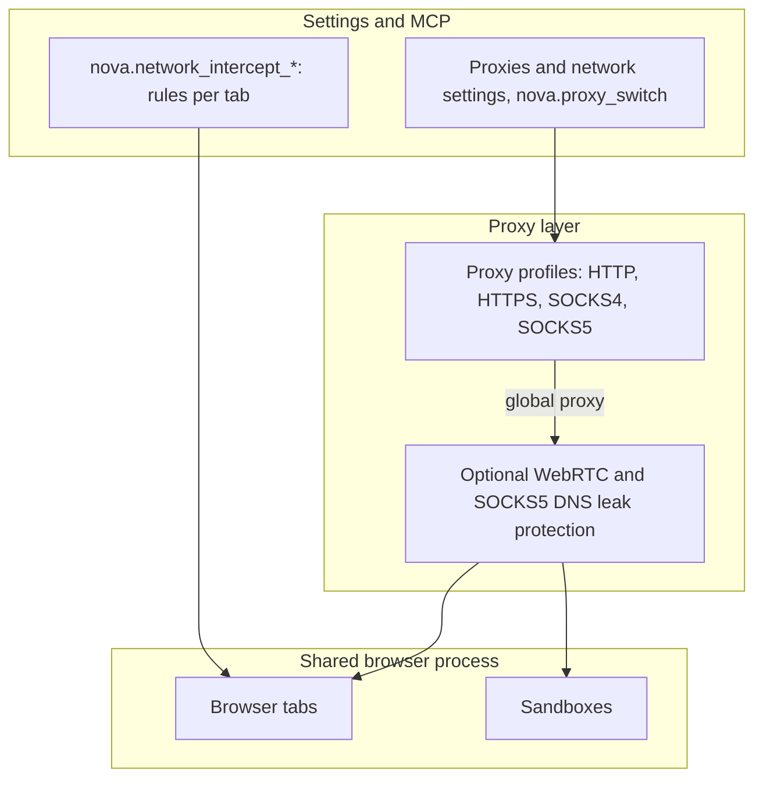

# Proxy Routing & Network Engine

> [!NOTE]
> Nova AI Workspace routes browser traffic through HTTP, HTTPS, SOCKS4 or SOCKS5 proxy profiles, can block WebRTC from leaking the real IP address past the proxy, and gives agents tab-scoped network interception and a request repeater for API debugging.

---

## 1. Problem Statement: Rate Limits, Geo-Restrictions & Leak Risks

Autonomous agents browsing the web encounter standard network hurdles:
* **IP Rate Limits & Geo-Blocking:** Region-restricted content (localized pricing, news) or IP rate limits during heavy research.
* **WebRTC IP Leaks:** Even with a proxy active, WebRTC can reveal local and public IP addresses to a page.
* **Plaintext Credential Exposure:** Automation frameworks commonly put proxy credentials into command-line arguments, where they show up in process lists.

Nova manages proxies as profiles with separately stored passwords and offers WebRTC and DNS leak protection.

---

## 2. Architecture & Routing Model

---

## 3. Core Features in Detail

1. **One global proxy for all surfaces:**
   * The profile marked "Use as global proxy for normal tabs" carries the traffic. Browser tabs and all sandboxes run in one shared browser process, so this global proxy applies to every tab and every sandbox.
   * Sandboxes store their own proxy choice (follow the global proxy, no proxy, or a selected profile), but WebView2 currently offers no way to give one profile its own proxy. A sandbox set to its own profile is switched back to the global proxy when Nova starts, and a sandbox set to "no proxy" also goes through the global proxy.
2. **Protocols and authentication:**
   * Supported protocols: HTTP (CONNECT), HTTPS, SOCKS4 and SOCKS5. Each profile can have a bypass list (for example `localhost;127.0.0.1;*.internal`).
   * Username and password work for HTTP and HTTPS proxies. SOCKS credentials are not supported by Chromium/WebView2.
3. **Credential hygiene:**
   * Proxy passwords are stored encrypted with Windows DPAPI (`nova.proxy_set_password` or in Settings) and are answered to the proxy's authentication challenge, not passed on the browser command line. The proxy log redacts credentials.
4. **WebRTC and DNS leak protection:**
   * "Protect WebRTC local IP leaks" (off by default) stops WebRTC from using UDP outside the proxy; some calls then fall back to TURN or fail. With a SOCKS5 proxy, local DNS resolution is additionally blocked except for the proxy host itself.
5. **Applying changes:**
   * When the global proxy changes, Nova recreates the open tab WebViews. Because the proxy and WebRTC switches belong to the shared browser process, Nova shows "Restart recommended" — after a restart the setting applies to all tabs.
6. **Emergency stop:**
   * `nova.proxy_disconnect` blocks HTTP(S) traffic for a scope; `nova.proxy_reconnect` checks the proxy and unblocks it.
7. **Network interception:**
   * `nova.network_intercept_add` arms a rule for one tab: let matching requests fail, answer them without reaching the network, change the request or the server's response, or delay them. A rule needs a URL pattern with at least 4 literal characters, lives at most 15 minutes (`ttlMs`, default 2 minutes) and removes itself after `maxHits` requests (default 20). Nova shows an indicator while rules are active. The tools are available whenever agent control is enabled; listing them does not arm anything.
8. **Request repeater:**
   * `nova.network_replay` prepares, sends and compares a single HTTP request outside the page, optionally with the cookies or storage-held token of an open tab (`adoptSessionFrom`).

---

## 4. MCP Tooling for Proxy & Network

Proxy tools are in the `proxy_management` bundle; interception and replay are in `page_read_debug`.

| Tool | Purpose |
| :--- | :--- |
| `nova.proxy_list` | Lists proxy profiles with protocol, host, port and sandbox bindings. |
| `nova.proxy_create`, `nova.proxy_update`, `nova.proxy_remove` | Manages proxy profiles. |
| `nova.proxy_set_password` | Stores or clears a profile's password (DPAPI-encrypted). |
| `nova.proxy_switch` | Changes the global proxy, or the stored proxy choice of a sandbox. |
| `nova.proxy_status` | Connection status, latency and external IP of a proxy. |
| `nova.proxy_test` | Tests a proxy against a probe URL (default `https://api.ipify.org/?format=json`). |
| `nova.proxy_disconnect`, `nova.proxy_reconnect` | Blocks traffic for a scope; checks the proxy and unblocks it. |
| `nova.proxy_log` | Reads recent, redacted proxy log lines. |
| `nova.network_intercept_add` | Adds a tab-scoped interception rule. |
| `nova.network_intercept_list`, `nova.network_intercept_clear` | Lists rules; removes them by rule, by tab or everywhere. |
| `nova.network_replay` | Prepares, sends and compares a single HTTP request. |

---

## Related Documentation

* **[Multi-Sandbox Session Isolation](sandbox-isolation.md)** — Separate browser profiles per sandbox.
* **[Fingerprint Protection & Browser Identity](fingerprint-and-identity.md)** — Fingerprint protection and client hints.
