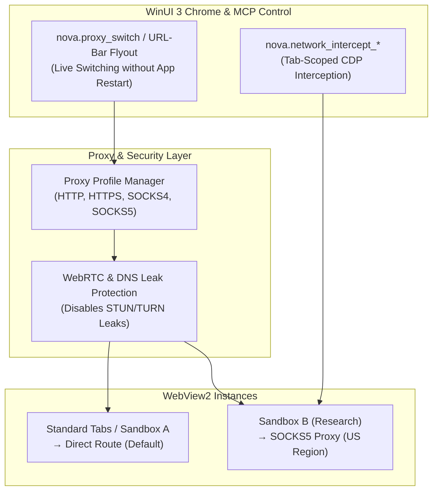

# Proxy Routing & Stealth Network Engine

> [!NOTE]
> The Proxy and Network subsystem enables granular routing over SOCKS5 and HTTP proxies per sandbox, eliminates WebRTC and DNS leaks, and equips agents with native network interception for mocking and API debugging.

---

## 1. Problem Statement: Rate Limits, Geo-Restrictions & Leak Risks

Autonomous agents browsing the web encounter standard network hurdles:
* **IP Rate Limits & Geo-Blocking:** Accessing region-restricted content (localized pricing, news) or encountering IP rate limits during heavy research.
* **WebRTC IP Leaks:** Even when an HTTP proxy is active, WebRTC STUN requests in conventional browsers frequently reveal the host's real local and public IP addresses.
* **Plaintext Credential Exposure:** Automation frameworks commonly expose proxy credentials in plaintext inside process command-line arguments (`--proxy-server`) or task manager process lists.

Nova resolves this via **isolated proxy profiles** and **integrated leak guards**.

---

## 2. Architecture & Routing Model

---

## 3. Core Features in Detail

1. **Granular Routing (Per-Sandbox & Global):**
   * Standard browser tabs use the global default proxy profile.
   * Each sandbox can be bound to its own dedicated proxy or exempted from proxy routing entirely.
2. **Dynamic Live Switching (`nova.proxy_switch`):**
   * Switching a proxy for an active sandbox does not require restarting Nova. The affected WebView2 instance is re-initialized seamlessly in the background with the new routing parameters.
3. **WebRTC Leak Protection:**
   * Option to suppress WebRTC ICE candidates, preventing physical IP discovery via browser JavaScript APIs.
4. **Credential Hygiene:**
   * Proxy credentials are encrypted in local settings and never exposed in Chromium command-line arguments or crash dumps.
5. **Network Interception & Replay:**
   * Using `nova.network_intercept_add`, agents establish tab-scoped interception rules to inspect requests, inject custom headers, or supply mock responses.

---

## 4. MCP Tooling for Proxy & Network

| Tool | Purpose |
| :--- | :--- |
| `nova.proxy_list` | Lists configured proxy profiles with type, host, and port. |
| `nova.proxy_status` | Reports latency, health status, and detected outbound IP. |
| `nova.proxy_switch` | Reassigns a proxy profile to a sandbox at runtime. |
| `nova.proxy_test` | Tests reachability and latency of a proxy against a probe URL. |
| `nova.network_intercept_add` | Adds a tab-scoped interception rule for matching URL patterns. |
| `nova.network_intercept_list` / `clear` | Inspects or clears active network interception rules. |
| `nova.network_replay` | Deterministically replays a previously logged network request. |

---

## 5. Production Code References

* **Proxy Settings & Profiles:** `NovaBrowser/Core/Settings/AppSettings.Proxies.cs`
* **Proxy UI Integration:** `NovaBrowser/Views/MainPage.Proxy.cs`
* **Network Interception Core:** `NovaBrowser/Core/Network/NetworkInterceptSession.cs`
* **MCP Proxy Handler:** `NovaBrowser/Core/Mcp/McpProxyHandler.cs`

---

## Related Documentation

* **[Multi-Sandbox Session Isolation](sandbox-isolation.md)** — Partitioned user data profiles and storage.
* **[Anti-Fingerprint Protection](fingerprint-and-identity.md)** — Hardware noise seeding and client hints.
