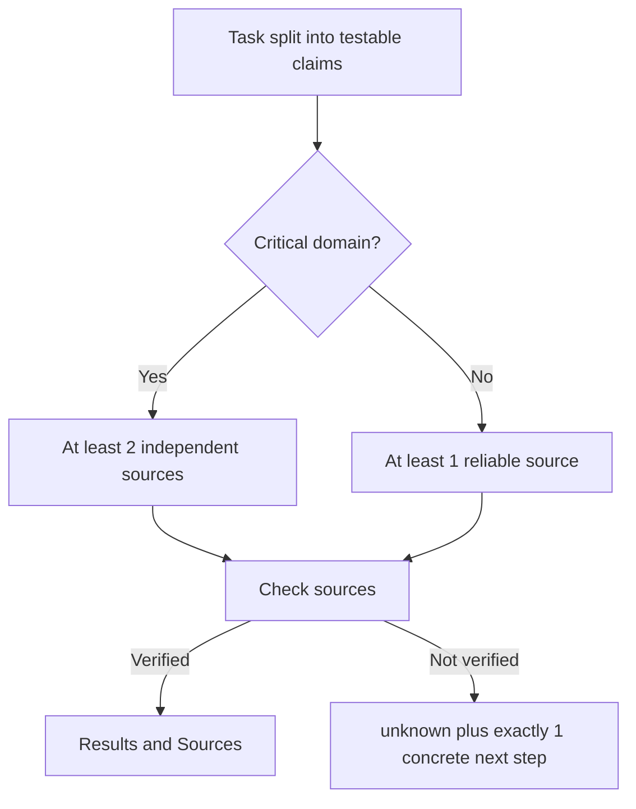

# Evidence Verification Mode (EVM) & Visual Evidence

> [!NOTE]
> Evidence Verification Mode (EVM) is a set of research rules Nova hands to agents for factual tasks: split the task into claims, back each claim with sources, and say "unknown" instead of guessing. For visual checks, Nova's screenshot tools capture just the element or region in question, so small text stays readable and responses stay small.

---

## 1. Two Examples: Support a Claim, Inspect a Result

For a factual task, an agent might need to establish a product's current price. EVM asks it to turn that question into a testable claim, consult the required sources, and preserve an unknown when the evidence is insufficient. Nova supplies this research contract; it does not automatically certify the answer.

For a visual task, an agent might need to check whether a Save confirmation is readable. An element crop preserves the relevant pixels, while a small context image shows where they came from. That image can support a claim about the displayed confirmation; it does not independently establish what the server stored.

## 2. Different Evidence Answers Different Questions

| Evidence | What it supports |
| :--- | :--- |
| Research sources | A factual claim, subject to relevance, currency and source independence. |
| Screenshot | What the captured surface visibly showed at capture time. |
| Screenshot diff | Which pixels changed within the comparison and its masks. |
| [CLS verification](../../closed-loop-system-cls/README.md) | Whether specified state conditions held around an action. |
| [TOB observation](../../tool-observation-bus-tob/README.md) | What Nova recorded about tool execution. |

A changed image is not automatically an improvement, and a successful screenshot capture is not a passing UI check. Choose the evidence that can answer the actual question.

## 3. Why Evidence Needs a Clear Question

When agents research facts or check a UI, two failure modes are common:

1. **Unsupported claims:** The agent states facts (prices, security advisories, deadlines) from memory or from a single source.
2. **Oversized screenshots:** A full-viewport screenshot costs many image tokens, and once it is downscaled, small text can become unreadable.

---

## 4. The EVM Rules

`nova.get_instructions` in task mode returns the EVM rules as text and as `structuredContent.evm`. They are guidance for the agent; Nova does not check the agent's final answer against them. The rules apply to factual and research tasks, not to plain UI automation.

1. **Claim test:** Break every factual task into testable claims.
2. **Evidence minimum:** Non-critical claims need at least 1 reliable source; critical claims need at least 2 independent sources.
3. **Unknown over guessing:** A claim that cannot be verified is marked `unknown`, with exactly one concrete next step.
4. **Stop early:** Stop researching once all claim tests pass.
5. **Compact output:** Answers use the sections `Results`, `Sources` and, if needed, `Unknowns`.

**Critical domains** (`structuredContent.evm.criticalDomains`): security, medical, legal, financial, political, pricing, deadlines and current-state claims ("latest", "today").

**Keeping results:** Claim results tied to a claimed tab can be stored with `nova.memory_add_candidate` (`component='evm'`, `status` `verified`, `unverified` or `disproven`); reusable research notes go to `nova.operator_notes_store` with the tag `evm`. `nova.memory_stats(componentFilter='evm')` shows the counts.

---

## 5. Visual Evidence: Crops Instead of Full Screenshots

`nova.capture_screenshot` can capture less than the whole viewport:

* **`selector`:** captures only the bounding box of one element (scrolled into view, ` >>> ` supported). Elements that are hidden or fully transparent are refused, because the crop would show something else.
* **`region`:** captures a rectangle in CSS pixels; the browser captures only that area.
* **`screenshotFormat: "auto"`** with a region: PNG for moderate text and UI crops (up to about 1 megapixel), JPEG for very large regions.
* **`highlightSelector`:** draws a marker (color, stroke, style and label configurable) around an element; on its own it captures a close-up of that element.
* **`includeContextImage`:** adds a small marked overview of the viewport for orientation.
* **`responseMode`:** `reference` returns only a `nova://screenshot/...` link that can be fetched later with `nova.read_screenshot_resource`; `thumbnail+reference` returns a small preview plus the link. These links are valid for the session, by default for one hour.
* **Budget:** Nova limits large inline captures per session; `force` can override eligible budget checks but not absolute safety limits. Default absolute limits are 50 MB encoded and 50 megapixels; full-page capture additionally has its own 20-megapixel and 20,000-pixel-height source limits.

---

## 6. MCP Tooling for EVM & Evidence

| Tool | Purpose |
| :--- | :--- |
| `nova.get_instructions` | Returns the EVM rules in task mode. |
| `nova.capture_screenshot` | Viewport, full page, element or region capture with optional markers and reference delivery. |
| `nova.read_screenshot_resource` | Fetches a stored screenshot by its `nova://screenshot/...` URI. |
| `nova.screenshot_diff` | Pixel comparison of two PNG screenshots: changed-pixel share, changed regions and a diff overlay; supports masks and anti-aliasing filtering. |
| `nova.screenshot_baseline` | Saves named baselines and compares a new capture against them (`save`, `update`, `compare`, `list`, `delete`). |
| `nova.audit_accessibility` | Checks text contrast, tap-target size and missing labels or accessible names. |
| `nova.measure_web_vitals` | Measures LCP, CLS, INP, FCP and TTFB with ratings. |

---

## Related Documentation

* **[Tool Observation Bus (TOB)](../../tool-observation-bus-tob/README.md)** — Server-side evidence ledger and visit windows.
* **[Agent Awareness Gates (AAG)](../../agent-awareness-gates-aag/README.md)** — Pre-execution safety and multi-agent lease locking.
* **[Input Dispatch & Shadow DOM Traversal](../../humanized-input-engine/README.md)** — How Nova delivers mouse and keyboard input.

[Research overview](../README.md) · [All core features](../../README.md)
