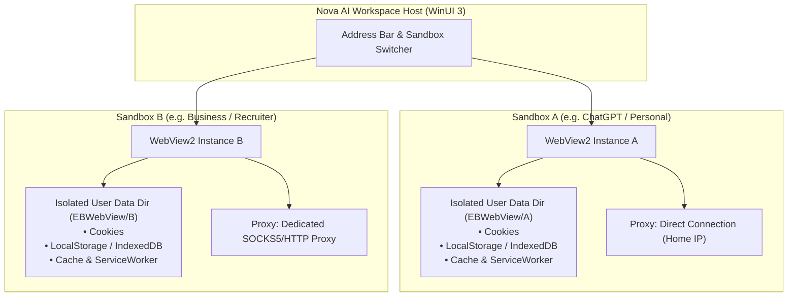

# Multi-Sandbox Session Isolation & Profile Security

> [!NOTE]
> The multi-sandbox architecture of Nova AI Workspace allows concurrent, interference-free execution of multiple isolated user profiles, authentication sessions, and network routing configurations within a single WinUI 3 desktop application.

---

## 1. Problem Statement: Session Bleeding & Identity Collision

Automated workflows and multi-agent operations frequently require concurrent execution across distinct user personas:
* **Personal vs. Corporate:** Concurrent sessions in WhatsApp Web, Google Workspace, GitHub, or LinkedIn.
* **Testing vs. Production:** Verifying web applications with distinct permission roles (Administrator, Auditor, Customer) simultaneously in the same workstation.
* **Privacy & Cookie Leak Risks:** In conventional multi-tab browsers, tabs share the same global cookie jar and LocalStorage, leading to inadvertent session overwrites or cross-site tracking.

**Nova AI Workspace** resolves this through a strict, hardware-accelerated **Sandbox Architecture**.

---

## 2. Partitioned Storage Architecture

Each sandbox in Nova (designated by letters such as `A`, `B`, `C` or custom unique IDs) is an independent, completely decoupled WebView2 execution context:

```
%LOCALAPPDATA%\NovaBrowser\
  ├── settings.json                    # Sandbox configurations & persona definitions
  ├── EBWebView\
  │     ├── A\                         # Profile A: Isolated cookies, cache, web storage
  │     ├── B\                         # Profile B: Isolated cookies, cache, web storage
  │     └── C\                         # Profile C: Isolated cookies, cache, web storage
  └── pks.db                           # Shared knowledge base with sandbox affinity
```



---

## 3. Core Isolation Guarantees

1. **Complete Storage & Session Partitioning:**
   * Cookies, Web Storage (`localStorage`, `sessionStorage`, `IndexedDB`), and HTTP caches are strictly partitioned per sandbox.
   * Authenticating in Sandbox A has zero impact on Sandbox B.
2. **Dedicated Proxy Profiles:**
   * Each sandbox can be bound to its own dedicated proxy route (SOCKS5 or HTTP/HTTPS).
   * Built-in WebRTC and DNS leak guards prevent exposing the real host IP address in anonymized sandboxes.
3. **Fingerprint & Identity Customization:**
   * Specific User-Agents, viewport metrics, touch capabilities, and system locales can be assigned per sandbox.
4. **Resilient Persistence & Reconciliation:**
   * Sandboxes possess persistent Unique Identifiers (UIDs). At startup, Nova reconciles sandbox definitions with filesystem directory anchors, preventing accidental loss of persistent sessions.

---

## 4. Test Profile Isolation (Critical System Invariant)

> [!CAUTION]
> Real user sandboxes (containing active sessions in ChatGPT, WhatsApp, etc.) must NEVER be overwritten or accessed during automated tests or smoke runs.

Nova enforces strict profile isolation for testing:
* **Environment Variable `NOVA_TEST_LOCALAPPDATA_DIR`:**
  All automated test suites (`dotnet test`, xUnit, PowerShell selftests) redirect `StoragePaths` to an isolated temporary scratch directory.
* Neither the production `settings.json` nor real session tokens are touched during test execution.

---

## 5. MCP Tooling for Sandbox Management

| Tool | Purpose |
| :--- | :--- |
| `nova.sandbox_context` | Retrieves metadata, assigned proxy, and identity configuration of a sandbox. |
| `nova.resolve_sandbox` | Deterministically resolves sandbox references and intent keys to container IDs. |
| `nova.sandbox_create` / `update` | Spawns or modifies sandbox containers (display name, color tag, start URL). |
| `nova.sandbox_delete` | Permanently removes a sandbox profile and deletes its isolated storage directories. |
| `nova.proxy_switch` | Dynamically switches the active proxy route assigned to a sandbox at runtime. |
| `nova.cookie_list` / `cookie_set` / `cookie_delete` | Inspects and manipulates cookies strictly within the target sandbox context. |
| `nova.storage_inspect` | Inspects `localStorage` and `sessionStorage` of a sandbox origin. |

---

## 6. Production Code References

* **Sandbox Identity & Context:** `NovaBrowser/Core/Sandbox/`
* **Storage & Profile Path Resolution:** `NovaBrowser/Core/Storage/StoragePaths.cs`
* **WebView2 Lifecycle & Surface Hosting:** `NovaBrowser/Views/MainPage.WebViewLifecycle.cs`
* **Tab & Session Management:** `NovaBrowser/Core/Browser/TabManager.cs`

---

## Related Documentation

* **[Site Data & Privacy Management](site-data-management.md)** — Cookie jars, storage, and cache clearing.
* **[Proxy Routing & Stealth Network](proxy-and-network.md)** — SOCKS5/HTTP routing and WebRTC leak protection.
* **[Anti-Fingerprint Protection](fingerprint-and-identity.md)** — Hardware noise seeding and client hints.
