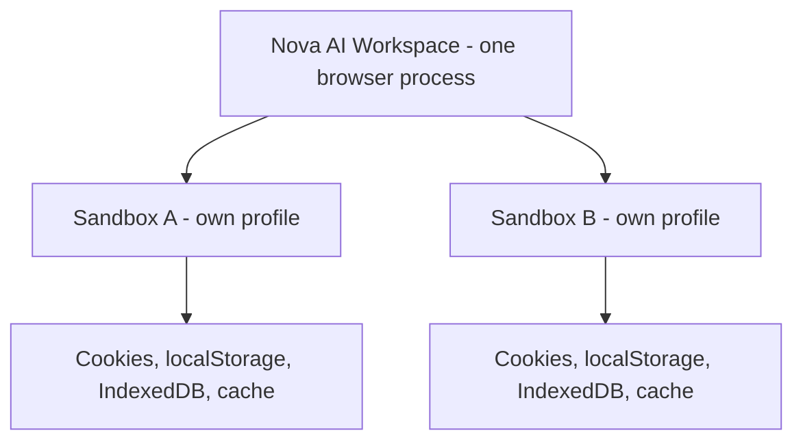

# Multi-Sandbox Session Isolation

> [!NOTE]
> Sandboxes let you stay signed in to the same website with different accounts at the same time. Each sandbox has its own browser profile with its own cookies, storage and cache, so a login in one sandbox does not affect another.

---

## 1. Problem Statement: Session Bleeding

Many workflows need several identities side by side:
* **Personal vs. work:** two accounts of the same web app, open at the same time.
* **Testing roles:** checking a web app as administrator and as customer in parallel.

In a normal browser window, all tabs share one cookie jar and one set of web storage, so a second login overwrites the first.

---

## 2. How Sandboxes Are Stored

Each sandbox is a separate WebView2 browser profile. All profiles live under one shared WebView2 data folder inside the Nova profile folder:

```
%LOCALAPPDATA%\nova-cognitive\Nova\
  ├── settings.json                        # Sandbox list (name, color, start URL, ...)
  └── UserData\Shared\EBWebView\
        ├── WV2Profile_<sandbox-uid>\      # One profile per sandbox
        └── WV2Profile_<sandbox-uid>\
```

Installations upgraded from older versions may still use `%LOCALAPPDATA%\NovaBrowser\` as the profile folder.

Sandboxes are addressed by a short ID (`A`, `B`, `C`, ...) and also carry a persistent internal ID that names their profile folder. Up to 100 sandboxes can exist; at least one always remains.



---

## 3. What Is Separated — and What Is Not

**Separated per sandbox:**
* Cookies, `localStorage`, `sessionStorage`, IndexedDB, cache and other profile data.
* Signing in in sandbox A has no effect on sandbox B.
* Fingerprint protection can be overridden per sandbox (see [Fingerprint Protection & Browser Identity](fingerprint-and-identity.md)).

**Shared by all sandboxes:**
* **One browser process and one proxy.** All sandboxes and browser tabs run in the same WebView2 browser process, which takes its proxy from the global setting. A separate proxy per sandbox is currently not possible; sandboxes that were set to their own proxy are switched to follow the global one. See [Proxy Routing & Network](proxy-and-network.md).
* **WebRTC and DNS protection.** "Protect WebRTC local IP leaks" (off by default) applies to the whole browser. With a SOCKS5 proxy it also routes DNS lookups through the proxy; if several SOCKS5 proxies are configured, this DNS protection covers only one of them.
* **Browser identity.** The user-agent preset set with `nova.identity_set` applies to all tabs.

> [!IMPORTANT]
> Sandboxes separate sessions; they do not give each sandbox its own network identity. Sites can still see the same IP address and the same browser engine across sandboxes.

---

## 4. Persistence & Recovery

Each sandbox profile folder contains a small metadata file. At startup Nova compares the sandbox list in `settings.json` with these folders; if the list is ever empty while profile folders still exist, Nova restores the sandboxes from them, so a damaged settings file does not lose your logins. A deleted sandbox is marked so that it is not restored by accident.

---

## 5. MCP Tooling for Sandbox Management

| Tool | Purpose |
| :--- | :--- |
| `nova.sandbox_context` | Metadata and context of a sandbox. |
| `nova.resolve_sandbox` | Picks the best matching sandbox for an intent key (e.g. `email.compose`), with optional service and account hints. |
| `nova.sandbox_create` / `nova.sandbox_update` | Creates or changes a sandbox (name, color, start URL, purpose, account label, aliases, preferred intents; `update` can also pause it). |
| `nova.sandbox_delete` | Removes a sandbox and its profile data (`confirm: true` required). |
| `nova.cookie_list` / `nova.cookie_set` / `nova.cookie_delete` | Cookies of the target tab's or sandbox's profile. |
| `nova.storage_inspect` | `localStorage` or `sessionStorage` of the target page. |

---

## Related Documentation

* **[Site Data & Privacy Management](site-data-management.md)** — Cookies, storage and cache clearing.
* **[Proxy Routing & Network](proxy-and-network.md)** — Proxy profiles and WebRTC leak protection.
* **[Fingerprint Protection & Browser Identity](fingerprint-and-identity.md)** — Fingerprint protection levels and browser identity presets.
