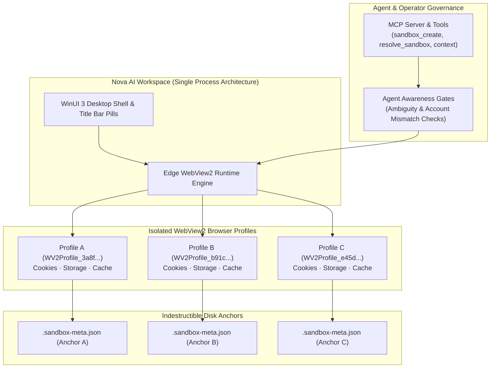

# Multi-Sandbox Session Isolation

Multi-Sandbox Session Isolation enables Nova AI Workspace to run multiple independent web identities and account logins side-by-side within a single, lightweight browser instance. Each sandbox maintains its own dedicated browser profile with separate cookies, web storage, and cache, allowing operators and autonomous agents to maintain separate work, personal, and administrative sessions simultaneously without authentication clashing.



---

## 1. Architectural Principles & Isolation Boundaries

1. **Lightweight Profile Separation vs. OS Virtual Machines:**
   Nova sandboxes are not operating-system virtual machines or hypervisors. They run inside the same native process architecture, eliminating the multi-gigabyte memory overhead and boot latency of container VMs while maintaining complete web session isolation.
2. **Crash Resilience ([Outrider](../../components/outrider/README.md)):**
   Native OS probes, hardware queries, and untrusted terminal runners execute in Outrider helper processes to safeguard the browser.
3. **Session Partitioning vs. Network Identity:**
   Sandboxes partition browser state (cookies, tokens, storage). They share the underlying browser process, GPU pipeline, user-agent engine, and proxy network stack. To external servers, requests from Sandbox A and Sandbox B originate from the same IP address unless routed through proxy profiles.

---

## 2. The Four Pillars of Sandbox Isolation

| Pillar | Subsystem | Core Responsibilities |
|---|---|---|
| **1. Storage & State Partitioning** | WebView2 Profile Engine | Enforces strict, zero-leakage separation of cookies, `localStorage`, `sessionStorage`, `IndexedDB`, and HTTP caches across sandbox directories. |
| **2. Indestructible Disk Anchors** | Profile Storage & Rehydration | Guarantees that profiles survive settings corruption via atomic `.sandbox-meta.json` disk anchors and boot-time identity reconciliation. |
| **3. WinUI 3 User Management** | Desktop Shell & Chrome Controls | Provides interactive title bar pills, quick-switch flyouts, scoped data-clear dialogs, color palettes, and per-sandbox security overrides. |
| **4. Semantic Intent Routing** | Agent Matching & AAG Gates | Maps high-level agent intents (e.g., `email.compose`, `crm.sales`) to target sandboxes with multi-signal scoring and account ambiguity gates. |

---

## 3. Storage Layout & System Limits

All sandbox profile directories live in the user's local application data folder:

```
%LOCALAPPDATA%\nova-cognitive\Nova\UserData\Shared\EBWebView\WV2Profile_<persistentUid>\
```

### System Limits & ID Contracts

- **Capacity Bounds:** Nova supports between **1** and **100** concurrent sandboxes (`AppSettings.MaxSandboxes = 100`). At least one sandbox must always exist.
- **Short Letter IDs:** Assigned sequentially (`A` through `Z`, then `S1` through `S100`). Short IDs can be recycled when a sandbox is deleted.
- **Persistent UIDs:** 32-character hexadecimal GUIDs assigned once at creation and never recycled. Used for disk directory naming and knowledge-store bindings (Domain Notes, Operator Notes).

---

## 4. Documentation Suite Index

Explore the comprehensive guides for deep architectural details, user controls, disk anchors, and API specifications:

| Document | Focus & Key Topics Covered |
|---|---|
| [**User Management & GUI Controls**](user-management-and-gui.md) | Browser chrome title bar pills, responsive compact vs. expanded layout, pill markers (color, favicon), hardware recording indicators, context menu actions, SettingsView configuration, scoped data clearing dialog (`SandboxDataClearDialog`), and accessibility traits. |
| [**Profile Storage, Disk Anchors & Recovery**](profile-storage-and-disk-anchors.md) | File system directory structure, storage isolation matrix (what is partitioned vs. what is shared), `.sandbox-meta.json` schema, atomic staging, startup identity reconciliation rules, deletion markers (`deleted_marker.json`), and the interactive `SandboxRecoveryDialog`. |
| [**Intent Routing & Agent Interaction**](intent-routing-and-agent-interaction.md) | Semantic attributes (`Purpose`, `Aliases`, `AccountLabel`, `PreferredFor`, `DetectedAccountName`), multi-signal intent scoring formula ($w_{\text{preferred}}$, $w_{\text{purpose}}$, $w_{\text{service}}$, $w_{\text{alias}}$, $w_{\text{account}}$), Agent Awareness Gates (low confidence, ambiguity, mismatch, not ready), and the complete MCP tool catalog. |

---

## 5. Related Documentation

- [Site Data Management](../site-data-management/README.md) — Cookie inspections, storage quotas, and cache clearing.
- [Agent Awareness Gates (AAG)](../agent-awareness-gates-aag/README.md) — Pre-action validation and account ambiguity protection.
- [Proxy Routing](../network/proxy/README.md) — SOCKS5/HTTP proxy profiles and WebRTC leak protection.
- [Fingerprint Protection & Browser Identity](../privacy/fingerprint-and-identity/README.md) — Per-sandbox canvas, audio, and hardware noise overrides.
- [Outrider Component](../../components/outrider/README.md) — Native helper process boundaries.

[All core features](../README.md)
